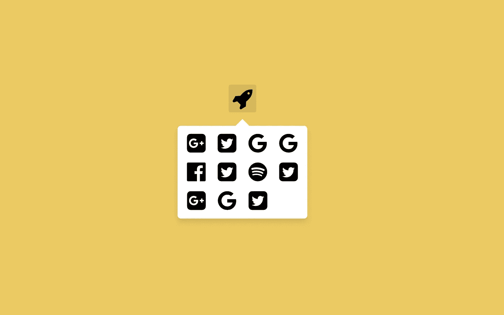
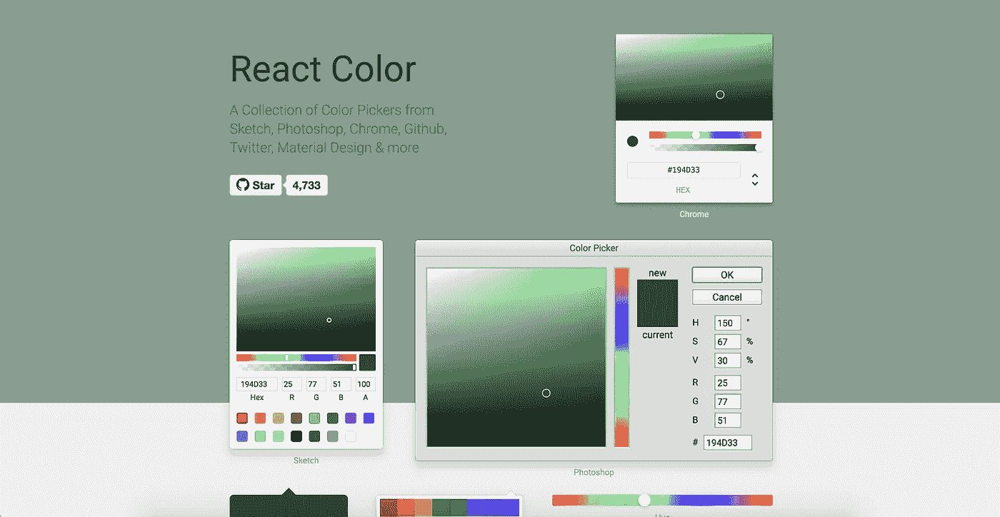
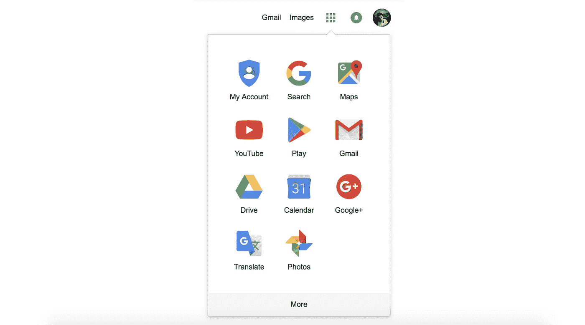
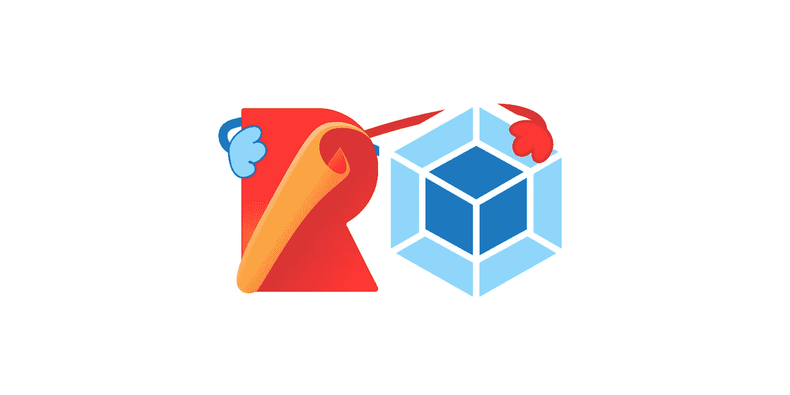
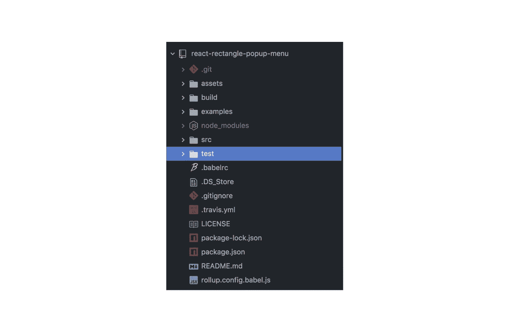
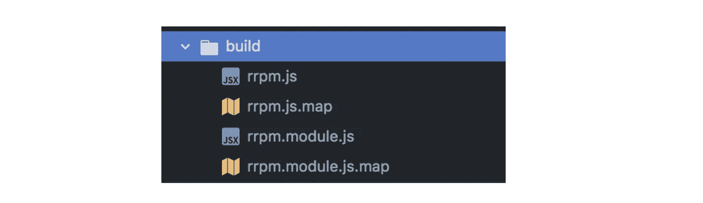
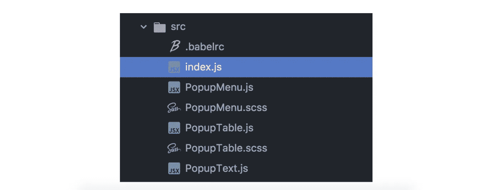

# React 组件库的制作

> 原文：<https://medium.com/hackernoon/making-of-a-component-library-for-react-e6421ea4e6c7>

> [Github](https://github.com/sasha240100/react-rectangle-popup-menu)|[NPM](https://www.npmjs.com/package/react-rectangle-popup-menu)|[Demo](https://sasha240100.github.io/react-rectangle-popup-menu/examples/)



[https://github.com/sasha240100/react-rectangle-popup-menu](https://github.com/sasha240100/react-rectangle-popup-menu)

> 最初发表于 [ZeoLearn](https://www.zeolearn.com/magazine/making-a-component-library-for-react) 。

前一段时间，我决定写一篇文章，主题包括发布到 NPM、API 架构。最好的教程是 react 组件库开发。

对我来说，React 组件库的一个很好的例子是 [react-color](https://casesandberg.github.io/react-color/) 。它有一个简洁的文档网站，有简单的一步一步的指导，还有很多为 React 应用程序制作颜色选择器的不同变化。



[https://casesandberg.github.io/react-color/](https://casesandberg.github.io/react-color/)

所以我决定像谷歌一样制作一个**矩形弹出菜单**:



This is from google.com website (an example of what I plan to make)

## 第一部分。准备项目(设置)

让我们编造一些现代图书馆应该符合的要求。

*   摇树
*   UMD 模式
*   构建输出是 es5
*   清除文档
*   示例(演示)
*   单元测试

**汇总& Webpack** =模块捆绑



Rollup & Webpack

对于捆绑库，我选择了 rollup(你可以在 Rich Harris 的[“web pack 和 rollup:相同但不同”](/webpack/webpack-and-rollup-the-same-but-different-a41ad427058c)中阅读更详细的文章，解释为什么 Rollup 更适合库)。

> 上卷:[https://rollupjs.org/guide/en](https://rollupjs.org/guide/en)

另外，我使用了 *webpack* (和 *webpack-dev-server* )来提供示例文件夹。它处理 css 包装、字体加载和 es6 - > es5 翻译(在 babel 的帮助下)。

> https://webpack.js.org/

Jest =单元测试

脸书开发的单元测试工具，非常适合我们比较 react 组件快照的需要。

> 链接:[https://facebook.github.io/jest/](https://facebook.github.io/jest/)

**快递** =上菜实例

在项目中有一个次要的位置，但是帮助我们正确地配置适当的例子(因为 *webpack-dev-server* 正在使用它)。

Sample of code, where we use express to serve static files for development mode

**巴别塔** =写 es6，提供 es5

如今 **ES6** 已经被大多数知名浏览器广泛支持，但是 **Babel** 不仅仅是与 es5 一起工作，它还是将 javascript 子集转换成浏览器兼容实现的全球标准。

在这个项目中，我们使用 **Babel** 主要是为了使用最新的 ES 特性，如 *async/await* 并支持 JSX 子集。

> 链接:[https://babeljs.io/](https://babeljs.io/)

## 第二部分。发展

现在，一旦我们安装了所有需要的 devDependencies，我们就可以继续进行开发过程了。

第一步是决定项目文件夹的结构。对于这个库，这是我最后得到的:



*   `assets/` —跳过此文件夹，这只是我在 API 文档中的图像
*   `build/` — UMD 和 ES 模块构建文件+ sourcemaps。



*   `examples/` —这个文件夹包含了我在不同情况下用来测试库的测试`.html`例子。
*   `src/` —包含在 JSX 编写的库源代码和用于文件夹内巴别塔配置的`.babelrc`文件
*   `test/` — JEST 测试

完成项目配置需要其他文件。我强烈推荐你使用`travis.yml`进行持续集成(现代项目的必备，尤其是比如组件库)。

> **重要的**:不要忘记在 rollup 中将`react`和`react-dom`从内部依赖关系中排除，否则，你会得到客户端的兼容性错误和不好的副作用，比如大的包大小和不好的性能。

```
**// rollup.config.babel.js**
{ // ...
  external: **['react', 'react-dom']**, globals: {
    **react: 'React',
    'react-dom': 'ReactDOM'**
  }
}
```

## 源文件/代码



在`index.js`文件中，我链接了每一个导出类的文件(实际上是 React 组件):

```
**// index.js**
export * from './PopupMenu';
export * from './PopupTable';
export * from './PopupText';
```

我们不会涵盖为这个库编写的所有代码，因为它更多的是针对特定主题的，而不是有帮助的，所以让我们仅以解释我们在项目组织中的需求的代码的几个部分为例。

**PopupMenu** header part

当我们为 UI 构建组件时，我们包含了样式文件，rollup 允许我们像 webpack 一样用样式和图像进行捆绑。在我的例子中，我选择了`sass`语法，因为它是我所熟悉的。这意味着`./PopupMenu.scss`文件将从`sass`编译到`css`，然后作为 javascript 代码插入到 html `<head>`标签中。

**rollup-plugin-postcss** module used in rollup config file.

考虑到我们启用了`"modules": true`特性，即启用 CSS 模块特性:

```
import **style** from './PopupMenu.scss';// Somewhere in JSX
// ... render() {
    return (<div className={**style.myClassName**} />)
  }// ...
```

每当我们在 ES6 模块中使用 JSX 语法时，我们都需要包含 react 依赖，否则会导致构建错误。

```
import **React**, {Component} from 'react';
```

在我的例子中，我甚至需要使用 React 以这种旧的方式向子组件提供上下文:*(旧的是因为 React 最近引入了* [*新的上下文 API*](/dailyjs/reacts-️-new-context-api-70c9fe01596b) *)* 。我有`PopupTable`，它取父`PopupMenu`的`popupWidth`

React context in PopupMenu class

我还想强调一下`classnames` npm 模块，它很好地结合了 CSS 模块中的多个类:


**classnames** moduleexample

**用法:**

## 单元测试

首先，您需要决定您想要选择哪个单元测试框架。我使用了一些流行的单元测试框架，并建议您进行测试:

*   [莫卡吉斯](https://mochajs.org/)
*   [AVA](https://github.com/avajs/ava)
*   [笑话](https://facebook.github.io/jest/)

对于这个组件库，我选择了 Jest。因为它是由脸书(与 React 相同)开发的，并且支持开箱即用的 React 组件快照测试。

> *捕获 React 树或其他可序列化值的快照，以简化测试并分析状态如何随时间变化。*(来自 JEST 网站)

这非常简单，您可以呈现一个想要测试的 react 组件，然后调用`component.toJSON()`将它转换成一个呈现的 html 树。示例:

```
// Jest Snapshot v1, [https://goo.gl/fbAQLP](https://goo.gl/fbAQLP)**exports[`PopupMenu should render correctly 1`]** = `
<div
  className="PopupMenu_PopupMenu__8TfA4"
>
  <div
    className="PopupMenu_button__20m_Y"
    onMouseOut={[Function]}
    onMouseOver={[Function]}
  />
  <div
    className="PopupMenu_popover__3hd_Z"
    onMouseOut={[Function]}
    onMouseOver={[Function]}
    style={
      Object {
        "height": "auto",
        "left": "calc(-100px + 50%)",
        "visibility": "hidden",
        "width": "calc(200px - 10px)",
      }
    }
  />
</div>
`;
```

一旦你第一次这样做了，它就被保存到一个`*.test.js.snap`文件中，这个文件基本上是一个模块，它导出几个渲染的 DOM 树字符串来与每个新的渲染进行比较。如果 DOM 树发生了变化，它会告诉你。如果树被积极的改变所改变(意味着这是预期的)，您必须运行`jest -u`来保存新的快照。

# 结论

让我们强调一下这篇文章中最相关的提示:

*   ***Rollup*** *比 Webpack 更适合组件库*
*   *包含****postscs****插件，将 css 捆绑成同一个 js 文件*
*   使用单元测试和持续集成向他人展示您关心稳定性并防止意外错误。

我还建议你将构建分成两步，`development`和`**production**`(包括*缩小*和进一步优化)。

> 所有的源码都可以在 [**Github 页面**](https://github.com/sasha240100/react-rectangle-popup-menu) 找到。并且生成的 [**演示**](https://sasha240100.github.io/react-rectangle-popup-menu/examples/) 也是可用的。

> 最初发表于 [ZeoLearn](https://www.zeolearn.com/magazine/making-a-component-library-for-react) 。

> 最近我为 Skillshare 做了一个[“WebGL 世界介绍”](https://skl.sh/2shhq00)课程，你可能会在那里找到一些有趣的 web GL 秘密！[点击这里。](https://skl.sh/2shhq00)