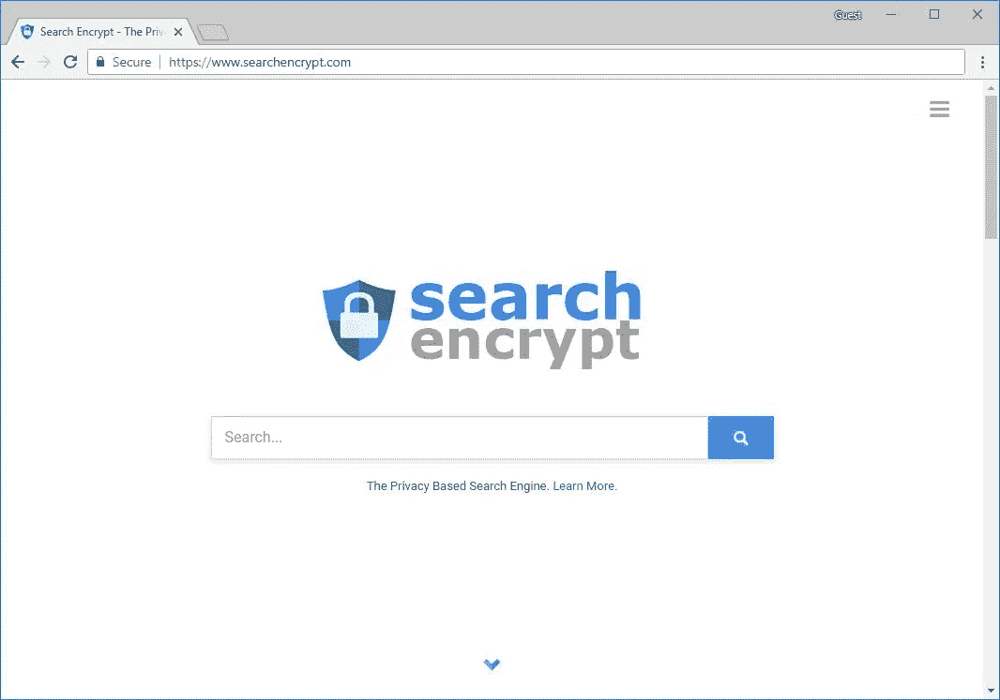

# 让隐私变得实用—搜索加密

> 原文：<https://medium.com/hackernoon/making-privacy-practical-search-encrypt-83b2ab973428>

“A surveillance camera on a wall with a green abstract design of Euronews HQ.” by [Lucas Gallone](https://unsplash.com/@lucasgallone?utm_source=medium&utm_medium=referral) on [Unsplash](https://unsplash.com?utm_source=medium&utm_medium=referral)

如果你是互联网的长期用户，你可能还记得搜索引擎的“旧时代”,当找到一个与你的查询相关的答案时，通常需要一些搜索和研究。幸运的是，搜索引擎在过去的 20 年里有了很大的进步。由于人工智能和改进的索引，找到问题的答案比以往任何时候都容易。

人们在日常生活中如此频繁地使用搜索引擎，以至于我们认为他们惊人的速度和相关的搜索结果是理所当然的。

***那么搜索引擎怎么会全线提升这么多呢？***

**答案:**跟踪你

不仅是搜索引擎像谷歌，雅虎！Bing 改进了他们的网页索引，提高了计算速度，但他们也收集了大量关于人们搜索内容和搜索方式的数据。

所以搜索引擎非常了解你，但是为什么他们需要了解你呢？对于任何关心隐私或在互联网上隐藏身份的人来说，大型搜索引擎引发了担忧。

幸运的是，有私人搜索引擎根本不会跟踪你。这些搜索引擎不需要知道你搜索一个给定术语的次数，你在哪里，或者你对什么感兴趣。

**那么，你应该使用什么私人搜索引擎呢？**

[*Search Encrypt*](https://www.searchencrypt.com) 是一个私人搜索引擎，对你的搜索词使用 AES-256 加密。除了加密，它还会使你的搜索词过期，这样当你完成搜索时，你的搜索基本上就永远消失了。正是这些特性让 Search Encrypt 提供了[完美的前向保密性](https://choosetoencrypt.com/privacy/what-is-perfect-forward-secrecy/)。

## 私人搜索引擎

*   [**搜索加密**](https://www.searchencrypt.com) :端到端加密，过期搜索词，无跟踪。
*   [**DuckDuckGo**](https://www.duckduckgo.com) :最知名的私人搜索引擎。
*   [**StartPage**](https://www.startpage.com) :一个以隐私友好的方式使用谷歌结果的搜索引擎。

# 搜索加密的历史

Search Encrypt 于 2016 年初由两名开发者创立，他们注意到大型搜索引擎创建关于其用户的数据档案的问题。

自最初推出以来，Search Encrypt 的受欢迎程度和用户基础一直在增长。仅在 2018 年，Search Encrypt 就增加了视频和地图搜索功能。它计划在未来一年继续增加新功能，扩大产品线。

 [## 搜索加密是如何工作的？-搜索加密博客

### Search Encrypt 是一个以隐私为核心价值的私人搜索引擎。搜索加密保护您的隐私…

choosetoencrypt.com](https://choosetoencrypt.com/tech/how-search-encrypt-works/) 

在过去的两年里，Search Encrypt 一直在稳步增长。根据 SimilarWeb 的数据，它每月有大约 3000 万的访问者。

在推出其搜索[引擎](https://hackernoon.com/tagged/engine)后不久，Search Encrypt 在其产品线中增加了一个 [Chrome 扩展](https://chrome.google.com/webstore/detail/search-encrypt-a-private/oodblefojaocanejnikhhjcglbaelpbp)。它的扩展可以让用户快速切换他们的默认搜索引擎到 Search Encrypt，并避免搜索引擎跟踪他们的信息。如果扩展检测到有人在搜索引擎上搜索跟踪，它可能会重定向到 Search Encrypt 的私人结果。

📤 [***尝试搜索加密扩展…***](https://chrome.google.com/webstore/detail/search-encrypt-a-private/oodblefojaocanejnikhhjcglbaelpbp)

# 搜索加密如何帮助保护隐私

大型搜索引擎会尽可能收集你的所有信息，这样他们就可以为你提供有针对性的广告。他们收集的关于你的具体数据越多，他们从广告中赚的钱就越多。

Search Encrypt 不会收集或存储您的任何个人可识别数据。您的搜索词永远不会与您的姓名或“数据档案”相关联。即使使用 Search Encrypt 多年，我们也不会了解你的任何信息。

例如，谷歌不仅可以访问你的搜索，还可以将你的搜索链接到你的 Gmail 账户、聊天记录、位置数据和其他通过谷歌分析收集的信息。

## 阅读 More…⤵️

 [## 谷歌的数据隐私问题

### 谷歌母公司 Alphabet 的市值为 7120 亿美元。在谷歌的产品范围内，有七种…

hackernoon.com](https://hackernoon.com/data-privacy-concerns-with-google-b946f2b7afea) 

Search Encrypt 被称为元搜索引擎。它不是使用自己的网络爬虫来索引互联网上的所有网页，而是从它的搜索伙伴那里获取搜索结果。它从你的搜索词中剥离你的私人数据并加密。然后，Search Encrypt 将您的搜索词以加密的形式发送到它的服务器，并发回相关的搜索结果。

像其他关注隐私的搜索引擎一样，即使执法部门要求你从 Search Encrypt 搜索，也不会有信息给他们。你的搜索总是被加密的，当你完成搜索时，你甚至不能访问你的搜索。

Search Encrypt 由广告收入支持，但这些广告不以任何方式定向。搜索结果中显示的广告完全基于您键入的搜索词。

# 如何获得搜索加密

使用搜索加密是一个简单易行的过程。只需去 searchencrypt.com 的[输入你的搜索词。如果你想更进一步，你可以添加](https://www.searchencrypt.com) [Search Encrypt 的 Chrome 扩展](https://chrome.google.com/webstore/detail/search-encrypt-a-private/oodblefojaocanejnikhhjcglbaelpbp)来进一步保护你的搜索。

## 更多信息⤵️

 [## 如何安装和删除搜索加密

### Search Encrypt 是一款注重隐私的搜索工具。它有助于保护您的搜索行为数据，并摆脱跟踪…

medium.com](/searchencrypt/how-to-install-remove-search-encrypt-49c74fc7408a) 

# 其他基于隐私的产品

隐私是一个大问题。显而易见，互联网上有很多产品是为了保持隐私或匿名而存在的。有很多方法可以防止追踪者在网上跟踪他们，并保护他们的数据。

## 推荐阅读:

*   [**私人搜索引擎**](https://hackernoon.com/untraceable-search-engines-alternatives-to-google-811b09d5a873)
*   [**私人浏览器**](https://choosetoencrypt.com/privacy/express-vpns-best-web-browsers-for-privacy/)
*   [**浏览器扩展**](/searchencrypt/the-best-browser-extensions-for-privacy-f611d8bc90a6)
*   [**VPN**](https://choosetoencrypt.com/privacy/private-search-engine-vpn/)

***感谢阅读！***