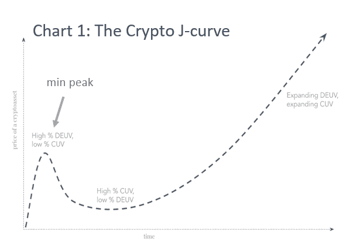
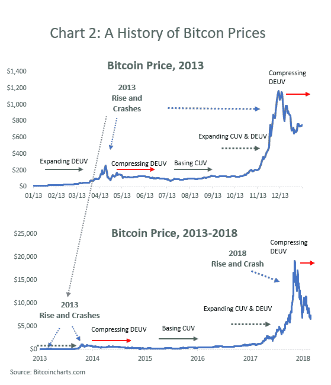
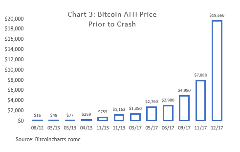
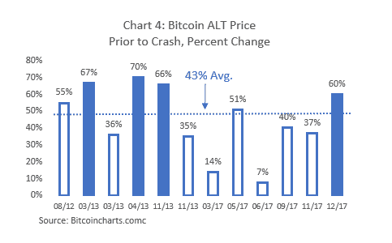

# 理解加密评估

> 原文：<https://medium.com/hackernoon/making-sense-of-crypto-valuations-cd4417d1f250>

Unsplash

当与经验丰富的机构投资者会面时，我注意到一些让他们保持观望的事情。他们的担忧包括缺乏来自华盛顿的明确监管，以及缺乏 SEC 监管的安全托管解决方案。好消息是，这些问题正在逐步得到解决。秘密监管正慢慢变得清晰。尽管谨慎，美国监管机构正在形成自己的立场。安全存储解决方案大幅改进 [**帮助减少**](https://blog.digicor.io/how-to-keep-your-crypto-safe-in-the-wild-west-crypto-world/) [**黑客**](https://blog.digicor.io/how-to-keep-your-crypto-safe-in-the-wild-west-crypto-world/) 的数量。与此同时，随着合格的托管机构进入这一领域，合规的托管解决方案也开始出现。然而，有一个领域投资者很难搞清楚:**如何评估区块链协议的估值？**换句话说，通过现在购买，我为比特币[或以太坊](https://hackernoon.com/tagged/bitcoin)支付的是太少还是太多？在传统股票中，有多种价格评估模型。遗憾的是，对于[区块链](https://hackernoon.com/tagged/blockchain)来说，这些车型还没有开发出来。此外，鉴于区块链网络从根本上不同于传统资产类别的特征，传统的估值框架不一定适用。最近一些试图提出理论结构的出版物值得探讨。

# 价值储存手段

投资者和密码爱好者考虑估值的最流行和最简单的方式之一是它为投资者提供价值储存的能力。这种方法通过使用比较器来确定加密的值。例如，以比特币(BTC)为例，根据一些 [**估计**黄金的总价值为 8 万亿美元。由于比特币的供应量上限为 2100 万 BTC，如果我们假设比特币占据了黄金市场的 10%，这将意味着 BTC 价格或 38000 美元。您可以对实用程序令牌采取类似的方法。比如](https://en.wikipedia.org/wiki/Gold_reserve)[**Filecoin**](https://filecoin.io/)**就是一个分散存储的解决方案区块链。为了计算其潜在价值，您需要确定当前存储的数据总量和存储价格。**

**这种估价方法经常被扩展到包括其他潜在的市场份额。效仿比特币的例子，汇款也是错位的时机。在这种扩展下，每个目标市场的价值是相加的，因为在固定的供给上有两个独立的需求源。这些是模型的简单应用，但是你经常听到人们引用。**

**然而，虽然这种方法可以假设性地帮助你了解比特币等数字资产的总可寻址市场(TAM ),但它不能告诉你更多其他信息。这种方法的最大警告是:**

1.  **我可以通过添加额外的价值捕获(如黄金或汇款)来创造我想要的任何终端价值。因此，TAM 可以任意大，容易出现人为错误。**
2.  **它忽略了概率。很有可能无法收购 TAM。**
3.  **因为它没有提到价值的驱动因素，所以你看不到任何价格动态。它可以遵循直线或正弦曲线路径。**

# **j 曲线**

****

**Chris Burniske**

**然而，J 曲线模型在描述定价加密的驱动因素和动态方面做得更好。J 曲线模型**取自私募股权，由[【1】](/@cburniske#_ftn1)也称为投机效用值。前者指的是网络的当前使用情况(例如，发生了多少次交易)。这类似于股票的基本面驱动因素。未来效用是指加密将产生的前瞻性价值。因为当前效用代表网络的价值用户，所以它是加密资产的自然底价。按照这种思路，在调整时期，价格将较少受到投机(或其预期效用值)的驱动，并将找到更接近其当前效用值的底部。因此，在这种方法中，当你加上 CUV 和德夫，你应该得到该硬币当天 100%的市场价值。****

****让我们在首次引入新密码时应用这个模型。它的价值在很大程度上是投机性的，因而大部分是由 DEUV 作为其效用或 CUV 尚未形成。因为这一阶段的价值纯粹是投机性的，所以该资产非常不稳定，正如我们在 ico 和早期阶段令牌中经常看到的那样。这段时间通常会产生 J 曲线的第一个“小峰值”(见图 1)。目前，价值构成中的 DEUV 百分比较高，CUV 百分比较低。然而，由于团队面临路障，投资者对 waines 感兴趣，DEUV 将压缩，价格将下降。这是一个关键阶段，因为许多硬币无法重新获得动力，并增加其长期预期效用值。另一方面，如果有一个拥有真正技术的强大开发团队，他们可以推进并专注于改进协议。随着越来越多的用户(不是投机者)涌入，随着 CUV 的扩张，价格重新获得动力。随着对未来效用价值的预期成熟，DEUV 增长，J 曲线开始变陡，导致 DEUV 和 CUV 的串联扩张。此时，完整的周期已经结束，价格处于历史新高(ALT)。这些结果可能会因牛市或熊市的不同而有很大差异。****

********

****我们也可以在比特币中看到类似的场景。以图表 2 中的 2013 年价格为例。这一年以一个扩张的 DEUV 开始，导致第一个小高峰。然而，由于投资者的预期没有得到满足，价格在年底再次反弹之前找到了底部，当时 CUV 和 DEUV 同时扩张。例如，2017 年 12 月的比特币价格涨势，可以部分促成了**[**CME**](https://cointelegraph.com/news/bitcoin-drops-following-cme-futures-investors-still-buy-in-at-100-premium)**和 [**CBOE**](https://cointelegraph.com/news/first-bitcoin-futures-contract-expires-at-10900-win-for-bears) 推出第一个比特币期货。这一消息引发了巨大的猜测，并担心错过导致加密货币领域的价格飙升。然而，由于投资者的预期与现实不符(很少有投资者真正购买比特币期货合约)，随之而来的是随后的抛售。与 2018 年的价格上涨和随后的下跌相比，2013/14 年的上涨和暴跌虽然一度引人注目，但现在几乎难以辨认(图 2)。这是因为在 J 曲线模型中，DEUV 将大于之前的峰值，从而导致 J 曲线不断刷新。********

****虽然牛市和熊市在金融界并不新鲜，但比特币的涨跌是相当戏剧性的**。这在很大程度上是因为比特币仍然几乎完全是投机性的，而且具有极大的上涨潜力。由于这两个因素，当比特币显示出真正的前景，CUV 扩大时，投资者就会蜂拥而入。当这种情况发生时，由于投资者忽略了现实，DEUV 将开始迅速超过 CUV 的增长。这种投资者投机盛衰的情景已经一次又一次地在 crypto 身上上演。自 2009 年以来，比特币经历了 13 次上涨和暴跌。然而，每一次，它崩溃了，下一次它会涨得更高，产生持续的历史最高(ATH)价格(见图表 3)。平均而言，比特币的 ALT 价格涨幅为 43%，其中有四个价格涨幅超过 60%(见图表 4)。******

************************

******喜欢你读的吗？ [**报名参加我们的快讯**](https://digicor.io/pages/newsletter) **！********

# ****包裹****

****尽管在如何对加密货币**[**估值方面做了更多的工作，但**伯恩斯基对 J 曲线的改编在解释加密货币的价值波动方面做了大量工作。在今天的市场上，大多数人购买 crypto 是期望它在未来会更值钱。因此，整个市场大部分是投机性的，所以在 J 曲线的任何阶段，价格中仍然只有很少的 CUV。也就是说，效用价值正在快速增长。例如，比特币(和许多其他东西)正在不断改进他们的协议，正如我们已经看到的](https://blockchainatberkeley.blog/todays-crypto-asset-valuation-frameworks-573a38eda27e) [**比特币 SegWit**](https://www.investopedia.com/terms/s/segwit-segregated-witness.asp)[【3】](https://blog.digicor.io/making-sense-of-crypto-valuation/#_ftn3)。由于其他数字资产也能够改进、展示效用并满足投资者的期望，数字资产将继续增长。投资者面临的问题是，如何最好地抓住这一价值？鉴于目前价格中大量投机成分的隐现[**我们认为**](https://blog.digicor.io/the-digicor-thesis/) 被动指数基金是收获上涨空间的最佳方式。联系我们 [**这里**](https://digicor.io/information/contactus) 了解更多关于我们的方法和指数基金。******

*****原载于 2018 年 6 月 22 日*[*blog . digicor . io*](https://blog.digicor.io/making-sense-of-crypto-valuation/)*。*****

****你可以考虑一下 DEUV，看看它将来是否会被用来替代黄金、汇款、文件存储等。，该令牌在 2025 年的预期效用值是多少。然后你把价格折回到现在，这就是预期效用值或 DEUV。****

****当前的买家主要由散户组成，他们的不成熟导致了市场更高的波动性和情绪化。****

****[【3】](https://blog.digicor.io/making-sense-of-crypto-valuation/#_ftnref3)一项协议升级，支持比特币区块内更多数量的交易。****

*******重要交底*******

*****本出版物包含从被认为是真实可信且备受推崇的来源获得的信息。转载材料经许可使用，并注明出处。我们已经尽了合理的努力来发布可靠的数据和信息，但作者不能对所有材料的有效性或其使用的后果承担责任。此处包含的某些信息可能已经过时，不再适用:信息来源在最初发布时被认为是可靠的，但不能保证。*****

*****本文包含的观点是作者的观点，但不一定是 DigiCor Asset Management 的观点。这些观点可能会在不通知的情况下发生变化。本出版物仅用于教育目的，不应被视为投资建议或对任何特定证券、策略或投资产品的推荐。*****

*****对特定数字资产的引用仅用于说明目的，并非旨在也不应被解释为购买或出售此类证券的建议。作者或 DigiCor Asset Management 可能拥有也可能不拥有或曾经拥有引用的数字资产，如果拥有此类数字资产，并不表示将继续持有此类数字资产。*****

*****本材料包含假设的插图，本材料的任何部分都不代表任何 DigiCor 资产管理产品或服务。此处包含的任何内容都不构成会计、法律、税务、证券或投资建议，也不构成关于任何投资的适当性的意见，也不构成任何类型的招揽。读者应该意识到所有的投资都有风险。*****