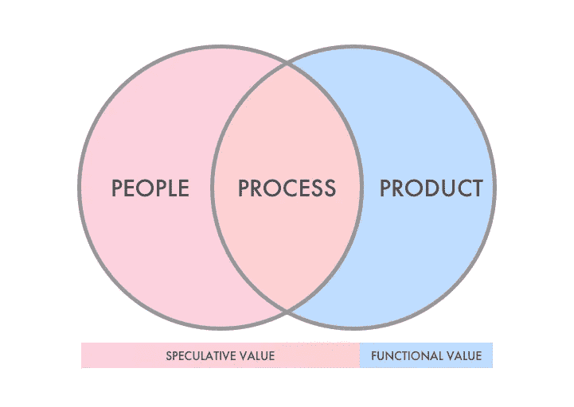

# 解读加密货币中的货币

> 原文：<https://medium.com/hackernoon/making-sense-of-the-money-in-cryptocurrencies-c7d305d2390e>

## 为什么一枚硬币值一美元、一百美元或一万美元

加密货币的支持者和怀疑者之间最常见的争论之一是关于硬币的价值。您可能会遇到这些的一些变体:

> “加密货币缺乏基本面！”
> 
> "你如何给比特币或以太坊赋予价值？"
> 
> "与黄金和其他实物资产不同，加密货币是无形的."

事实上，如果加密货币是明天的技术，就像今天的互联网一样，你如何给它估值？互联网对你的货币价值是什么？有没有绝对正确的定价方式？仅仅是供求的市场力量在起作用吗？

然而，看看[的 CoinMarketCap](http://www.coinmarketcap.com) ，你会发现每种加密货币都有一个价格。买家会为一枚硬币支付他们认为合理的价格。

那么他们如何决定以什么价格购买他们的第一枚硬币呢？谁说比特币值 10 美元、1 万美元或者 10 万美元？**今天，是什么赋予了一枚硬币美元的价值？**

# 人们。产品。过程。

The 3 Ps of Cryptocurrencies.

借用市场营销和商业评估的一些概念，我们可以以类似的方式评估所有加密货币。我认为“过程”介于“人”和“产品”之间，因为它指的是人们采用和使用产品的步骤。

## 人

一组人是内部利益相关者，如开发人员、合作伙伴和创始人，他们可以影响加密货币的发展及其战略进步。另一组是外部利益相关者，他们只是投入资金，对产品没有什么发言权。

传统上，公司的投资者是在董事会拥有股权和影响力的内部利益相关者。然而，加密货币允许任何人成为投资者，并且不拥有任何股权。

虽然投资者现在是“外部”的，不能影响产品，但他们可以通过在任何时候购买和出售大量代币来影响价格。他们还可以在通常所说的“泵送-倾倒”小组中协调购买和销售。

此外，投资者可以是任何人，比如赌徒、夫妻店投资者，或者对加密货币知之甚少的人，他们往往对价格变化和公共新闻非常敏感。

因此，一枚硬币的价值在很大程度上取决于为其买卖定价的外部利益相关者。**因此，外部利益相关者的构成是一个重要因素**，因为他们的投资者类型和动机将影响加密货币的买卖方式。

事实是，大多数人都是出于投机的原因，这就是为什么我认为一枚硬币的大部分美元价值都是投机的。

## 产品

撇开人不谈，产品差异化呢？当然，并非每种加密货币都生而平等。有合法的和有前途的加密货币，也有脆弱的或骗局。

我之前写过关于加密货币分类的文章，并根据功能对代币进行了分类——支付模式、价值储存、协议改进、硬币即服务和公用代币。

虽然这是评估不同加密货币功能目的的一种方式，但考虑不同加密货币如何实现这一目标也很重要。例如，比特币现金(BCH)或莱特币(LTC)作为支付方式如何优于比特币(BTC)或以太坊(ETH)？Nano 或者 IOTA 的无感设计呢？

加密货币将改变支付方式、商业交易、机器经济等等，加密货币将具有功能价值。然而，鉴于它们相对于传统方法的当前限制(安全性、可伸缩性、黑客攻击等)，它们的功能价值仍然很小，并且今天的价格仍然应该归因于投机。

## 过程

鉴于加密货币的开源性质，可能会有两个或更多类似的产品寻求解决同一问题。假设人和产品因素完全相同，怎么比较呢？

“流程”是人们与产品互动的方式，这种互动可以是使用产品、影响产品的使用方式或营销产品。也就是说，**过程是一种加密货币得以采用的战略途径**。

当我们观察不同加密货币的过程时，我们可以看到细微差别，然后决定我们更喜欢哪种策略。例如，以太坊的建立是为了应对智能合约，而不是与比特币竞争支付模式。另一方面，Nano 旨在通过建立一个无感觉、非区块链的系统来解决区块链支付的可扩展性和高交易费用问题。

Ripple 和 IOTA 等一些加密货币专注于建立合作伙伴关系，这将有助于改进产品并鼓励采用。拥有忠诚的合作伙伴和坚定的社区也给了他们相对于竞争对手和模仿者的竞争优势。

随着加密货币逐渐经历改进和采用(或缺乏)，过程成为实现产品功能价值的方式。另一方面，它的投机价值将逐渐减少，无论它失去价值还是在其用例中变得更加具体。

# 结论

今天的加密货币市场具有高度的投机性，价格在很大程度上受到人们情绪和投机的影响。价格受到负面消息、谣言、市场趋势和贪婪的影响。当我们购买一枚硬币时，认为它的价值会随着达到一定的里程碑而上升，这就是投机。

加密货币可能会发生许多变化——监管、改进、用例、模仿、黑客等。尽管认识到如今大多数硬币的美元价值都是投机性的很重要，但我们也应该看看它们的功能价值，因为从长远来看，这才是主流。

一个特定的令牌被推测的程度如何？它的优点是什么？它真的有必要在区块链吗？它的战略流程是什么？一旦你意识到这些，你也许能够在你的加密货币投资中做出更明智的决定。

*谢谢你看完。我很高兴写下并分享关于加密货币的内容，因为我相信它们有很多方法可以实现。如果你觉得有用，请随意与他人分享这篇文章！或者你可以在下面评论你的想法或不同意见；我很想得到一些关于这些问题的反馈。*