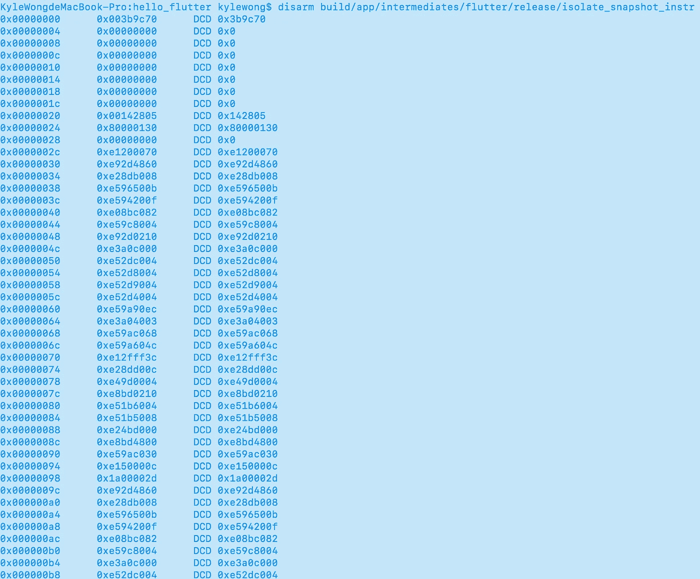

# 充分利用 Flutter:从基础到定制

> 原文：<https://medium.com/hackernoon/making-the-most-of-flutter-from-basics-to-customization-433171581d01>

开源 SDK Flutter 为开发人员提供了一种为 Android 和 iOS 应用程序轻松部署定制用户界面的方式——只要你知道如何优化它的功能。


*本文是阿里巴巴* [***利用旋舞***](/@alitech_2017/utilizing-flutter-best-practice-from-alibaba-236a53aa32c8) *系列的一部分。*

对于开发者来说，像谷歌的 Flutter 这样的软件开发工具包提供了一种构建原生 Android 和 iOS 移动界面的方法，同时避免了许多相关的负担，包括纯粹的时间需求。尽管如此，一些人可能会想知道 Flutter 项目与纯 Android 或 iOS 项目有何不同，例如它们的渲染或事件交付机制，或者它们如何让开发人员在建设停滞时修改错误并实施项目。

为了帮助解决这些问题，并阐明其工作方式，阿里巴巴今天从全球视角看待 Flutter，使用“hello_flutter”示例项目。接下来的部分将首先介绍 Flutter 的原理，然后讨论定制和优化功能，以及有兴趣探索 Flutter 的开发人员可以遵循的具体步骤。

# 颤振的基本原理

## 体系结构

作为一个程序，Flutter 的架构建立在三个不同的层面上:框架、引擎和嵌入器。


Overview of Flutter’s architecture

Flutter 的框架在 Dart 中实现，包含材质设计风格的小部件、Cupertino 风格的小部件(用于 iOS)、基于文本/图像/按钮的小部件、渲染、动画、手势等等。这一层的核心代码包括 flutter 资源库下的 flutter 包和 sky_engine 资源库(dart:ui 库提供了 flutter 框架和引擎之间的接口)下的包，如 io、async 和 ui 包。

Flutter 的引擎是用 C++实现的，包括 Skia、Dart 和 Text。Skia 是一个开源的 2D 图形库，它为各种硬件和软件平台提供了一个通用的 API。它已经被用作 Google Chrome、Chrome OS、Android、Mozilla Firefox、Firefox OS 和许多其他产品的图形引擎。支持的平台有 Windows7+，macOS 10.10.5+，iOS8+，Android4.1+，Ubuntu14.04+等等。

引擎的 Dart 部分主要包括 Dart 运行时和垃圾收集(GC)。如果 Flutter 在调试模式下运行，还包括 JIT(实时)支持，而在发布和配置文件模式下，dart 代码由 AOT(提前)编译成本机“arm”代码，因此不存在 JIT。文本是指具有以下呈现级别的文本呈现:libtxt 库(用于字体选择和分隔线)，派生自 minikin 和 HartBuzz(用于字形选择和整形)。Skia 充当渲染后端，在 Android 和 Fuchsia 上使用 FreeType 渲染，在 iOS 上使用 CoreGraphics 渲染。

嵌入器是在各种平台中嵌入 Flutter 的嵌入层。这里的主要任务是渲染表面设置、线程设置和插件。我们可以看到，与平台相关的 Flutter 层很少，平台(如 iOS)只是提供一个画布，其余的渲染相关逻辑发生在 Flutter 内部，这有助于实现良好的跨平台一致性。

## 工程结构

本文使用的开发环境是 Flutter beta v0.3.1，对应引擎 commit : 09d05a389。

对于我们简单的“hello_flutter”项目示例，flutter 的工程结构如下:


上面的例子中，“ios”是 iOS 的代码，用 CocoaPods 管理依赖关系，“android”是 Android 的代码，用 Gradle 管理依赖关系，“lib”是 dart 代码，用 pub 管理依赖关系。类似于 iOS 中 Cocoapods 的 Podfile 和 Podfile.lock，pub 中对应的是 pubspec.yaml 和 pubspec.lock。

## 模式

Flutter 支持常见的模式，包括调试、发布和概要分析，但是有一些显著的区别。

Flutter 的调试模式对应 Dart 的 JIT 模式，也称为检查模式或慢速模式，支持 iOS 和 Android 的设备和仿真器。在这种模式下，断言功能(包括所有调试信息、服务扩展和调试辅助工具，如“观察站”)被启用。该模式针对快速开发和操作进行了优化，但不针对执行速度、包大小或部署。在这种模式下，编译基于 JIT 技术，支持流行的亚秒级有状态热重装。

Flutter 的发布模式与 Dart 的 AOT 模式相对应，后者面向最终用户部署，支持真实机器，但不支持模拟器。在这种模式下，所有断言都被禁用，为了尽可能多地移除调试信息，所有调试工具也被禁用。该模式针对快速启动、快速执行和数据包大小进行了优化，同时禁止所有调试辅助工具和服务扩展。

Flutter 的 profile 模式与它的 release 模式相似，因为这种模式只增加了对服务扩展和跟踪的支持，并最小化了使用跟踪信息所需的依赖性。例如，“观察台”可以连接到流程。profile 模式不支持仿真器的原因是仿真器上的诊断并不代表真实的性能。

由于 Flutter 的 profile 模式和 release 模式在编译原理上没有区别，所以本文只讨论它的调试模式和发布模式。

实际上，在 Flutter 中进行的一个 iOS 或 Android 项目，仍然是标准的 iOS 或 Android 项目。Flutter 只通过在 BuildPhase 添加 shell 生成并嵌入一个 App.framework 和 Flutter.framework (iOS)并通过 Gradle 添加 flutter.jar 和 VM/isolate _ snapshot _ data/instr(Android)编译相关代码并嵌入到 native app 中。因此，本文主要讨论由颤振引入的构造和执行原理。虽然编译目标包括 arm、x64、x86、arm64，但是原理都很相似，只讨论与 arm 相关的原理。(如无特别说明，安卓默认 armv7。)

# 更深入:iOS 的代码编译和执行

## 发布模式下的编译

在发布模式下，Flutter 下 iOS 项目 dart 代码的构建过程如下:


在图中，gen_snapshot 是 Dart 编译器，它使用树抖动技术(类似于可以生成最小包的依赖树逻辑，这样 Dart 支持的反射在 Flutter 中被禁用)生成汇编形式的机器码，然后通过 xcrun 等编译工具链生成最终的 App.framework。换句话说，对于所有的 dart 代码，包括业务逻辑代码和第三方包代码，它们所依赖的 flutter framework (dart)代码最终都变成了 App.framework。

摇树函数位于 gen_snapshot 中。要查看相应的逻辑，您可以访问:

engine/src/third _ party/dart/runtime/VM/compiler/AOT/precompiler . cc

dart 代码最终对应于 App.framework 的符号如下:


其实类似于 Android 发布的产品(见下文)，App.framework 也包括四个部分:kDartVmSnapshotData、kDartVmSnapshotInstructions、kDartIsolateSnapshotData、kDartIsolateSnapshotInstructions。为什么 iOS 用 App.framework 而不是 Android 的四档？原因是在 iOS 下，由于系统限制，Flutter 引擎无法在运行时将内存页面标记为可执行，而在 Android 下可以。

Flutter.framework 对应于 Flutter 架构的引擎和嵌入器。实际上，Flutter.framework 位于 Flutter 存储库的/bin/cache/artifacts/engine/IOs *中，默认情况下从 Google 存储库中拉出。当需要自定义更改时，您可以使用 Ninja construction 系统通过下载引擎的源代码来生成它。

Flutter 相关代码的最终产品是 App.framework(由 Dart 代码生成)和 Flutter.framework(引擎)。从 Xcode 项目来看，Generated.xcconfig 描述了 flutter 相关环境的配置信息，然后在 Runner 项目设置中新增的 Build Phases 的 xcode_backend.sh 实现了复制(从 Flutter 框架库到 Runner 项目根目录下的 Flutter 目录)和嵌入 Flutter.framework 以及编译嵌入 App.framework。

最终生成的 Runner.app 中与颤振相关的产品如下:


结果，flutter_assets 是 flutter 资源，代码是 App.framework 和 Flutter.framework，位于 framework 目录中。

## 在发布模式下执行

与颤振相关的渲染、事件和通信处理的逻辑如下:


Dart 中 main 函数的调用堆栈如下:


## 调试模式下的编译

在调试模式下，Flutter 的编译结构类似于发布模式。差异主要表现在两点:

**1。Flutter.framework**

在调试模式下，框架包含 JIT 支持，而在发布模式下没有 JIT 支持。

**2。App.framework**

与 App.framework 在 AOT 模式下是 dart 代码对应的本机代码不同，在 JIT 模式下 App.framework 只有几个简单的 API，它的 Dart 代码存在于 snapshot_blob.bin 文件中。这部分中的快照是一个脚本快照，带有简单的带标签的源代码。所有注释和空白字符都被删除，常量被规范化，并且不存在机器码、树抖动或混乱。

App.framework 中的符号表如下:


在 Runner.app/flutter_assets/snapshot_blob.bin 上运行字符串命令，查看以下内容:


调试模式下主条目的调用堆栈如下:


# Android 的代码编译和执行

除了 Android 和 iOS 的一些平台相关的特性，其他的逻辑比如对应 AOT 的 Release 和对应 JIT 的 Debug 会很相似，只有两个关键的区别需要注意。

## 发布模式下的编译

在发布模式下，Android Flutter 项目中 Dart 代码的构造链接如下:


在该图中，vm/isolate_snapshot_data/instr 项是 arm 指令，由引擎在运行时加载并标记为可执行。VM_snapshot_data/instr 用于初始化 DartVM。有关其调用入口，请参见 Dart_Initialize (dart_api.h)。Isolate_snapshot_data/instr 对应于我们创建新隔离的 App 代码；有关其调用入口，请参见 Dart_CreateIsolate(dart_api.h)。

Flutter.jar 类似于 iOS 的 Flutter.framework，包括引擎的代码(Flutter.jar 中的 libflutter.so)和一组将 Flutter 嵌入 Android 的类和接口(FlutterMain、FlutterView、FlutterNativeView 等等)。事实上，flutter.jar 位于 flutter 资源库的/bin/cache/artifacts/engine/Android *中，默认从 Google 资源库中拉出。当需要自定义修改时，可以通过下载引擎的源代码，使用 Ninja 构造系统生成 flutter.jar。

以 isolate_snapshot_data/instr 为例，运行 disarm 命令的结果如下:



其 APK 结构如下:


新安装 APK 后，使用时间戳判断(packageinfo 中的 versionCode 结合 lastUpdateTime)来决定是否将 assets 中的 flutter 产品复制到本地 app 数据目录中。复制的内容如下:


Isolate/vm_snapshot_data/instr 最终位于应用程序的本地数据目录中，在那里它是可写的。因此，应用程序的整个替换和更新可以通过下载和替换那些快照来完成。

## 在发布模式下执行

下图显示了发布模式下的执行逻辑:


## 调试模式下的编译

和 iOS 的情况一样，Android 中调试模式和发布模式的区别主要在于以下两个组件:

**1。flutter.jar**

这里的区别与之前对 iOS 的描述完全相同。

**2。App 代码**

app 代码位于 flutter_assets 下的 snapshot_blob.bin 中，iOS 也是如此。

在介绍了关于 iOS 和 Android 的 Flutter 编译原则之后，我们现在将关注如何配置 Flutter 及其引擎，以实现完全的定制和优化。由于 Flutter 正处于敏捷开发阶段，其中出现的问题的当前性质在未来可能并不相关。因此，下一节的重点不是解决问题，而是可以说明解决问题的原则的不同类型的场景。

# 颤振的定制和优化开发

颤振是一个复杂的系统。除了上面提到的三层架构，它还包括 Flutter Android Studio (Intellij)插件、发布库管理和许多其他组件。然而，定制和优化通常与 Flutter 的工具链有关；代码位于 flutter 库的 flutter_tools 包中。我们现在来看看如何分别为 Android 和 iOS 定制这一部分。

## 定制 Android

Android 的 Flutter 定制相关的内容有 flutter.jar、libflutter.so(在 flutter.jar 下)、gen_snapshot、flutter.gradle、flutter_tools。定制颤振时，应考虑以下因素:

**1。将 Android 中的目标定义为 armeabi**

这一节是构造的一部分，其逻辑在 flutter.gradle 下，当 app 通过 armeabi 支持 armv7/arm64 时，必须修改 flutter 的默认逻辑如下:


由于 Gradle 本身的特性，该部分可以被构造并在修改后生效。

**2。设置 Android 在启动时默认使用第一个可启动的活动。**

本节与颤振 _ 工具有关，修改如下:


这里的重点不是如何修改，而是如何让修改生效。原则上，对于“flutter run/build/analyze/test/upgrade”等命令，实际运行的是 Flutter 脚本(Flutter _ repo _ dir/bin/Flutter)；然后通过这个脚本，通过 Dart 运行 flutter_tools.snapshot(由 packages/flutter_tools 生成)。逻辑如下:

```
if [[ ! -f "SNAPSHOT_PATH" ]] || [[ ! -s "STAMP_PATH" ]] || [[ "(cat "STAMP_PATH")" != "revision" ]] || [[ "FLUTTER_TOOLS_DIR/pubspec.yaml" -nt "$FLUTTER_TOOLS_DIR/pubspec.lock" ]]; then
        rm -f "$FLUTTER_ROOT/version"
        touch "$FLUTTER_ROOT/bin/cache/.dartignore"
        "$FLUTTER_ROOT/bin/internal/update_dart_sdk.sh"
        echo Building flutter tool...
    if [[ "$TRAVIS" == "true" ]] || [[ "$BOT" == "true" ]] || [[ "$CONTINUOUS_INTEGRATION" == "true" ]] || [[ "$CHROME_HEADLESS" == "1" ]] || [[ "$APPVEYOR" == "true" ]] || [[ "$CI" == "true" ]]; then
      PUB_ENVIRONMENT="$PUB_ENVIRONMENT:flutter_bot"
    fi
    export PUB_ENVIRONMENT="$PUB_ENVIRONMENT:flutter_install"

    if [[ -d "$FLUTTER_ROOT/.pub-cache" ]]; then
      export PUB_CACHE="${PUB_CACHE:-"$FLUTTER_ROOT/.pub-cache"}"
    fi

    while : ; do
      cd "$FLUTTER_TOOLS_DIR"
      "$PUB" upgrade --verbosity=error --no-packages-dir && break
      echo Error: Unable to 'pub upgrade' flutter tool. Retrying in five seconds...
      sleep 5
    done
    "$DART" --snapshot="$SNAPSHOT_PATH" --packages="$FLUTTER_TOOLS_DIR/.packages" "$SCRIPT_PATH"
    echo "$revision" > "$STAMP_PATH"
    fi
```

由此可见，如果你想重新构建 flutter_tools，可以删除 flutter _ repo _ dir/bin/cache/flutter _ tools . stamp(以便重新生成)，或者屏蔽掉 if/fi 判断(每次都重新生成)。

3.在 Android 项目的调试模式中使用发布模式颤振

如果您发现 Flutter 在开发中似乎有些滞后，并且猜测这可能是由逻辑或调试模式的某个因素引起的，您可以在发布模式中构造 APK，或者将 Flutter 强制到发布模式，如下所示:


## 自定 iOS

iOS 开发定制 Flutter 相关的内容有 Flutter.framework、gen_snapshot、xcode_backend.sh、flutter_tools。定制颤振时，应考虑以下因素:

**1。优化建造过程中反复更换颤振框架导致的重新编译**

本节的这个逻辑与构造有关，位于 xcode_backend.sh 中，为了保证每次都能获得正确的 Flutter.framework，Flutter 每次都会根据其配置(见生成的. xcconfig 配置)寻找并替换 Flutter.framework。然而，这会导致依赖于该框架的项目代码的重新编译。必要的修改如下:


**2。在 iOS 项目的调试模式中使用发布模式颤振**

要进行这种定制，需要将 Generated.xcconfig 中的 FLUTTER_BUILD_MODE 改为“Release”，FLUTTER_FRAMEWORK_DIR 改为“Release”对应的路径。

**3。设置对 armv7** 的支持

关于这个场景的原始文档，请参见[https://github . com/flutter/engine/wiki/iOS-Builds-Supporting-arm V7](https://github.com/flutter/engine/wiki/iOS-Builds-Supporting-ARMv7)。

其实在 iOS 中，Flutter 本身是支持 armv7 的，但是目前没有提供官方支持，所以你必须修改相关逻辑如下:

**a.** 生成默认逻辑:

Flutter.framework(arm64)

**b.** 修改 Flutter，使 flutter_tools 每次都能重建。修改 build_aot.dart 和 mac.dart，将 iOS 的相关 arm64 改为 armv7，将 gen_snapshot 改为 i386 架构。

i386 架构下的 gen_snapshot 可以通过以下命令生成:

```
./flutter/tools/gn --runtime-mode=debug --ios --ios-cpu=arm
ninja -C out/ios_debug_arm
```

这里隐含着一种逻辑:

构造 gen_snapshot 的 CPU 相关预定义宏(x86_64/__i386 等)。目标 gen_snapshot 和最终 App.framework 架构的 arch 必须保持一致。即使用 x86_64->x86_64->arm64 或者 i386->i386->armv7。

**c.** 在 iPhone4S 上，当 gen_snapshot 生成不支持的 SDIV 命令时，会出现 EXC _ 坏指令(EXC _ ARM _ 未定义)错误，可以通过在 gen_snapshot(位于 build_aot.dart)中添加参数“—不使用整数除法”来实现。其背后的逻辑如下:


**d .**“Lipo create”基于 a 和 b 生成的 Flutter.framework 生成一个同时支持 armv7 和 arm64 的 Flutter.framework。

**e.** 修改 Flutter.framework 下的 Info.plist，删除:

```
<key>UIRequiredDeviceCapabilities</key>
  <array>
    <string>arm64</string>
  </array>
```

同样，您必须在 App.framework 上执行相同的操作，以避免受到来自 AppStore 的应用精简的影响。

# 调试颤振工具

如果您想知道在调试模式下构造 APK 时在 Flutter 中执行的具体逻辑，您可以采用以下方法:

**a.** 了解 flutter_tools 命令的参数。


**b.** 打开 packages/flutter_tools 作为 Dart 项目，添加新的“Dart 命令行 App”配置。将 Dart 文件设置为“flutter_tools.dart”，将工作目录设置为您的 flutter 项目的路径，并将程序参数设置为前面获得的参数。


# 引擎定制和调试

考虑下面的场景。假设我们基于 Flutter beta v0.3.1 定制开发了一个服务，为了保证稳定性，SDK 在一定时期内不升级。同时，在主服务器上修改了 flutter v0.3.1 上的一个 bug，标记为 fix_bug_commit。您如何跟踪和管理这种情况？

1.Flutter beta v0.3.1 将其对应的引擎提交指定为 09d05a389。请参见:颤振/箱/内部/发动机.版本

2.获取发动机代码。

3.由于主代码是在第二步中获得的，我们需要的是与特定提交(09d05a389)相对应的代码库，那么您将从这个提交中拉出一个新的分支:custom_beta_v0.3.1。

4.基于 custom_beta_v0.3.1 运行“g client sync ”( commit:09d 05 a 389)获取对应于 flutter beta v0.3.1 的所有引擎代码。

5.使用“git cherry-pick fix_bug_commit”将主服务器的更改同步到 custom_beta_v0.3.1。如果更改对最新更新有许多依赖关系，可能会出现编译失败。

6.针对与 iOS 相关的更改运行以下代码:

```
./flutter/tools/gn --runtime-mode=debug --ios --ios-cpu=arm
ninja -C out/ios_debug_arm

./flutter/tools/gn --runtime-mode=release --ios --ios-cpu=arm
ninja -C out/ios_release_arm

./flutter/tools/gn --runtime-mode=profile --ios --ios-cpu=arm
ninja -C out/ios_profile_arm

./flutter/tools/gn --runtime-mode=debug --ios --ios-cpu=arm64
ninja -C out/ios_debug

./flutter/tools/gn --runtime-mode=release --ios --ios-cpu=arm64
ninja -C out/ios_release

./flutter/tools/gn --runtime-mode=profile --ios --ios-cpu=arm64
ninja -C out/ios_profile
```

要调试 Flutter.framework 源代码，请在构造中使用以下命令:

```
./flutter/tools/gn --runtime-mode=debug --unoptimized --ios --ios-cpu=arm64
ninja -C out/ios_debug_unopt
```

用生成的产品替换 Flutter 中的 Flutter.framework 和 gen_snapshot，调试引擎源代码。

7.最后，运行以下代码，查看与 Android 相关的更改:

```
./flutter/tools/gn --runtime-mode=debug --android --android-cpu=arm
ninja -C out/android_debug

./flutter/tools/gn --runtime-mode=release --android --android-cpu=arm
ninja -C out/android_release

./flutter/tools/gn --runtime-mode=profile --android --android-cpu=arm
ninja -C out/android_profile
```

可以用构造的产品替换 flutter/bin/cache/artifacts/engine/android *下的 gen_snapshot 和 flutter.jar，生成 Android 的 arm&debug/release/profile 产品。

(Original article by Wang Kang 王康)

# 阿里巴巴科技

关于阿里巴巴最新技术的第一手深度资料→脸书: [**“阿里巴巴科技”**](http://www.facebook.com/AlibabaTechnology) 。推特: [**【阿里巴巴技术】**](https://twitter.com/AliTech2017) 。