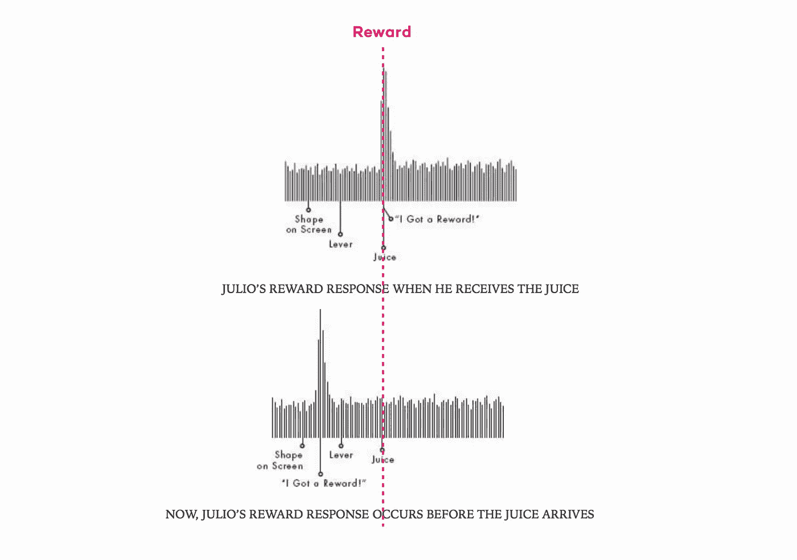

# 打造下一个价值 10 亿美元的应用？养成一个成为渴望的习惯

> 原文：<https://medium.com/hackernoon/making-the-next-billion-dollar-app-create-a-habit-that-becomes-a-craving-d4f8feb6584d>

你有没有发现自己走在回家的路上，完全被手机上的东西所占据？你没有看你要去哪里，但突然你发现自己在你的前门。

这是因为你的大脑已经下意识地养成了一种**习惯**来节省有意识的努力，将一系列的动作处理成自动的例行程序。

习惯是我们人类许多行为背后的驱动力。这就是为什么一个患有顺行性健忘症的[患者](/@PRHDigital/the-power-of-habit-64e8a3d42abd)不记得他的厨房在哪里，但问他要一些坚果，这个提示会促使他走到那里，伸手去拿一个罐子。

这也是我们沉迷于我们的应用程序的原因。你们当中有多少人在没有服务的时候经历过某种“焦虑”或沮丧？这类似于吸烟者在飞机上的感觉；应用程序就像是我们大脑的虚拟香烟。

习惯会变成渴望，在我们意识到之前，我们会打开 Instagram、Snapchat 或简单地再次下拉刷新你的邮件应用。我们的多巴胺系统通过诱导一种我们称之为欲望的半压力反应，让我们不断寻找奖励。去除我们满足欲望的能力，事实证明我们的[大脑会变得疯狂。](https://www.sciencedirect.com/science/article/pii/S0747563214002805)

# 产品中的习惯循环

Wolfram Schultz [展示了](https://www.cin.ucsf.edu/~houde/sensorimotor_jc/WSchultz93a.pdf)预期和渴望的力量，同时观察到一只名叫 Julio 的猴子为了得到一滴黑莓汁而拉动杠杆。

最初，每当胡里奥拉起操纵杆，他的多巴胺水平就会随着他得到美味的奖励而飙升。然而，随着时间的推移，当 Julio 重复这个动作时，多巴胺峰值在他拉动杠杆之前就开始出现了。胡里奥的快乐中枢在他前面启动，为奖赏而工作。

The more often you repeat an action that yields a reward, the earlier you get a dopamine hit. Over time, you start *anticipating* the reward (image credit: [The Power Of Habit by Charles Duhigg](https://www.amazon.co.uk/Power-Habit-Why-What-Change/dp/1847946240/ref=sr_1_1?ie=UTF8&qid=1538752544&sr=8-1&keywords=power+of+habit)).

舒尔茨还发现，在这种预期状态下，去除或大大延迟汁液的释放会导致与欲望和沮丧相关的复杂神经模式爆发。简单来说，它会导致一种无法满足的渴望——类似于你的外卖订单出错时的感觉。

我们在 Instagram 等社交应用上也经历了类似的习惯循环。如果你曾经看到有人打开他们的应用程序，几乎可以保证他们的眼睛第一个扫向通知中心和右下角的红色警报。为什么？因为随着时间的推移，他们的大脑已经开始预期受欢迎或感觉重要的回报。

Where did your eyes first go? 👀😏

你还会看到许多用户在上次登录几分钟后重新打开他们的 Instagram 或 Mail 应用。他们知道在如此短的时间内获得回报的可能性很低，但潜意识的惯例和习惯会让他们再次检查。

随着时间的推移，这个自动过程成为一个强大的习惯循环，它会让你**投入**更多的精力来发布和维护你的个人资料。

[Nir Eyal’s Hook model](/@nireyal) breaks down the habit loop into four stages

习惯性使用还会导致一种叫做**的厌恶损失**的东西。以 Snapchat Streaks 为例，你获得的 streak 分数等于你连续给某个朋友来回发送直接快照的天数。

如果你打破了这个记录，你就失去了所有的地位/友谊的证明，并且*一些开始是一种乐趣的东西现在变成了监狱*。

One teen’s Snapstreaks — it would be more painful to stop and break the streak than it would be to continue in perpetuity.

成功的产品无情地优先考虑导致上瘾或习惯性使用的功能。为什么？因为获取用户是一回事，但确保新用户*停留*对于长期活跃用户增长至关重要；你不能用一个漏桶来持续增长活跃用户。

# 如何制作一个让人上瘾的 app？

2014 年，我推出了一款名为 [Fling](https://techcrunch.com/2015/10/29/moment-sharing-app-fling-adds-reactions-to-promote-global-conversations-tackles-user-safety/) 的应用。在我们的第一年里，我们增长到了 400 万用户和 500 亿条消息，我们的 DAUMAU 超过了 50%。

这意味着平均来说，我们每月有超过一半的用户每天都在使用我们的应用程序(小提示——许多风投会要求你的 DAUMAU 至少达到 30%)。

Fling 类似于 Snapchat，但有一点不同:你的照片发给了世界上随机的 50 个人，而不是你的朋友。那些收到你内容的人可以简单地回复并开始聊天；你结识了社交圈之外的人，并在世界各地建立了友谊。

The very first version of Fling that I photoshopped myself (pre-Sketch days)… The concept was super straightforward, & the design admittedly got better with a full team later on!

以下是我们在产品中建立初始成瘾的几种方式:

# **1。纯设计**

如果你把一架纸飞机从建筑物上扔到一条繁忙的街道上，你会怎么做？走开？不——你会好奇它去了哪里，谁得到了它，如果他们读了信息等等。

在 Fling，我们将这种体验虚拟化到我们的设计中，以激发你在现实生活中的情感。实际上，你必须通过向上滑动纸飞机图标，将你的信息扔(即“扔”)到世界地图上。然后，我们向您展示了 50 个指示收件人所在城市的大头针。

“Flinging” — throwing your media like a paper plane out to the world

我们发现用户对投掷本身的动作上瘾。让你发泄情绪的内在触发因素(无聊、孤独)得到的回报是兴奋地看着你的信息将走向何方。

然而，这不足以让用户自动返回，我们需要增加一些可变性。

# **2。可变奖励**

在你的应用或产品中引入不可预测性，会在你的大脑中创造出[升高的多巴胺](https://www.youtube.com/watch?v=axrywDP9Ii0&feature=relmfu)，因为用户试图处理*可能*或可能发生的事情。

正如驯兽师凯伦·普赖尔在《T4》中指出的，不要开枪打狗！每跳六次就有鱼吃的海豚很快就会对中间的五次变得无精打采。然而，随意奖励它，它会剧烈地跳跃，永远不知道哪一跳会有鱼。

这就是老虎机如此令人上瘾的原因——不是因为我们知道我们会得到金钱奖励，而是因为我们可能会得到金钱奖励。

通过 Gig FM ( [我们的音乐直播应用](https://www.gigfm.com)于 2017 年推出)，用户可以在家中直播自己的音乐表演，并可以获得礼物，你需要用点数购买礼物；这很像虚拟街头表演。

[Gig FM App](https://www.gigfm.com) — artists livesteam their performances from home to engage their fans and receive virtual tips in the form of “Gifts”

在测试期间，我们希望通过向所有用户提供免费积分来庆祝我们的第 5000 个用户。我们没有给每个用户相同的信用点数，而是告诉他们，他们的账户中收到了一个 10 到 5000 之间的随机数；我们引入了可变性来保持他们的兴奋。它没有花费我们更多的学分，但它产生了很高的点击率和参与度。

An email campaign sent out to [Gig FM](https://www.gigfm.com) beta users.

类似地，在 [Fling](https://techcrunch.com/2015/10/29/moment-sharing-app-fling-adds-reactions-to-promote-global-conversations-tackles-user-safety/) 中，在地图上看到 50 个分散的大头针变得乏味，所以我们在显示了你的信息的目的地后，缩短了这种体验(和多巴胺)。我们从来没有显示谁打开了它，也没有喜欢按钮；用户只能回复投掷。

Replies were the end goal of Flinging

我们会看到用户不断刷新他们的收件箱，急切地等待回复。未知的变量*谁*会回复你(如果有人的话)意味着超过 85%的用户在收到推送通知的几秒钟内就打开了。这也是让用户打开 PNs 的好方法。

Fling 最终随着应用程序的发展而发展，但是我们始终保持核心的“fling”和回复机制。

Fling V2.0\. We hired a real designer.

# **3。行为群组**

最后，这是一个值得单独张贴的东西，但行为群组是任何应用程序保持高留存率的基础。

您可以通过将执行特定操作的新用户分类到组或“群组”中，找出您的用户在哪里以及如何激活**，并找出当这些操作重复时保留提升了多少。**

用 lamens 的话来说，就是找到你的用户在你的应用中找到*值*的准确点。他们[重复你的核心动作](https://news.greylock.com/the-only-metric-that-matters-now-with-fancy-slides-232474cf414c)越多，保留率应该增加得越多。

例如，脸书早年发现，如果你在注册后 10 天内与 7 个朋友联系，你几乎可以保证成为他们产品的长期用户。他们的数据显示，此后回报递减，所以脸书知道他们要让你做的就是在 10 天内交 7 个朋友来激活你。

Points of activation for various unicorn companies — the term “AHA! Moment” is often used to describe the inflection point on retention curves. Image credit: Aplitude.

在 Fling，我们发现我们的核心动作是发送聊天信息。虽然发送媒体给了你多巴胺，但最终的回报和*的目标*总是得到回复，并与一个随机的人开始一个偶然的聊天线程。你也不需要成为一个内容创建者来开始聊天，你只是简单地回复其他人的信息。

> Fling 中的激活点:当新用户第一天在单个聊天线程中发送超过 **3 条消息**

第一天聊天不仅仅是“你好”的新用户的长期保留率明显高于其他群组。

在现实世界中，这是有意义的；参与到有意义的对话中的新用户突然明白了这个应用的全部意义，并从长远来看发现了它的价值。许多人通过机缘巧合建立了长期的联系和友谊，有些人甚至最终结婚了！

直到今天，我仍然会收到在 Fling 上认识的情侣和朋友的信息:

在 [Gig FM](https://www.gigfm.com) 上，我们最初惊讶地发现，保留与*发送*礼物相关，而不是收到礼物。我们留住客户的最大动力来自于那些在加入的第一周内至少送出一份礼物的用户:

这是有意义的:这种互动给了发送者认可的喜悦和即时的满足感，因为广播员在所有其他观众面前大声感谢他们。它还从虚拟礼物中给艺术家经济回报，并给房间里的其他观众提供娱乐内容。

用户因此在向艺术家送礼物后理解了该应用的核心目的。数据分析之后，黑客保留变得很容易，作为我们入职的一部分，我们几乎不可能不在用户的第一次会话中发送礼物(带有免费积分)。

# 尽早整合习惯循环

找到你的核心行动，并通过设计把它变成你产品中的一种习惯，这是可持续发展的关键之一。

无论你是一个社交、银行或健康应用程序，甚至是一个按需购买美酒的应用程序，从一开始就将习惯循环、多巴胺点击和可变奖励整合到产品**中是很重要的。**不要等到发射后；培养你的第一批用户，让他们养成习惯并坚持下去。随着你的用户变得忠诚，他们也更有可能邀请他们的朋友，通过推荐和口碑为你开发产品。

*如果你喜欢这篇文章，请鼓掌告诉我。这会让我开心的，干杯！*

***Marco Nardone****是痴迷于产品的创始人&*[*wine app*](https://www.getwineapp.com)*和*[*Gig FM*](https://gigfm.com)*app 的 CEO，之前还创立了其他 9 款 app 和产品，包括*[*【Fling*](https://techcrunch.com/2015/10/29/moment-sharing-app-fling-adds-reactions-to-promote-global-conversations-tackles-user-safety/)*，用户增长到 500 万，发送的消息超过 500 亿条。更多关于* [*技术*](https://hackernoon.com/tagged/tech)*[*成长黑客*](https://hackernoon.com/tagged/growth-hacking) *和产品思想的帖子请关注 Medium。**