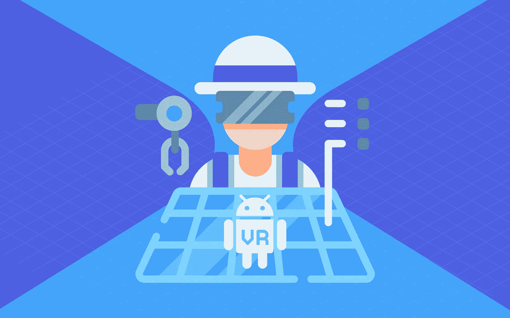
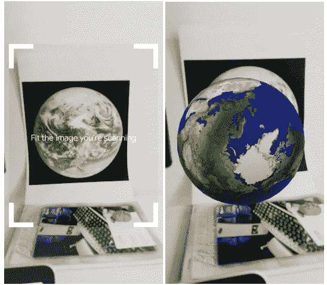

# 用 ARCore Android 让世界变得美好

> 原文：<https://medium.com/hackernoon/making-the-world-beautiful-with-arcore-android-9ddde21f73dd>

如果你对这个世界的现状不满意，你可能会想要改善它。让它更漂亮。而且，在 2018 年，谷歌和他们的 ARCore Android 可以帮助你实现这一目标。ARCore 是一个用于构建增强现实应用的开发平台。在本文中，我将向您介绍它的功能，以及这项技术本身如何丰富您的日常生活。我还将一步一步地向您展示如何制作自己的 ARCore 应用程序。

# 什么是增强现实？

你可以说增强现实让你可以用手机创造自己的世界。用技术术语来说，AR 使得用计算机生成的 3D 模型、图像和视频来增强你的现实世界环境成为可能。当你通过手机摄像头看东西时，你会看到/听到作为环境一部分的所有虚拟附加物。当然，前提是你要安装一个必需的 AR 应用。

[为什么 AR 是 2018](https://tsh.io/blog/mid-year-review-of-the-2018-tech-trends-is-the-4th-industrial-revolution-here/) 最热门的技术之一？这可能是因为你有太多的方法可以使用它——唯一的限制是你的想象力。增强现实有可能影响和丰富我们生活的方方面面。请继续阅读，找出方法。

# ARCore Android 是什么？

因为我的文章关注的是 ARCore，所以让我们先来一次简短的回顾。2018 年 2 月 23 日，谷歌发布 ARCore ver。1.0.0.从那以后，Android 一直支持增强现实。在第一个版本中，谷歌实现了基本的功能，如:跟踪手机在现实世界中的位置，检测环境平面的大小和位置，以及了解环境的当前照明条件。除了这些功能，ARCore 1.0 还引入了定向点，允许您将虚拟对象放置在非水平或非平面纹理表面上。

2018 年 4 月 17 日，谷歌发布 ARCore Android ver。1.1.0 包括:

*   用于同步(在同一帧)从相机帧获取图像的 API(无需手动将图像缓冲区从 GPU 复制到 CPU)；
*   用于获取相机拍摄的图像的色彩校正信息的 API。

5 月 8 日，我们得到了一个巨大的发布，其中谷歌补充道:

*   cloud Anchors API 使开发人员能够在 iOS 和 Android 上构建共享的 Google ARCore 体验。这是通过允许在一个设备上创建的锚被转换成云锚并与其他设备上的用户共享来实现的；
*   增强图像 API，使 ARCore 应用程序能够检测和跟踪图像；
*   垂直面检测，这意味着 ARCore 开始检测水平面和垂直面。

在写这篇文章的时候，谷歌已经发布了 ARCore Android 版本。1.3.0，支持:

*   Frame 上的新方法，*getandroidesensorpose()，其中*返回 Android 传感器帧的世界空间姿态)；
*   相机上的新方法: *getImageIntrinsics()* 返回相机图像的相机内部函数和 *getTextureIntrinsics()* 返回相机纹理的相机内部函数；
*   新类别*cameraintrinsic*为相机提供不旋转的物理特性，包括其焦距、主焦点和图像尺寸；
*   Session *getConfig()* 上的新方法，该方法返回由 Session.configure()设置的配置。

# ARCore Android 正在运行

在上一节中，我介绍了 Google ARCore 的功能。现在，让我们暂时抛开技术细节，欣赏一下增强现实在视觉上是多么令人印象深刻。你准备好看看如何将它融入你的生活了吗？

想象外面很美，你要去一个全新的地方骑自行车旅行。你以前从未去过那里，所以，当然，你需要一个向导。有了增强现实，你的手机可以作为一个很好的向导，根据你的位置告诉你去哪里。这里有一个例子:

或者说你刚搬到一个大城市，但你在那里还没有任何朋友，所以你不知道如何去所有有趣的地方。如果你有一个 ARCore 兼容设备，它会定位附近所有的兴趣点，并实时显示给你。你只需要把手机对准街道。

当你想装饰你的新家或者买一件与其他家具不冲突的新家具时，ARCore Android 也可以帮助你。只要把你的手机指向你想放新东西的地方。

有很多关于如何使用 AR 的想法和概念。关于这部电影有一些例子:

# 如何制作 ARCore 应用程序

在本文的剩余部分，我将教你如何创建一个简单的带有标记和视频的 ARCore 应用程序。在 ARCore 中，标记是用户环境中的 2D 图像，如海报或产品包装。在您的应用程序中，您将使用标记来显示地球的 3D 模型和用户单击模型后播放的短视频。这将是以后创作更大作品的第一步，例如，你自己的博物馆指南。我们开始工作吧！

您需要从环境配置开始。做起来需要 Android Studio 和 Kotlin 的基础知识。下一步是配置您的 **build.gradle** 。请记住，ARCore 的最小 sdk 版本是 24。在您的 **build.gradle 中，**添加依赖项:

在您的 **AndroidManifest.xml** 中，为摄像机添加权限:

当运行应用程序时，必须确保安装在 ARCore 支持的设备上。有两种方法:
使用 ar fragment——你不需要编写代码来检查你的设备上是否安装了 ARCore AndroidARFragment 会帮你做的！
编写检查所有 ARCore 状态的代码

下面是后者的一个例子:

好了，现在您的环境已经启动并运行，您可以开始构建应用程序了。正如我之前提到的，它将向您展示 ARCore 的一小部分功能。

我决定使用流行的标记(2D 图片)。在 ARCore Android 中，它们被称为增强图像。首先，你需要添加图像，你的应用程序将识别这些图像，并在屏幕上显示为 3D 模型。您还需要安装一个场景插件，以便轻松导入 sceneform 资产。这可以通过以下方式完成:

*   id Studio ->首选项->插件，
*   选择浏览存储库… ->搜索 Google Sceneform 工具，
*   单击安装。

现在，您已经具备了将 3D 模型导入到项目中的一切条件。是时候找些模特了！你可以从这个[网站](https://poly.google.com/)开始。记住模特应该是 OBJ，FBX 或者 glTF。有关将 3D 模型导入 ARCore 应用程序的更多信息，请访问此[网站。](https://developers.google.com/ar/develop/java/sceneform/import-assets)  太棒了！你已将模型导入我们的应用程序。现在，让我们找点乐子吧！在应用程序包中的项目内创建一个资产文件夹。您将在那里保存标记和视频的图像。记住只使用。jpg 和。png 图像文件。

有了资产文件夹中的图像和视频加上导入的模型，终于可以开始编码了。首先，您需要创建一个将图像作为标记从资源加载到位图的方法:

在我的例子中，我使用了一个来自 google samples for ARCore Android 的图像，但是您可以选择任何您想要的图像。现在，您需要添加一个数据库来存储标记的所有图像，以便进行识别。为此，请添加:

如您所见，您已经构建了 AugmentedImageDatabase，并使用前面的方法添加了一个图像。之后，就该配置会话了:

应该在 onResume()方法中调用此方法。

至此，您已经创建了从资产导入图像以及将它们添加到数据库和会话配置的方法。剩下要实现的唯一事情是在扫描标记之后显示 3D 模型。小菜一碟！首先创建一个更新方法，您将使用它来更新显示的模型:

最后一步是在表面视图的更新监听器中添加这个方法:

就是这样！尝试扫描图像，你应该会在屏幕上看到地球的 3D 模型(或者你选择的任何图像)。

*Thanks to ARCore, you can see a 3D model of the Earth on a smartphone screen*

# 如何在 ARCore Android 中添加视频

您的 ARCore 应用程序现在允许您导入图像和 3D 模型，将它们添加到数据库中，并在扫描标记后显示 3D 模型。但是还缺少一个东西——显示和播放视频。ARCore 不支持直接播放视频。要实现它，你需要使用 OpenGL。我在这里使用了[中的代码。](https://gist.github.com/BALUSANGEM/47dc82fb4542bacbb35960510580e1a6)
  这正是我们想要的。如果您从 gist 创建一个类，剩下唯一要做的事情就是在您的 **MainActivity.class:** 中添加一些代码

*   步骤 1 —您需要扩展 GLSurfaceView。渲染器，
*   步骤 2 —在 MainActivity 的布局中，添加:

*   步骤 3 —在 onCreate 方法中，添加:

*   步骤 4 —添加用于绘制视频帧的代码:

*   最后一步-在 onUpdateFrame 方法中为 3D 模型添加一个点击监听器:

就是这样！你可以在这里找到 MainActivity [的完整代码。](https://gist.github.com/edi233/cd24f60dfbb210e29cffb09fa17685c1)

在应用了所有前面的步骤之后，您应该得到类似这样的结果:

 [## mobizen_20180808_131833 -可流式传输

### 编辑描述

streamable.com](https://streamable.com/s/49jny/kkdsaj) 

恭喜你！您刚刚创建了一个可以显示 3D 模型的应用程序，在您点击它之后，会向您显示一个视频！使用 ARCore Android 可以做的事情令人惊叹

# 摘要

如你所见，用增强现实创造一个更美好的世界非常简单。谷歌 ARCore 让你可以自由地制造几乎任何你想要的东西。为什么差不多？这项技术仍然非常年轻——具有惊人的潜力，但没有我们需要的许多功能。谷歌开发人员正在逐渐增加新功能和修复漏洞，但还有很多工作要做。尽管有这么多缺陷和缺失的功能，ARCore Android 还是值得熟悉的。至少，我是这么认为的。

## 手稿后

在我的项目中，我使用了一篇名为[使用 OpenGL 在 ARCore 中播放视频](/nosort/playing-video-in-arcore-using-openggl-a81ff62f7a6d)的文章中的信息。我还使用了 Google ARCore 示例中的一些代码。你可以在这里找到这个项目[的所有代码。](https://github.com/edi233/ARCoreVideo.git)

**这篇文章由 ukasz Juszczyk 撰写，最初发表在软件之家博客******上。访问博客，获得更多关于最佳开发实践和软件外包技巧的文章。****