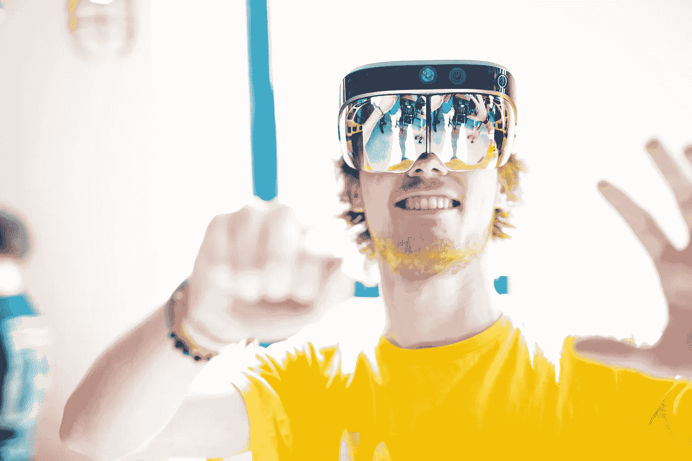
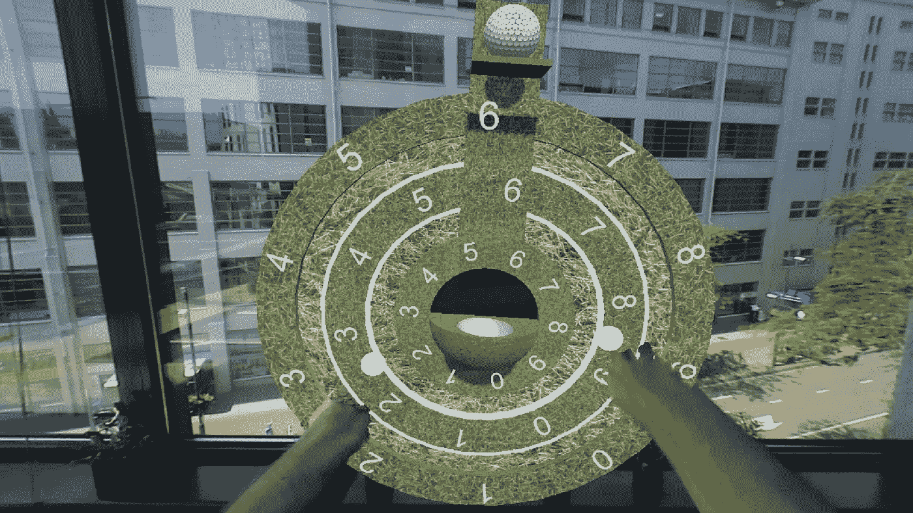
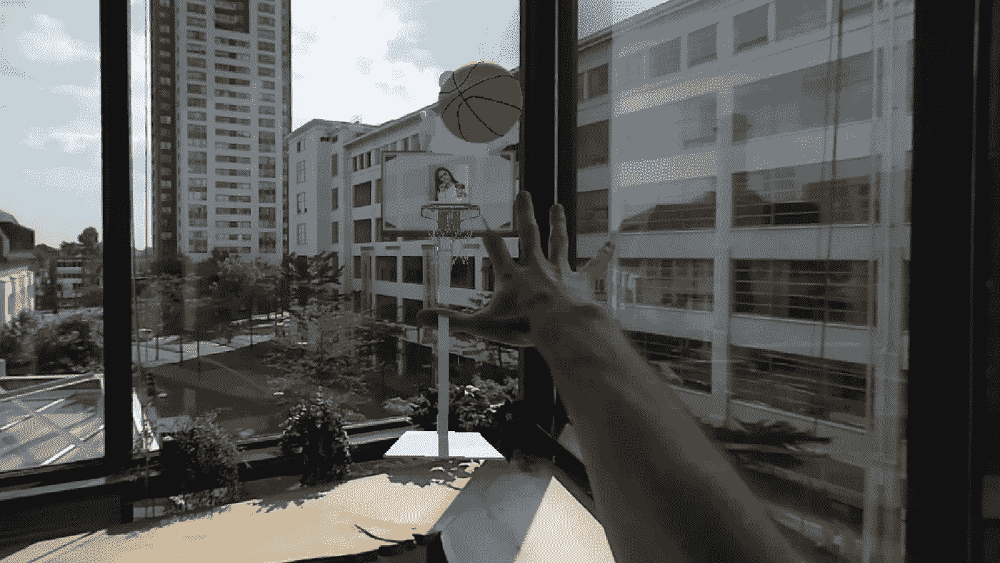
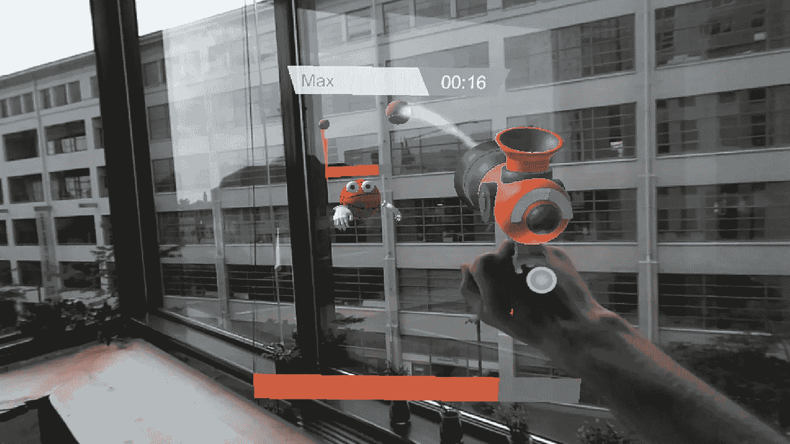
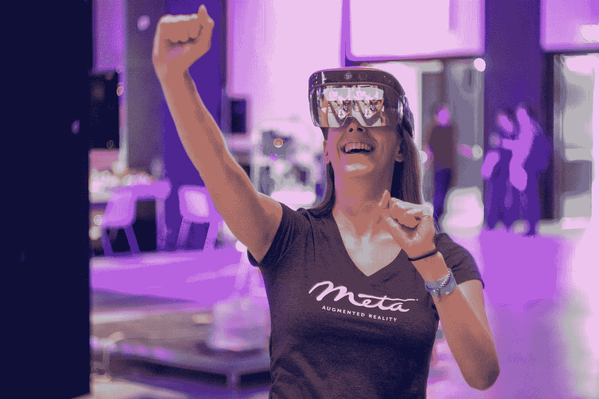

# 让工作成为工作:办公室里的 AR

> 原文：<https://medium.com/hackernoon/making-work-a-work-out-ar-at-the-office-514d8399b97c>

在去[工作](https://hackernoon.com/tagged/work)的路上——你在一个不舒服的地铁座位上打电话。在办公室——至少两个显示器，一把符合人体工程学的椅子……至少在你的同事借走之前。回到家里——在漫长的一天工作后，坐在电视机前的沙发上。

我们从一个屏幕到另一个屏幕，从一把椅子到另一把椅子。这是有问题的，我们也知道。久坐不动的行为与负面的健康结果有关，这与缺乏锻炼的结果不同——也就是说，你不能通过偶尔去健身房来解决这个问题。那么，当老板不想让你在上班时间在街区散步时，你会怎么做？

人们普遍认为伏案工作固有的久坐不动的工作方式并不容易改变。理想情况下，你会摆脱将你束缚在办公桌上的显示器，但这也意味着看不到你的电子邮件收件箱、IDE 或设计工具。

或者会吗？如果我们告诉你，你可以在没有台式电脑的情况下工作，把你的工作任务转换成可以让你起身走动的任务，会怎么样？我们是麦克斯·奥滕(22 岁)和安妮·科克(22 岁)，是[温室集团](https://www.greenhousegroup.com/)的实习生，我们花了六个月的时间让这成为可能。

怎么会？带着增强现实眼镜。想象一下，早上上班，你戴上 AR 耳机，而不是启动电脑。无论您身在何处，您都可以在眼前看到您需要的所有数据。这不仅可以让您在工作时四处走动，我们还将必要的身体活动融入了您的日常生活，用积极的活动取代了传统的工作任务。这会给你所有你需要的健康益处，而不会影响你的工作效率。

> AR 将会大规模出现。“当它到来时，我们会想，没有它我们是如何生活的。有点像我们想知道今天没有手机我们是怎么生活的。”
> 
> 苹果公司首席执行官蒂姆·库克

我们借鉴了有趣的体育世界来塑造未来的办公室，为此，我们增加了三种常见的办公室活动:登录、发送电子邮件，以及最后——如果你仍然坐着太久——休息一会儿。在理疗师的建议下，我们已经确保新任务设计引发的运动将特别有效地防止办公室工作人员经常成为受害者的身体疾病。

# 活动 AR 工作区

为了实现这一切，我们不仅使用了任何 AR 眼镜，还使用了交互式眼镜；它们允许你用手与你周围看到的所有 AR 元素进行交互，就好像它们真的在那里一样。这项[技术](https://hackernoon.com/tagged/technology)仍处于起步阶段，但由于微软的 [*Hololens*](https://www.microsoft.com/en-us/hololens) 和 Metavision 的 [*Meta 2*](http://www.metavision.com/) 已经广泛流行。Meta 2 独特的 90 度视野非常适合创建逼真的沉浸式体验，加上其有用的在线社区以及它与 ar 对象的交互与现实世界的交互高度相似的事实(鼓励直观理解)，我们看到了这款设备在开发我们的活动 AR 工作空间方面的最大潜力。这是它的样子。

**1/3:登录中。**首先要做的事情:要开始进入新的工作环境，请输入您的密码登录系统。你不用使用键盘，而是通过解决这个 AR 密码锁来一杆进洞。它大约与眼睛齐平，所以不要坐下来！

2/3:发送电子邮件。登录后，工作日开始。作为办公室中最常用的沟通渠道，电子邮件是我们增加的下一项任务，我们将利用未来的技术回到过去:抓起一张纸，打好你的信息，站起来，把它扔进 AR 篮球场，发送给你的同事。

在不同的任务中，一个动画篮球角色会全程指导你，让你熟悉新技术，并在你需要时帮助你。一旦你掌握了窍门，他就会让你去做。

这看起来可能是一个令人兴奋的概念，但是你每次想给别人发信息的时候都要这么做吗？嗯…这取决于你。你可以设定自己的目标，并决定你想要运动的频率。

**3/3:休息一下。如果你没有达到你的目标，并且静坐了太长时间，我们会让你知道——不像臭名昭著的 Clippy，不像许多公司发放的笔记本电脑上预装的烦人的弹出工具，而是以一种温和、不显眼的方式。我们不会强迫你休息，而是让你做一两分钟有趣的事情:在一个简短的 AR 游戏中，你将能够与你的同事竞争，同时获得你需要的活动。**

对于我们在这里向你展示的产品版本，我们通过赋予它一个体育主题来保持与核心价值和目标的一致——但一旦硬件变得足够普通，像这样的应用程序可以推向市场，就会有过多的皮肤可供选择。也许你会让你的办公室感觉像是星球大战主题的外太空，或者用平静简约的风格找到内心的平静。

这种定制只是我们希望保持用户参与的方式之一。在我们的原型中，我们融入了亲切感和趣味性。基于 Meta 2 的自然交互风格，我们已经确保 AR 对象(如剪贴板和篮球帖子)看起来像真实的东西，所以用户直观地知道如何使用它们。游戏化方面也是一种激励用户充分利用技术潜力的方式，并且可以在未来扩展，例如通过在部门之间建立竞赛。

# 它有潜力

像这样的增强现实环境提供了一种全新的交互方式，这使得设计成为一个有趣的挑战。除了 AR 物体与现实世界中的物体相似之外，增强世界的其他设计指南仍然很少，AR 眼镜的技术限制意味着用户需要一些指导来执行操作，以便设备能够“理解”它们。因此，我们的用户测试的大部分反馈都是关于手部跟踪的准确性，这是在广泛采用的道路上需要克服的技术挑战之一。(便携性和外形也需要改进，因为 Meta 2 目前被拴在电脑上，像 Hololens 一样，相当笨重。)

但是展望未来，技术将不可避免地得到完善，我们收到的关于原型本身的反馈是非常积极的。许多试用过 AR workspace 的人告诉我们，他们希望每天都使用它，不仅仅是因为它新颖有趣；他们认为从长远来看，这是解决他们久坐不动的工作方式问题的可行办法。

因此，毫无疑问，在工作中，但在其他任何地方，交互式可穿戴 AR 都提供了一种非常有前途的混合数字和物理环境的方式，通过使用自然交互来控制数字元素。在这个过程中，需要确定和验证设计指南，需要改进技术，还应该考虑社会影响(如果每个人的现实都得到增强，这可能会改变我们不仅与技术互动，而且与彼此互动的方式)。

最终，我们甚至不再需要屏幕——不仅仅是桌面显示器，手机、平板电脑和笔记本电脑都将成为过去。随着增强现实改变我们的工作、生活和娱乐方式，一切都将在你眼前发生。我们从办公室开始——但要做好它将接管世界的准备。