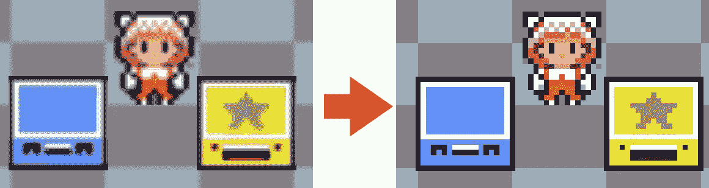
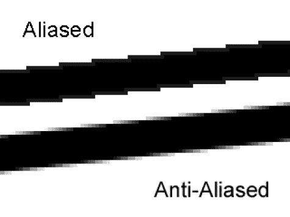
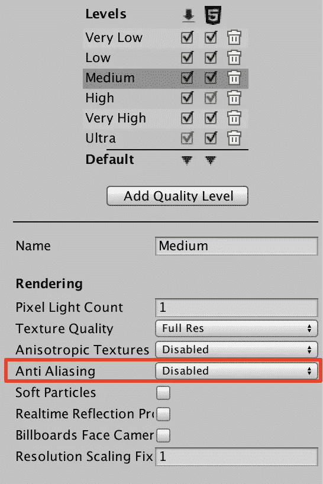
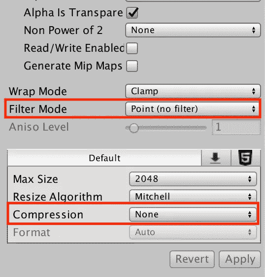
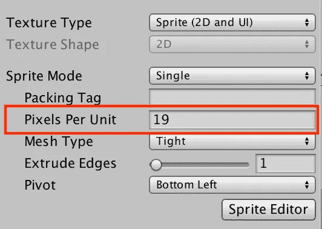
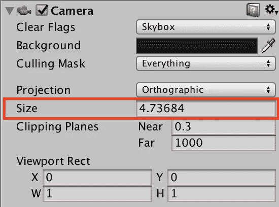

# 在 Unity3D 中让您的像素艺术游戏看起来像素完美

> 原文：<https://medium.com/hackernoon/making-your-pixel-art-game-look-pixel-perfect-in-unity3d-3534963cad1d>

前一段时间我提到我们花了一些时间来完善我们的游戏 pixel。我们必须这样做，以使我们美丽的 2D 像素艺术游戏在任何分辨率下都好看。我们也不希望物体移动或停留在半个像素上。

默认情况下，Unity 并没有完美地显示像素艺术，所以我们需要在这里和那里改变一些东西，并实现一个小的修复。不过不用担心，这并不难做到。

**免责声明**:本教程基于几个来源，但主要基于[这个伟大的 twitter 帖子](https://twitter.com/Davitsu/status/956499799133573120)。我也知道有其他方法可以做得更好，但这是我经过大量研究后使用的方法。

让我们看看实现这种像素完美外观的步骤有哪些。

From blurry (default) to pixel perfect

# 关闭抗锯齿

视频游戏中使用反走样来平滑纹理边界。你通常希望打开它，这样你的纹理在屏幕上看起来就不会“太像素化”，而是平滑的。这是反走样的一个例子:

Anti-aliasing example

底线是平滑模糊的。这将使它看起来没问题，如果我们在一个比这个更小的分辨率看到它。如果我们不激活反走样，我们会注意到像素化的边界。

在我们的例子中，我们正好想要 oposite，所以我们需要取消抗锯齿。在 Unity 中，它是默认激活的。

进入**编辑- >项目设置- >质量**并将**反走样设置为禁用**

Quality settings

请注意，可能有多个质量级别。在我的照片中有非常低，低，中，高，非常高和超。你需要**点击它们中的每一个**，并在所有中将它们的反走样设置更改为禁用**。**

# 精灵导入设置

当你导入一个图像/纹理时，Unity 会默认设置一些滤镜来平滑它。同样，这对于其他类型的游戏来说可能是个好主意，但对于像素艺术游戏来说却不是。

您需要转到项目中的每个精灵，并在检查器中更改这些设置:

Sprite Import Settings to change

将**滤镜模式**更改为点(无滤镜)，关闭**压缩**(如图更改为无)。同样，这需要为游戏中的每一个精灵做。

# 每单位像素(PPU)

您也可以在精灵导入设置中找到该设置。默认情况下是 100。将它更改为**您的平铺尺寸，单位为像素**(例如，在我们的例子中，我们有 19x19 的平铺)。

Pixels Per Unit

这也与我们需要改变的下一件事相关。

# 照相机或照片尺寸

现在我们已经设置了 PPU，我们需要告诉摄像机我们希望它基于 PPU 有多大，这样屏幕上的一个像素就与游戏中的一个像素相对应。

为了得到这个大小，我们只需要做一个简单的公式:

**摄像机或摄影尺寸=垂直分辨率/ PPU / 2**

一旦你有了那个尺寸，点击**主相机**对象，并把那个值放入尺寸设置:

Camera Ortographic Size

在我们的例子中，垂直分辨率为 180px，PPU 为 19px，因此:

**180 / 19 / 2 = 4.73684**

值得一提的是，在我们的例子中，我们以很小的分辨率渲染所有的东西，然后再放大。不要使用想要的垂直分辨率(在我们的例子中是 720p ),而是你正在渲染的分辨率。

# 对齐网格脚本

这是让它看起来像素完美的最后一步。到目前为止，它不应该看起来模糊了，但我们仍然有问题，你的对象可以放置在“一半”像素，由于按比例增加的分辨率。

有不同的方法来避免这种情况，如使用特定的 2D 相机插件或着色器。它们可能比我用的更有效，但我发现它们比这种方法更复杂。

想法是你把一个调整你的对象的脚本放到 **LastUpdate()中。**

要做到这一点，你需要**将你的精灵渲染器移动到一个子对象**中，并在那里添加脚本。

下面是我正在使用的脚本:

它检查父位置并将其舍入到网格上。所以没有半个像素的移动！

有了这些设置，你的游戏现在应该看起来不错了。我希望这能帮助其他人调整像素艺术游戏的统一。