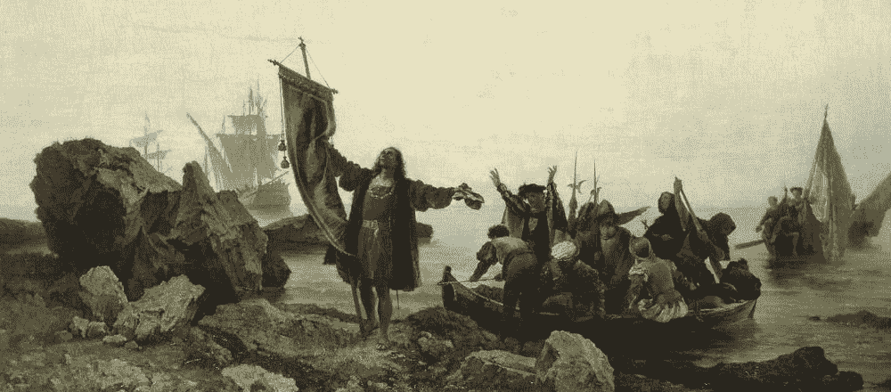
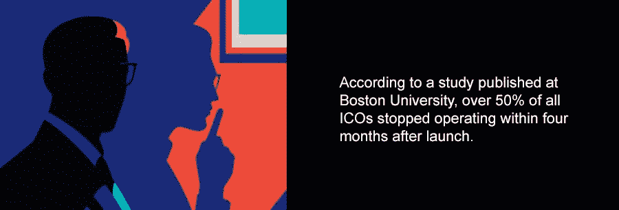
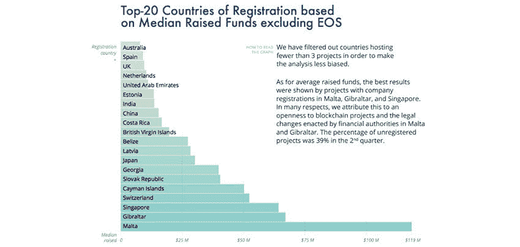
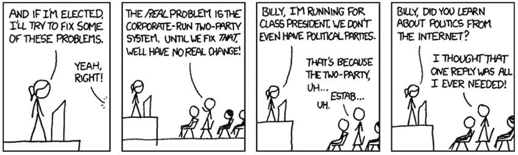
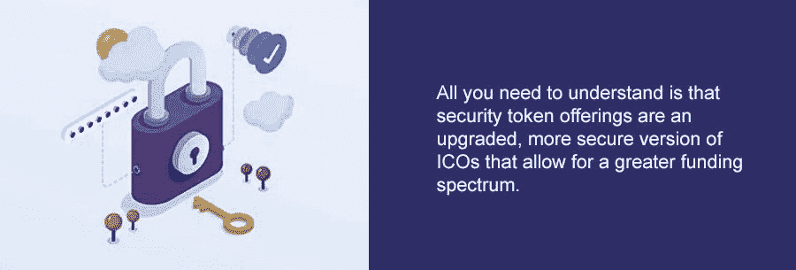
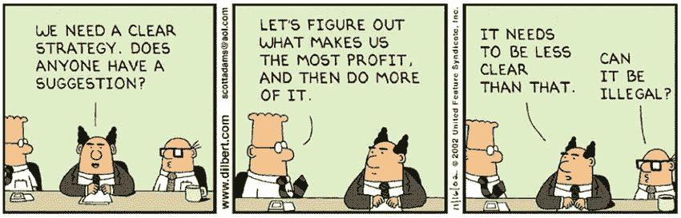

# 马耳他的进步立法为安全代币产品打开了大门

> 原文：<https://medium.com/hackernoon/maltas-progressive-legislation-opens-door-for-security-token-offerings-24f9f0c8fa5a>

[http://www.hermitagemuseum.org/](http://www.hermitagemuseum.org/)

无论你喜欢还是讨厌 ico，它们不仅革新了密码世界，还帮助塑造了现代众筹的整体形象。它们似乎与智能合同一起出现，随着潮流越来越大，诈骗和欺诈项目的数量也越来越多。根据波士顿大学发表的一项研究，超过 50%的 ico 在发布后四个月内停止运行。许多国家都在试图制定监管 ICO 行业的法规，但现在是时候转向一种新的、更安全的融资方式了吗？

[https://i.pinimg.com/originals/1c/15/98/1c1598bd8901be72596ad805d7ad4a19.jpg](https://i.pinimg.com/originals/1c/15/98/1c1598bd8901be72596ad805d7ad4a19.jpg)

在本文中，我们将比较和对比安全令牌产品(s to)和 ICOs，解释为什么(以及如何)马耳他是 STO 法规的全球行业领导者，最后讨论在市场变得过于饱和之前在马耳他推出 STO 的最简单方法。

# 马耳他又名区块链岛

最近马耳他肯定有很多炒作，但这种炒作在很大程度上是基于马耳他政府对加密货币和周围区块链产业的看法。例如，马耳他总理 Joseph Muscat [说](https://maltablockchainsummit.com/speakers/hon-joseph-muscat/)，“我知道监管者对这项技术很警惕，但事实是它即将到来。我们必须站在接受这一重要创新的前沿，我们不能坐等其他人采取行动并模仿他们。我们必须成为别人模仿的对象。”这个国家最高级别官员的这种前瞻性思维与像中国[这样的国家形成了鲜明的对比，中国在去年彻底禁止了所有未来的 ico](https://www.businessinsider.com/r-china-bans-initial-coin-offerings-as-illegal-fundraising-2017-9)。

我们都知道 ico 可能很危险，很难监管，因为有太多的变量不完全符合现有的思维方式。正因为如此，大多数国家采取了简单的路线，试图将 ico 作为 IPO 或类似的事物进行管理，并使用现有的规则和条例来管理这一新概念。在这一点上，马耳他决定积极主动地思考问题，而不是试图将 ICOs 塞进现有的盒子里，而是决定创建一个全新的结构来支持这一新兴技术。

[https://icorating.com/report/ico-market-research-q2-2018/](https://icorating.com/report/ico-market-research-q2-2018/)

这些新结构主要以三种不同法案的形式出现，所有这些法案都由马耳他议会一致通过:

**1。马耳他数字创新管理局法案(MDIA)**

该法案允许成立马耳他数字创新管理局，其各种目的包括在马耳他推广区块链技术，认证和管理 DLT 平台软件。认证的目的是为马耳他 DLT 平台上的用户提供法律、技术和词汇定义。MDIA 的首席执行官斯蒂芬·麦卡锡负责保证技术服务提供商以透明和公平的方式运营。

完整的账单可以在这里找到。

**2。《创新技术安排和服务法》(ITAS 法)**

《ITAS 法案》旨在给出更多以前不存在的定义和规定。这为创新技术安排(ITA)、创新技术服务(ITS)以及提供这些服务的个人/公司(ITS 提供商)制定了明确的标准和注册指南。所有这些都将归 MDIA 管辖。

此外,《ITAS 法案》概述了审计和认证软件和架构的指导方针，其目的是设计和提供 DLT、智能合同、Dao、令牌交换以及部长在 MDIA 推荐后可能指定的类似技术。这实质上意味着区块链式的技术被接受并被赋予了一个定义，这使得澄清未来的法律将如何对待它变得更加容易。

[完整的账单可以在这里找到。](http://justiceservices.gov.mt/DownloadDocument.aspx?app=lp&itemid=29078&l=1)

**3。虚拟金融资产法案(VFA 法案)**

《VFA 法案》建立了一个框架，在此框架下，法规可适用于直接或间接处理虚拟金融资产的实体，包括但不限于:ico、钱包提供商、代理服务提供商、经纪公司、投资组合经理、投资顾问和代币交易所。除此之外,《VFA 法案》还规定了向 MFSA 提交 ICO 和 STO(安全令牌产品)白皮书的指导方针。最后，VFA 法案要求代币发行者(ICO，STO)必须指定一个 MFSA 批准的 VFA 代理来监控和报告代币发行。

完整的账单可以在这里找到。

将这三项法案与其他司法管辖区的法规进行比较，就可以清楚地看出为什么马耳他在“技术第一”的方法上走在了前面。其他主要管辖区(美国、瑞士、直布罗陀等。)通过修改现有的 IPO 和股票市场法律来接近监管程序——这没有考虑到 DLT 和区块链是一种截然不同的技术。这些司法管辖区通常只是查看概念白皮书，执行 KYC/反洗钱协议，并根据 ICO 声称拥有的令牌类型进行裁决。

另一方面，马耳他根据这三项法案设立了机构，目的是研究 ICO/STO 背后的技术，以确保其可行性。当然，他们也执行 KYC/反洗钱程序，但正如马尔他金融服务部副部长西尔维奥·谢姆布里在接受《福布斯》采访时所解释的那样，“白皮书背后的技术才是最重要的，但往往会被忽视。如果技术有缺陷，产品将不会提供白皮书中开始的内容。我们非常关注这些专注于区块链的公司背后的技术。”

# STO 是筹款的未来，马尔他已经有立法来支持它

忽略所有的浮华和魅力，你需要明白的是，安全令牌产品是 ICOs 的升级版，更安全，允许更大的资金范围。通常，监管 ico 最困难的部分是决定他们提供哪种类型的代币(股权还是证券还是公用事业)并据此做出裁决。正如 [Evercity 在他们的媒体文章中指出的](/evercity-blog/sto-vs-ico-investor-rights-legal-risks-418c01bde767)，ico 面临几个关键问题:

*   **令牌状态**—ico 经常要为他们的令牌编造一个理由，而实际上他们根本不需要令牌。另一方面，“安全令牌构成金融工具，由特定资产(股权、债务、房地产等)支持，完全符合所有法律要求。”
*   **投资者权利** —公用事业代币不提供担保或投资者权利，法律禁止项目投机获利。另一方面，“安全令牌为投资者提供了明确定义的(完全合法的)权利——公司股份、收入分配、投票权——这些参数可能会有所不同。”

sto 以一种 ico 永远无法做到的方式向更多的人群开放资金——这当然是寻求增加他们的众筹努力的创始人特别感兴趣的。sto 允许机构资本(即私人股本集团)在国际范围内参与，因为它们很容易符合许多司法管辖区的现有法规。因为 sto 本质上仍然是众筹，与传统的风险投资相比，它们允许投资者进入的门槛更低，同时仍然标榜拥有更大流动性的好处。

这一点非常重要，因为根据比特币杂志的报道，作为欧盟经济区的成员国，马耳他的代币发行在欧盟市场上具有优势。在马耳他注册证券发行不会规避其他司法管辖区的法规。然而，作为欧盟成员国，由于欧洲单一市场，在马耳他合法和受监管的证券发行在其他欧盟成员国被视为合法。”

[https://dribbble.com/shots/3827365-Set-password-Isometric-illustration](https://dribbble.com/shots/3827365-Set-password-Isometric-illustration)

从法律意义上来说，sto 比 ico 复杂得多，尽管马耳他在进步法规方面领先于其他国家，但仍然建议使用服务，而不是自己尝试在法律领域导航。

# 在为时已晚之前抓住马耳他时刻

有了 ICOs，当然可以在没有交钥匙解决方案的情况下启动，但是随着 sto 的法律复杂性增加，强烈建议寻求法律顾问。这里有两条路可走；一个是寻找一家碰巧与马耳他有业务往来的国际公司，另一个是选择一家与当地政府密切合作的马耳他公司。

第一个选择是像 IBC 集团这样的公司，它在 30 多个国家开展业务，并拥有良好的国际记录。但选择提供一揽子全球解决方案的交钥匙解决方案的问题是，你错过了个人接触。例如，IBC 集团甚至没有花时间去校对他们网站上关于马耳他的页面:“如果你想在马耳他举办一个 ICO，想了解更多信息，请联系我们。”

另一个选项是搜索一个专门针对马耳他的代理机构，如 [ICO Malta](https://icomalta.com/) ，它与[币安](https://www.binance.com/)、 [OKEx](https://www.okex.com/) 和 [Coinvest](https://coinve.st/) 一起出现在 [kintu.co 的“你应该了解的马耳他 15 家密码公司”列表中](https://kintu.co/crypto-companies-malta/)。克里斯·奥斯本(Chris Osborne)将 ICO Malta 列为“将自己标榜为‘全栈 ICO 平台’的公司，它提供法律、技术和财务支持，帮助加密创始人将他们的 ICO 想法变成现实。”他们能够通过提供全方位的服务来做到这一点，包括:令牌创建(ICO 和 STO)、营销、交易所上市、银行、KYC/反洗钱解决方案等。

# 外卖的要点

由于各种原因，ico 的受欢迎程度正在下降，sto 正在崛起取代它们的位置。目前，最有可能引领 STO 市场的国家是马尔他。他们不仅拥有最先进的立法，而且还是一个足够小的国家，可以根据市场需求进行调整和适应。然而，由于法规的复杂性，建议求助于代理机构，或至少从当地律师事务所寻求法律指导，以确保你在前进之前处于最佳法律地位。

## 关于作者:

[基里尔·希洛夫](http://twitter.com/kirills4ilov)——geek forge . io 和 Howtotoken.com 的创始人。采访全球 10，000 名顶尖专家，他们揭示了通往技术奇点的道路上最大的问题。加入我的**# 10k QA challenge:**[geek forge 公式](https://formula.geekforge.io/)。