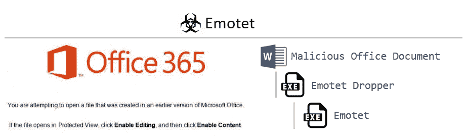
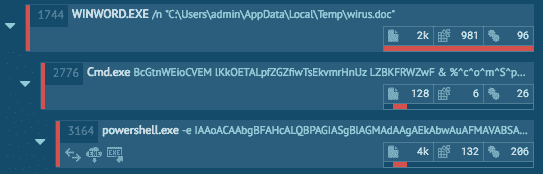
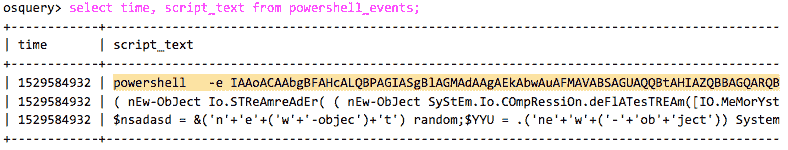
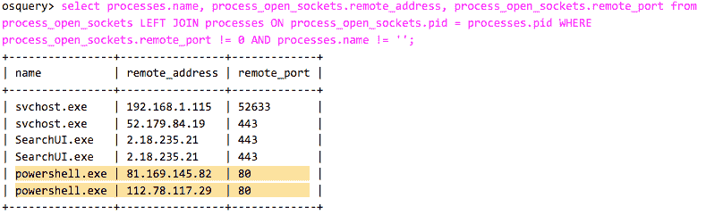
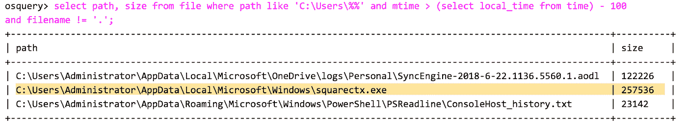
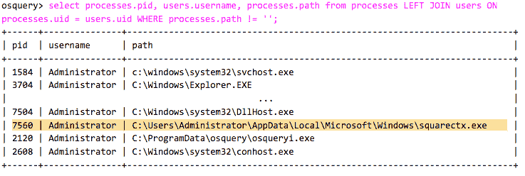
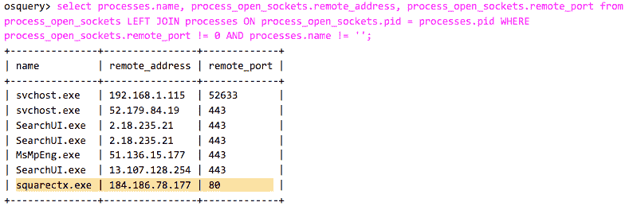
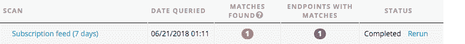

# 使用 Osquery 的恶意软件分析|第 1 部分

> 原文：<https://medium.com/hackernoon/malware-analysis-using-osquery-part-1-78f5f617cc19>

Sysmon 和 Osquery 等工具有助于检测端点上的异常行为。这些工具通过记录多种类型的事件，让我们能够很好地了解终端上发生的情况，我们可以将这些事件转发给 SIEM 或其他关联系统进行分析。

在这个博客系列中，我们将分析不同的恶意软件家族，查看端点上生成的事件类型，以及我们如何使用 Osquery 来检测它们。

# 开始吧！

让我们从分析著名的 [Emotet](https://blog.trendmicro.com/trendlabs-security-intelligence/new-emotet-hijacks-windows-api-evades-sandbox-analysis/) 银行木马开始，这是一个针对许多国家和公司部门的持续威胁([emo Tet](https://www.symantec.com/blogs/threat-intelligence/evolution-emotet-trojan-distributor)的演变)。下载者通过电子邮件网络钓鱼传播，并使用恶意的 Office 宏下载恶意软件。

文件示例:

[https://app . any . run/tasks/b30d 3215-a238-415 e-ba7d-a884e 1505758](https://app.any.run/tasks/b30d3215-a238-415e-ba7d-a884e1505758)

[https://www . virus total . com/#/file/c 932d 54 a 9 ef 3c 645 a 28 b 7d 8 de 9747 fc 6 c 06 fc 23 c 6d 65 c 036 da 4 ea E4 d 778 a 81 db](https://www.virustotal.com/#/file/c932d54a9ef3c645a28b7d8de9747fc6c06fc23c6d65c036da4eae4d778a81db)

正如我们在沙盒报告中看到的，Office 宏使用一个编码命令执行 PowerShell 来下载有效负载。

如果我们在安装了 Osquery 的环境中运行示例，我们可以构建一个查询来从 powershell_events 表中检索 PowerShell 生成的事件。Osquery 读取 Microsoft-Windows-PowerShell event log 通道，所以需要[启用](https://www.fireeye.com/blog/threat-research/2016/02/greater_visibilityt.html)脚本块日志记录。

我们可以看到编码的 PowerShell 命令以及解码命令后生成的脚本文本代码。

PowerShell 下载有效负载后，Osquery 可以记录任何进程打开的套接字连接。我们可以在 process_open_socket 表和 processes 表之间进行简单的连接，以查看哪些进程正在进行网络连接。

有趣的是，在下载有效载荷的过程中，可以看到哪些文件被写入了磁盘。为此，我们可以查询存储一些有用字段的文件表([文件表模式](https://osquery.io/schema/3.2.6#file))。这个表需要一个 WHERE 条件来返回结果，所以我们可以添加一些过滤器，例如像*用户*目录和在过去 100 秒内创建的文件。

从 PowerShell 下载的文件是一个 Emotet dropper，它提取最终的有效负载并执行它(squarectx.exe)。现在，让我们查询系统运行进程。与上面类似，我们可以连接用户表来查看用户名列。为了看得更清楚，省略了一些行。

现在我们知道 Emotet 恶意软件正在我们的环境中运行，并且可能正在做恶意的事情，所以让我们寻找恶意软件活动的迹象。为此，我们重用上面使用的查询来查看系统进程的网络连接。在这里，我们可以检测到与命令和控制服务器的通信。

正如我们所见，使用 Osquery 等工具分析恶意软件并提取有价值的信息是可能的，这些工具为我们提供了丰富的系统事件可见性。

# AlienVault 如何使用 Osquery

Osquery 允许您从端点检索大量事件和有用信息。这对于调查[安全](https://hackernoon.com/tagged/security)事件以及对您关键资产的威胁搜寻活动非常有帮助。

AlienVault 通过 AlienVault 代理利用 Osquery 在 USM Anywhere 和 Open Threat Exchange 中搜索威胁。

AlienVault 代理是一个轻量级、适应性强的端点代理，基于 Osquery，由 AlienVault 维护。在 USM Anywhere 中，AlienVault 代理支持持续的端点监控，使用内置的 AlienVault 威胁情报来自动执行端点查询和威胁检测以及其他网络和云安全事件。这使得 USM Anywhere 能够提供端点检测和响应(EDR)、文件完整性监控(FIM)以及丰富的端点遥测功能，这些功能对于完整有效的威胁检测、响应和合规性至关重要。

在 [USM Anywhere 在线演示](https://www.alienvault.com/products/usm-anywhere/demo)中亲自体验一下。

4 月，AlienVault 推出了 Endpoint Threat Hunter，这是开放威胁交换(OTX)中基于 AlienVault 代理的免费威胁扫描服务。OTX 终端威胁猎人允许任何人确定他们的终端是否感染了最新的恶意软件或其他威胁，方法是手动扫描他们的终端是否存在 OTX 编目的危害指标(IOC)。

免费使用 OTX 端点威胁猎人:[https://otx.alienvault.com/endpoint-threat-hunter/welcome](https://otx.alienvault.com/endpoint-threat-hunter/welcome)

以下是我们如何使用 OTX 端点威胁猎人在分析系统上检测到 Emotet 感染的示例。

在本博客系列的下一篇文章中，我们将看到其他恶意软件家族，并探索如何检测活动，如系统持久性和许多其他技术。

敬请期待！

“使用 Osquery 的恶意软件分析|第 2 部分”@ n0dec https://hackernoon.com/malware-analysis-using-

# 附录

**查询**

select time，script _ text from powershell _ events；

select processes.name，process _ open _ sockets . remote _ address，process _ open _ sockets . remote _ port from process _ open _ sockets LEFT JOIN process _ open _ sockets . PID = processes . PID WHERE process _ open _ sockets . remote _ port！= 0 和 processes.name！= '';

select path，size，from file 其中 path 如' C:\Users\%% '和 mtime >(select local _ time from time)-100 和 filename！= '.'；

select processes.pid，users.username，processes . path from processes LEFT JOIN users ON processes . uid = users . uid WHERE processes . path！= '';

**文件**

c 932d 54 a 9 ef 3c 645 a 28 b 7d 8 de 9747 fc 6 c 06 fc 23 c 6d 65 c 036 da 4 EAE 4d 778 a 81 db

9f 6325 ebce 797 b5 ceec 1 bbf 32 e 61 AEC 8 FBE 8 b 650

124 d03b 86227 bbf 282 f0f 567 AE 11858 e

bafc 6731 EFD 63 f 57 c 89653 b 24 ba 532 AC 1 e 96d 259993 c8 F3 d 96d 26 E1 cf 6 CD 57d 3

**DNS 请求**

萨莫蒂查

okane-mikata.com

**连接**

81.169.145.82

112.78.117.29

184.186.78.177

74.139.102.161

**OTX**

 [## 搜索脉冲“emo Tet”-alien fault-公开威胁交换

### 了解最新的在线威胁。共享和协作开发威胁情报。保护你自己和…

otx.alienvault.com](https://otx.alienvault.com/browse/pulses?q=emotet)