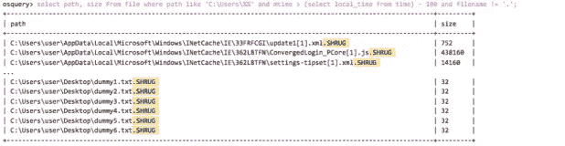

# 使用 Osquery 的恶意软件分析|第 2 部分

> 原文：<https://medium.com/hackernoon/malware-analysis-using-osquery-part-2-69f08ec2ecec>

在本系列的第一部分中，我们看到了如何使用 Osquery 来分析和提取关于恶意软件行为的有价值的信息。在那篇文章中，我们跟踪了众所周知的 Emotet loader 的活动，这是一种流行的分发银行木马的工具。使用 Osquery，我们能够发现它如何使用恶意的 Microsoft Office 文档感染系统，以及它如何提取和执行有效载荷。

在本帖中，我们将看到恶意软件使用的另一种常见技术，持久性。为此，我们将继续使用 Osquery 来浏览注册表和 startup_items 表。


## 注册表持久性

在这种情况下，我们将分析使用。NET 框架，特别是一个[耸肩勒索软件](https://lmntrix.com/Lab/Lab_info.php?id=112)的样本。这种恶意软件加密用户的个人文档，并要求一定数量的比特币来恢复所有文件。

[https://otx . alien fault . com/indicator/file/a 554 b 92036 FB BC 1c 5d 1 a 7d 8 a 4049 b 01 C5 b 6 b 7 b 30 f 06843 fcd CCF 1 f 2420 DFD 707](https://otx.alienvault.com/indicator/file/a554b92036fbbc1c5d1a7d8a4049b01c5b6b7b30f06843fcdccf1f2420dfd707)

用. NET 调试器打开该示例，我们可以看到它首先在用户临时目录中创建了一个新文件，并在指向该文件的用户空间的“CurrentVersion\Run”注册表项中写入了一个新值。该恶意软件将在用户每次登录时执行。这是恶意软件下载者为了留在系统中而使用的一种常见的持久性机制。


如果我们在 Osquery 环境中运行这个示例，我们可以使用几个查询很容易地检测到这个活动。例如，如果您还记得在本博客系列的第 1 部分中我们用来记录写入磁盘的文件的查询，我们也可以在这里使用它来检测植入用户临时目录的文件。我们只是搜索在过去 100 秒内写在用户目录上的文件。


此外，我们可以搜索在注册表配置单元中创建的新条目。为此，我们可以使用‘registry’Osquery 表，它允许我们查询系统中的所有注册表条目。我们还可以使用“启动项目”表。第二个表包含一组预定义的路径，系统使用这些路径在启动时自动运行程序。运行下面的查询，我们可以看到恶意软件如何编写了一个新条目，指向通过第一个查询发现的“耸肩. exe”文件。


文件上也写着 shrug.exe。NET 框架，所以我们可以用调试器再次打开它，看到一些有趣的部分。该文件首先检查系统是否已经被感染。如果没有，它会创建一个同名的新注册表项来写入安装参数。

[https://otx . alien fault . com/indicator/file/b 14 a 57 ad 391d 9 ba 5b 2714 dad 4773118 f 118 ed 8d 64 b 523466 bb 60 F3 b 18336 EFC 1](https://otx.alienvault.com/indicator/file/b14a57ad391d9ba5b2714dad4773118f118ed8d64b523466bb60f3b18336efc1)


这一次，我们可以使用注册表来查看注册表中是否创建了任何新条目。通过运行一个查询来搜索最近 100 秒内在 HKEY _ 用户配置单元中创建的任何新键，就像我们之前对文件所做的那样，我们可以看到新的“耸肩”键。


要查看是否有任何值被添加到该键中，我们可以使用键路径来搜索注册表。通过查询之前的密钥路径，我们可以获得勒索软件用来存储数据的安装参数，如安装日期、受害者标识符，以及用于加密文件的密钥和初始化向量(IV)。


注册表安装后，耸肩勒索软件发送一些数据到地址变量中存储的域。这个连接可以通过运行类似于[第 1 部分](https://www.alienvault.com/blogs/labs-research/malware-analysis-using-osquery-part-1)博文中使用的查询来发现，以查看与命令和控制服务器的通信。


最后，正如勒索软件通常所做的那样，它试图加密用户的所有个人文档。在这种情况下，我们可以在上图中看到它是如何开始加密整个“C:\”目录的。幸运的是，该活动会导致文件更改它们的修改时间戳，从而允许我们查询最近修改过的所有文件。查询将返回所有被勒索软件修改过的文件，我们可以看到，它们都有一个新的文件扩展名”。耸耸肩”。



## 计划的任务和服务

在 Windows 系统上获得持久性的另一种常见方法是创建计划任务或安装新服务。这些动作通常是由恶意软件执行的，Osquery 有表来查询它们。

这是一个石油钻塔恶意软件的例子。正如您在下表中看到的，在运行示例之后，已经创建了两个新的计划任务。Osquery 可以通过查询 scheduled_tasks 表为我们提供这些信息。


服务表允许我们查看系统中安装了哪些服务。在运行安装恶意服务以获得持久性的恶意软件示例后，我们可以构建一个查询来返回这些结果，并查看有关新服务的所有详细信息。如您所见，我们已经检测到服务“检查更新”正在执行恶意的 PowerShell 脚本。


## AlienVault 如何使用 Osquery

通过使用 Osquery，我们可以检测恶意软件威胁经常使用的许多机制和技术。在[之前的博客](https://www.alienvault.com/blogs/labs-research/malware-analysis-using-osquery-part-1)中，我们看到了如何一步一步地分析恶意软件感染。在这篇文章中，我们已经看到了如何捕捉持久性技巧。这在调查安全事件以及对您的关键资产进行威胁搜索时非常有用。

AlienVault 通过 AlienVault 代理利用 Osquery 在 USM Anywhere 和 Open Threat Exchange 中搜索威胁。

AlienVault 代理是一个轻量级、适应性强的端点代理，基于 Osquery，由 AlienVault 维护。在 USM Anywhere 中，AlienVault 代理支持持续的端点监控，使用内置的 AlienVault 威胁情报来自动执行端点查询和威胁检测，以及您的其他[网络](https://hackernoon.com/tagged/network)和云[安全](https://hackernoon.com/tagged/security)事件。这使得 USM Anywhere 能够提供端点检测和响应(EDR)、文件完整性监控(FIM)以及丰富的端点遥测功能，这些功能对于完整有效的威胁检测、响应和合规性至关重要。

在 [USM Anywhere 在线演示](https://www.alienvault.com/products/usm-anywhere/demo)中亲自体验一下。

4 月，AlienVault 推出了 Endpoint Threat Hunter，这是开放威胁交换(OTX)中基于 AlienVault 代理的免费威胁扫描服务。OTX 终端威胁猎人允许任何人确定他们的终端是否感染了最新的恶意软件或其他威胁，方法是手动扫描他们的终端是否存在 OTX 编目的危害指标(IOC)。

免费使用 OTX 端点威胁猎人:[https://otx.alienvault.com/endpoint-threat-hunter/welcome](https://otx.alienvault.com/endpoint-threat-hunter/welcome)

# 附录

## Osquery 搜索

```
*select path, size from file where path like 'C:\Users\%%' and mtime > (select local_time from time) - 100 and filename != '.';*

*select source, name, path from startup_items;*

*select path, name, type, data from registry where path like 'HKEY_USERS\%\%%' and mtime > (select local_time from time) - 100;*

*select path, name, type, data from registry where key like 'HKEY_USERS\%\Shrug';*

*select name, action, path, enabled, next_run_time from scheduled_tasks;*

*select name, display_name, start_type, path, user_account from services;*
```

## IOC 示例

 [## 耸肩勒索软件- AlienVault -开放威胁交换

### 耸肩. NET 写的勒索软件。

otx.alienvault.com](https://otx.alienvault.com/pulse/5b899bd8694f420825bbdfdd) 

## 连接

[*http://tempacc 11 VL . 000 webhostapp[。]com/marthas _ stuff/upload hash . PHP*](http://tempacc11vl.000webhostapp[.]com/marthas_stuff/uploadhash.php)

*145.14.145.119*

## **文件**

*ShrugInstaller.exe*

*a 554 b 92036 FB BC 1c 5 D1 a 7 D8 a 4049 b 01 C5 b 6 b 7 b 30 f 06843 fcdccf 1 f 2420 DFD 707*

## **已删除可执行文件**

*C:\ Users \ admin \ AppData \ Local \ Temp \耸肩. exe*

*b 14 a 57 ad 391d 9 ba 5b 2714 dad 4773118 f 118 ed 8d 64 b 523466 bb 60 F3 b 18336 EFC 1*

## **亚拉**

```
*import "dotnet"*

*rule ShrugRansomware {*

 *meta:*

 *author = "AlienVault Labs"*

 *strings:*

 *$bitcoin_address = "1Hr1grgH9ViEgUx73iRRJLVKH3PFjUteNx"*

 *$s1 = "upoldhash.php"*

 *$s2 = "HarmedFiles"*

 *$s3 = "ShrugDecryptor"*

 *$s4 = "SHRUG2"*

 *$pdb1 = "\\Debug\\ShrugTwo.pdb"*

 *$pdb2 = "\\Debug\\Shrug.pdb"*

 *condition:*

 *uint16(0) == 0x5A4D and dotnet.number_of_guids > 0 and* 

 *((dotnet.typelib == "a6ab6b1f-b144-4920-be42-bb90ec6fc22e")* 

 *or ($bitcoin_address)* 

 *or (2 of ($s*))* 

 *or (any of ($pdb*)))
}*
```