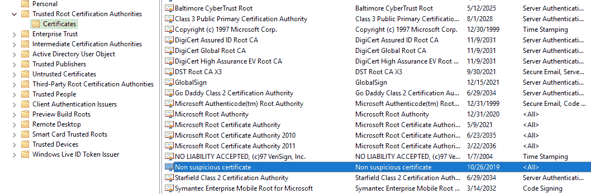
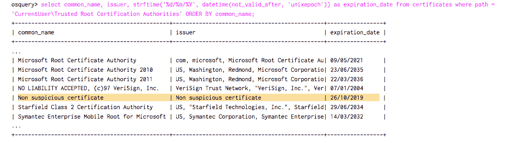
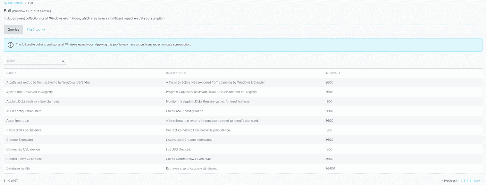
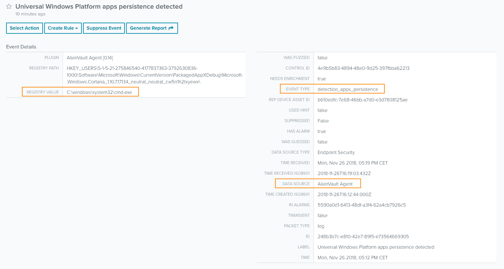
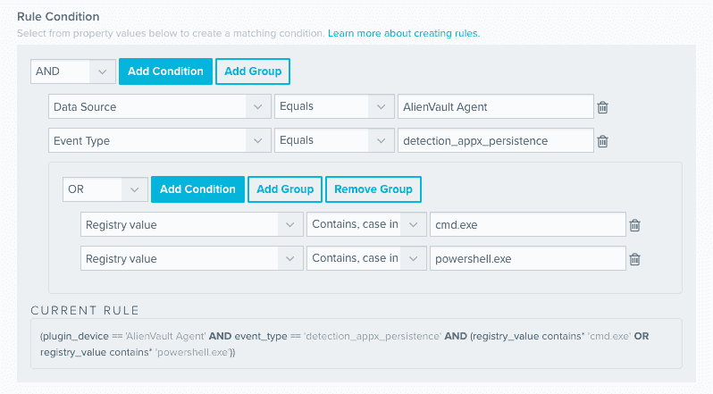
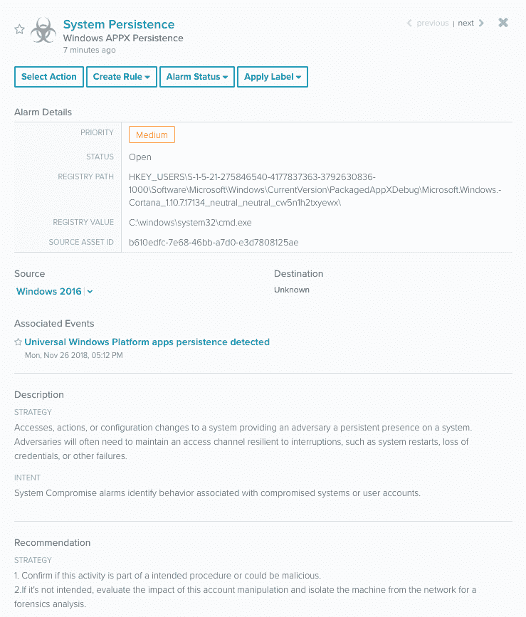
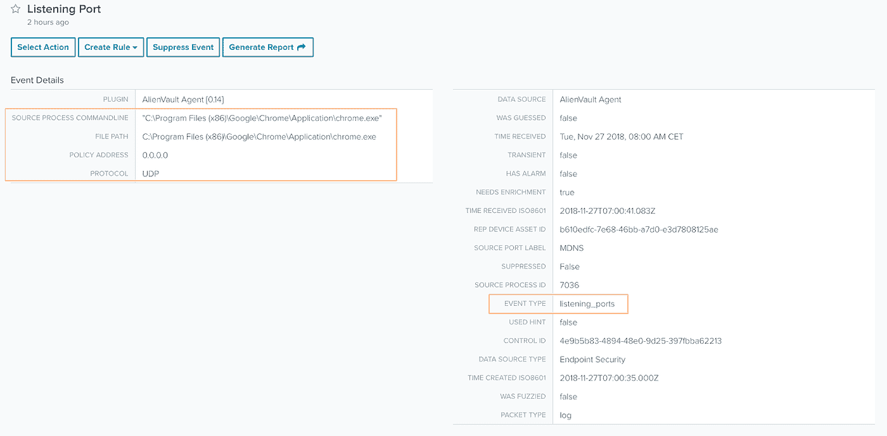
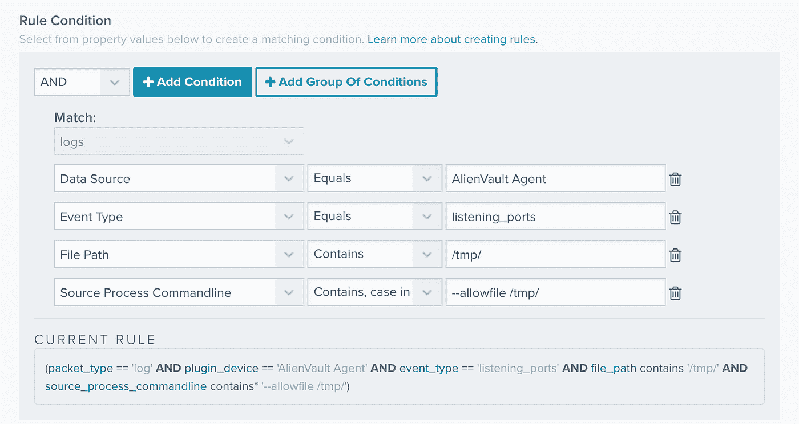
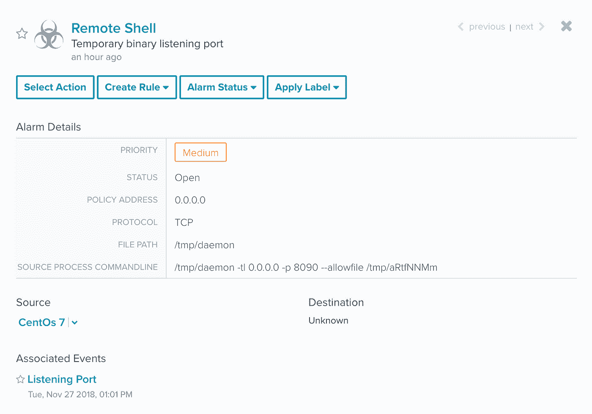

# 使用 Osquery 的恶意软件分析

> 原文：<https://medium.com/hackernoon/malware-analysis-using-osquery-part-3-9dc805b67d16>

这是第三部分。在这个博客系列的第 1 部分中，我们分析了恶意软件的行为，在第 2 部分的[中，我们学习了如何检测恶意软件攻击中使用的持久性技巧。尽管如此，当恶意活动发生时，我们可以通过 Osquery 观察到更多类型的事件。因此，在本系列的最后一篇博客文章中，我们将讨论如何检测恶意软件攻击中使用的另一种技术示例，这种技术涉及在系统中安装根证书，该证书可用于拦截通过安全 TLS/SSL 通信传输的信息(中间人)。我们还将了解如何使用 Alienvault 代理和 Alienvault USM Anywhere 来创建自定义规则并检测您环境中的恶意活动。](https://www.alienvault.com/blogs/labs-research/malware-analysis-using-osquery-part-2)

# 检测新安装的根证书

根证书通常由制造商或软件供应链预先安装在系统中。它们在公钥加密中用于标识证书颁发机构，通常用于在 web 浏览器中建立 TLS 和 SSL 连接。安装在根目录中的系统和应用程序信任证书。

攻击者可以利用这种信任，在系统中安装根证书来拦截通信或代码签名等。在本例中，我们将安装自己的证书，该证书可用于拦截与银行平台的连接，从而窃取用户的个人信息。安装后，我们可以使用 MMC 控制台查看系统受信任的根证书颁发机构，看看我们的证书是如何放置的。

正如我们之前讨论的，Osquery 可以通过查询 certificates 表来检测这种活动。如果我们执行一个查询来检索安装在受信任的根证书颁发机构中的所有证书，我们将像以前一样发现我们的证书。

此查询可用于列出系统中的新证书:

# 如何通过 Alienvault 代理和 Alienvault USM Anywhere 使用 Osquery 的强大功能

到目前为止，我们已经观察了 Osquery 如何帮助实现端点检测和响应(EDR)功能。现在我们来看看如何通过 Alienvault USM Anywhere 中的 AlienVault 代理使用 Osquery。

AlienVault 代理是一个基于 Osquery 的轻量级端点代理，它被配置为按时间间隔调度查询，从而实现连续的端点检测。您可以在 AlienVault USM 的**数据源>代理>配置文件**中看到查询集合。这些查询由 Alienvault 实验室团队维护和更新，该团队研究新的威胁和恶意活动，并基于该研究构建和更新查询。

如果我们选择 Windows 完整配置文件，我们可以看到代理在端点中执行了多少查询。在所有这些查询中，我们发现一些旨在寻找持久性技术、DLL 注入、后门、密码挖掘器甚至系统错误配置的查询。

**用例 1:检测系统后门持久性**

现在，我们将了解如何创建一个自定义编排规则，以使用 Alienvault 代理生成的事件来检测恶意活动。我们要做的第一件事是搜索来自 AlienVault 代理数据源的有趣事件。在这种情况下，我将为“检测到通用 Windows 平台应用程序持久性”查询创建一个警报规则。创建这个查询是为了检测一个[已知的持久性机制](https://oddvar.moe/2018/09/06/persistence-using-universal-windows-platform-apps-appx/)，该机制用于隐藏一个[程序](https://hackernoon.com/tagged/program)，该程序将在自动运行工具启动时运行。

一旦我们有了想要的事件，就有必要对感兴趣的领域做笔记。有些可用于规则中的条件，有些可用作突出显示字段。例如，在下面的事件中，有一些有趣的字段，如:

*   数据来源:Alienvault 代理
*   事件类型:检测 _ 应用程序 _ 持久性
*   注册表值:C:\Windows\system32\cmd.exe

在 USM Anywhere 的**设置>规则**部分，我们可以为警报类型创建一个编排规则。因为我们想要一个警报来触发“通用 Windows 平台应用程序持久性”事件，所以我们可以先开始添加琐碎的条件，比如**数据源== AlienVault 代理**和**事件类型= = detection _ appx _ persistence**。然后，假设我们只想在注册表值中放置的进程是 cmd.exe 或 powershell.exe 时触发警报，这是后门系统通常使用的。我们可以添加一个带有 OR 运算符的组条件来匹配这种情况。

一旦创建了编排规则，我们就可以通过运行恶意命令来测试它，使用我们试图检测的技术向系统添加后门。之后，如果我们查看警报部分，我们可以看到该活动是如何触发我们的新警报规则的。

**用例 2:检测监听连接的进程**

假设您的公司正成为某个最新威胁的目标，您希望检测恶意软件正在执行的活动。在阅读了一篇关于这项研究的博客文章后，您发现一个恶意软件正在使用 netcat 的修改版本，以便在受感染的机器上获得远程外壳。

如果我们看一下代理提供的不同事件，我们可以看到当进程正在侦听传入连接时，侦听端口事件会进行报告。

然后，我们可以创建一个新的规则，以匹配位于/ *tmp* (临时目录)文件夹(通常不需要管理权限来写文件)中的进程开始监听特定端口上的连接并一直等待与攻击者建立通信。此外，我们可以添加参数 *— allowfile /tmp/，*，这是我们从研究博客中了解到的一个常见的 IOC 发现。

正如我们所看到的，已经触发了一个警报，表明我们的一个主机感染了我们想要检测的恶意软件。我们可以在突出显示的字段中查找该活动最重要的特征。

**结论**

在这个博客系列中，我们讨论了如何使用 Osquery 来帮助您检测终端上的恶意软件和其他恶意活动。通过 AlienVault 代理(USM Anywhere 的一部分)实现 Osquery，您可以将恶意软件检测和分析提升到一个新的水平。USM Anywhere 支持强大的端点检测和响应功能(EDR ),可持续自动监控您的端点是否存在威胁，将该数据与网络[安全](https://hackernoon.com/tagged/security)数据相关联，并为您提供一个集中的控制台来查看所有安全警报，查询您的系统以获取取证信息，并创建定制的编排规则来自动执行这些查询和其他事件响应操作。

还有更多的东西有待发现。通过我们的在线互动演示或[开始为期 14 天的免费试用](https://www.alienvault.com/products/usm-anywhere/free-trial)，在任何地方参观 USM。