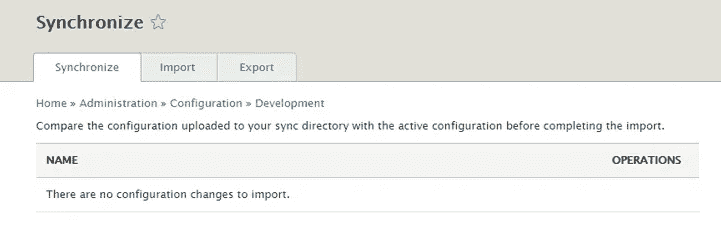
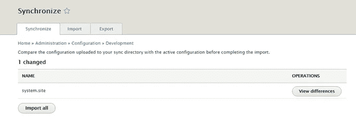
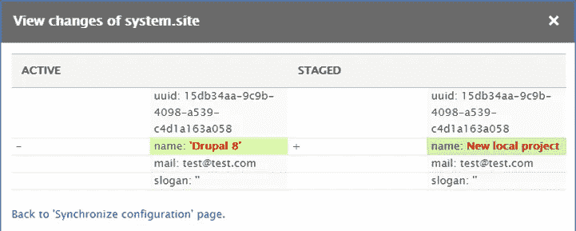
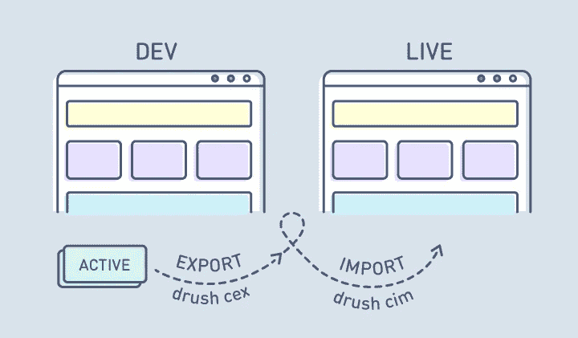

# 管理您的 Drupal 8 站点配置

> 原文：<https://medium.com/hackernoon/manage-your-drupal-8-site-configurations-18408257efc2>


[By ADCI Solutions](http://clc.la/drupal_config)

部署和**配置管理**是每个项目中非常常见但又非常重要的部分。这些过程在 **Drupal 7** 中太痛苦了。Drupal 7 将所有配置和内容一起存储在一个数据库中。要管理配置，您可能已经使用了功能、Strongarm 和其他相关模块的组合。这些模块提供了一种将配置打包到特殊“特性”Drupal 模块中的方法。

**Drupal 8** 提供了一种完全不同的管理配置的方式。这个想法是，几乎所有的配置都可以存储在文件中，而不是存储在数据库中。它允许开发人员轻松地在开发和现场站点之间移动设置。

在本文中，我们将深入研究一个新的配置管理系统，并学习如何从开发环境中迁移您的配置。因此，我们将开发一个基本的工作流程，帮助您在不同环境之间保持配置同步。

在我们开始之前，我们应该确定你的网站的哪一部分可以在新系统的帮助下导出。

# 管理配置。不满足

其实除了内容，一切都是配置。按照这种想法，认为新的配置管理系统可以帮助将内容从开发网站转移到生产网站是错误的。使用新系统，您可以管理:

*   模块设置和状态
*   内容类型和设置
*   块类型和设置
*   许可
*   视图
*   主题设置
*   诸如此类

以下内容视为内容，无法管理:

*   节点
*   用户
*   自定义块及其内容
*   其他实体内容

要将内容从 dev 转移到 prod，您可能必须考虑迁移系统，但这是一个完全不同的故事。

让我们来看看运行中的配置管理系统。

# 基本设置和准备

配置管理功能由“配置管理器”核心模块提供。确保它已启用。之后，一个新的管理页面将会出现:/admin/config/development/configuration。

此页面允许您:

*   导入和导出配置(完整归档或单个归档)；
*   同步配置。

即时可用的 Drupal 8 网站配置存储在 DB 的“config”表中。这样做是出于[性能和安全原因](https://goo.gl/Y4jhSp)。这个新系统允许我们导出完整的网站配置，并将其存储在 YAML 文件中。

在开始使用配置之前，让我们配置一个文件夹，我们将在其中存储我们的配置 YAML 文件。该文件夹在 setting.php 文件中配置:

```
$config_directories['sync'] = 'sites/default/files/config_HASH/sync';
```

这里的 HASH 是在安装阶段生成的长 HASH；它有助于保护配置免受 web 访问。

现在我们可以手动或使用 Drush 导出活动网站配置: *drush config-export* (或 *drush cex* )。我们坚持 Drupal 方式，并将在本文中使用 Drush。

让我们在这一点上停下来想一想。几乎所有的网站配置现在都可以作为 YAML 文件使用。这是什么意思？耶！这意味着我们可以在版本控制系统下存储您的配置 YAML 文件！

# Git 和 Drush 的基本工作流程

我们几乎可以肯定，您的 sites/default/files 文件夹被版本控制系统忽略了。没有吗？尽快做:)

建议将您的 config 文件夹移动到与您的 docroot 目录相同的级别(的同级)(它完全阻止对它的 web 访问)。这并不总是可能的，您可以将其移动到与公共文件文件夹相同的级别(sites/default/files)。

只需移动文件夹并更改 setting.php 文件:

```
$config_directories['sync'] = 'sites/default/config_HASH/sync';
```

运行 **Drush** 命令后，将会创建 YAML 文件，您可以提交它们。让我们回到管理界面。



在此阶段，没有配置更改，因为我们刚刚导出了当前活动的配置。让我们改变网站上的一些东西(例如网站名称)，看看会发生什么。



我们可以看到一个配置项(文件)被更改了。现在我们可以看到变化:



图片里有什么？

阶段配置是保存在 YAML 文件中的配置。

活动配置是存储在数据库中的当前网站配置。

在这一点上，理解出口和进口的区别是非常重要的。

**导出**用于获取数据库中定义的所有配置，并将其保存为 YAML 文件。

**Import** 执行相反的操作:它将 YAML 文件中的配置导入到 DB 中。

在我们的示例中，如果您使用“import all button”或运行*drush config-import*(*drush CIM*)命令来运行导入，它将从 YAML 文件(stage config)中清除对某个州的站点名称更改。

如果我们想要更改我们的暂存配置，我们必须运行导出。之后，适当的 YAML 文件将被更改，我们可以提交更改。

总而言之，将变更从您的开发环境转移到实际环境的基本工作流程如下:

在开发网站上:

1.  安装配置管理模块，配置同步文件夹，导出活动配置并提交。
2.  改变配置。
3.  使用命令 *drush cex* 导出更改
4.  提交和推送更改: *git 提交*和 *git 推送*

在实时网站上:

1.  拉改变的配置: *git 拉*
2.  将更改导入实时网站活动配置: *drush cim*

因此，我们的开发和实时网站只需几个简单的步骤就能实现同步。



# 结论

Drupal 8 使用新的配置管理系统，努力使导出和导入站点配置的过程更加容易。在本文中，我们研究了一个基本的工作流，它允许在开发和实际环境之间保持配置同步。我希望这个工作流程能够帮助您改进部署过程。

# 相关(有帮助的)模块/发行版

1.  [特性](https://www.drupal.org/project/features):允许您捆绑配置，以便在另一个站点上重用。必须有一个 Drupal 8 发行版的模块。
2.  [配置安装器](https://www.drupal.org/project/config_installer) : Drupal 配置文件，允许从现有配置安装一个站点。
3.  [配置工具](https://www.drupal.org/project/config_tools):自动将配置更改提交给 git。
4.  [配置只读模式](https://www.drupal.org/project/config_readonly):允许通过管理用户界面锁定任何配置更改。
5.  [配置开发](https://www.drupal.org/project/config_devel) t:帮助开发配置。
6.  [配置同步器](https://www.drupal.org/project/config_sync):提供从更新的模块、主题或发行版安全导入站点配置的方法。

*原发布于*[*ADCI 解决方案网站*](http://clc.la/drupal_config1) *。*


**在社交网络上关注我们:** [推特](https://twitter.com/ADCISolutions) | [脸书](https://www.facebook.com/adcisolutions/) | [LinkedIn](https://www.linkedin.com/company/adci-solutions/)

[](http://clc.la/drupal_config_json) [## 如何从 Drupal 8 站点发送 JSON 数据？- Drupal stories:一个内部人员的观点- Medium

### 想象一种情况:您的移动应用程序需要使用 JSON 从 Drupal 8 上的站点获取一些信息。为什么…

clc.la](http://clc.la/drupal_config_json)