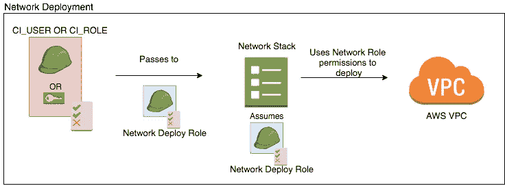

# 管理单独的 AWS 帐户🌗自动化、部署和保护

> 原文：<https://medium.com/hackernoon/managing-seperate-aws-accounts-iam-deployments-e7e3ca038d53>

An account for every color of the rainbow

拥有独立的 AWS 帐户是最近的开发运营热潮，以美化我们的工具包(当然不包括 kubernetes ),这是有充分理由的！分离 AWS 帐户来管理环境甚至产品是一个好主意。如果做得好，这是另一种能帮助你晚上入睡的东西。好处是:

*   **安全！**跨 AWS 帐户的关注点分离意味着完全不同的 IAM 用户、角色& API 密钥集合。现在，您的生产帐户将最终不会向您的每个开发人员公开。
*   **开发速度快，开发者轻松！**开发者只会怕碰生产账号里的东西。这意味着您的其他帐户不会膨胀，同时还能拆分其他环境。这是低估了，开发商将能够发挥&建立更多！**为每个人创造发展机会！**
*   **计费**。你可以停止支付 AWS 账单的 2%来分析你的账单。您可以使用内置的[合并计费](https://docs.aws.amazon.com/awsaccountbilling/latest/aboutv2/consolidated-billing.html)，明确了解每个环境的财务状况。

我将向您展示 Avoss 如何处理他们的多帐户设置，重点关注**部署、安全&开发人员访问**。

但是要注意！银弹是不存在的，多账户有它自己的权衡！学习 IAM 需要时间，迁移到多个账户将是一件令人头疼的事情。

**旁注*** 如果你没有使用某种基础设施作为代码解决方案，运行一个多 AWS 帐户设置将会非常困难&繁琐。在 Avoss 的这篇博文&中，我们使用了[云信息](https://aws.amazon.com/cloudformation/)。如果你想把基础设施作为代码来研究，我在上一篇博客文章[cloud formation Vs terra form](https://hackernoon.com/your-infrastructure-as-code-cloudformation-vs-terraform-34ec5fb5f044)中做了一个比较。

## IAM 和部署

你的第一期杂志将会是《我是谁》。谁有权访问什么？一切是如何部署的？怎么才能减少访问！ARHH 不要提交访问键(是的，我们都做过)！让人应接不暇。

我们多环境客户的**目标是:**

*   你的生产账户应该没有松散的 API 密匙。
*   开发人员应该仍然能够拥有对生产的完全**读取权限**，但是变化应该在您的持续集成中发生。

**我们可以两者兼得。**或者至少只有两个 API 键，如果您的持续集成运行在 AWS 基础设施之外的话。

## 我们开始吧

我知道这会让您感到畏缩，但是首先我们必须手动创建一个用户或角色。除非有我不知道的事情，否则必须手动创建用户或角色，以创建将启动您的部署的第一个初始用户或角色。唯一的另一种情况是使用您的根凭证，这绝对是不行的☠️.这必须在每个环境中完成。

手动创建的用户或角色将用于为每个环境中的所有部署创建其余的 IAM 角色和权限。这给了我们一些优势，你所有的 IAM 角色和权限，将很容易被看到&服从代码审查。再加上持续集成，角色和权限将很好地在您的所有客户中滚动。

但是**这听起来可能有点吓人**，给一个手动创建的用户或角色权限来执行你整个帐户的所有权限&角色！哇，这太可怕了，但是我们可以采取适当的措施来确保这些权限尽可能地锁定。其次，如果您在 AWS 内部使用持续集成解决方案，您可以让 [EC2 实例承担](https://docs.aws.amazon.com/IAM/latest/UserGuide/id_roles_use_switch-role-ec2.html#roles-usingrole-ec2instance-roles)部署角色&拥有我向您的生产帐户承诺的零 API 密钥。让您的部署无比安全。

下面是手动创建的用户或角色的附加策略。

Tight policies of the manually created User or Role

你会注意到

*   它**只能执行你特别命名的特定堆栈**
*   它只能**创建您指定的特定用户&特定角色**

这意味着，即使这个角色或用户受到威胁，攻击者也需要知道您的**确切堆栈名称**、**角色**和/或 **IAM 用户**。如果你想变得非常硬核，你可以在这些名字中加入一些随机垃圾。现在安全了！

好了，现在我们有了一个可以创建更多角色的用户，我们要去哪里？到一个 API 密匙不存在的地方&我们有最大的安全性。 [**涅槃。**](https://youtu.be/EgqUJOudrcM?t=36s)

This scenario repeats over every AWS account you wish to use for deployments

在这个图的中心是`${env}-roles-stack.yml`，你可以在这里检查[。这就是您的其余 IAM 角色&权限的来源。](https://gist.github.com/nathanmalishev/12e0857ae2946a84849c7b8f83d9dcac)

这个`${env}-roles-stack.yaml`创建了一个特定的部署用户或角色&特定的角色，它只能针对特定的栈执行。这与我们手动创建的用户或角色非常相似，除了每个未来的部署角色还指定了可以承担它的确切内容，无论是 CloudFormation 还是部署用户或角色。当您的基础设施被分解时，这一点非常有效。

A brief look at [${env}-roles-stack.yml](https://gist.github.com/nathanmalishev/12e0857ae2946a84849c7b8f83d9dcac), for the full example

你会注意到角色和用户之间的关系是双向的。该角色被明确告知只能由用户承担。虽然我们告诉用户它被允许承担角色&还被允许执行特定的 CloudFormation 堆栈，但这需要角色。替代从用户处承担角色的方法是将角色传递给 CloudFormation 栈&在角色上指定只允许 CloudFormation 承担该角色。

这意味着，如果攻击者在这一点上损害我们的部署 CI，他们将再次需要角色的**确切名称、**和**确切堆栈名称** &，无论该角色是被**传递给某个服务还是被假定为**。

Assuming the deployment role, when passing the role isn’t available

Passing roles to CloudFormation via command line when available

这很好&非常安全的部署，但是多个 AWS 帐户发生了什么呢！

The deployment to Multiple AWS Accounts or Environments

这些管道中的每一个的部署都在您的 AWS 环境中复制。对于每个 AWS 帐户，都有一组部署角色&一个共享的 CloudFormation 模板。您的持续集成应该处理部署的输入参数，如帐户详细信息、环境名称、区域等。而且这个图没有理由不能涉及你希望的那么多的账户！这很容易扩展，因为每个环境只有一个部署用户。

**本次部署的另一个注意事项**。如果您将角色传递给 CloudFormation 堆栈以在执行时假设，您必须确保这些角色对于所述堆栈的任何未来修改都是存在的。包括删除，如果它不存在，CloudFormation 就没有一个执行堆栈的角色！

## 再告诉我一次，为什么所有这些努力都是值得的？

**非常安全！**首先，您的第一道防线必须妥协，无论是手动创建的用户/角色，还是部署用户/角色。然后，攻击者必须弄清楚这些权限是与云信息相关的，并且只能针对某些角色对某些堆栈执行。如果他们碰巧知道堆栈名称，& role 部署角色应被锁定，这样爆炸半径仅影响该部分基础架构。

现在，如果您在这个过程中只使用了角色，那么您将有**实际上零个 API 键**部署过程。唯一的攻击可能来自接管您的受损 EC2 实例并继承该角色的人。这是不太可能的，尤其是如果您正在利用虚拟专用网络并保护您的实例！

## 我能进入生产吗？

**是的！**你可以像平常一样通过 **web 控制台&命令行**访问！您猜对了，您通过`[switching roles](https://docs.aws.amazon.com/IAM/latest/UserGuide/id_roles_use_permissions-to-switch.html)` 从您的开发帐户授予您的生产帐户的访问权限。

在您的生产帐户中，您创建了一个角色，拥有您想要的所有权限(但要严格限制！记住这是生产！).然后，您必须编辑`Trust Relationship`以允许您的开发帐户承担该角色。在您的开发帐户中，您可以创建一个策略并将其附加到所需的用户或组。该策略仅具有能够在您的生产帐户中承担角色的功能。

然后你可以填写这个便捷的链接，它会提示你切换角色屏幕`https://signin.aws.amazon.com/switchrole?roleName=<role_name>&account=<target_account>`。在您切换角色后，如果您有权限，您将能够像平常一样浏览 UI。

Console UI after switching roles

这是无缝的&很容易来回切换。除了它更容易，你甚至不必键入另一个密码！更好的是，您可以使用 CLI 来`assume-role`并像平常一样使用命令行！

## **合并计费**

最后但同样重要的是，对于那些没看过的人来说。如果您将您的帐户设置为一个组织，您可以免费访问[合并计费](https://docs.aws.amazon.com/awsaccountbilling/latest/aboutv2/consolidated-billing.html)。合并计费提供了每个帐户的价格分割，让您清楚地了解您的财务 AWS 健康状况！不仅如此，成本浏览器还了解你的每一个关联账户&你可以把它应用到你的过滤器中，而不仅仅是依赖标签。

An example of what consolidated billing looks like

**感谢阅读！如果你走到这一步，一定要留下掌声！**