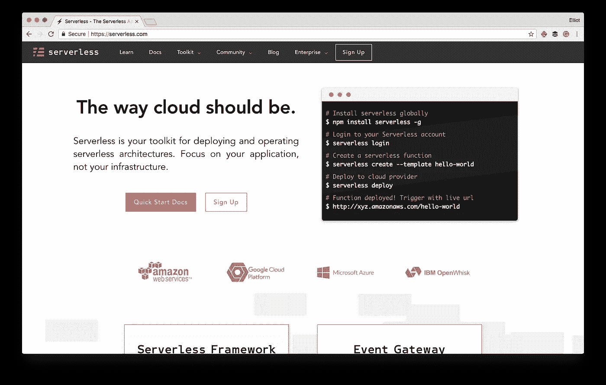
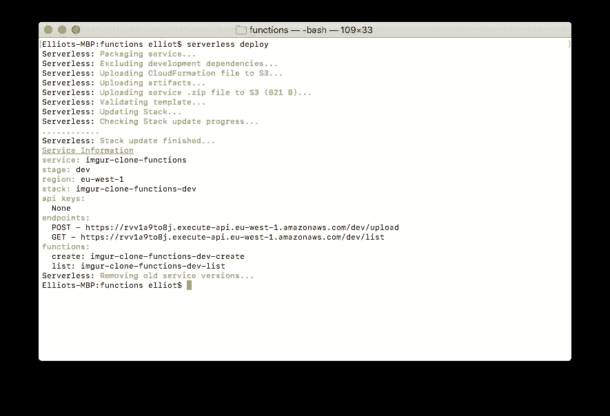

# 使用无服务器管理您的 Lambda 帝国

> 原文：<https://medium.com/hackernoon/managing-your-lambda-empire-with-serverless-abb6a29c081e>

如果你关注我有一段时间了，你会知道我是新的[无服务器](https://hackernoon.com/tagged/serverless)模式概念的超级粉丝。然而，当涉及到管理一个 [API](https://hackernoon.com/tagged/api) 网关背后的大量功能时，它开始变得有点负担。

令人欣慰的是，在管理大量功能时，像[无服务器](https://serverless.com)这样的新工具被证明是非常有用的。



在这篇文章中，我们将看看无服务器在处理跨多个环境的不同 lambda 函数的庞大帝国时提供的一些惊人的优势！

# 主要优势

无服务器允许您轻松开发和部署对多个 AWS Lambda 函数的大量更改。这是一个巨大的胜利。通过允许我们在一个`yml`文件中定义 Lambda 函数的所有内容，它将我们部署更改的时间减少到不到一分钟。

> 当涉及到开发任何东西时，缩短反馈回路是至关重要的。您希望最大限度地减少一个简单的更改花费 5-10 分钟来部署和检查的次数。

我们在使用像 serverless 这样的工具时所体验到的快速反馈循环确实使这种架构风格成为一种非常可行的选择，可以毫不费力地构建高度可伸缩的生产应用程序。

# 跨平台

许多产品所有者的一个主要担忧是，他们越来越依赖单一云服务提供商的服务。这也被称为“供应商锁定”，是一个非常现实的问题。

你不希望开发一个数百万美元的解决方案，完全依赖于一个云提供商，却发现在 6 个月后，你所依赖的特定服务将被弃用。

无服务器解决这个问题的方法是不知道您使用的是哪一个底层云服务提供商。您不局限于 AWS，您可以设计您的无服务器应用程序，使其可以跨多个云服务提供商部署。

# 装置

安装无服务器工具需要 npm。可以通过拨打以下电话进行安装:

```
npm install -g serverless
```

如果您已经在机器上设置了 aws 凭证文件，并为用户设置了正确的权限，那么您应该可以开始了！

# 构建您的功能

> 由于我目前正在编写一个完全基于 AWS 的类似 imgur 的网站，所以我将把这篇文章建立在我到目前为止为这个特定项目所做的工作的基础上！

假设我想为我的新项目开发一系列不同的端点。我可以在一个`imgur/`目录下的不同 python 文件中定义所有这些单独的函数。

```
.serverless/
imgur/
- list.py
- upload.py
- ...
serverless.yml
```

在根目录下的我的`serverless.yml`文件中，我可以这样做:

This is an example serverless.yml file for another article I’m writing!

因此，在上面的配置中，我基本上定义了两个不同的 API 端点，它们使用我在我的`imgur/`目录中定义的函数来驱动。

一旦我对我的函数做了更改，为了部署这些更改，我只需调用:

```
serverless deploy
```

剩下的就交给我了。

这个。是。**惊艳！**



An example of the serverless deploy command

从上面的截图中可以看到，cli 处理云形成文件的创建，它打包并上传工件，然后将它们推送到 S3 并进行部署。

最后，一旦一切完成，它就打印出“服务信息”。在这些信息中，您应该会看到所有已部署端点的列表，以及需要哪些`HTTP`动词来访问它们。对于我定义的两个端点，整个过程花费了大约 20 秒。

# 管理资源访问

通常情况下，你会希望你的 lambda 函数能够与其他 AWS 资源对话，无服务器处理得非常好。在您的`serverless.yml`文件的范围内，您能够指定一个非常细粒度的级别，即您的函数的不同访问级别。

# 开发、测试和生产

当谈到将开发环境与测试和生产环境隔离时，无服务器允许您通过`yml`文件或命令行参数来指定您想要部署到哪个阶段。

这意味着我可以在 Jenkins 这样的人中围绕这一点建立一个完整的部署管道，自动部署测试，执行集成测试，然后直接推向生产，没有任何额外的麻烦。这是理想的。

# 结论

希望这篇文章对你有用！最近刚刚开始使用无服务器，我已经看到了这个框架的巨大潜力，我非常期待在未来用它做更多的开发。

我目前正试图建立我的 YouTube 频道，并达到新的 1k 订户标志，以保持合作伙伴身份，如果你想支持我，请随时前往那里订阅:[https://www.youtube.com/tutorialedge](https://www.youtube.com/tutorialedge)

我真的很想听听那些已经在生产中使用了一段时间的人的想法！请在下面的评论区或者通过我的推特告诉我:[埃利奥特·福布斯](https://medium.com/u/eb71d34fbe09?source=post_page-----abb6a29c081e--------------------------------)