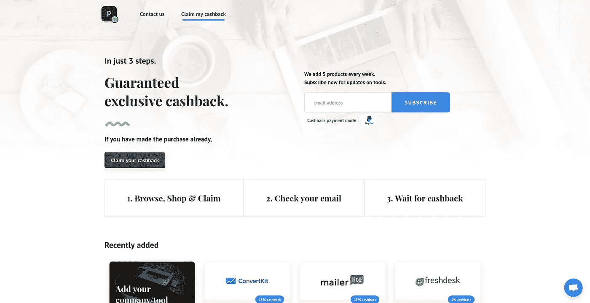

# 通过 Google Apps 脚本使用 Google Sheets 管理 Firebase 数据库。

> 原文：<https://medium.com/hackernoon/managining-firebase-database-using-google-sheets-via-google-apps-script-b87e5637b006>

使用 Google Apps 脚本对我来说是一次很好的学习。一个人可以自动化的事情，你可以用几行代码自动化某些功能的程度是惊人的。G Suite 提供了各种工具来开始使用 Google Apps 脚本。

最近，我们推出了一个名为 [**Paybackhub**](http://paybackhub.com) 的返现平台，为购买他们喜爱的软件工具的客户提供专属返现。我们还在 Paybackhub 上推出了一个优惠页面，列出了软件工具等令人惊叹的优惠。处理这么多关于优惠和返现的数据绝非易事。每当我们有一家新公司加入时，在复杂的实时数据库中添加数据是很乏味的。此外，如果在更改值时出现错误，我们会付出很大代价。我们还希望有一种更简单的方法将公司安装到我们的平台上。易于编辑，易于管理和快速。当时我们研究了我们的选择，并决定在 google sheets 上添加新的更新，通过 Google Apps 脚本将自动更新必要的信息到 Firebase 上的实时数据库。



Paybackhub webpage

在 Google sheets 上处理数据既简单又舒适。我们添加公司名称，我们的平台提供的返现和其他必要的细节注意到进入表中。当所有这些细节都得到验证后，就会运行一个脚本，将所需的重要数据以结构化的格式更新到 Firebase 上的数据库中。数据是从这里获取的，所有的功能都是由我们的网站执行的。

# 使用 Google sheets 开始自动化 Firebase。

在进入代码之前，必须有一个谷歌账户。在 [firebase](https://firebase.google.com/) 上创建一个应用。创建应用程序后，转到 database 选项卡，选择相对数据库。出于安全考虑，在数据库上启用了规则。这些规则允许用户和开发者自由地读/写数据库。在构建应用程序时，我们转到 rules 选项卡，并执行以下操作

```
*{
 “rules”: {
 “.read”: true,
 “.write”: true
 }
}*
```

为了测试，我们启用了读和写。这意味着任何有权访问数据库 url 的人都可以在其中读写数据。

Apps Script 是一种源自 Javascript 的语言。因此，Javascript 的基础知识足以与应用程序 Scipt 相处得很好。

## 理解使用的方法

1.  **getDatabaseByUrl(url，optSecret) :** 给定 firebase 应用程序数据库的 Url 和一个密码(维护安全性)，该方法返回该 url 处的数据库。

```
var url = "URL_OF_FIREBASE_APPLICATION";
var optSecret = "SECRET_CODE";
var database = FirebaseApp.getDatabaseByUrl(url, secret);**//getData**
Logger.log(database.getData("companies/offers")); //give a path **//pushData**
var data = {"companyName" : "Paybackhub", "desc" : "A cashback platform"};
var dataToPush = database.pushData("companies", data); //path, data
Logger.log(dataToPush);//**setData**
var data = {"companyName" : "Paybackhub", "desc" : "A cashback platform"};
var dataToSet = database.setData("companies/paybackhub/details", data);
Logger.log(dataToSet); //**updateData**
var data = {"desc" : "A cashback platform for software tools"};
var dataToUpdate = database.updateData("companies/paybackhub/details",data);
Logger.log(dataToUpdate);//**removeData**
var dataRemoved = database.removeData("companies/paybackhub");
Logger.log(dataRemoved);
```

2. **getData(path，parameters) :** 该方法将获取路径中给定的所有数据。在上面的例子中，变量*数据库*保存了应用程序中所有数据库的值。 *getData* 方法使用这个变量来遍历数据库，并从特定路径获取数据。

3. **pushData (path，Data，optQueryParameters) :** 生成一个新的子位置，将数据推送到那个路径(即生成的位置)。变量*数据*中的内容存储在新的子*公司中。*

4. **setData(path，Data，optQueryParameters) :** 该方法将数据写入作为参数发送的特定路径。变量*数据*中的内容存储在路径*公司/列表*中(即特定位置)

5. **updateData(path，Data，optQueryParameters)** :用于在不改变已有数据的情况下，更新特定路径的数据。这里*数据*代表需要被覆盖的孩子。

6. **removeData(path，optQueryParameters) :** 该方法用于删除数据库中特定路径下的所有数据。在上面的代码中， *companies/paybackhub* 下的所有条目都将被删除。

# 将 Firebase 库添加到应用程序脚本

要使用上述函数，必须包括能够使用它们的库。在脚本编辑器中，点击**Resources>Librairies**并添加项目关键字“**myep 8 zeet 1 ylvdxs 7 uyg 9 pldocoke 7–2l**”。点击**后选择**，选择最新版本即可。

# 谷歌工作表

在 google sheets 中，填写需要推入这些行和列的所有数据。要了解更多关于使用应用程序脚本访问数据的信息，请阅读谷歌的这篇精彩的[文档。](https://developers.google.com/apps-script/reference/spreadsheet/)

这帮助 [paybackhub](http://paybackhub.com) 非常容易地管理数据库。关于公司的每日更新在一天中被多次归档。所以在 Google Sheets 上处理所有这些更新对我们帮助很大。只需按下一个按钮，所有这些变化都会更新到 Firebase 上，我们所有的顾客都可以通过我们的网站购物。

对于这种定期手动更新，使用这种方法将是非常有益和有效的。更多关于如何处理 Firebase 和 Google Sheets 的信息，请点击这里。

希望这篇文章是有用的，并尝试一下。

对于软件工具上的返现结账 [**返现枢纽**](http://paybackhub.com) 。我们每周增加 5 个很棒的工具，有高达 30%的返现。可以从 paybackhub 获得大约相当于 3 个月工资的返现。希望这对你有帮助:)

如果你对这篇文章和 Paybackhub 有任何反馈，请联系 twitter。

在 Twitter 上关注 pay back hub:【https://twitter.com/paybackhub 

在 twitter 上联系我: [Supriya S](https://twitter.com/s_omeal)