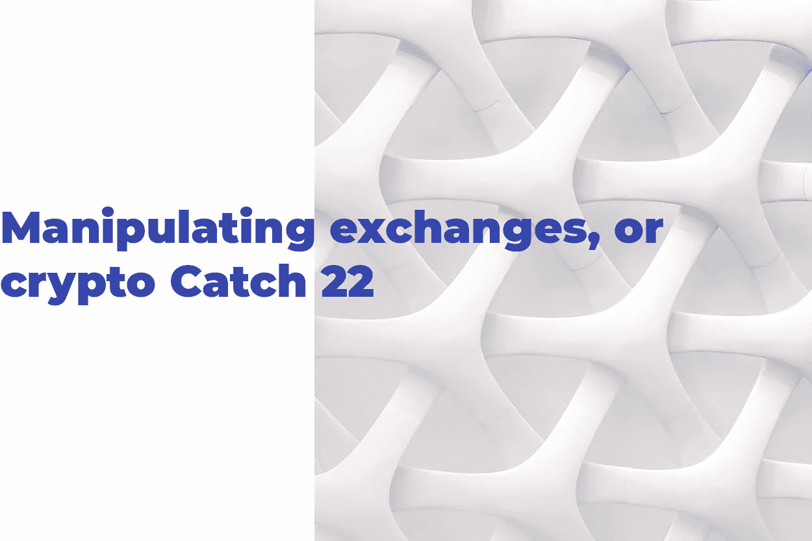
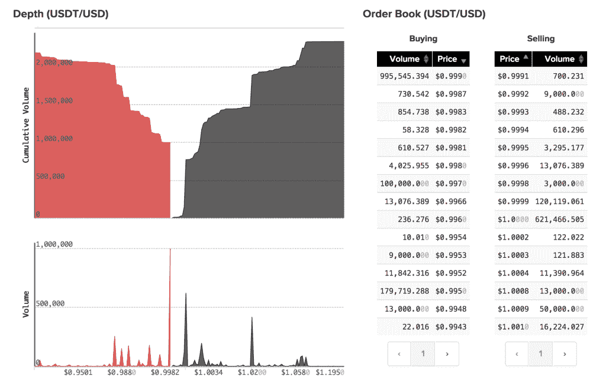

# 操纵交换或加密捕捉 22

> 原文：<https://medium.com/hackernoon/manipulating-exchanges-or-crypto-catch-22-57861c6aec98>

# 奥尔加·格里尼纳

北海巨妖可能会愤怒地否认对他们参与 USDT 价格操纵的指控，但是那个搅起波澜的彭博记者可能有一些金融背景来做出可信的结论，并且实际上理解诸如“套利”、“订单簿”和“汇率挂钩”这样的基本交易概念。那么，他好奇的眼睛发现的那些“奇怪的信号”是什么？看一下北海巨妖的 USDT 订单簿，我们可以看到，在 1 美元价格水平附近的一个可疑的非常接近的范围内，有超过 100 万美元的静止买卖订单。因此，USDT 的价格变动非常小。北海巨妖对彭博的“憎恨者”持有什么观点？嗯，这基本上是叫他们傻瓜，不能掌握加密交易的基本知识和 USDT 固有的设计。

USDT Order Book where suspicious amount of 13, 076.389 was first spotted

你有没有想过令牌最初是如何在加密交易所上市的？所有的交易所，无论是像 T2 币安 T3 这样的巨头还是较小的参与者，都需要稳定的流动性提供者和更多的用户。因此，很可能有很多在柜台下进行的交易——特别是当我们谈论新兴交易所准备好“谈判”任何条款以增加用户基础的时候。

更重要的是，密码交易所不会被人操纵。传统股票市场的洗盘交易由来已久。在秘密领域，这种现象的规模惊人地扩大。持有大量密码的投资者——无论是初创企业创始人还是仅仅是感兴趣的人——都会同时买卖相同数量的代币，以创造一种暗示人为需求的误导活动。操作方式非常简单:玩家或机器人发出卖出指令，然后发出买入指令，简单地从自己手中买断，反之亦然。瞧，你就知道了:交易量激增，给人一种代币需求大于实际需求的印象。很难评估新推出的代币中有多少通过了这种灰色计划，没有人给你这个统计数据！

这是一个合乎逻辑的飞跃，表明伪造交易量和代币价格操纵不会很快出现，至少在监管机构宣布加密清洗交易非法并最终迫使比特币狂野西部玩家遵守之前不会出现。在那之前，交易所将与代币发行商谈判互利交易。这是官方的:密码市场仍然是高度操纵的空间。可疑的创业公司和 ico、交易所、媒体等等都可能在某些方面认罪。这对区块链和传统金融行业的影响都相当惊人。不仅名誉岌岌可危。那些“狡猾的企业家”为了将代币推向交易所并抬高价格而推出代币，只是在摧毁我们对新技术的善意。