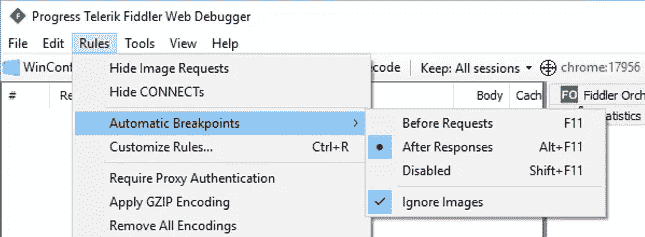

# 用 Fiddler 操纵 web 应用程序 HTTP 流量

> 原文：<https://medium.com/hackernoon/manipulating-web-application-http-traffic-with-fiddler-140d789d0a1c>

我在我正在开发的一个网络应用程序的前端偶然发现了一个奇怪的 bug。这个应用程序向服务器执行一个 ajax 请求，并得到一个相对较大的 JSON 序列化对象，这是一个复杂计算的结果。当我使用浏览器开发工具调查响应时，一切似乎都很正常，所以看起来像是客户端问题。唯一的问题是，返回的对象是根据特定信息计算的结果，这种特定信息只能在除了浏览器本身之外没有任何工具的环境中找到，并且在开发[环境](https://hackernoon.com/tagged/enviroment)中不容易重现该 bug。

为了在我的本地机器上重现这个问题，我使用 [Fiddler 的](https://www.telerik.com/fiddler)调试功能，执行了一个快速而肮脏的 HTTP 响应操作。

## 关于提琴手

Fiddler 是一个 HTTP 调试代理，具有一些令人惊叹的功能，目前由 Telerik 开发(参见这篇[维基百科文章](https://en.wikipedia.org/wiki/Fiddler_(software))了解完整历史)。对我来说，它是网络开发不可或缺的工具。尽管浏览器的开发工具[网络](https://hackernoon.com/tagged/network)分析功能已经有了很大的进步，Fiddler 还是提供了一些高级选项，就像这篇文章中描述的那样。

## 用于演示的示例应用程序

我写了一个超级简单的应用程序，从维基百科的公共 API 获取一些文章。该应用程序对以下 URL 执行 ajax GET 请求:

> [https://en.wikipedia.org/w/api.php?action=query&list = Category members&cm title =类别:生物学&format = JSON&origin = *](https://en.wikipedia.org/w/api.php?action=query&list=categorymembers&cmtitle=Category:Biology&format=json&origin=*)

并返回一个 JSON 序列化对象，其中包含一些生物学类别的文章。我选择这个 API 进行演示，因为它是公共的、开放的(不需要认证)并且易于使用。

The original response object from the Wikipedia API call. Screenshot was taken from [Postman](https://www.getpostman.com/)

The sample application normal flow, running in Google Chrome. The ajax request is pending (1), then completes and the results are displayed on the page (2)

## 操纵响应

默认情况下，Fiddler 将监控浏览器 HTTP 请求(作为代理服务器)，但不会干涉它们。有两种调试模式:请求前和响应后。在“响应后”模式中，fiddler 将从服务器获得响应，但不会将其转发回浏览器。在这一点上，我们有机会操纵反应。

首先，我们来启用这个模式。从菜单栏中，选择规则->自动断点->响应后。

Enable “After responses” debug mode

现在，我们将刷新浏览器页面，以便再次执行请求。发出了请求，得到了响应，但在 Fiddler 中暂停了。

The response is paused in the Fiddler proxy. The JSON serialized response payload is marked

下一步是操纵响应。这可以通过在响应检查面板中编辑响应文本来完成。下一个截图展示了这种操作。

Manipulating a single value in the response. In this case, I changed “Biology” to “Math”. After editing, click the “Run to Completion” button on the top bar

编辑完响应后，单击 Fiddler 响应面板上的“Run to Completion”按钮。被操纵的响应将继续它的旅程，到达它的最终目的地——浏览器。

The final result: the altered value is displayed in the application (“Math” instead of “Biology”)

## 用例

这个特性正是我快速解决我正在处理的客户问题所需要的。首先，我将整个 JSON 字符串从原始环境复制到我的开发环境中(使用 browser developer tools network 选项卡)。然后，我在本地机器上启动 web 应用程序，让它执行 ajax 请求。我在 Fiddler 中使用了“After Responses”调试模式，并用之前复制的数据替换了原始响应的 JSON 有效负载。这个问题又出现了，我很快就解决了。

## 最后的话

我确信许多开发人员不熟悉这种调试技术。在我最近使用它之后，我对它感到非常兴奋，并想与世界其他地方分享它。我希望你会发现它在类似的情况下是有用的。