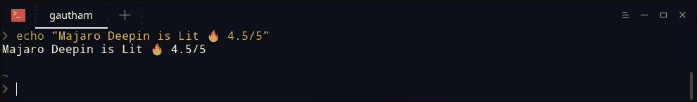
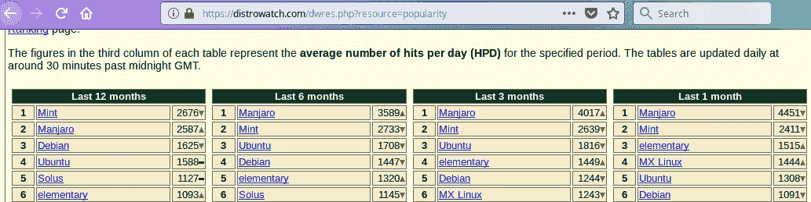
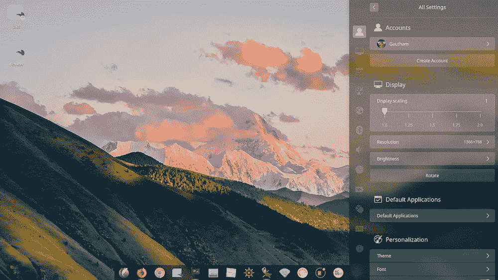
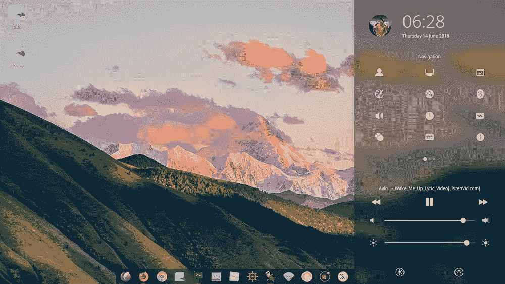
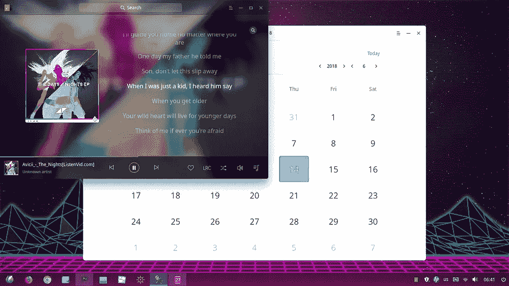
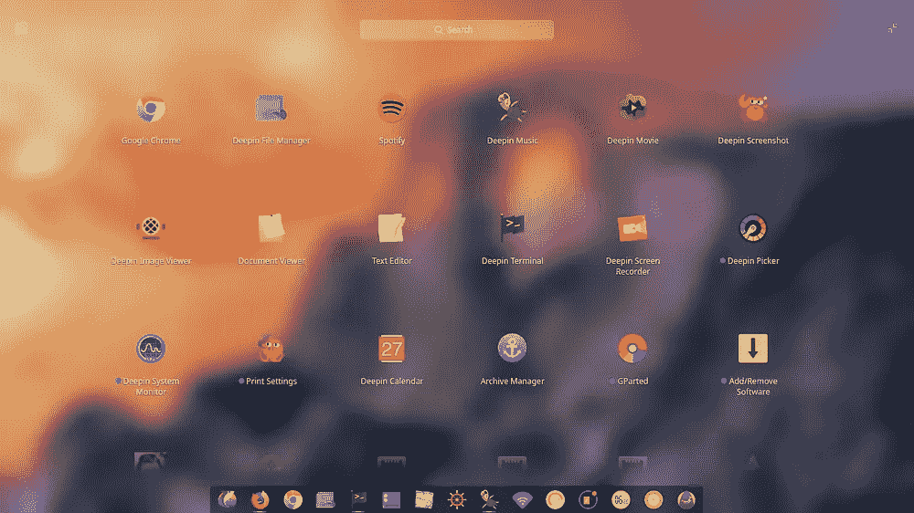
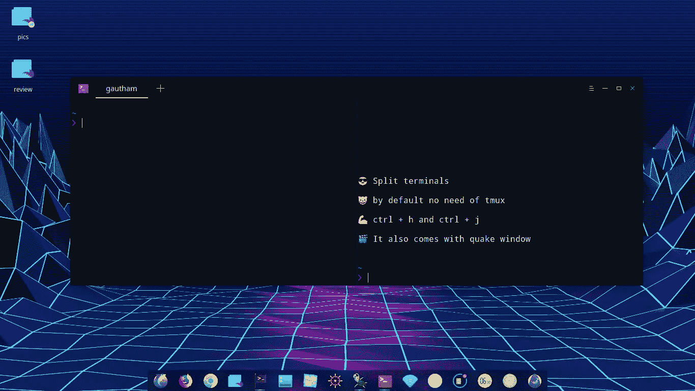
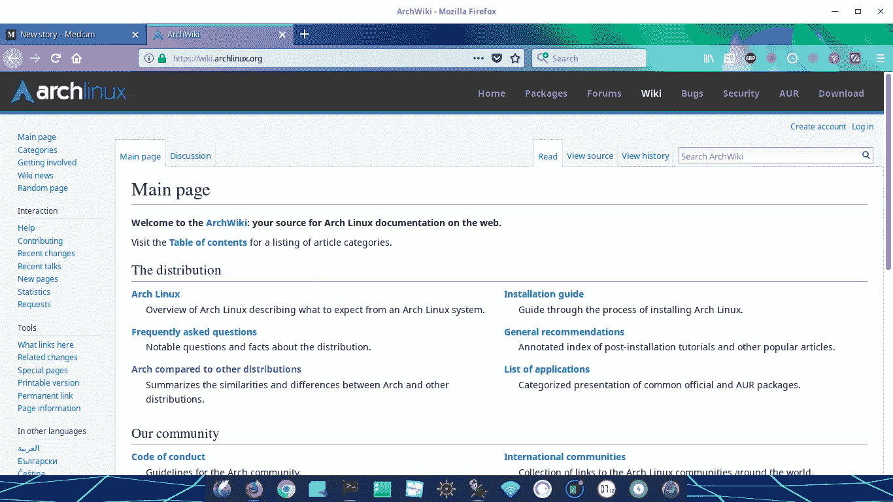
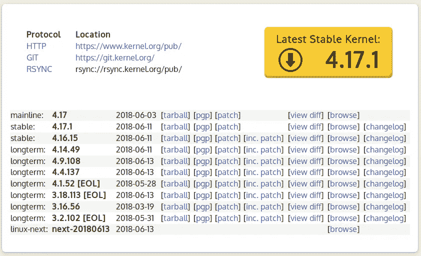
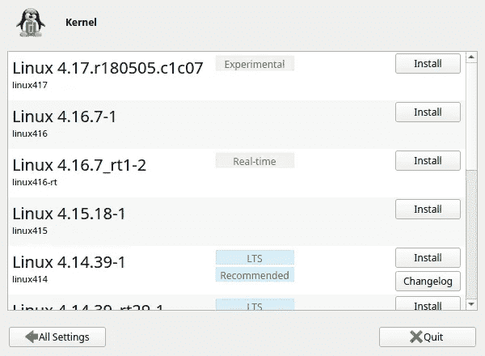

# Manjaro Deepin Review:一个简洁而强大的 Linux 发行版

> 原文：<https://medium.com/hackernoon/manjaro-deepin-review-a-clean-minimal-and-powerful-linux-distro-6c0ccac04cd8>

我已经用了几个月的 Manjaro Deepin 了！这是我对它的感觉。🔥

TL;DR

对于不熟悉的人来说。Manjaro 是一个基于 Arch Linux 的 Linux 发行版。

如果你没有听说过 Arch，你并不孤单。Arch Linux 自 2002 年以来一直存在，但正是这个令人惊叹的操作系统提供了最少的功能和一个令人惊叹的社区。但是对于一个正常人来说有点多，甚至安装都需要很大的努力。所以你没听说过。

Deepin 是目前中国最流行的 Linux 操作系统。但是它是在 Debian 之上的(和 Ubuntu 一样的东西)。我以前用过它，它的用户界面令人惊叹，轻而易举地击败了所有其他的 Linux 操作系统。但是镜子太慢了。

Manjaro Deepin 是一个社区驱动的项目，试图融合世界上最好的东西🌎。Deepin 的 UI 变成了令人惊叹的 Arch 内核。Manjaro 还有其他各种风格，比如 Gnome、KDE 等等。

Manjaro is the Top rising OS in Distrowatch, It was not even visible in the list three years ago 👏

# 五大功能🎄

## ⛅️控制中心

控制中心仍然在操作系统的一侧，这在任何操作系统中都不常见。使得它非常容易使用和最小化。

## 吃豆人📦

任何一个 Arch OS，不仅仅是 Manjaro，最好的一点是 Pacman，Arch 的包管理器。

为什么这么神奇？

它里面有你需要的所有包。Arch 社区太神奇了，你甚至不需要谷歌你想要安装的软件包。

在我使用 Manjaro 的几个月里，我不得不搜索一个包大约 2-3 次，使它非常容易使用。所有这些包都是最新的。你将在任何其他操作系统之前获得 Arch 中任何软件包或软件的最新版本。在包的更新上，Arch 总是领先 Ubuntu 和其他人几个月。✈

> 📦Pacman 无疑是最好的包装经理。

## Windows 和 Mac 的两全其美

如果你喜欢像 dock 这样的 mac 作为任务管理器，或者喜欢高效的 windows 作为外观，请尝试 Deepin。易于清理的用户界面从其他用户界面中脱颖而出，因为它能够带来两个世界的最佳效果。

它还有一个受 Mac OS 启发的启动器，看起来非常光滑。所有的图片都是默认的，没有对用户界面做太多的调整。

Deepin 还配备了大量具有华丽用户界面的默认应用程序，如音乐应用程序、视频应用程序(我甚至不需要安装 VLC)、截图应用程序、屏幕录制应用程序等等。

Mac and windows like launcher for Manjaro Deepin

## 末端的😍最佳默认应用程序

我❤️我的终端。这是我使用 Linux 的主要原因之一。默认终端是如此惊人，没有任何调整。默认情况下，您可以拆分终端和 quake 窗口。通过添加一些 ZSH 插件，我的终端变得很好用，在早期的操作系统中，我经常花几个小时来做这件事。这是如此完美的默认，所以为什么麻烦。

Terminal of Manjaro Deepin

## Arch Wiki 和更新

使用基于 Arch 的操作系统最令人惊奇的事情是，你永远不需要花那么多时间去阅读上百个论坛来解决一个简单的问题。你可以在 Arch wiki 中找到几乎所有问题的答案。它总是最新的，几乎拥有世界上所有事物的信息。我已经用它解决了我以前操作系统中的大部分问题，所以你不能说我对它完全陌生。

Arch wiki solves almost everything 😃

Arch 的另一个令人惊奇的特性是，你会在别人之前收到包裹。甚至 Linux 内核。您可以一键安装它们。当我写这篇博客的时候，4.17 已经发布了，而且已经可以在 Arch 中使用了。

Packages comes first to Arch before others.

## 结论🏁

在使用 Linux 很长一段时间后，我只是想要一个稳定易用的 Linux。这样我就不用花几个小时去搜索添加一个小的包来完成我的工作。Manjaro Deepin 帮助我轻松做到了这一点。

用户界面是 Linux 中最好的，简洁明了，非常前卫，甚至没有添加任何主题。那些花在美化 Linux 上的时间已经一去不复返了。

但它完美吗？

不，我不这么认为。偶尔会有 bug，就像其他 Linux 发行版一样。但是在社区和 Arch wiki 的帮助下，你可以很容易地解决这些问题。这是迄今为止我用过的最好的基于 Linux 的操作系统。💯

*如果你在机器学习结账*mljobslist.com[找工作](https://mljobslist.com/jobs/)

*感谢您的阅读😅。如果你喜欢这篇文章，就给它鼓掌👏。*

*如果你想聊天，* [*DM 我在 https://twitter.com/gauthamzzz*](https://twitter.com/gauthamzzz)*。*

我是阿拉哈巴德印度信息技术学院的一名硕士研究生。我的网站[*http://gauthamzz.com/*](http://gauthamzz.com/)*。*