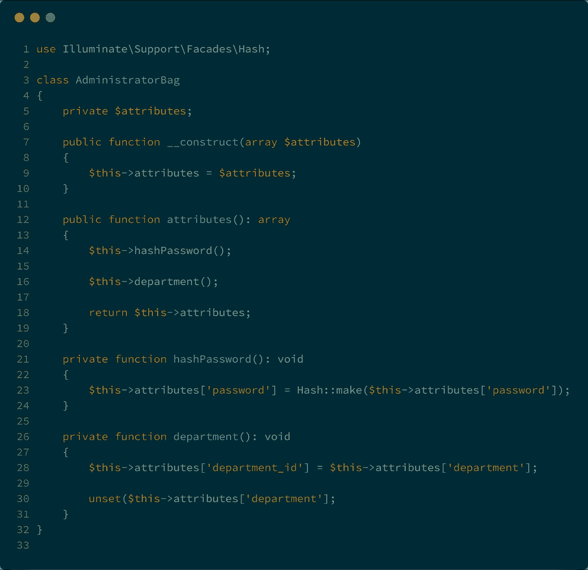

# 从请求到雄辩的映射

> 原文：<https://medium.com/hackernoon/mapping-form-request-to-eloquent-6eb30ee9eb7d>

Laravel 附带了 API 资源，用于将雄辩的对象映射到响应中。但是请求呢？纠结这个很久了，终于开心的介绍包包了！

## 1-测试

在以前的帖子中，我已经说过我是一个多么热爱 TDD 的人。我觉得如果我知道如何与实现交互，那么讨论实现的问题会更容易。先说测试。

简单的创建过程，但是`$administrator->create($request->validated())`不能工作，因为 a)我们想要散列密码，b)数据库列被称为`department_id`而不是`department`。

## 2-将表单请求转换为包

表单请求是验证输入数据的很好的类。在验证之后，我们可以用它将输入转换成雄辩者能够理解的东西。这里有一个片段。

我们现在可以通过调用`$request->toBag()`将请求转换成数据包，而不是使用控制器中的`$request->validated()`。`bag`将负责完成我们想要的各种输入转换。看看这个:

## 3-总结-处理程序

和往常一样，请求处理程序将对 Laravel 的表单请求进行类型提示，以自动验证输入数据。如果一切顺利，我们可以将这些数据转换成一包经过验证的数据，并将其传递给口才。

## 4-绿色测试！

该实现满足步骤 1 中描述的测试。这最终满足了我保持一个干净、直观的 API 请求与数据库结构分离的愿望，就像 API 响应可以在不需要更改数据库的情况下进行转换一样。