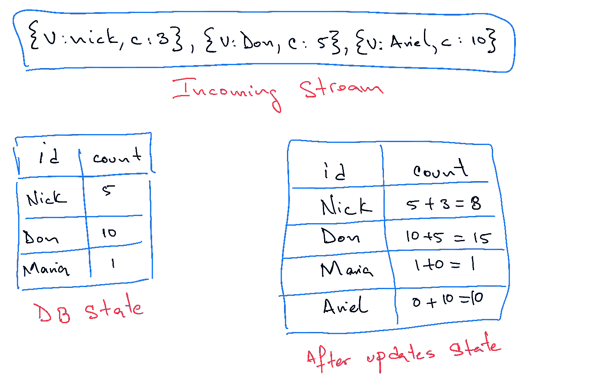
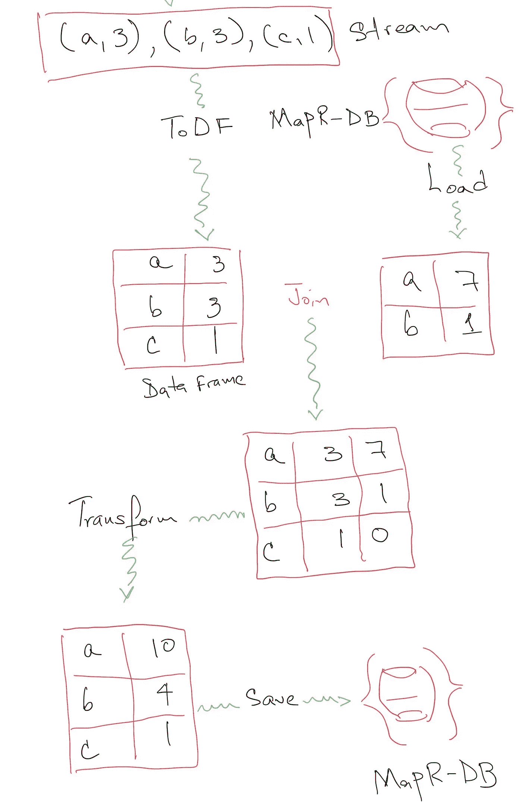

# MapR-DB 原子文档更新

> 原文：<https://medium.com/hackernoon/mapr-db-atomic-document-updates-d54f535b589>

在 a [*前一篇文章*](/@anicolaspp/interacting-with-mapr-db-58c4f482efa1) 中，我们已经讨论了 MapR-DB 的一些特性，这些特性使得这个分布式数据库特别有趣。在本帖中，我们打算通过展示一个具体的用例来继续这一努力。

## 问题是

要解决的问题可以描述如下。

> 一系列消息通过一个流传来。每个值都有一个`*id*`和一个`*count*`。对于每个`*id*`,我们必须通过使用流中的`*count*`增加其值来更新数据库中现有的`*count*`。

下图显示了该问题的一个示例。

The problem in an image.

有各种方法可以解决这个问题。一种方法是读取存储在数据库中的给定`id`的当前状态，然后使用流中的值更新其`count`，最后将更新后的值保存回数据库。

我们来详细看看这个过程。

Loading, merging, and saving.

正如我们在上面的图像中看到的，为了更新数据库中的状态，我们需要首先从数据库中加载每条数据，将值与传入的流连接起来以计算新的状态，最后，将新的状态保存回持久存储。一般来说，无论我们选择使用哪种数据库技术，无论是 MapR-DB 还是任何其他持久性技术，我们都必须遵循相同的过程。

下面的代码展示了我们如何使用与 MapR-ES (MapR Streams technology)和 MapR-DB 集成的 Apache Spark 来实现这个想法。

需要注意的是，在每张流式幻灯片上，我们从 MapR-DB(或任何其他数据库)加载，并将加载的数据帧与流合并。然后，我们将当前最近计算的新状态保存回数据库。

这个过程完全有意义，而且在大多数数据库中，这是无法回避的。然而，每次我们在流上接收数据时，这些操作的执行成本都很高。

# MapR-DB 突变

> 别人摔短裤的时候，MapR-DB 大放异彩。

MapR-DB 能够增量更新文档，而不需要先加载它们。更具体地说，可以只更新文档的某些字段，而不涉及文档级别的任何其他内容。

一个合理的问题是:鉴于 MapR-DB 的分布式本质，这些更新是自动应用的吗？答案是肯定的。

让我们先写一些代码来证明最后一个陈述，然后我们将使用这个概念来解决问题。

我们可以从下面的代码片段开始。

正如我们所见，`run`函数将为给定的`id`增加`count`，具体来说，是增加`times`倍。

基于这段代码，我们可以创建另一个函数，通过创建多个线程并在每个线程上执行`UpdateSameId.run`来并行执行相同的操作。

我们可以用下面的方式运行上面的代码。

这将打印出 MapR-DB 上每个文档的最终状态，通过这一点，我们可以肯定地说更新是自动应用的。

> 整个代码是 [***反应器项目的一部分，你可以在这里找到***](https://github.com/anicolaspp/reactor/tree/master/mapr_db_atomic_updates) 。

正如我们所看到的，即使在多线程或多处理器环境中运行，MapR-DB 也能保证值的一致(原子)更新。为了增加并行性，我们可以使用 Apache Spark 编写类似的代码，但是结果是一样的；我们试过了。

基于这些发现，我们可以改进我们的原始应用程序，以解决我们首先提出的问题。

让我们从删除首先从 MapR-DB 加载的部分开始，用更新替换它们。

让我们回顾一下我们最初的应用程序的一些重要变化。

首先，根本不需要从数据库加载当前状态。相反，我们创建必要的突变，并将它们并行应用于 MapR-DB。

其次，我们显著减少了 Spark 必须执行的任务数量，提高了整体性能，同时降低了数据库的负载。

第三，代码更简单、更优雅、更容易理解，增加了可维护的索引，同时使其他人的生活更容易。

最后，我们为每个分区创建一个连接，这样我们可以避免任何 Spark 串行化问题，同时增加并行性，因为每个分区操作将同时运行(Spark magic 在这里工作)。

流程运行后，我们可以放心，我们的数据将通过我们最新的方法得到正确有效的更新。

# 结论

如前所述，MapR-DB 是一个非 SQL 数据库，具有非常有趣的特性，值得探索。这些特性不仅使它成为高性能和分布式工作负载的首选，也使我们作为问题解决者的生活更加轻松。尽管 MapR-DB 固有的分布式本质，我们可以将自己从像这样的复杂系统所具有的许多问题中抽象出来，并轻松地使用 MapR-DB 来解决市场上最复杂的业务问题。

请阅读 [***与 MapR-DB***](/@anicolaspp/interacting-with-mapr-db-58c4f482efa1)*进行交互，以更全面地了解如何使用 MapR-DB 及其相关工具。*