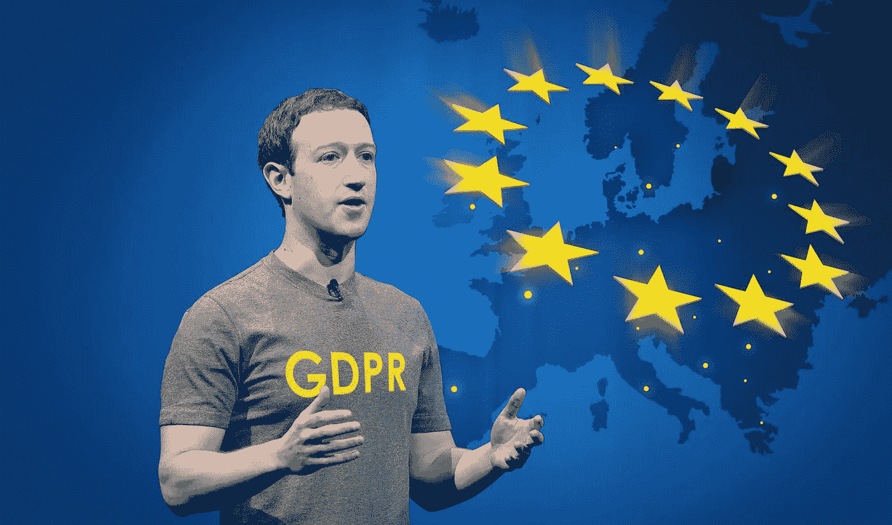

# 马克·扎克伯格和欧洲的 GDPR

> 原文：<https://medium.com/hackernoon/mark-zuckerberg-and-europes-gdpr-9b76adebf8bd>

## 在国会山的证词中，脸书的创始人兼首席执行官似乎是新的欧洲数据和隐私法规的最大支持者。但是…

昨天，GDPR 一度成为推特上的热门话题，有超过 22700 条推文。

前一天，[布鲁塞尔](https://twitter.com/MargSchinas/status/983799232313417730)

## [扎克伯格的证词直播](https://hackernoon.com/zuckerberg-live-c9e7ce1b9b54)

### [每一分钟，脸书的创始人兼首席执行官告诉 DC 的美国立法者。](https://hackernoon.com/zuckerberg-live-c9e7ce1b9b54)

[hackernoon.com](https://hackernoon.com/zuckerberg-live-c9e7ce1b9b54)

GDPR 代表通用数据保护条例，该条例将于 5 月底在欧盟生效。GDPR 将对欧洲互联网企业的运营方式产生重大影响，无论这些企业是否位于欧盟成员国境内。

[连线](https://medium.com/u/ecdcb63e1a76?source=post_page-----9b76adebf8bd--------------------------------)甚至[写道](http://www.wired.co.uk/article/facebook-mark-zuckerberg-congress-testimony-cambridge-analytica-gdpr-privacy)“一旦被嘲笑，欧洲新的数据保护已经成为大西洋彼岸嫉妒的来源。”“当 GDPR 法案第一次被通过时，美国评论家认为这是一种嫉妒的保护主义，”罗兰·曼索普(Rowland Manthorpe)解释道，并引用了《纽约时报》(New York Times)最近的一篇社论。

“新的欧洲规则并不完美——它们包括所谓的被遗忘权，即允许人们要求公司删除他们不再希望分享的个人信息，”这篇社论写道。“但欧洲人在解决美国最近凸显的一些问题方面取得了进展。”

周二，在扎克伯格在参议院作证期间，2018 年美国国会民主党候选人亚历山大·奥卡西奥-科尔特斯甚至[呼吁美国 GDPR](https://twitter.com/Ocasio2018/status/983778940098613249) 。

那么，为什么 GDPR 在扎克伯格的证词中如此突出，为什么有这么多关于它的问题？

这一切都是从一张照片开始的，在过去的几天里，这张照片引起了极大的关注。它显示了马克·扎克伯格的法律和公共政策团队向他提供的笔记，其中一些人陪同他参加了周二和周三的听证会:总法律顾问科林·斯特朗(Colin Stretch)和美国公共政策副总裁乔尔·卡普兰(Joel Kaplan)；首席隐私官艾琳·伊根；[米里娅·乔丹](https://medium.com/u/e25576ea95fe?source=post_page-----9b76adebf8bd--------------------------------)，国会事务公共政策主任；合规副总法律顾问 Pearl Del Rosario 公共政策主任布莱恩·赖斯。

Via [Stefan Becket](https://medium.com/u/a9c05e1fab37?source=post_page-----9b76adebf8bd--------------------------------) on Twitter

这些笔记包括大量话题和问题的谈话要点，包括俄罗斯干预和选举诚信、多样性、竞争和隐私……甚至包括脸书对苹果公司蒂姆·库克关于公司商业模式和领导力的评论的反应。

在注释中，当涉及到隐私时，新的欧洲 GDPR 法规相当突出。

笔记建议扎克伯格:“不要说我们已经做了 GDPR 要求的事情。”

Via [Greg McNeal](https://medium.com/u/dcac8d8554d8?source=post_page-----9b76adebf8bd--------------------------------) on Twitter

他们还提到了两个证词中使用的几个论点:

*   无论生活在哪里，人们都应该拥有良好的隐私工具和控制。
*   我们把一切都建设得透明，让人们可以控制。
*   GDPR 做了几件事:(a)提供对数据使用的控制——我们已经做了几年了；(b)要求同意——做了一点，现在在欧洲和世界各地做得更多；(c)对于敏感的事情，如面部识别，要获得特别的同意。
*   支持切实可行的隐私立法，让人们处于控制之中，并允许创新。

在很多场合，当参议员和众议员问他关于 GDPR 的问题时，这些笔记对扎克伯格很有帮助。

例如，在美国众议院[能源和商业](https://medium.com/u/585c3b833da6?source=post_page-----9b76adebf8bd--------------------------------)委员会的听证会上，当[众议员斯科特·彼得斯](https://medium.com/u/1a3b44ee2d9b?source=post_page-----9b76adebf8bd--------------------------------)问:欧洲人在 GDPR 问题上做对了什么？

扎克伯格回答说:“我认为 GDPR 总的来说将是互联网非常积极的一步。它编纂了——里面的很多东西是我们已经做了很长时间的东西；我认为我们应该采取的一些其他措施。例如，这需要的控制通常是我们多年来提供的隐私控制。反复地把工具放在人们面前，不仅仅是把它们放在环境中，而是把它们放在人们面前，确保人们理解控制是什么，并得到肯定的同意。我认为这是一件好事，我们在过去定期这样做。我觉得做多是有道理的。我认为这是 GDPR 要求我们去做的事情，而且是积极的。”

众议员彼得斯接着问道:欧洲人做错了什么吗？

扎克伯格摆了一个长姿势后说:“我需要多考虑一下。”

不久之后，众议员 Ryan Costello 也问到了关于欧洲的 GDPR:“你认为它的哪些部分适合放在美国法学上；换句话说，擦除的权利、取回数据的权利、纠正的权利……您能分享一下您对这一点的看法吗？这不仅适用于您，也适用于小型公司。”

扎克伯格也给出了同样的回答:“我认为 GDPR 的一些地方很重要，也很好。”

他提到了三个重要部分，在最后一部分，他补充了另一个关于脸书对欧洲新法规的看法的话题:

*   “一是确保人们能够控制他们共享的每一条信息是如何被使用的——人们应该能够知道公司对他们了解多少，能够控制和设置谁可以看到这些信息，并且能够随时删除这些信息；”
*   “第二件事是确保人们真正了解哪些工具是可用的——不只是在某个设置页面上显示它们，而是将它们放在人们面前，以便他们可以做出决定。既能建立信任，又能让他们的体验按照自己想要的方式进行。这些年来，我们在脸书已经多次这样做了，但现在，与 GDPR 合作，我们将在全世界做得更多
*   “第三件事:有一些非常敏感的技术，我认为对实现创新很重要，比如人脸识别，但你要确保你得到了特别的同意。如果我们让美国公司很难在面部识别等领域进行创新，那么我们就会输给中国公司和世界各地的其他公司。”

众议员吉恩·格林也询问了 GDPR 的情况，包括关于新法规要求的具体问题。以下是扎克伯格的回应:

前一天，在参议院的听证会上，参议员玛丽亚·坎特威尔问道:“你认为欧洲的法规应该适用于美国吗？”

扎克伯格回答说:“我认为世界上的每个人都应该得到良好的隐私保护，不管我们是否实施完全相同的法规，我想它会有些不同，因为我们在美国和其他国家有一些不同的感受。”

他补充说:“我们致力于推出控制和肯定同意，以及围绕敏感技术类型的特殊控制，如人脸识别，这在 GDPR 是必需的。我们在世界各地都这样做。我认为，我们是否应该在美国采取类似的措施当然值得讨论，但我今天想说的是，无论监管结果如何，我们都将继续前进并实施这一措施。”

不久后，参议员林赛·格雷厄姆(Lindsey Graham)询问关于隐私监管的“欧洲人是否有权利”。

扎克伯格回答说:“我认为他们把事情做对了。”

据 EurActiv.com[的 Catherine Stupp 报道，负责司法、消费者和性别平等问题的欧盟专员 Vera Jourova 也对扎克伯格在国会山的证词发表了评论，说“谢谢你，扎克伯格先生”。](https://medium.com/u/92bd4547d17b?source=post_page-----9b76adebf8bd--------------------------------)

谈到剑桥分析公司的违规行为和数据保护，茹罗娃还指出，欧盟“准备纠正 GDPR 的情况”

4 月 4 日，[在与记者的问答环节中，Cecilia Kang if The New York Times 在提到 GDPR 时问扎克伯格:“你对美国的这类数据保护法规以及针对全球用户的更深入的法规感到舒服吗？”](https://newsroom.fb.com/news/2018/04/hard-questions-protecting-peoples-information/)

他回应道:“总的来说，我认为像 GDPR 这样的法规是非常积极的。我对昨天路透社的报道感到有些惊讶，因为记者问我们是否计划在全球范围内对 GDPR 实施控制，我的回答是肯定的。我们打算让所有地方都可以使用相同的控制和设置，而不仅仅是在欧洲。会是完全相同的格式吗？大概不会。我们需要弄清楚，在不同的市场、不同的法律和不同的地方，什么是有意义的。但是——让我重复一遍——我们会让所有地方的控制和设置都一样，不仅仅是在欧洲。”

在路透社的报道中，扎克伯格被引述说“我们仍在敲定细节，但在精神上，它应该是整个事情的方向。”文章提到他没有细说。