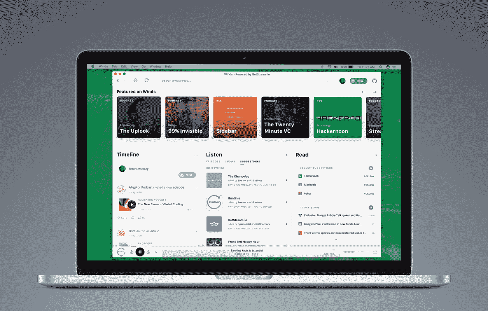

# 通过构建您的 API 进行营销

> 原文：<https://medium.com/hackernoon/market-by-building-on-your-api-ea4385bd7148>

## 创始人访谈

> 披露: [Stream](https://goo.gl/LxzcfX) ，可扩展提要的 API，之前赞助过 Hacker Noon。

*今天，我们将采访他们的首席执行官 Thierry Schellenbach，谈谈如何通过在你的 API 上构建很酷的产品来营销你的公司。*

关于本次采访的前几部分，请访问:

*   [“Stream 如何开始构建新闻订阅源”](/@DavidSmooke/how-stream-started-building-newsfeeds-bfd064ddf054)
*   [“从脸书的新闻订阅挣扎中可以学到什么，谁将为未来的新闻订阅提供动力？”](/@DavidSmooke/what-to-learn-from-facebooks-newsfeed-struggles-and-who-will-power-the-newsfeed-of-the-future-fd32f31e6321)

[**David**](https://medium.com/u/7f91547ce9c9) **:实际上我第一次听说你们是从 Nick Parsons，以及你们在 Stream 上开发的 Winds RSS 产品。我发现像你们这样的公司制造一种产品来推销你们的主导产品非常有趣。你认为这种方法是你认为市场营销应该如何的核心吗？你对其他以初级产品为营销手段的创始人有什么建议？**

蒂埃里·谢伦巴赫:好问题！事实上，我也写了一篇关于这个的博文。在我们的 API 上构建应用程序是我们营销的最佳方式之一。许多公司尝试各种不太友好的营销方法，如积极的出站和垃圾邮件——这不是我们所做的。

> 拥有这种 API 驱动模型的好处之一是，你可以通过在它的基础上构建有趣而有用的东西来推销你的业务。

[大风](https://getstream.io/winds/)就是一个很好的例子。这是一个完全开源的 RSS 和播客阅读器，我们使用 React 和 Redux 构建在 Stream 之上。我们现在有了一个新版本，Winds 2.0。它目前处于测试阶段，但我们将在下个月左右发布 GA。我们计划围绕你如何为这个项目做贡献，以及关于使用 React 和 Redux 的教程。

我们有另一个示例应用程序，名为 [Cabin](http://cabin.getstream.io/) 。你可以按照 7 部分教程学习如何建立一个功能齐全的 Instagram 风格的应用程序。

创建教程和示例应用，以及与其他语言和框架的集成，是我们最好的营销技巧。

最后，我总是喜欢让团队(包括我自己)为开源做出贡献。我们积极赞助一些开源项目——最著名的是 [Django Rest 框架](http://www.django-rest-framework.org/)。

> *我个人不仅喜欢帮助开源项目，这也是我们回报帮助我们起步的社区的好方法。*

**所以你已经成功地做了大量的开发者营销，你的产品被开发者采纳了很多。在如何向开发者营销和发展开发者社区的问题上，你有没有什么改变了你的想法，是你年轻时第一次涉足这个领域时没有想到的？**

向开发者营销很难。作为一名开发人员，我亲身体会到，在营销方面，我们并不总是最开放的。

让你的内容适合你为之写作的受众是很重要的。例如，当我们写了一篇关于[从 Python 转向 Go](https://getstream.io/blog/switched-python-go/) 的博文时，我们关注的是那些更有可能从这些类型的帖子中做出决策，或者至少获得信息的工程经理。当我们发布类似如何使用 Go 进行[测试的帖子时，我们的目标是高级开发人员。我们试图通过针对不同受众的不同文章和主题来平衡我们的内容。](https://getstream.io/blog/how-we-test-go-at-stream/)

这可能是一项艰巨的任务，因为博客文章质量的门槛很高。发布一篇博文通常需要数周的工作。

**这种营销方式给你带来了哪些限制？**

这种方法在接触开发者方面非常有效。我们还用基于[的 UI 套件](https://getstream.io/based-feed-ui-kit-sketch/)做了一些针对设计师的促销活动。购买流的另一个“角色”是产品所有者。到目前为止，我还没有找到一个好的向产品所有者营销的方法。产品负责人没有 Reddit 或黑客新闻。有几个社区，但都很小。所以这是我正在学习更多的东西，并希望在未来改进。

**创始人经常谈论这种类型的创意内容营销有多难。你是如何处理这个问题的？**

对于 Stream，我们试图让这种营销方式成为我们文化的一部分。Algolia 以让他们的[工程师参与营销](https://stories.algolia.com/the-new-paradigm-engineers-as-marketers-c5aae44b7203)而闻名(披露一下，Algolia 的 CEO 是 Stream 的投资者)。

我们的方法非常相似。我们鼓励我们公司的所有团队，尤其是工程团队，写下他们的经历。营销通过帮助撰写、反馈和推广内容来支持这些努力。对于像 Stream 这样面向开发者和产品负责人销售的公司，我相信这不仅是最有效的，也是最真实的营销类型。

感谢您分享这些见解。有没有其他公司的营销实例，你觉得真的很励志？

肯定有几个公司是我仰望的。首先，我认为 Crew 推出 Unsplash 作为促销活动的方法非常聪明。如今，他们已经将 [Unsplash](https://unsplash.com/) 变成了一项独立的业务，但它最初只是一场营销活动。

另一个很好的例子是 Mailjet 的 [MJML](https://www.mailjet.com/feature/mjml/) 。通过发布一款客户可以用来开发回复邮件的工具，他们提高了 Mailjet 的知名度。

我们的投资者之一，Dharmesh Shah，在 SlideShare 上创建了一个关于 Hubspot 文化的演示。演示文稿[被观看了超过 300 万次。我认为这也是一个非常有创意的营销活动。](https://www.slideshare.net/HubSpot/the-hubspot-culture-code-creating-a-company-we-love)

事实上，几周前，我和 [Wayne Chang](https://twitter.com/wayne?lang=en) 聊天，他提到了[这篇关于用户入职的文章](https://hackernoon.com/the-quintessential-guide-for-building-an-unforgettable-first-time-user-experience-19720a7447d2)。虽然不完全是营销活动，但我认为许多公司低估了良好入职体验的重要性。让潜在客户浏览你的网站是非常困难和昂贵的。你能做的任何提高转化率的事情都是值得花时间去做的。