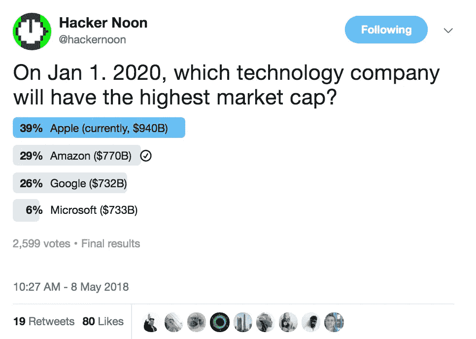

# 市值

> 原文：<https://medium.com/hackernoon/market-cap-schmarket-cap-dadb07f8c56e>

# 嗨，黑客，

有时候你只需要说去你的日常职责，然后做一些简单的事情。这个星期自己打了那会儿，又造了 [**ami 民调**](https://goo.gl/Gx2ugs) 。目前，这是我们最受欢迎的 Twitter 投票，请您通过我们的分销网络贡献您的投票想法。我们得到了大量投票者的支持，比如“哪个社交媒体网站导致了最大的负外部性？”以及“区块链技术最会颠覆哪个行业？”我们可以利用这些民意调查做很多事情。您的想法可以驱动我们发布的内容。在 AMIpolls.com**的[T5 介入。](https://goo.gl/Gx2ugs)**

# 本周的十二大科技故事:

[**如何组织你的组织从混乱中获利**](https://hackernoon.com/how-to-structure-your-organization-to-profit-from-chaos-daea5fcdab36) 作者:[穆罕默德·阿里·瓦基尔](https://medium.com/u/56b34c78990a?source=post_page-----dadb07f8c56e--------------------------------)

[**网状网络如何让物联网成为现实**](https://hackernoon.com/how-mesh-networking-will-make-iot-real-b5b88baab63b) 作者 [Jeffrey Lee](https://medium.com/u/b8d80c94fbce?source=post_page-----dadb07f8c56e--------------------------------)

[**框架还是语言？滚出我的草坪！**](https://hackernoon.com/framework-or-language-get-off-my-lawn-9935e1c72019) 作者[亚当·扎克里·乏色曼](https://medium.com/u/6ca2e74d71f5?source=post_page-----dadb07f8c56e--------------------------------)

[**无需来办公室:由**](https://hackernoon.com/no-need-to-come-to-the-office-making-remote-work-at-gitlab-737c42865210)**[juriaan Kamer](https://medium.com/u/c1320aa91c08?source=post_page-----dadb07f8c56e--------------------------------)进行远程工作**

[**人气分析**](https://hackernoon.com/sentiment-analysis-in-cryptocurrency-9abb40005d15) 由[布雷克厄](https://medium.com/u/e563f869a32?source=post_page-----dadb07f8c56e--------------------------------)

[**区块链 Twitter 与约翰·迈克菲**](https://hackernoon.com/worlds-first-blockchain-twitter-chat-is-launching-with-john-mcafee-9b9bf3f83e14) 聊天由[阿黛尔·德·迈耶](https://medium.com/u/574f1c81b9d7?source=post_page-----dadb07f8c56e--------------------------------)主持

[**⚛反动国家博物馆**](https://hackernoon.com/the-react-state-museum-a278c726315) 由[甘特·拉博德](https://medium.com/u/6ca0fe37eac1?source=post_page-----dadb07f8c56e--------------------------------)制作。

[**质数使用 Python**](https://hackernoon.com/prime-numbers-using-python-824ff4b3ea19) 由[迈克尔·葛朗台](https://medium.com/u/c07aac64b6e1?source=post_page-----dadb07f8c56e--------------------------------)

[**如何设置五分钟内 Algo 交易的比特币历史价格数据**](https://hackernoon.com/how-to-setup-bitcoin-historical-price-data-for-algo-trading-in-five-minutes-485cd5a0b3ed) 由[羊驼](https://medium.com/u/648225f0e33d?source=post_page-----dadb07f8c56e--------------------------------)

脸书在看我的“加密”WhatsApp 对话吗？ 由[演变成](https://medium.com/u/536476373c93?source=post_page-----dadb07f8c56e--------------------------------)

[**超越**](https://hackernoon.com/beyond-outcomes-over-outputs-6b2677044214) 约翰·卡特勒

[**种子资金募集—条款清单问题第 3 部分—旁注**](https://hackernoon.com/seed-fundraising-term-sheet-problems-part-3-side-letters-695333d8f92b) by [灰锈](https://medium.com/u/582c1c98356d?source=post_page-----dadb07f8c56e--------------------------------)

直到下一次，不要把世界的现实想当然。还是继续为另一个人的科技梦想而努力——我有什么资格去评判呢？

亲切的问候，

[大卫·斯穆克](http://www.davidsmooke.net/)，[阿米](https://medium.com/u/1fedc8fffada?source=post_page-----dadb07f8c56e--------------------------------) :-)