# 市场周期没有穿衣服

> 原文：<https://medium.com/hackernoon/marketcycle-4e5407d0c68>

## 加密货币最重要模式的心理社会领域指南

12 个月前，在做了 7 年外汇交易员后，我一头扎进了一个秘密的教育兔子洞。

这是一个陡峭的学习曲线。许多市场动态都在争夺相关性和关注度。

接下来是**在 12 个月的紧张学习中，我学到的最重要的一件事**。

对于投资者和交易者来说，理解一个市场动态是最重要的。

这是一种模式——一种简单而深刻的模式，多年来一直隐藏在众目睽睽之下。

# 非理性繁荣的面孔

理解这种模式从这张**金融泡沫生命周期图开始。**

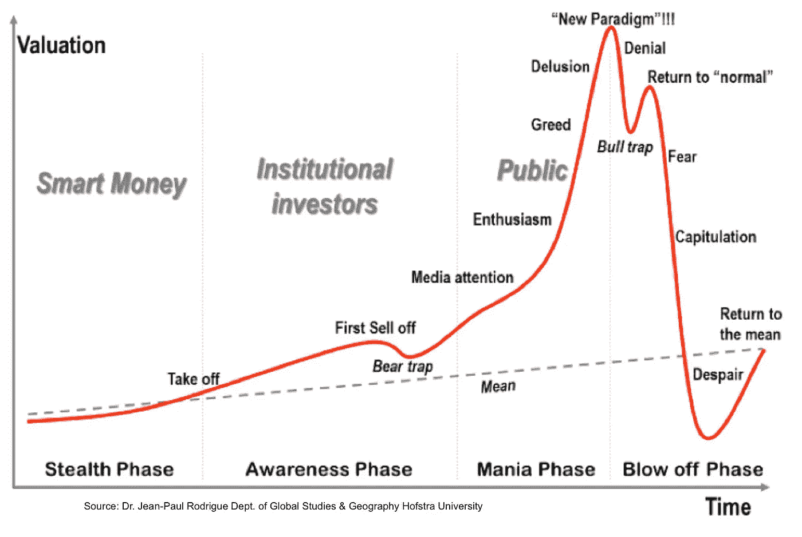

**红线的路径并不抽象**——覆盖上个世纪几乎所有著名泡沫的图表，它将完全符合等高线。

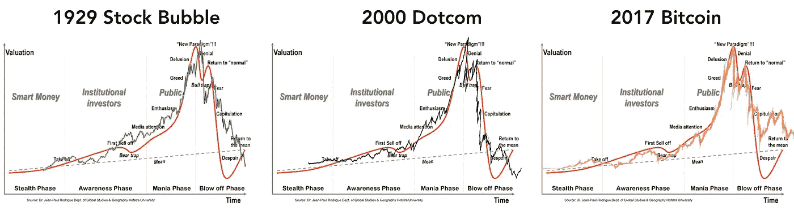

这是因为潜在的模式直接反映了全球市场心理——大众金融意识的无形之手，在尽可能大的范围内。

该图在投机泡沫时期对投资者很有用。但是在加密中，它有着更深层次的含义。

# 加密货币的金融简史

对投资者和交易者来说，比特币的历史就是四次牛市的历史。(还有四次撞车)。

所有四轮牛市都是 21 世纪所有资产类别中最引人注目的牛市。(按增长百分比)。

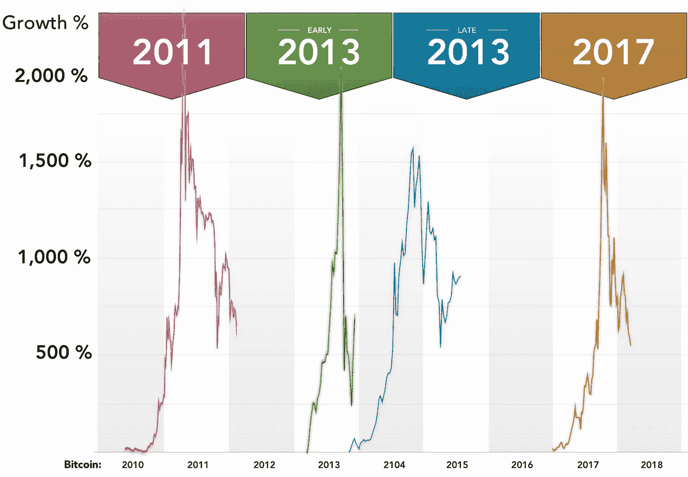

这里有一点背景，所以你有东西可以比较。

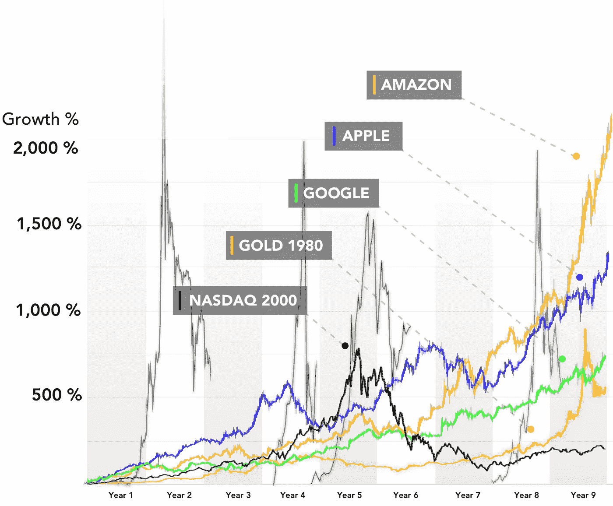

尽管所有四个泡沫的价格增长百分比基本相似，但牛市覆盖的价格范围却大不相同。

每一轮连续的牛市都比前一轮走得更远。

每一次崩盘后的低点都比前一次低点高*。*

(高很多)。

连续的更高低点是上升趋势的定义。

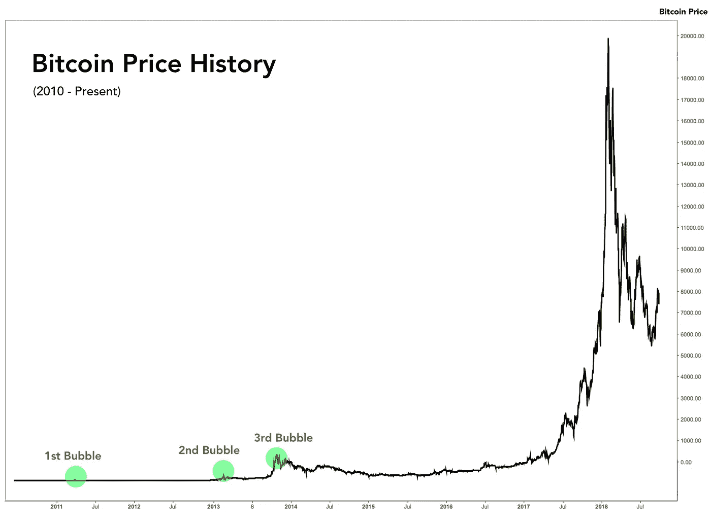

它看起来不像是一个上升趋势——它看起来很平稳，直到 2017 年。

这是因为最近一次泡沫的规模如此极端，以至于你几乎看不到前三次。

但之前的每次泡沫也是如此。

每一个都比前一个走得更远。

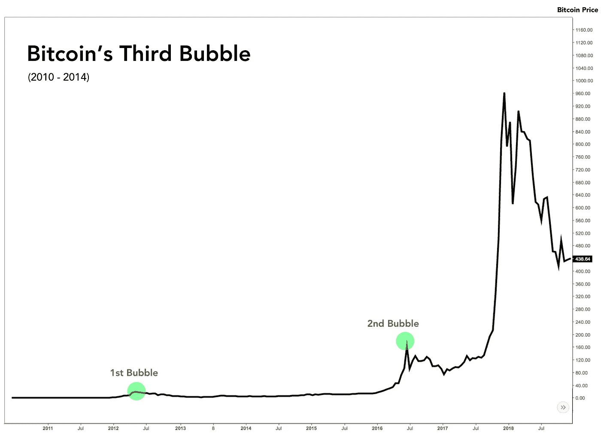

# **特殊设置有助于我们看清图案**

将我们的图表转换到*对数标度*可以使早期(指数较小)的价格趋势与近期(指数较大)的价格趋势相等。

我们能够更清楚地发现价格运动的循环和分形模式，与规模无关。

现在我们可以看到了——四个比特币泡沫按比例归一化。

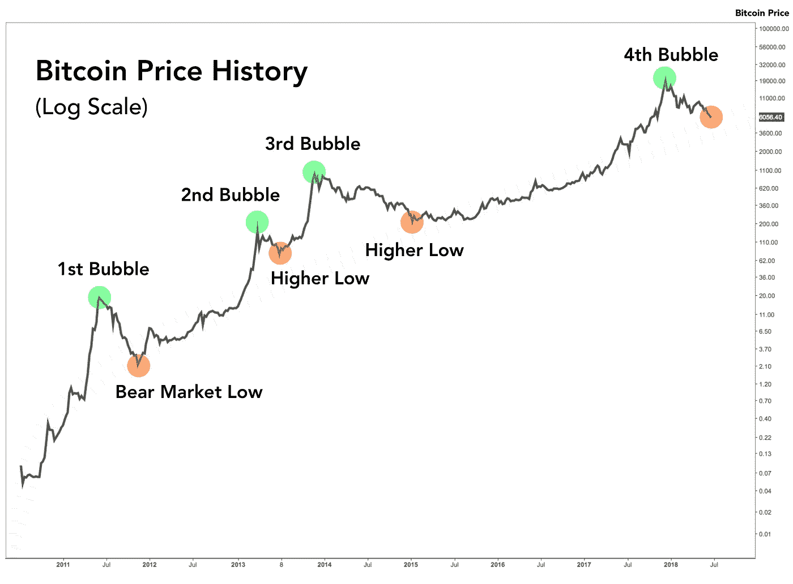

自从 2010 年比特币诞生以来，我们已经看到了一系列熟悉的重复事件。

以下是**比特币的四次牛市，**从数字上看:

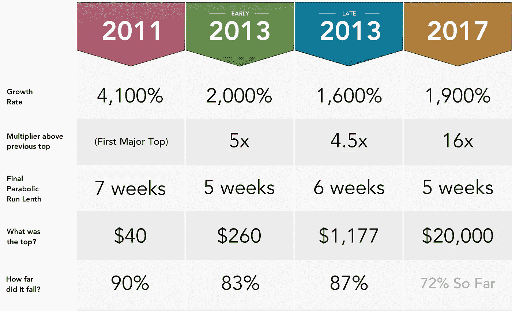

# 大局

模式很简单。如果有的话，有人可能会说这是所有比特币图表中最准确的:

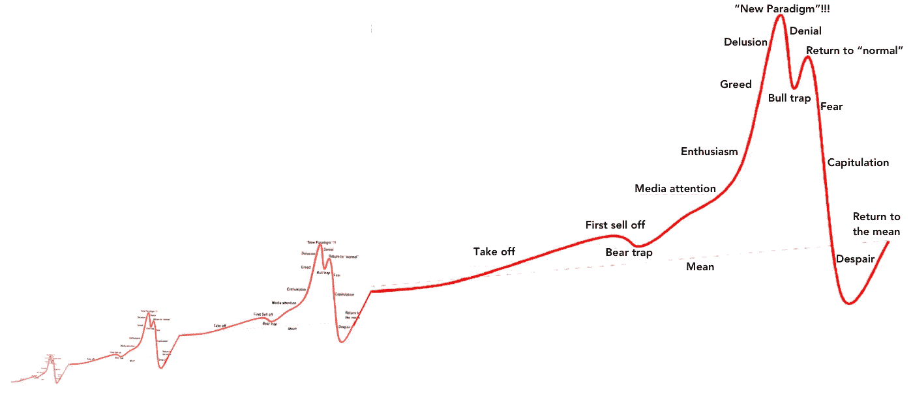

# 市场周期是一种模式

引导比特币前进的模式正是我们集体心理与贪婪和恐惧之间关系的镜像。

自 2010 年以来，**金融泡沫的生命周期**扮演了双重角色，即**比特币的市场周期**。这是我们资产类别的情感季节日历，也是加密货币市场的罗塞塔石碑。

# 打开循环包装

知道如何作为一个秘密投资者或交易者有效地操作是基于对自己在周期中的位置的认识。

目前(在撰写本文时)，我们正接近比特币第四个整体周期的尾声，接近熊市阶段的底部。(本文发表于 2018 年 8 月)。

但是确定自己在循环中的位置只是洋葱的第一层。

# 剥去这些层

每个周期都有明确的季节或阶段。

每个阶段都有自己独特的市场动态，并对市场参与者提出不同的情绪和心理挑战。

历史不会重演，但它确实会呼应和押韵——就像一堆俄罗斯玩偶上的面孔一样，一季的每一个实例都不可避免地与其更年轻、更年长的姐妹分享其 DNA。

了解每个季节的外部市场动态和内部流行的心理地形对于在这个市场中生存和成功至关重要。

# 比特币的市场周期

**(加密货币作为资产类别的市场周期)**

该循环可分为四个阶段:

# 第一阶段:积累

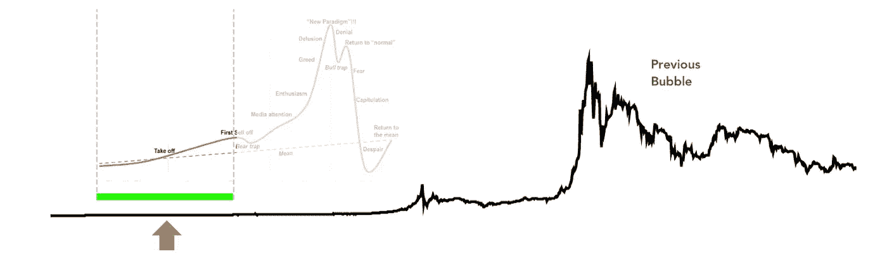

这个阶段持续好几个月。

**一切都低了。**低价、低量、低波动、低预期。

对于散户投资者和交易者来说，之前的崩盘是他们最先想到的。

**底部可能已经到来，**但散户投资者受到了创伤，害怕进一步亏损。

在上涨时卖出，在下跌时做空的机构投资者、巨鲸和精明的投资者在周期开始前开始回购。

**这是最有机会的时期**，讽刺的是(也不奇怪)这是金融媒体和公众最不关注的时期。

# 第二阶段:牛市

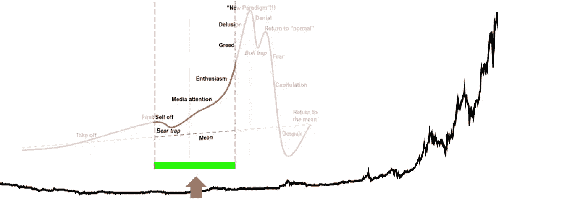

**广泛预期的监管基本面消息事件**充当催化剂，将价格推至熊市初期以来未见的水平。

社交媒体人气开始看涨。占主导地位的情绪是自信、兴奋和巨大的希望感。

价格递增然后回撤，周而复始。每个周期看起来像**前进 3 步，后退 1-2 步**，持续大约 3-6 周。

几个增长周期过去后，最终旧的历史高点被夺回。

**买了最后一顶**的人摆脱了负担，减轻了整个市场的抛售压力。

**价格发现的热情开始升温。**零售 FOMO 立足自身，**和财经媒体煽风点火。**

**在价格发现的第一个 100 天里，**比特币几乎是其历史最高水平的两倍。

没过多久，比特币**就爬出了对数通道。**

**比特币还在循环运动**，前进 3 步，后退 1-2 步。

# 第二阶段，第二部分:抛物线

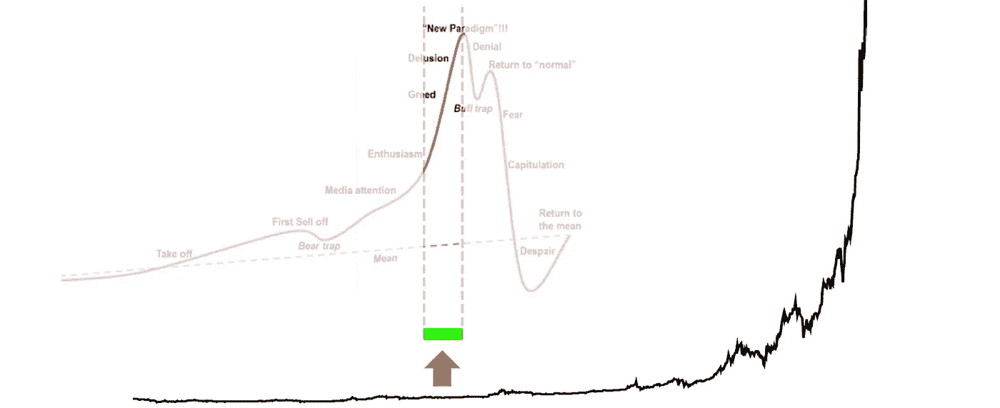

**没有通知，**前进 3 步，后退 2 步就放弃了。

**新常态**是前进三步，不退一步。

从现在开始，比特币的价格以抛物线速度增长。零售 FOMO 成为一种全球现象。

**嘻哈艺人**代言 ico， **K-pop 乐队**对山寨币滔滔不绝。

与加密相关的谷歌搜索量创下历史新高。

交易所被新账户注册淹没，暂时停止注册。Monero 的币安账户正在 craigslist 上出售。

**机构投资者和聪明的投资者**正在扩大规模，但仍然是期货衍生品市场的净多头。

**专家推测，我们已经到达了加密货币采用曲线的拐点**，价格可能再也不会下降。

在上次崩盘后沮丧地卖出的散户投资者，现在正随着价格接近顶部而重新买入。

这最后一波抛物线买入的时间框架惊人的一致。历史上，**所有四次都持续了 5-7 周**。(把那个放在你的后兜里)。

# 第三阶段:精明的投资者获利

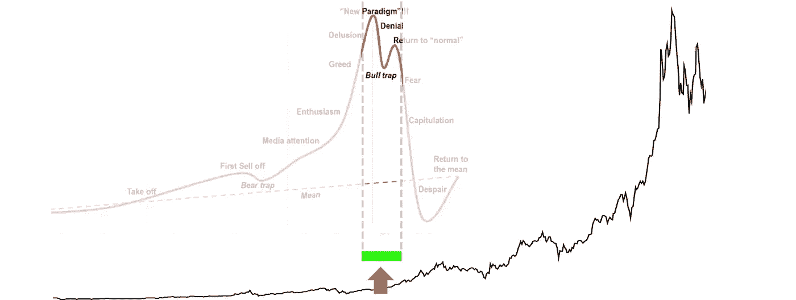

**抛物线趋势结束。**价格暴跌，约 25%。它试图夺回历史高点，但失败了。

大多数散户投资者认为这是一次健康的调整，所以没有卖出。

**从比特币中取出的利润被投入替代币。替代硬币市场进入指数抛物线牛市。**

鲸鱼和机构投资者已经平仓好几个星期了，现在正在净做空期货衍生品市场。

这段时间大约持续 6-8 周。

**任何人在这个时期卖出获利****都做得很好。**

****Cryptotwitter 看涨。****

****

# **第四阶段:熊市**

**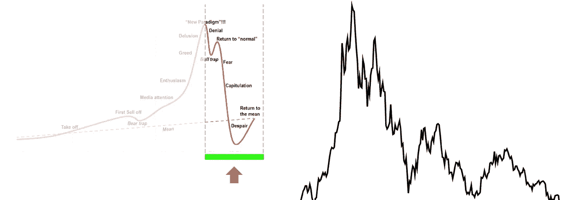**

**剧烈的下跌之后是数周的横盘行情。**

**没有经历过完整市场周期的散户投资者无法获利，因此被炒股。**

**任何在顶部买入的人现在都有在底部卖出的风险。**

**Cryptotwitter 为趋势线苦恼了几个月。**

**在社会舆论的法庭上，提供历史上准确价格预测的看跌分析师会被剔除。**

**随着每一个新低，**社交媒体影响者的合唱**坚持认为**价格刚刚触底，**只有傻瓜才不买蘸酱，alt 旺季即将来临。**

****看涨救济反弹** **遇到的是**鲸鱼做空期货市场、监管 FUD、机构市场大规模抛售、空头在支持转为阻力时退出、交易所黑客、ICO 丑闻、上个月的 FUD 被重新包装并重新发行为本月的 FUD，以及与 Mt. Gox 多少有些松散和不太可能相关的解释不清的流动性抛售。**

****最后一次下跌**突然发生，成交量很大，引发了止损和恐慌性抛售的冲击波。它在日线图上表现为一根长灯芯。**

**许多散户投资者刚刚卖出了底部。**

**技术分析师垂涎了几个月的价格在几个小时内就能得到。**

**这发生在你住的地方的半夜。没有下单买的人都睡到底。**

**([你可以在这里](https://twitter.com/ColeGarnerBTC/status/1031793465099579392)查看我的购买订单)。**

**最终，比特币触底，比历史高点低了大约 80%。**

**这使其回撤至**与之前所有比特币熊市大致相同的水平。****

****

# **投降的积累**

**我们的比特币市场周期之旅到此结束。**

**投降后，零售市场将处理震惊和敬畏。**

**接下来几周和几个月的低销量对精明的零售买家来说是一个机会，因为菲亚特还在观望。**

**熊市买入必须有策略——我推荐 [@TheCryptoFam](https://mobile.twitter.com/TheCryptoFam) 关于这个话题的精彩 tweetstorm。([在这里读吧。](https://mobile.twitter.com/TheCryptoFam/status/1010238766349537281))**

****

# **比特币的市场周期是加密货币投资者的北极星**

**知道如何作为一个秘密投资者有效地操作是基于对自己在周期中的位置的认识。**

**虽然意识到自己的位置并不能保证盈利。远非如此。**

**就像跟着北极星走不代表就能找到路。**

**但是，意识到这颗恒星的存在为世界之巅描绘了一个参照系，如果你在海上漂泊，这个参照系将决定你的生死。**

**这个比喻显然可以延伸到你在熊市中的投资组合。**

****

# **第五条抛物线**

**每当我们想到未来，重要的是要记住我们对未来唯一确定的事情*。***

**那就是:我们不知道会发生什么。**

**这迫使我们用概率来思考。**

**这让我想到一个假设的问题。**

**想象一个金融工具:从一开始，它就做了一件特定的事情，并且在八年内循环做了四次，规模不断扩大。**

**问题:在接下来的几年里，该资产未来最有可能出现的情况是什么？**

**你认为比特币会*停止*它已经连续做了四次的事情吗？**

**有可能。这是有可能的。我们必须承认这一点。**

**但这是最有可能的情况吗？**

****否**缺乏不良基本面，运动中的物体往往会保持运动状态。**

****比特币的基本面从未如此强劲:**纽约证券交易所宣布将提供加密货币托管服务和比特币期货合约；高盛宣布将开设一个机构加密交易柜台，并斥资 3 亿美元收购顶级加密货币交易所 Poloniex 日本、韩国、新加坡、瑞士和英国在加密友好型监管方面继续领先于本地区；万事达卡刚刚申请了一项加密货币部分储备系统的专利(会出什么问题？);美国证券交易委员会继续审议比特币交易所交易基金；闪电网络还在继续发展，已经让比特币在机构间的转移近乎即时。**

**最有可能的情况是市场周期第五次重演。**

**比特币和替代币开始了另一轮指数抛物线牛市。**

**(然后崩溃。)**

# ****所以现在就为自己定位****

**现在以及接下来的几个月里？尽你所能。而价格仍然很低。**

**为下一个周期做准备需要学习的两个最重要的技能:**

1.  ****风险管理。没有它就没有成功。****
2.  ****学习如何在抛物线上涨期间(和之后)获利**。成为这种神秘的、疯狂的相关技能的忠实学生。**

**(我不是理财顾问，这也不是理财建议。)**

****在推特上关注我:** [@ColeGarnerXBT](https://twitter.com/ColeGarnerXBT)**