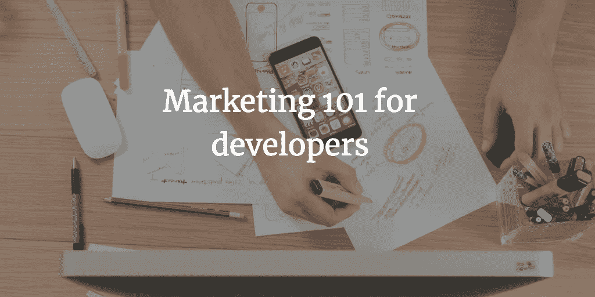
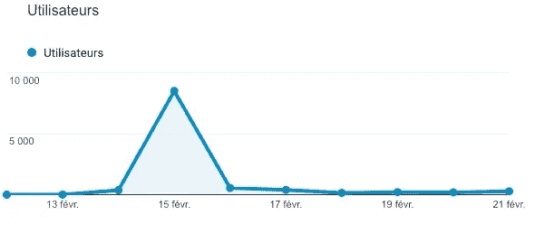
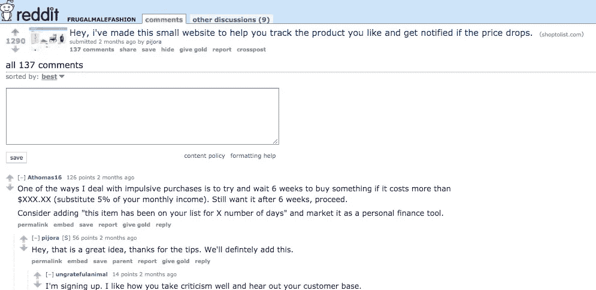
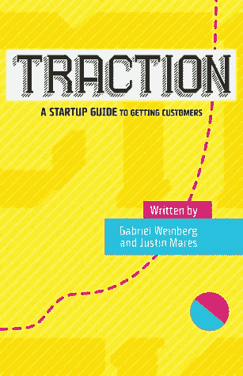

# 面向开发者的营销 101

> 原文：<https://medium.com/hackernoon/marketing-101-for-developers-c42a95a8f884>

我知道我知道，开发者讨厌[营销](https://hackernoon.com/tagged/marketing)。经过几个月的编码，你部署你的网站，你认为人们会来。嗯，那是不可能的。我的合作伙伴 [Pierre De Wulf](/@pierreda) 和我在 3 个月前推出了 [ShopToList](https://shoptolist.com) ，我们推出了一个壮观的 Reddit，在一周内获得了 1200 个用户，然后发生了这样的事情:

[*购物狂*](https://shoptolist.com) *是万能的愿望清单。它允许你跟踪你想买的产品，如果价格下降，你会收到通知。认为口袋，但购物。*

因此，在我们的一篇 reddit 帖子“病毒式”传播(1000+ upvotes，大量评论)两天后，流量接近于零。我们必须做点什么。我们阅读了所有关于营销的资料，并开始测试不同的策略。在这篇文章中，我将向你展示什么有效，什么无效。

我们根本不是营销专家，但我们使用这些技术成功地将我们的用户群增长了 300%。

为了了解更多的背景， [ShopToList](https://shoptolist.com) 对我们来说是一个附带项目，我们是 100%自举的，我们没有很多预算花在营销上。

## 了解你的目标

在做任何营销之前，首先要做的就是想好你的用户是谁。为了了解这一点，我们做了两件事。首先，我们向他们发送了一份谷歌表格，询问了不同的问题，以了解他们如何使用该产品。然后我们查看了现有的数据。意味着有多少产品用户添加到了购物清单上，什么样的产品，什么价格范围等。

有了 ShopToList，我们的目标用户是重度电商客户，愿意用最优惠的价格买东西。这意味着我们不会瞄准冲动型买家。有许多适合我们目标的利基社区:

*   优惠券猎人
*   交易
*   节俭的
*   解雇企业家(财务独立提前退休)
*   “大采购”:冰箱、笔记本电脑、显卡……

## 在线社区

我们做的第一件事是在特定的子网站上发布一条短信，比如:

*   时尚分栏
*   [Startup](https://hackernoon.com/tagged/startup)/Entrepreneur sub edit，征求反馈和 beta 测试人员
*   企业家论坛

Our best Reddit [post](https://www.reddit.com/r/frugalmalefashion/comments/7xlqbv/hey_ive_made_this_small_website_to_help_you_track/)

Reddit 为我们表现得非常好。皮埃尔和我是长期的 Redditors，所以我们知道平台非常好。我们知道我们必须小心，所以每次我们做自我推销时，我们都不会试图隐瞒。大多数情况下 mods 会批准这个消息，我们收集了很多用户，最重要的是反馈。

## 博客作者

我们在谷歌上搜索了一些我们感兴趣的不同领域的博客目录。然后我们给他们所有人(600 多人)发了一封电子邮件，告诉他们 ShopToList 对他们的观众来说有多么好。

我们给 600 位博主发了邮件，其中约有 20 位回复了邮件，要求支付一点费用(50-150 美元)来写一篇关于 ShopToList 的评论。我们同意他们中的两个；我们认为他们的流量非常好，有一些反向链接对搜索引擎优化很有用。

不幸的是，结果很糟糕，我们只从这些文章中获得了几次点击。

## 脸书集团

我们在许多[脸书](https://hackernoon.com/tagged/facebook)群组(比如 50+群组)中发布了到 ShopToList 的链接，并获得了一点流量，可能我们总流量的 1%来自脸书群组。

这个过程花了我们很多时间。因为我们必须寻找“好的”脸书群体，也就是说，在我们的目标社区中的群体，没有反对自我推销的规则，并且有一个积极参与的社区。

许多脸书群组已经变成了某种“链接垃圾箱”,在那里人们忽略了一切，因为每天都有 50 多个垃圾链接被张贴出来。所以结果还是很糟糕。

## Quora

我们在 Quora 上寻找关于不同主题的未回答/不完整的问题，其中 ShopToList 非常适合:

*   如何在网上省钱？
*   有哪些替代**竞争对手名称* *的好方法？
*   我在哪里可以找到**某些产品**的最佳在线销售？

Quora 的表现比在脸书群组上发帖要好，因为我们成功地从这些回答中获得了“重复出现”的流量。

一些 Quora 问题在谷歌上排名很高，如果你获得足够多的赞成票成为第一个答案，这可能是一个巨大的获取渠道。当然，关键是要提供优质的答案，不要只扔一些你产品的链接，而是要解释为什么它完美契合了用户的要求。

## Youtubers

我们寻找 Youtube 频道，可以在他们的一个视频中谈论 ShopToList，意思是购物 Youtube，节俭/消防频道。我们不想瞄准“大”YouTube，因为我们知道他们背后往往有一个代理人/机构来管理他们的合作关系，所以我们联系了 40 个 YouTube，从 1 万到 10 万订户，我们只得到一个代理人的回应，他愿意知道我们可以为合作关系支付多少钱。

我们对 Youtubers 和博客有点天真，我们认为我们可以让他们尝试我们的网站，免费谈论我们，但不幸的是，他们收到了太多的请求，所以基本上每个人都要求金钱和付费合作伙伴关系。

## 付费广告

我们尝试在 Adwords、脸书和 Reddit 上做一些广告。总而言之，我们根本不是广告专家，这是一个很大的话题，可以说很多，比如 A/B 测试广告、定位/重新定位等，我们并没有做到所有这些，但问题是，我们很快意识到付费流量并不适合“免费”的 B2C 网站。

我们的收入如此之少(~100 美元/月)，我们还没有任何关于用户留存的可靠数据(我们上线才三个月)，因此我们无法从付费流量中计算出任何 ROI。所以为一次点击花费 0.3-1 美元对我们来说太贵了。

# 我们要尝试的另一件事

## 参考

从一开始，我们就想在 ShopToList 中添加一个推荐机制。然后我们看看其他人是怎么做的。在大多数付费 B2C 产品或 SAAS 中，双方都可以获得产品折扣，比如一个月的免费，或者某种免费的服务积分。因此，现有用户有动力分享他们的推荐代码，他们的朋友也有动力接受邀请并创建一个账户。

但是在我们的案例中，我们问自己，既然我们的产品可以免费使用，我们如何才能创造一个共享注册链接的激励机制。我们查看了一些免费的 B2C 服务，如果你不通过推荐链接邀请朋友，有些人会限制这些服务的功能。

因此，也许我们可以限制我们允许人们在 [ShopToList](https://shoptolist.com) 上跟踪的产品，并要求用户分享他们的推荐链接，以获得无限制的产品跟踪。但这意味着我们会“惩罚”我们最活跃的用户，这就是为什么我们没有那样做。我们真的不知道我们将如何做到这一点，但无论如何，我们认为我们真的需要一个推荐机制。

# 这本书给了我们两个宝贵的教训

Buy it on [Amazon](https://www.amazon.com/Traction-Startup-Achieve-Explosive-Customer/dp/1591848369) (non affiliate link)

在我们读过的所有书中，最有用的无疑是 Gabriel Weinberg (DuckDuckGo 创始人兼首席执行官)的《Traction》。我强烈推荐你阅读它，因为我们从它中学到了许多宝贵的经验。我们将在下一篇博文中进一步讨论这个问题，但你现在可以从这本书里学到两件事:

## 找到你的关键路径

就用户数量而言，找到你的现状和目标之间的关键路径。你的关键路径是关于允许你达到你的牵引目标的特征的最短路径。这意味着，如果你的短期目标是拥有 20 000 名用户，你必须事先决定什么应该集成到你的产品中，以达到这个目标。你觉得你需要一个手机 app 吗？你觉得你需要这个社交功能吗？你认为你需要改进设计吗？这些问题的答案构成了关键路径。当你的[初创企业](https://hackernoon.com/tagged/startup)处于早期阶段时，你的资源非常有限，这就是为什么选择做什么，更重要的是选择不做什么非常重要，这是关键路径的唯一目的。

## 坚持下去

一旦你找到了一个有效的渠道，坚持下去，并发挥创造力。当开始你的牵引策略时，尝试很多东西是非常诱人的，因为有很多东西可以尝试:社交广告、谷歌广告、博客广告、内容营销、联盟计划、贸易展、线下活动…

你可能想和野兔一起跑，和猎狗一起猎，这是个坏主意，如果你找到一只好猎狗，就坚持下去。一旦一个策略成功了，哪怕是一点点，试着去改进它，利用它直到筋疲力尽，然后才转换频道。并不是说不能同时使用多个渠道，只是在排除之前尽量优化你使用的那个。

基本上，如果你发现定位博客对你有用，在使用这个渠道之前，试着调整你的目标博客或你发布的内容或行动号召。这听起来可能很明显，但是以 ShopToList (link)为例，我们忽略了这个调整过程，在其他渠道上浪费了一些时间和金钱。通过优化当前流程，我们取得了更好的结果。

我希望你喜欢这篇文章，我们经常写我们在创业世界的旅程。你可以看看我们最后的帖子(30k 读者！) :

 [## 我们如何在一个月内推出我们的第一个 MVP

### 不到一周就有 1200 名用户

hackernoon.com](https://hackernoon.com/how-we-launched-our-first-mvp-in-one-month-6239aca8e63e) 

> 感谢阅读，如果你喜欢这篇文章，请随时点击👏按钮帮助其他人找到它，并关注我:)