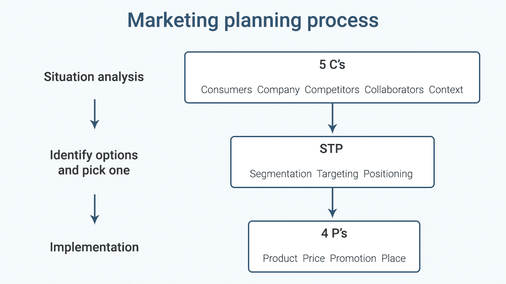

# 工程师营销

> 原文：<https://medium.com/hackernoon/marketing-for-engineers-8228821a0ea8>

营销是“旨在满足买卖双方需求的商品和服务的交换”这是商学院的说法，市场营销的责任是了解客户的需求，并确保你的团队能听到他们的声音。

我们将概述营销规划过程和营销的基本语言，以帮助您更好地理解营销在产品开发过程中的作用。

## 营销规划流程

营销人员通常采用以下三管齐下的决策方法:

1.  **情况分析**:了解你的景观。
2.  **确定你的选择并选出一个**:决定谁是你的客户。
3.  **执行**:执行你的计划。

## 营销的基本语言

你可能会听到营销人员提到 5 C、STP 和 4 P:

1.  **5 摄氏度:**

*   你的消费者或用户是谁，他们需要什么？
*   贵公司有哪些可用资源？
*   你的竞争对手是谁？
*   谁是你的合作者，或者说谁必须赢你才能赢？
*   背景是什么，或者你的用户准备好接受这种产品了吗？

2. **STP:**

*   你将如何选择你的目标市场？
*   你将如何向他们定位你的产品？

3. **4 个 P 的**:

*   你将向目标市场提供什么样的实际产品、价格、促销和位置？

这三个概念是市场营销的基础，按照这种特定的顺序来完成营销规划过程可以帮助你开发出更好的产品。

## 寻找产品/市场契合度

除了了解客户的声音，营销还将帮助你的团队向你的目标客户群宣传你的产品的好处。他们可能会通过博客或内容营销讲述故事，并通过广告或媒体宣传提高知名度。

一些以产品为中心的团队首先决定他们想要构建什么样的产品或功能，然后请求营销部门帮助他们销售。他们的方法可能是把产品放在第一位，甚至在决定产品面向谁之前。但是在以客户为中心的团队中，你首先应该考虑的是用户的需求以及如何解决这些需求。

更好的技术不一定意味着更好的产品。在你确定了你要解决的关键问题以及如何锁定需要你的解决方案的用户后，你就可以围绕这些需求来优化设计你的产品和功能。换句话说，找到产品/市场契合度的更有效方法是制造你能卖的东西，而不是卖你能制造的东西。

PullRequest 是一个为各种规模的团队构建的代码评审平台。我们拥有世界上最大的按需审查员网络，由一流的自动化工具提供支持。因为代码质量很重要。[了解有关 PullRequest 的更多信息](https://www.pullrequest.com/?utm_source=medium.com&utm_medium=referral)

*原载于 2018 年 8 月 30 日*[*【www.pullrequest.com*](https://www.pullrequest.com/blog/marketing-for-engineers/?utm_source=medium.com&utm_medium=referral)*。*