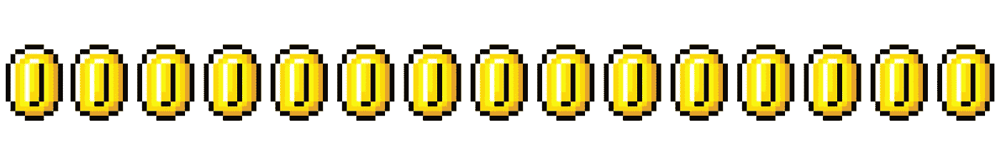
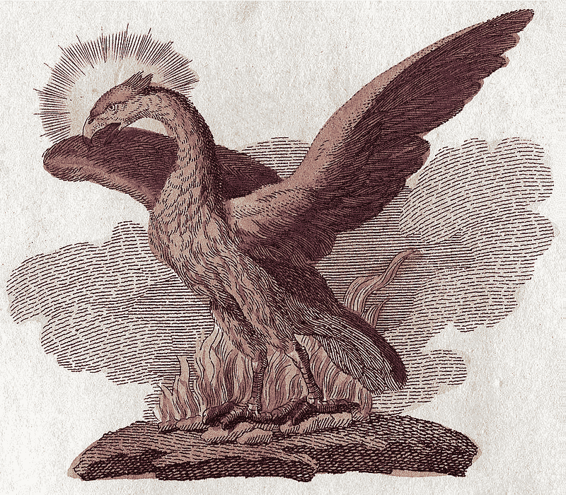
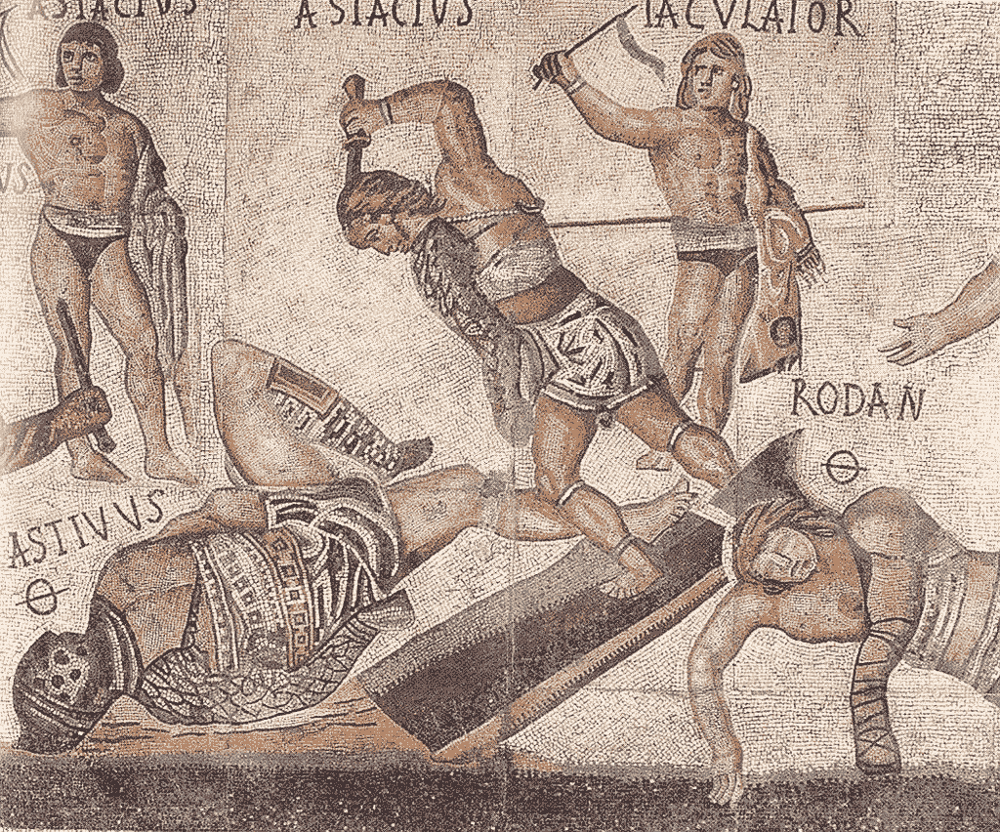
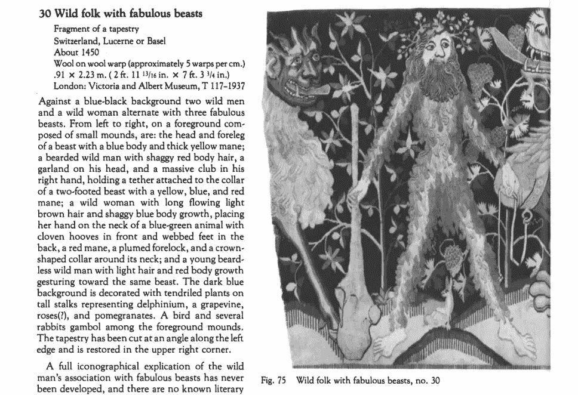

# 秘密营销:当品牌？

> 原文：<https://medium.com/hackernoon/marketing-in-crypto-when-brand-54317f0eb6a2>

*目前，我正全力以赴地为我正在从事的一个加密货币项目进行品牌重塑。尽管总体想法很棒，但我的第二个直接想法是“这个项目需要重塑品牌才能长期生存”。后来我想到，除了新硬币爆炸的数量之外，还应该重新定位。* *这个故事开始于一年前。让我们来谈谈可以帮助一个人扎根于市场的基本因素。那么，为什么在 crypto 中拥有一个品牌很重要呢？*

市场运行良好。似乎我们都要去月球。我开始关注竞争。当然，我去了 [Coinmarketcap](https://coinmarketcap.com) ，卷起袖子，从最上面的数字 2 开始。嗯，并不是说 1 号明显不是竞争对手(*用一个比特币最大化者的声音说，lol* )，而是有点太高的野心，也许是一个不必要的野心。

在回顾了前 500 个职位后，我可以区分出大约 25 个项目，这些项目解释了他们是谁，他们为什么存在，他们做什么以及如何做。我甚至没有质疑经济可行性，只是质疑关键战略信息的可用性。那 5%的市场是老鼠的眼泪。很糟糕吗？好吃吗？肯定是好的。希望市场将进行几次清理周期，以实现玩家之间的一些明确性，加密货币的数量将大幅减少。

以下是根据自己的经验和纯粹的意图提出的一些建议，让人们更容易得到美好的东西。**我们将把定位和身份作为核心传播渠道。**

# 明确你的定位

**简单来说，任何人都应该能够察觉出你是什么物种。如果我们不能用一种普通人都能理解的语言来说话，那么大规模的采用还很遥远。但首先，给自己一个答案——你是做什么的，为什么？“你为什么需要区块链？”这个问题很容易打动人看着他们在迷宫般的解释中枯萎。如果你找不到一个关于为什么和什么的论点，那就不要管它。**冻它，碎它，烧它，杀它。没人说容易。如果你有这个答案，你就是赢家(*笑话*)！

下一步是用 1-2 句话概括你的答案。这将是你的定位，应该转化为一个综合的句子，最好越短越好。这将是你的关键信息，是上帝思想的精髓，也是唯一应该留在受害者记忆中的东西。

在不确定的市场中，最有可能的角色是成为一个替代硬币(*有时会自动变成标记为*的 shitcoin)，为自己找到一个更大的存在理由(*我的意思是，为你的加密货币项目，但不要忘记照顾好自己*)。

**提示:**如果你感到失落，就从沟通策略开始。我并不是想打乱战略制定的传统流程(*商业、营销、沟通、数字，然后是社交媒体……*)，但这份文件是关于你要说什么的基本指南。市场、竞争、受众、趋势和问题分析将是你的分析基础。收集见解。看看你适合哪里。为最终用户提出价值主张。找到合适的词语来表达。

**告诫:**不要忽悠人。如果你不适合市场，需要借助酷词来掩盖它，首先升级你最初的产品想法。

# 身份的力量

所有的美丽都以身份的形式出现！嗯，我们知道交流不仅是口头的，也是视觉的(*并且可以通过任何其他可能的信息交换媒介进行传播*)。

令我惊讶的是，对许多人来说，身份和品牌是一回事。这就不对了。没有身份，实际上，你无法进行品牌化。但主要的困惑来自另一个词——品牌重塑，这是一种营销策略，其中创造了一个新的品牌身份。**身份是品牌重塑的一部分，描述了品牌的精神和功能关联。通过创造更多的情感联系来包装你的资产就是品牌。**我喜欢比较词语的辅音“*同一性*”和“*实体*”，因为这真的很像创造一个:赋予一个名称和声音、形状、颜色、特定的图案和专用的视觉联想。

填写一份身份简介曾经花了我大约 5 个小时。基本上，它是一个很好的精炼和检测差距的工具。在你向听众传达了重要信息后，试着明确定义以下几点(但不限于):

*   你对用户的品牌优势是什么？找到最多 3-5 个。
*   你的品牌与竞争对手的区别到底在哪里？3–5 个特征。如果可能的话，请指出要点。
*   你的品牌价值观是什么？找到最多 3-5 个。
*   哪些词构成了你的品牌标签云？听起来你想看别人的眼睛吗？

提示:符号学是一门科学。力求科学的方法。您最好了解一般的身份创建过程，但是让专业人员来做这项工作。保持自律，独立于你内心的炒作。不是你喜欢最终的结果，而是终端用户的感知。方便与焦点小组核对。

**警告:**时刻检查符号学和意义之外隐藏的东西，避免误解。

> 为什么这很重要？看一下系绳。从表面上看，这是某种…不清楚的东西。你有没有尝试过破译泰瑟的身份？下面跟我玩的开心。

# 系绳示例

我从来没有关注过[系绳](https://tether.to)的存在，可能是因为我从来没有交易过任何 USDT 美元对。前几天，当我走进兔子洞查看$BTC 的图表时，有了一个意外的发现。也许，对你来说，不包括衍生品，87%的 BTC 美元对 USDT 美元的交易不是新闻。嗯，我给自己做了一个服务，在 Twitter 上阅读更多关于 Tether 的信息，以估计人们对它的总体情绪。我也谷歌了一下，发现以前它被命名为 Realcoin。

**摆脱“硬币”尾巴的荣誉！**但是 Tether 网站和媒体没有报道任何关于这个重大事件的消息。那是怎么回事，为什么要系绳？

## 系绳-θ-T

一开始，似乎系绳的 T 和θ完全没有联系。但似乎 Theta(希腊字母)是从 Teth(腓尼基字母)衍生而来，与品牌名称一致。

> **Theta** ( [英国](https://en.wikipedia.org/wiki/British_English) : [/ˈθiːtə/](https://en.wikipedia.org/wiki/Help:IPA/English) ，[美国](https://en.wikipedia.org/wiki/American_English):[/ˈθeɪtə/](https://en.wikipedia.org/wiki/Help:IPA/English)；大写**θ**或**θ**，小写 **θ** (类似数字 [**0**](https://en.wikipedia.org/wiki/0_(number)) )或**ϑ**；[古希腊](https://en.wikipedia.org/wiki/Ancient_Greek_language):[θῆτα](https://en.wiktionary.org/wiki/%CE%B8%E1%BF%86%CF%84%CE%B1)*thē̂ta*[【tʰɛ̂ːta】](https://en.wikipedia.org/wiki/Help:IPA/Greek)；[现代](https://en.wikipedia.org/wiki/Modern_Greek):[θήτα](https://en.wiktionary.org/wiki/%CE%B8%CE%AE%CF%84%CE%B1)t34】thˇtat36【ˇθita】是[希腊字母](https://en.wikipedia.org/wiki/Greek_alphabet)的第八个字母，来源于[腓尼基字母](https://en.wikipedia.org/wiki/Phoenician_alphabet) [Teth](https://en.wikipedia.org/wiki/Teth) 。在希腊数字系统中，它的值是 9。

## 凤凰轨迹

腓尼基字母是世界上已知的最古老的字母。奇怪的是，所谓的上流社会倾向于像凤凰鸟这样的邪教。还记得罗斯柴尔德所拥有的杂志封面上以硬币形式出现的世界主导货币挂在凤凰的脖子上，周围是燃烧的法币吗？

A phoenix depicted in a book of legendary creatures by [FJ Bertuch](https://en.wikipedia.org/wiki/Friedrich_Justin_Bertuch) (1747–1822), Wikipedia

凤凰鸟被广泛地与腓尼基文明联系在一起，因为它为上流社会提供昂贵的紫色染料而闻名。

> 在古希腊和古罗马，凤凰这种鸟有时与发音相似的腓尼基人联系在一起，这是一个以从海螺壳中提取紫色染料而闻名的文明。因为来自腓尼基的昂贵的紫色染料在古代与上层阶级联系在一起，后来又与皇室联系在一起，所以在中世纪时期，凤凰被认为是“皇家鸟类”。

我得说，这是一个有趣的巧合的开始。

## θ和死亡？

Theta 不是你典型的友好信件。在古代，它与死亡联系在一起，用来纪念死去的人。

A *retiarius* attacks his downed opponent, a *secutor*, with a dagger in this scene from a mosaic from the Villa Borghese, Wikipedia

> 在古代， [Tau](https://en.wikipedia.org/wiki/Tau) 被用作[生命](https://en.wikipedia.org/wiki/Life)或[复活](https://en.wikipedia.org/wiki/Resurrection)的象征，而希腊字母表的第八个字母 theta 被认为是[死亡](https://en.wikipedia.org/wiki/Death)的象征。

## 动物用的绳子

让我们继续前进。在这绝望的深渊中应该有一些积极的东西。这个词本身是怎么回事？有什么好的意思吗？维基再次拒绝了。

> 1.一根[绳](https://en.wiktionary.org/wiki/rope)、[缆](https://en.wiktionary.org/wiki/cable)等。该[将](https://en.wiktionary.org/wiki/hold)某物保持在[位置](https://en.wiktionary.org/wiki/place)同时允许[的一些移动](https://en.wiktionary.org/wiki/movement)。
> 
> 2.(*推而广之*)极限[能力](https://en.wiktionary.org/wiki/limit)[资源](https://en.wiktionary.org/wiki/abilities)、[资源](https://en.wiktionary.org/wiki/resources)等。

我们绝对不喜欢限制自己的能力。但是让我们来看看更荒谬的发现。“tethera”是“tethera”的派生词，意思是数字 13，用于数羊。

> (博罗代数羊)[燕](https://en.wiktionary.org/wiki/yan#English)、[泰恩](https://en.wiktionary.org/wiki/tyan#English)、**特瑟拉**、[梅特拉](https://en.wiktionary.org/wiki/methera#English)、[皮条客](https://en.wiktionary.org/wiki/pimp#English)、[塞瑟拉](https://en.wiktionary.org/wiki/sethera#English)、[勒瑟拉](https://en.wiktionary.org/wiki/lethera#English)、[霍瓦拉](https://en.wiktionary.org/wiki/hovera#English)、[多维拉](https://en.wiktionary.org/wiki/dovera#English)、[迪克](https://en.wiktionary.org/wiki/dick#English)、[燕-阿-迪克](https://en.wiktionary.org/wiki/yan-a-dick#English)、[泰恩-安](https://en.wiktionary.org/wiki/tyan-a-dick#English)

此外，如果你有可怕的野兽，有系绳总是好的。虽然不知道谁束缚了谁。

The Wild Man: Medieval Myth and Symbolism, By Timothy Husband, Metropolitan Museum of Art

## 标签云

我还没说完。θ符号用在哪里？根据维基的说法:

*   **几何学中的平面角，2D。**嗯，都是关于我们的大脑和看东西的机制。例如，宇航员在宇宙飞船上看不到三维空间。对他们来说，无限的天空似乎是有限的，因为它没有地平线可供大脑粘贴和投影图片(*见夏尔·戴维斯的沉浸式虚拟艺术和劳里·麦克罗伯特的《空间性的本质》*)。
*   **经济模型中银行的准备金率。**“准备金率是存款机构必须持有，而不是借出或投资的可储备负债部分。这是由该国的中央银行决定的要求，在美国是美联储”(*见*[*Investopedia*](https://www.investopedia.com/terms/r/reserveratio.asp#ixzz5OtrE4C2U))。
*   **代表衍生价格价值敏感度的数量。**关于时间的流逝，“时间的衰变”(*见* [*维基*](https://en.wikipedia.org/wiki/Greeks_(finance)) )。

足以形成一个特定的品牌标签云，包括死亡、绳子、绵羊、极限、银行、衍生品等词……为什么以及如何选择一个我们不喜欢的带有负面联想的身份？

回到身份，整个故事再次证实，人们应该经常检查在符号和意义背后是否有什么东西。

*注意:我并不认为这是有意指定的真实含义，只是因为我不在 Tether 总部工作，但是您可以就处理品牌时的谨慎和准确性做出自己的结论。*

**感谢阅读！**另外感谢 [@SwoleOffCrypto](https://twitter.com/SwoleOffCrypto) 、 [@seweso](https://twitter.com/seweso) 和 [@drwasho](https://twitter.com/drwasho) 对结束语话题的支持。如果你想打招呼或讨论这篇文章，请随时在 [Twitter](https://twitter.com/cryptokatia) 或 [LinkedIn](https://www.linkedin.com/in/cryptokatia/) 上留下评论或 ping 我。干杯！

