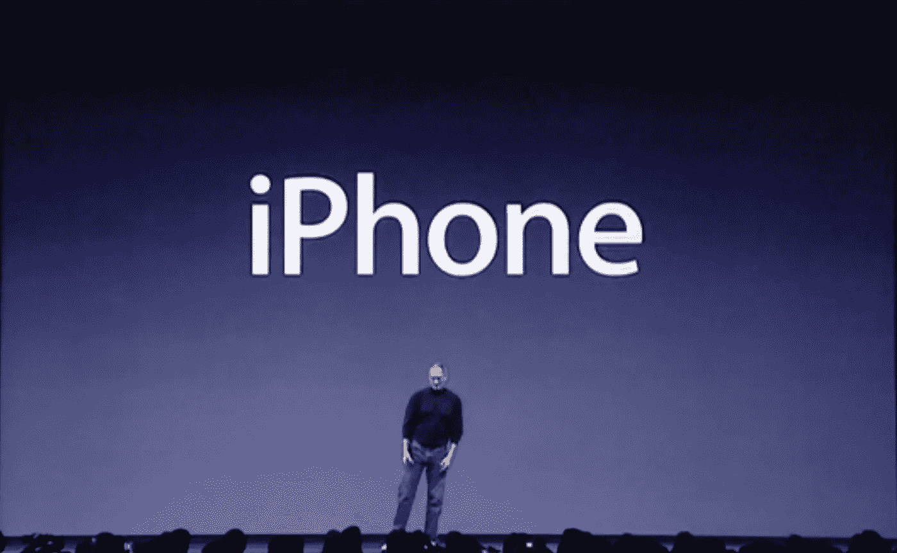
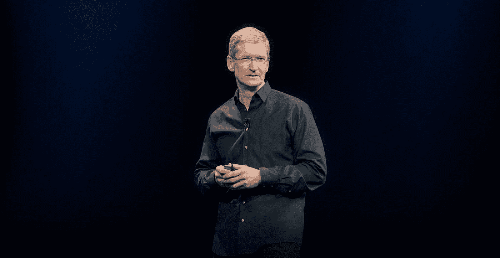
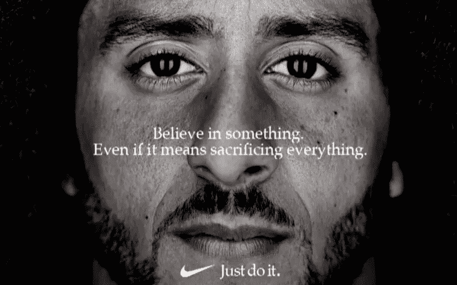

# 史蒂夫·乔布斯给创业公司和苹果公司上的营销课

> 原文：<https://medium.com/hackernoon/marketing-lessons-for-startups-and-apple-from-steve-jobs-2eb5fa833486>

Steve Jobs introduces the iPhone (2007)

每年，我都会观看苹果最新 iPhone 发布会的主题演讲，观看 iPhone XS 系列发布会的最新主题演讲。

毕竟，最初发布 iPhone 的主题演讲实际上已经改变了世界。我们还没有完成，世界(和宇宙)还有很多要改变。

然而，自史蒂夫·乔布斯去世以来，观看主题演讲有时会很有挑战性，因为人们的期望总是如此之高，加上科技媒体对即将宣布的内容的预测越来越准确。

Under CEO Tim Cook, Apple is a trillion dollar company

值得称赞的是，蒂姆·库克作为首席执行官接过了史蒂夫·乔布斯的接力棒，并继续为公司的成功开辟道路，这体现在数万亿美元的价值、数十亿台设备和使用苹果产品的人以他们自己的方式改变了世界。

尽管如此，一些人并不完全满意，除非苹果推出一些引人注目的东西，比如我们可能在《星际迷航》中看到的心灵传输技术。

此外，如果你是那些希望被传送到应许之地的人之一，如果你注意到苹果 2018 年创意开幕的强烈暗示，可能会得到帮助:

Around 1:12 into Apple’s opening video for the keynote, you can see a peek into the future

当前挑战的一部分是，iPhone 在发达社会已经变得如此普遍，许多人认为它为我们所有人创造的巨大力量是理所当然的。

有人说，自 iPhone 和 iPad 以来，苹果没有推出任何重要产品。

嗯，他们可能没有试过 AirPods，我无法想象我的生活中没有它，或者 Apple Watch，你现在可以从你的手腕上打电话，并开始在健康和健身领域找到自己的位置...可能会救你一命。

据报道，苹果也在研究从增强现实眼镜到自动驾驶汽车的一切产品，他们甚至为他们的新总部建造了一艘宇宙飞船，每天提醒人们思考未来。

是的，他们继续改进现有的产品，比如 iPhone。

如果你有最新的 iPhone 6 或更高版本，继续尝试使用原始 iPhone 或前几款中的任何一款。

你会很快意识到并欣赏苹果对 iPhone 的不断改进，如果 iPhone X 是一个指标，他们愿意大胆地做出改变。

尽管如此，对于苹果来说，似乎还有一个[营销](https://hackernoon.com/tagged/marketing)的挑战，那就是如何将他们的技术和进步传达给大众。

他们是否专注于解释更好的规格和特性？

这是 2018 年主题演讲后的苹果宣传视频，让你来评判:

Apple’s Summary of September 2018 Keynote in 108 seconds

没有人会质疑这些新规格或功能并不比以前的型号更好，尽管每个人可能都必须评估他们当前设备的升级成本(你好，数百万非 iPhone 用户，包括使用 Android 的用户)。

然而，在 iPhone XS 发布后，彭博的 Emily Chang 和 T2 的 Om Malik 之间的对话明确了苹果信息、营销和故事当前和未来的一些合理挑战:

就我个人而言，我喜欢 iPhone，可能会买 XS Max(我有一部 iPhone 7+，可以随时使用更多屏幕)。

我也同意 Om…不是 iPhone 命名策略的粉丝，希望苹果能有不同的想法(抱歉，忍不住)。

XS·麦克斯？

如果有必要引入数字或简单字母之外的东西，为什么不直接叫它 Max 呢？

还有，明年会是 iPhone 11 还是 XI 或者 Max+？🤔

在艾米丽和奥姆的谈话之后，我开始思考。

*苹果如何向硅谷和科技迷社区之外的普通人传达今天的信息？*

如果我在技术部门以外的家庭成员问“我应该买哪部手机，为什么？”或者更多关于新 iPhones 与以往不同的细节，我如何解释为什么 A12 仿生芯片比你把六百万富翁和巧克力饼干结合起来更酷？

当苹果与 IBM 或微软这样的公司竞争时，它可以利用大卫对抗歌利亚的信息，但从技术上讲，大卫现在是市值上的歌利亚。

苹果似乎面临两个相互竞争的挑战。

对于我们这些痴迷于创新的人来说，我们想知道创新是如何不断提高标准并推动特定技术领域的发展的。

对于大多数其他人来说，人们想知道这些产品如何使用，以及如何实际影响他们的工作、生活和互动。

而且，正如我在科技界以外的朋友和家人经常提醒我的那样，他们只是希望它能够工作，简单易行。

在某些方面，苹果似乎试图走中间路线，正如他们提供规格和灵感的最新视频所示。

有些人可能会说，这是让大多数人开心的最佳策略。

要有创意，但要稳妥。

而且，只要没有其他公司能像苹果一样拿出更多与大众联系在一起的创新产品，这就可能行得通。

然而，当其他人这么做的时候，这种营销策略还有意义吗？为什么要等待它发生呢？

我们一直建议[初创公司](https://hackernoon.com/tagged/startups)让自己与众不同，大胆尝试。

耐克最近与科林·卡佩尼克合作发起的活动提醒人们，大胆尝试并不一定要创业。

当然，一些人因此烧掉了他们的鞋子和衬衫，但是许多人出去购买产品，进入他们的衣柜骄傲地展示耐克品牌的产品，几乎每个人都在谈论和关注。

与几年前相比，这似乎是苹果稍微缺少的东西。

大众的关注，而不仅仅是媒体和技术世界的关注。

大多数人会听说有新的 iPhones 和新的 Apple Watch，但他们真的会明白这有什么关系吗？

我们是否过于关注产品规格，而没有足够关注我们正在用这些产品做些什么来改变世界？

因此，当我更多地思考艾米丽和奥姆提出的问题时，我想知道谁可能对苹果的营销和故事有最好的建议，以及对任何创业公司的教训。

我想我找到他了。

史蒂夫·乔布斯在 1997 年 9 月营销苹果公司内部会议上介绍“思考不同”运动

对我来说，营销是关于价值观的。

这是一个非常复杂的世界，一个非常嘈杂的世界。我们也没机会让人们记住我们。没有一家公司是。所以我们必须非常清楚我们想让他们了解我们什么。

幸运的是，现在苹果是世界上六个最好的品牌之一。与耐克、迪斯尼、可口可乐、索尼齐名，它是伟人中的伟人之一。不仅仅是在这个国家，而是在全世界。

但是，即使是一个伟大的品牌，如果要保持其相关性和活力，也需要投资和关怀。过去几年，苹果品牌在这一领域明显受到忽视。

我们需要把它带回来。

做到这一点的方法是不要谈论速度和费用。不是说 MIPS 和兆赫。不是说我们为什么比 Windows 好。

乳制品行业花了 20 年时间试图让你相信牛奶对你有好处。这是个谎言，但他们还是努力了。销售是这样的。然后他们尝试“有牛奶”,销售情况是这样的。Got Milk 甚至没有谈到产品…事实上，重点是产品的缺失。

但是最好的例子，也是宇宙有史以来最伟大的营销工作之一是耐克。

记住耐克卖的是商品。他们卖鞋。

然而，当你想到耐克时，你会觉得它与一家鞋类公司有所不同。

如你所知，在他们的广告中，他们从不谈论产品。他们从来不谈论他们的 air sole，也不谈论为什么他们比 Reebok 的 air sole 更好。

耐克在他们的广告中做什么？他们表彰伟大的运动员，他们表彰伟大的运动员。他们就是这样的人，他们就是这样的人。

苹果在广告上花了一大笔钱。你永远不会知道。

所以当我到这里时，苹果刚刚解雇了他们的代理商，我们正在与 23 家代理商进行竞争，四年后他们会选出一家。

所以我们搞砸了，雇佣了 Chiat-Day 广告公司，我有幸在几年前与之合作。

我们创作了一些获奖作品，包括被广告专业人士评选为有史以来最佳广告的广告 [1984](https://www.youtube.com/watch?v=2zfqw8nhUwA) 。

我们在大约 8 周前开始工作，我们问的问题是，“我们的客户想知道谁是苹果，我们代表什么？

我们在这个世界上处于什么位置？"

而且，我们要做的不是为人们制造盒子来完成他们的工作。虽然我们做得很好。在某些情况下，我们比几乎任何人都做得好。

但是苹果不仅仅是这样。

苹果的核心，它的核心价值是，我们相信有激情的人可以让世界变得更好。

这是我们的信念。我们有机会和这样的人一起工作。

我们有机会与像您这样的人合作，与软件开发人员合作，与客户合作，他们以或大或小的方式做到了这一点。

我们相信，在这个世界上，人们可以把它变得更好。

那些疯狂到认为自己可以改变世界的人，才是真正改变世界的人。

因此，我们在几年后的第一次品牌营销活动中要做的就是回归核心价值。

很多事情都变了。这个市场与十年前完全不同，苹果也完全不同，苹果在其中的地位也完全不同。

相信我，产品、分销策略和制造完全不同，我们完全理解这一点。

但是价值观，核心价值观，这些东西不应该改变。

苹果公司的核心理念和今天真正代表的理念是一样的。

所以我们想找到一种沟通的方式。我们所拥有的让我非常感动。它纪念那些改变了世界的人。

他们有的活着，有的不在了。但是那些不是的人，你会看到，你知道如果他们曾经使用过电脑，那应该是 Mac。

这场运动的主题是“与众不同”。

向那些与众不同、推动世界前进的人致敬。

这就是我们，它触及了公司的灵魂。

所以我要开始播放了，我希望你和我有同样的感受。

在某种程度上，历史在重复，信息应该反映相同的核心价值。

苹果致力于让人们改变世界。