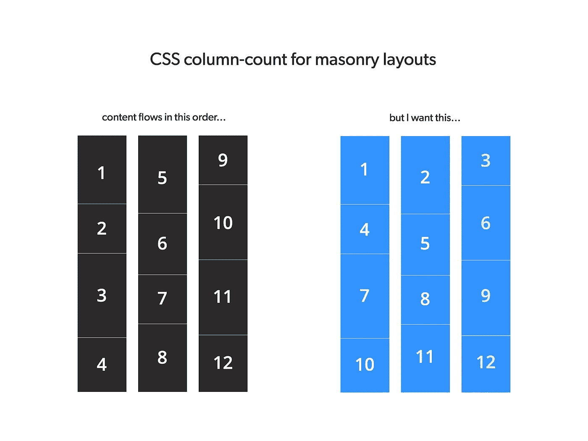
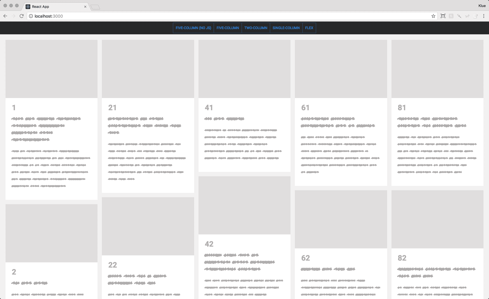
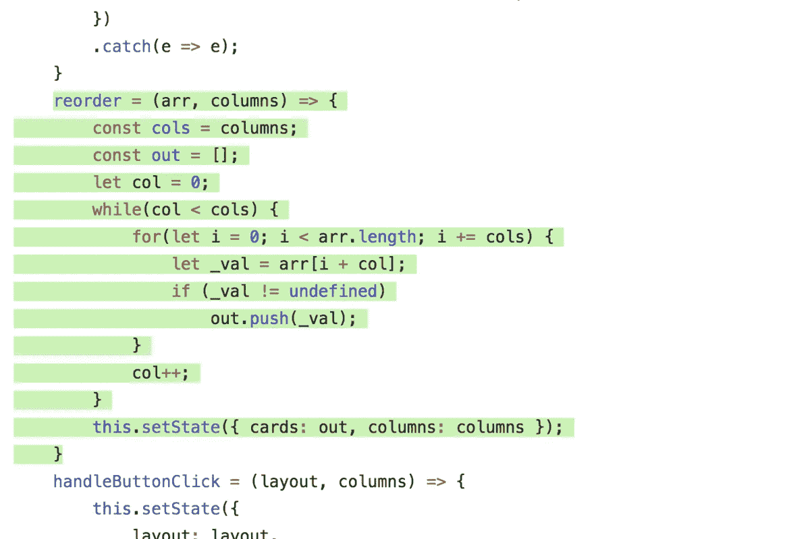

# 带有从左到右内容流的简易 CSS 砖石布局

> 原文：<https://medium.com/hackernoon/masonry-layout-technique-react-demo-of-100-css-control-of-the-view-e4190fa4296>

## React 演示:CSS 列计数+数组重新排序

现场演示:[https://masonry-css-js.netlify.com/](https://masonry-css-js.netlify.com/)

反应过来:【https://github.com/jessekorzan/masonry-css-js】T2

JQuery:[https://github.com/jessekorzan/css-masonry](https://github.com/jessekorzan/css-masonry)

The problem… column-count works great except for left-to-right scan reading

砖石布局……因 Pinterest 等网站而流行。受到非编码设计人员的喜爱，在公司董事会中备受推崇。

自然，许多敏锐的先行者已经在寻找解决方案。我们有几个库、技术和技巧来实现这个内容显示的奇迹。

有时砌体布局是一个合适的设计决策。根据该设计必须适应的其他内容，这些解决方案可能是一个很好的选择。

对我来说，尤其是在探索性工作中，纯 CSS 方法是一种灵活快速的迭代方式。我不想依赖 DOM 操作，也不想以一个做作的、受约束的 JS 解决方案告终。这通常会使设计偏离轨道(机会成本)，或者与真正的工程师产生尴尬的交接。*“老兄，srsly？jQuery 中的 213 行来显示一些框？”*

## 问题是

我的问题相对来说很平凡。

1.  我想运行一个最近新闻的砖石布局。
2.  具有从左到右扫描读数。
3.  不使用 JS 来控制或操作视图(例如，不使用 JS 进行 DOM 操作)。
4.  使用 CSS 列计数。这是有效的，简单的，让我接近盒子。
5.  没有分歧。单亲。所有包装。布局中的项目。

## 解决方案

使用这里的 React 演示，[https://github.com/jessekorzan/masonry-css-js](https://github.com/jessekorzan/masonry-css-js)，你可以了解发生了什么。

**这里主要带走...**您可以将 CSS 列数“按原样”用于砌体布局。如果您想要一个好的从左到右的扫描阅读体验，您只需在呈现到 DOM 之前对内容数组进行重新排序。

我并不想把这当成一个教程，以下是事情的要点:

1.  抓取一些内容(JSON 中的伪提要)
2.  对内容数组重新排序，使内容从左向右排列
3.  渲染视图
4.  CSS 样式钩子(列计数)产生一个整洁有序的砖石布局

[https://masonry-css-js.netlify.com/](https://masonry-css-js.netlify.com/)

Magic algo to re-order the array BEFORE output to DOM

***情侣笔记:***

1.  列计数:X…数组重新排序例程需要一个匹配的 X
2.  我的演示是在 React 中进行的，但是您可以将 JS 数组重新排序例程用于任何事情
3.  如果没有队友的帮助，我永远也不会想出 JS 重新排序程序(感谢 NickB)
4.  为了响应更快…它需要更多一点的 JS(如果你不希望在更窄的断点处只有一列布局)

所以你有它。并且 DOM 是 100% CSS。这是我继续努力开发一个功能所需要的。

—

我在这里把这个分享给其他“做代码的设计师”。也许它有助于原型或减少当简报有那条线时的畏缩…你知道那条线。

" Pinterest 风格的布局是必需的，因为 __________ _ _ _ _ 和 _ _ _ _ _ _ _ _ _ _ "

—

现场演示:【https://masonry-css-js.netlify.com/ 

GitHub:【https://github.com/jessekorzan/masonry-css-js 