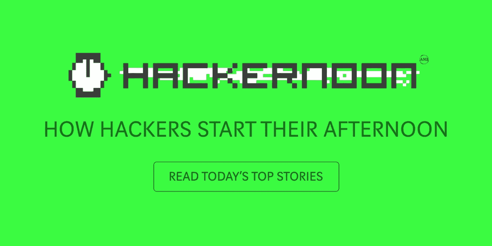

# 万事达卡可能会支持加密信用卡网络，比特币基地可能会在今天宣布 IPO 计划

> 原文：<https://medium.com/hackernoon/mastercard-could-support-a-crypto-credit-card-network-and-coinbase-may-announce-ipo-plans-today-87ec0e78818d>

**市场状况—2018 年 10 月 26 日** [**BTC**](https://berminal.com/coins/Bitcoin-BTC)**:6466.32 美元(-0.14%)** [**ETH**](https://berminal.com/coins/Ethereum-ETH)**:202.68 美元(-0.03%)** [**【XRP**](https://berminal.com/coins/XRP-(Ripple)-XRP)**:0.4585 美元(+0.40%)**

比特币跌至 6500 美元以下，但仍表现出异常的波动性，徘徊在 6400 美元至 6500 美元左右。以太坊继续在大多数加密货币交易所保持略高于 200 美元的价格。今天，前 100 种加密货币中的大多数都出现了 1%至 3%的轻微亏损，总市值目前为 2087 亿美元。

其他消息，万事达卡申请了一项“区块链资产部分准备金管理”专利。该专利本质上描述了一种加密货币信用卡网络和系统，该网络和系统同时跟踪加密资产和法定资产。此外，随着股市继续下跌，加密货币与股票的相关性很小。近日，股市失去了 2018 年的全部涨幅。与此同时，更广泛的加密货币市场保持稳定。因此，股票和加密货币之间似乎没有任何关联。

美国消费者新闻与商业频道加密交易主持人 Ran NeuNer 表示，比特币基地加密货币交易所将于 10 月 26 日星期五宣布首次公开募股。 NeuNer 甚至表示，IPO 公告将在他的节目中现场直播。在他的推文中，NeuNer 还回顾了比特币基地的用户统计数据，显示该交易所 80%的收入来自消费者，15%来自机构账户。剩下的 5%被简单地称为“其他”。数据还显示，比特币基地预计 2018 年第四季度收入 4.5 亿美元。2017 年，比特币基地总裁阿西夫·希尔吉(Asiff Hirji)表示，IPO 可能会在 2017 年底进行。Hirji 公开表示“这当然符合我们投资者的利益……比特币基地最明显的道路是在某个时候上市。”([阅读更多](https://berminal.com/news/106207/CNBC-CryptoTrader-Host-Ran-NeuNer-Says-Coinbase-is-on-the-Verge-of-Announcing-an-IPO))

**2)比特大陆首次公开募股的潜在投资者被提供了关于该公司财务支持的虚假信息。**coin desk 进行的调查报告发现，投资者收到的文件显示，比特大陆获得了 Digital Sky Technologies Global 和 GIC Private Limited 的资金支持。其中一份推介文件明确表示，比特大陆“最近完成了红杉资本、DST 和 GIC 的 4 亿美元 B 轮融资，投前估值 120 亿美元。”另一个版本做出了类似的声明，两个版本都被转发到公共社交媒体讨论、私人电子邮件列表和加密媒体。一位内部消息人士告诉 CoinDesk，“比特大陆在没有提供证据的情况下创造了这个平台。”香港的金融监管法律将“为诱使他人达成协议”而发布虚假陈述的行为定为刑事犯罪，如果这些指控被证实属实，比特大陆管理层可能会被处以最高 7 年监禁和巨额罚款。([阅读更多](https://berminal.com/news/106218/Bitmain-IPO-Investors-Received-False-Information-About-the-Companys-Funding))

根据发表在 BREAKER 上的一篇报道，并不是所有加密领域的硬币期刊都像其他期刊一样具有新闻诚信。BREAKER 撰稿人科林·法伊费(Corin Faife)最近注册了一个假电子邮件账户，联系了 28 家不同的期刊询问广告费用，如果收到回复，他会继续询问一篇文章“不被标记为‘赞助’要花多少钱。”“28 家媒体中有 12 家表示，他们将在不标明赞助的情况下发布内容，包括 NewsBTC、Bitcoinist、Cryptovest、AMB 加密和 Blokt。([阅读更多](https://berminal.com/news/106400/Inquiry-Shows-Some-Coin-Journals-Will-Publish-Sponsored-Content-Without-Identifying-It))

[***订阅百慕达简讯***](https://visitor.r20.constantcontact.com/d.jsp?llr=myyhdl6ab&p=oi&m=1131022639884&sit=9ar6aztmb&f=776989ec-8460-43a4-b86a-bcf8f2f1bca7)

[***免费下载百慕大 App***](https://berminal.app.link/medium-post)

*[***百慕大官方电报***](https://t.me/berminal)*

*[***伯明纳尔推特***](https://twitter.com/berminalapp)*

****