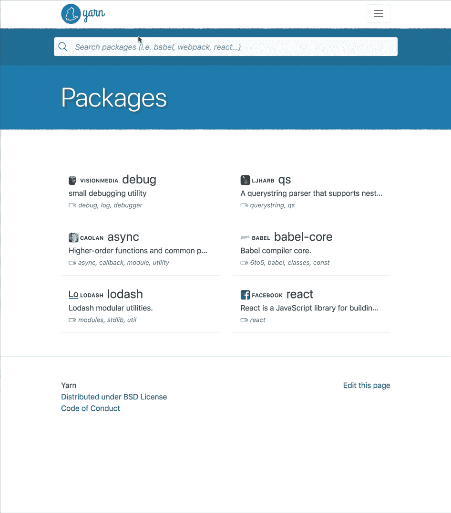
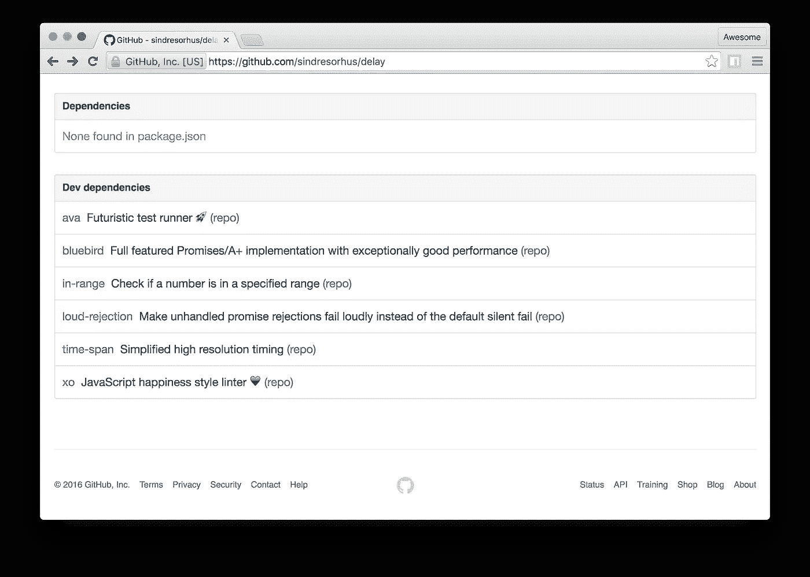
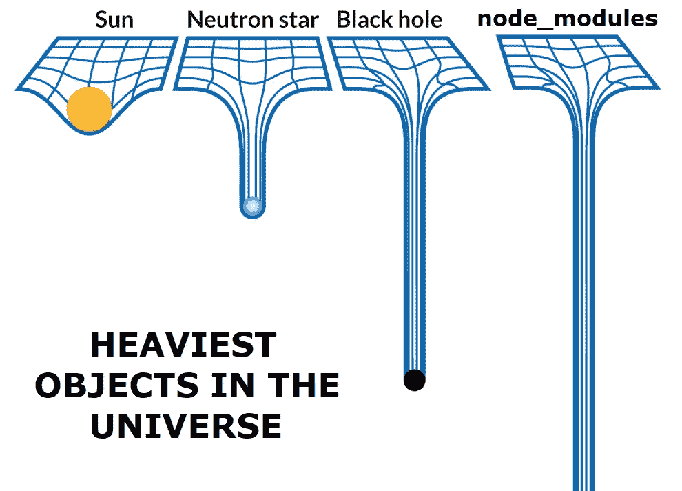

# 掌握 NPM 的艺术

> 原文：<https://medium.com/hackernoon/mastering-the-art-of-npm-ca06357150cb>

## 通过有效利用 NPM 库提高 JavaScript 开发人员工作效率的技巧。

NPM is great at harnessing the power of open source collaboration. Image Credit: [Unsplash](https://unsplash.com/photos/bq31L0jQAjU)

NPM 模块库的规模和范围是前所未有的，毫无疑问，这是 JavaScript 相对于其他编程语言的最大优势之一。作为一名开发人员，你越善于利用 npm 模块，你就会变得越快越有效率。

为此，我想分享一些有用的技巧，它们在我开发节点和前端 JavaScript 项目的工作流程中产生了巨大的变化。

## 搜索 NPM

有几种搜索 npm 注册表的方法，但我发现 [**Yarn 的搜索**](https://yarnpkg.com) 总是能产生最相关和最高质量的结果。

Image Credit: [Yarn](https://yarnpkg.com/en)

原来，Yarn 的搜索是由 Algolia 支持的[，Algolia](https://discourse.algolia.com/t/2016-algolia-community-gift-yarn-package-search/319)是一种企业级托管搜索解决方案，被许多合法的、精通技术的公司使用，如 Stripe、Twitch 和 Medium。如果你以前从未使用过这项服务，这里有一个搜索体验的快速预览:

Yarn search — blazing fast, relevant results, and clean UX.

简单来说，这就是牛逼。Algolia 免费为 Yarn 的网站*提供同类最佳的托管搜索*，整个 JavaScript 开发者社区都可以从中受益。

> 唯一的缺点是，许多 JS 开发者并不知道 Yarn 的搜索比其他搜索好多少，比如默认的 npm 搜索。

一个有趣的替代搜索解决方案是 [npms.io](https://npms.io) ，其开源[架构](https://github.com/npms-io/npms-analyzer/blob/master/docs/architecture.md)由 [CouchDB](http://couchdb.apache.org/) 和 [Elasticsearch](https://www.elastic.co/products/elasticsearch) 支持。它考虑了每个包的各种有趣和非常雄心勃勃的指标。根据经验，搜索相关性感觉与 Yarn 的 Algolia 搜索大致相当，额外的指标并没有真正产生明显的差异。

然而，Yarn 搜索的速度、一致性和整体用户体验是 Algolia 的专长真正闪光的地方。使用[yarnpkg.com](https://yarnpkg.com)的搜索只是一种乐趣，对于搜索 npm 模块这样复杂和重复的过程，UX 比你想象的更重要。

还值得一提的是其他一些竞争者:

*   [NPM search](http://npmsearch.com/)——有趣的项目，虽然我看不出比 yarn 的搜索有什么优势。
*   [npmjs.com](https://www.npmjs.com/)-NPM 的官方注册搜索。
*   节点模块——由多产的 [Mathias Buus](https://github.com/mafintosh) 编写，但似乎不是最新的。

作为一个旁注，我绝不隶属于纱或阿尔戈利亚。我很喜欢 JS 社区，并且想把 yarn 的搜索结果公之于众，让更多的开发者开始利用它。

## 策划搜索

如果我在寻找 React 或 React 原生解决方案，我通常会从搜索位于 [**JS.coach**](https://js.coach/) 的手动管理的集合开始。它的作者已经为 React、React Native、React VR、Webpack、Babel 和 PostCSS 编译了一个大的、最新的质量、分类模块列表。

如果你是 React 开发人员，并且对[发布自己的 React 模块](https://github.com/transitive-bullshit/create-react-library)感兴趣，JS.coach 可以让你很容易[提交](https://github.com/jscoach/support/blob/master/CONTRIBUTING.md)自己的包。我不确定，但我很想知道 Vue、Angular 和其他流行的框架是否存在类似的东西。

Image Credit: [awesome](https://github.com/sindresorhus/awesome)

另一个有用的资源是[**Awesome lists . top**](https://awesomelists.top/)，它允许你搜索超过 400 个 [Awesome GitHub 列表](https://github.com/sindresorhus/awesome)，分类范围从 awesome node.js 模块到 awesome react 模块以及介于两者之间的一切*。当研究一个新的主题时，我倾向于保守地使用令人敬畏的列表，或者作为一个起点，因为虽然它们确实令人敬畏，但它们往往有点令人不知所措。*

## NPM 枢纽

这个浏览器[扩展](https://github.com/npmhub/npmhub)通过在任何包含`package.json`文件的存储库底部显示每个依赖项的链接和描述，让您快速浏览 GitHub 和 GitLab repos 上的 npm 依赖项。

NPM 中心是 GitHub 的一个非常有价值的附件，我经常使用，真的离不开它。

Breakdown of npm dependencies for the [delay](https://github.com/sindresorhus/delay) module on GitHub (image credit: [npmhub](https://github.com/npmhub/npmhub)).

任何时候我发现一个我真正喜欢的模块或者考虑作为依赖项添加的模块，我都会看看它的依赖项和开发依赖项，这些依赖项在它的 GitHub repo 上有显著的显示。这既让我对模块的质量有了一个很好的了解，也是发现有趣的新模块的一个很好的方法，我将来可能会用到这些模块。

通过查看你最喜欢的 JavaScript 作者正在使用的模块，你可以从*那里学到很多东西*，而 [npmhub](https://github.com/npmhub/npmhub) 只是让你在 GitHub 上工作时，让这部分成为你正常工作流程的一部分变得超级快速&简单。

## 评估包

我们已经介绍了几种不同的方法来寻找令人敬畏的 npm 模块。现在让我们讨论如何实际评估这些模块作为潜在的依赖项。

在实际决定将一个 npm 模块作为一个依赖项添加到您的项目之前，评估它的质量是一个重要的审查步骤。这实际上更多的是一种直觉，是在浏览和使用数百或数千个模块后随着时间的推移而形成的，但在学习快速评估 npm 模块时，需要考虑一些最重要的事情:

*   模块的源 repo 有几颗星？流行的回购协议更有可能是可靠的，因为它们已经向其他开发商证明了自己的价值。
*   它有多少下载量？例如，人们真的在使用该模块吗？
*   这个模块是多久前发布的？多久前更新的？你会发现许多几年前的高质量模块可能工作得很好，但是可能有更新的选项可以更好地维护。
*   项目有多少未决问题和 PRs？例如，它维护得好吗？一个有大量公开问题的流行项目都说“X 不工作”,这将是一个巨大的危险信号，表明这个模块没有得到积极的维护。如果它是一个坚实的基础和足够重要的依赖，你可以考虑[派生](https://guides.github.com/activities/forking/)回购并自己更新它，因为这是进入[开源](https://opensource.guide/)的最简单方法之一。
*   作者是你认可/尊敬的人吗？随着你消耗更多的 npm 模块，这个心理列表会随着时间而增长。
*   模块包括单元测试和合理的文档吗？
*   该模块是否包含与您的项目兼容的许可证？在决定添加一个模块作为依赖项之前，使用这个方便的[参考](https://choosealicense.com/)来仔细检查法律条件，尤其是如果你正在处理一个商业项目。
*   该产品包有哪些 npm 依赖项？这真的是一个庞大、臃肿的依赖关系吗，或者是否已经考虑和注意保持它的小规模和集中性？这是 npmhub 真正有帮助的一个领域。
*   该模块支持您的目标 JS 环境吗？这是一个新的和不幸的考虑，涉及多种 JS 模块格式和语言特性，可能不会很快得到解决。像 [babel](https://babeljs.io/) 这样的 Transpilers 和像 [webpack](https://webpack.js.org/) 这样的各种工具链可以对此有所帮助，但是你可能会遇到在非 ES6+环境中使用新的 ES6+模块的问题，比如旧版本的 node 或浏览器。例如，这个[问题](https://github.com/renchap/modern-js-in-browsers/issues/1)给出了一个很好的关于 trans pilling`node_modules`的元分解，但是现在请注意这个兼容性问题存在于不同的 JavaScript 版本中。

对于评估 npm 模块的艺术来说，这只是冰山一角，随着时间的推移，这些指导方针将变成一种模糊的启发，您可以使用它来选择更好的模块依赖关系。请记住，这些是一般的指导方针，而不是具体的规则。例如，有很多模块没有很多星星，但是设计得非常好，可以成为可靠的依赖。每个模块都是从零开始的😉

Image Credit: [DevHumor](http://devhumor.com/media/node-modules-1)

实际上，npm 的庞大规模是 JavaScript 的最大优势之一，也很容易成为其最大的弱点之一。这可以归因于一个有趣的理论，选择的[悖论](https://www.wikiwand.com/en/The_Paradox_of_Choice)，它大致陈述了过多的选择会导致极端的犹豫不决和无所作为。听说过 [JavaScript 疲劳](https://auth0.com/blog/how-to-manage-javascript-fatigue/)吗？很大程度上由于 JavaScript 在过去几年中的流行，它仍然很活跃。当你跌入 NPM 兔子洞时，你必须保持警惕，不要成为它的受害者。

## 包扎

我希望这个指南对你有所帮助，即使它只是一个你以前没有意识到的提示。以下是一些要点的总结:

*   使用[纱线搜索](https://yarnpkg.com/en)查找通用 npm 模块。
*   使用 [JS.coach](https://js.coach/) 查找 quality react & react 原生模块。
*   使用 [npmhub](https://github.com/npmhub/npmhub) 快速探索 GitHub 上的 npm 依赖关系。
*   在将 npm 模块作为依赖项添加到您的项目之前，评估其质量是一个重要的审查步骤。

如果你对我个人最喜欢的 npm 模块有兴趣，请查看🔥[值得使用的 JavaScript 模块](https://hackernoon.com/javascipt-modules-worth-using-9aa7301e41ac)🔥。我将很快发表另一篇文章，介绍将自己的包贡献给 NPM 的技巧&最佳实践，这是充分利用 JavaScript 生态系统的重要的下一步。

有我遗漏的任何提示和技巧吗？请在评论中分享给我！❤️

## 在你走之前…

*如果您喜欢这篇文章，请点击👏下面，并与他人分享，这样他们也可以享受它。*