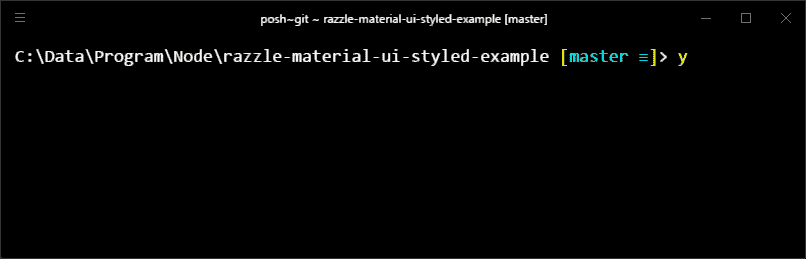
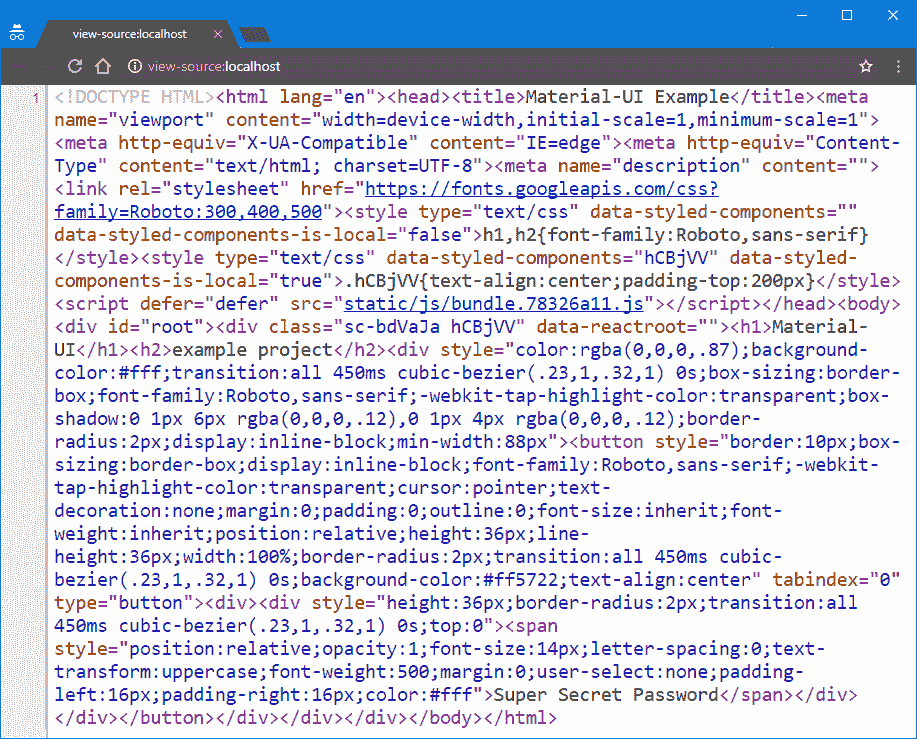
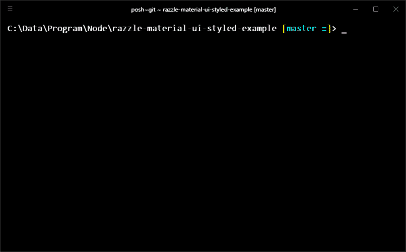
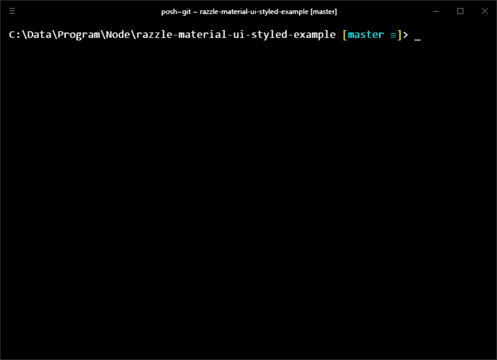

# Material-UI:入门(快！)⚡反应 16+

> 原文：<https://medium.com/hackernoon/material-ui-get-started-fast-react-16-eea211d65308>

如何入门 Material-UI？

在我看来，这是简单而正确的方法。

[Material-UI](http://www.material-ui.com/#/) by [## kire Erik/razzle-material-ui-style-example

### 使用 Express with compression 的风格化组件的 UI 示例。附带 HTML 和内联 CSS 和 JavaScript 缩小。

github.com](https://medium.com/u/4324666fe0ac#getting-started) 

> *等等！你在某种基于 Unix 的系统上吗？麦克。Linux？如果是这样的话，你可能想改变* `[*.env*](https://github.com/kireerik/razzle-material-ui-styled-example/blob/6ad048dbb9fb6565070c9bd48bb0617a052b2572/.env#L2)` *文件中的* `*PORT*` *，我已经将它设置为* `*80*` *，它在 Windows 上工作。*[*Razzle*](https://github.com/jaredpalmer/razzle)*的默认是* `*3000*` *所以如果你喜欢的话你可以去掉那条线。*

该项目已经启动并运行。

*Start the server in development mode*

去野外实验吧！

我不是在开玩笑。立即关闭这篇文章，尝试该项目！

开个玩笑！😄你可以稍后继续阅读…

> 你懒吗？ [*启动 Codenvy 上的项目*](https://codenvy.io/dashboard/#/load-factory?id=factoryffyherfcfvcdm83r) *改为！一次点击和项目启动和登录后运行。*

你还在读书吗？好吧，我会握着你的手带你走一遍。

# 使用

这里的事情会变得很无聊。我已经告诉你自己去试一试。

好吧，玩笑归玩笑。我们是认真的。

## 基础

*Folder structure*

*   ⬅Static 的公开文件在这里。
*   src
    –*application/*[***main . js****⬅the main react . js 组件。
    –*](https://github.com/kireerik/razzle-material-ui-styled-example/blob/master/src/application/Main.js)**[***server . js***](https://github.com/kireerik/razzle-material-ui-styled-example/blob/master/src/server.js)⬅serves 缩小版 HTML。
    –client . js，index.js，static.js ⬅"Lower 级别”脚本(稍后会讨论)。**

****

**Source code**

**你可能已经发现了。`Main.js`包含 React.js 组件。所以基本上你可以在这里改变你网站的主要内容[。](https://github.com/kireerik/razzle-material-ui-styled-example/blob/master/src/application/Main.js#L47-L55)**

**`server.js` [呈现 React.js 应用程序，收集样式](https://github.com/kireerik/razzle-material-ui-styled-example/blob/master/src/server.js#L30)，并在您访问站点时以 HTML 的形式提供所有这些内容。**

**检查源代码！是的，梦想实现了。这是一个适当缩小的一行程序。你可以[在这里](https://github.com/kireerik/razzle-material-ui-styled-example/blob/master/src/server.js#L34-L56)修改你的主 HTML，主要是你的页眉。**

> **[*如何实际启动项目*](https://github.com/kireerik/razzle-material-ui-styled-example#getting-started) *详见已经链接的自述。* [*特征*](https://github.com/kireerik/razzle-material-ui-styled-example#features) *的示例项目也列在那里。***

## **📝密码**

**用[样式化组件](https://www.styled-components.com/)在`Main.js`中样式化组件容易吗:**

**这就是服务器端渲染如何与`server.js`中的样式化组件一起工作:**

**它还包括一些额外的东西，比如静态资源的压缩和 HTML 缩小:**

## **先进的**

**`src/index.js`是**服务器**的主要入口。这是 Razzle 要求的。**

**`src/client.js`是**浏览器**的主要入口点。这也是 Razzle 所要求的。**

**可选的`.env`包含一些环境变量定义。**

**您可以在`scripts`对象下的`package.json`中找到构建脚本。**

## **📝密码**

**这就是主入口点(`index.js`)启动服务器(`server.js`)的方式:**

**下面是 index.js 的完整[最简单版本](https://github.com/kireerik/razzle-material-ui-styled-example/blob/d85a4f762220cfd33d45797f192858307b288d4e/src/index.js)。**

**[client.js](https://github.com/kireerik/razzle-material-ui-styled-example/blob/master/src/client.js) 入口点融合了浏览器中已经呈现的应用程序:**

**在 [package.json](https://github.com/kireerik/razzle-material-ui-styled-example/blob/master/package.json#L2-L7) 中，`start`脚本使用了一种构建和运行方法:**

****

***Build and run***

## **材料-用户界面**

**服务器端渲染使得正确使用 Material-UI 有点复杂。设置`userAgent`不一定简单(至少对我来说)。不过[文档](http://www.material-ui.com/#/get-started/server-rendering)也没那么差。**

**以下带有链接的代码有望提供一些上下文:
[server.js](https://github.com/kireerik/razzle-material-ui-styled-example/blob/master/src/server.js#L30) :**

**[client.js](https://github.com/kireerik/razzle-material-ui-styled-example/blob/master/src/client.js#L6) :**

**[Main.js](https://github.com/kireerik/razzle-material-ui-styled-example/blob/master/src/application/Main.js#L29) :**

> **[*阅读栈溢出*](https://stackoverflow.com/questions/37816998/react-server-side-rendering-with-express-warning-on-the-client-checksum-styl/43958663#43958663) *上的这个解决方案，如果你觉得它也有用，就按下向上投票按钮。***

## **单路由静态站点生成**

**可选的 [static.js](https://github.com/kireerik/razzle-material-ui-styled-example/blob/master/src/static.js) 是从主服务器入口点 ( `index.js`)调用的[。它抓取已经生成的静态资源，并将它们复制到`static`文件夹中。另外，它访问 URL 并保存 HTML 响应:](https://github.com/kireerik/razzle-material-ui-styled-example/blob/master/src/index.js#L25)**

****

**Static site generation**

**静态站点生成脚本有些复杂:**

1.  **一个常规的 Razzle 构建是用静态设置(`RAZZLE_STATIC=true`)生成的服务器端代码创建的。**
2.  **该构建以`production`模式开始。**
3.  **静态生成器只在这一次执行。它执行前面描述的步骤并关闭服务器。**

# **关于这个例子**

## **动机**

**我想创建一个更现代、更吸引人的版本，迈克尔·摩根斯坦的[搜索又回来了！](https://searchisback.com/)。为什么？因为我认为我可以做得更好，我仍然认为我可以。
我很快意识到我需要结合一些技术来实现我的愿景。**

> ***所以“…在测试了一堆示例项目后，我最终找到并使用了 Razzle。”(* [*来源*](https://github.com/jaredpalmer/razzle/issues/289#issuecomment-306586593) *)***

**我还需要在 Material-UI 和 Muse UI 之间做出选择。(在这一点上，使用材料设计对我来说不是问题。)我也考虑过其他库。但是我很快就喜欢上了 Material-UI 的[复选框动画](http://www.material-ui.com/#/components/checkbox)。不管怎样，它真的很坚固。**

****

***Material-UI’s checkbox animation***

**首先，我想用 Muse UI，这是一个 Material-UI 的端口，因为我认为我会喜欢 Vue.js 胜过 React.js。**

**然而，当时它的文档只有中文，所以我选择原始库。**

**第一次使用 React.js 将 CSS 和 HTML 结合到 JavaScript 中感觉有点奇怪。后来，当我将 Vue.js 用于一些小型客户端项目时，我意识到我实际上更喜欢 React 方式，尤其是对于样式化的组件。**

**最终，我创建了这个示例项目。所以我可以从我的真品开始，名为[脸书搜索器](https://facebooksearcher.com/):**

 **[## 脸书搜索器

### 按常规方式搜索脸书。使用各种参数来调整和过滤结果。找到你的同龄人，重新联系你的老朋友。搜索地点，工作场所，学校，关系等等。

facebooksearcher.com](https://facebooksearcher.com/)** ****

**[*Facebook Searcher*](https://facebooksearcher.com/)**

**这是一个简单的搜索表单，它建立了一个链接，所以你可以通过常规方式对脸书上的人进行定制搜索。
你已经可以使用已实现的字段，它已经比它的竞争对手提供了更多的自由。**

**例如，你可以列出对两性都感兴趣的脸书用户(脸书支持)。它仍在开发中，一些功能正在等待实施。因此，如果你想以任何方式支持这个项目，请随时告诉我！**

**[其他原因](https://github.com/michaelrambeau/bestofjs/issues/91#issuecomment-307631163)**

## **什么是 Razzle？**

**一个与框架无关的构建工具，用于服务器呈现的通用 JavaScript 应用程序。**

** [## jaredpalmer/razzle

### ✨创建服务器渲染的通用 JavaScript 应用程序，无需任何配置。与 React、Reason、Elm、Vue.js 以及接下来的任何内容一起工作。

github.com](https://github.com/jaredpalmer/razzle) 

## 为什么要嘲笑？

Razzle 使服务器端渲染变得简单。这对我来说是必须的。另外，它不会强迫你使用你不想使用的解决方案。

> *所以它“……是[…]极简……”(*[*来源*](https://github.com/jaredpalmer/razzle/issues/289#issuecomment-306586593) *)*

热模块重载也是一个很好的特性。定制或扩展默认值也很简单。

> *所有这些使得 Razzle“…一个几乎与框架无关的构建系统…”它“…将 100%与 Angular、Vue、Rax、Preact、Inferno、React-XP、RN-Web 一起工作…”—* [*来源*](https://medium.com/u/fb7a3c353cc1#issuecomment-306593963) *)*

[谁在用？](https://github.com/jaredpalmer/razzle/issues/332)

# 下一步是什么？

脸书搜索器最初是由一家老派的主机提供商“部署”的。我在那里有安全的 Shell 访问，所以我能够安装 Node.js。

我使用进程管理器 2 来确保它无论如何都在运行。当然，这没有静态网站快。另外，我没有一个好的部署和更新框架。过了一段时间，我开始手动保存 HTML，并以这种方式在 Netlify 上发布应用程序。它更加可靠，应用程序加载速度也更快。

后来，我转而使用 Firebase 主机，它更快，更可靠。我在这里实现了静态站点生成特性。手工做肯定是不可持续的。现在，我只需一条命令就可以构建和部署脸书搜索器。我现在可以集中精力实现剩下的特性了。

*Deploy with one command*

将我们的应用程序部署到 Firebase 主机很容易。而且，我们仍然可以将其部署为 Firebase 函数来代替([基本示例](https://github.com/jaredpalmer/razzle/tree/master/examples/with-firebase-functions))。也许这个话题本身就值得再写一篇文章。

目前，我的项目没有生根。如果你的项目需要它，你可以添加一个路由器或者你可以考虑使用 [After.js](https://github.com/jaredpalmer/after.js) 来代替，它基本上是 Razzle 的路由和相关功能。

我也期待着更新项目到 1。Material-UI 的版本，一旦他们发布它并添加回我非常喜欢的复选框动画。

# 减去

通过实验和/或阅读这篇文章，你可以以一种复杂的方式快速而容易地使用 Material-UI。所以继续努力，创造一些美好的东西吧！🎉

你会使用这种设置吗？你喜欢别的吗？

⬇ **回复**、**提问**和**在下面的评论中分享你的经历**！

你喜欢这篇文章吗？

⬅ 👏**拍拍**文章几下！

**与**你的**朋友**和大学分享这个循序渐进的指南**！**

⬅使用 Twitter 和 Facebook 按钮来这样做。

从地址栏复制链接。直接给你的同事发信息。👋打个招呼，把文章发给他们。

## 💌时事通讯

埃里克·恩吉

> [**立即订阅**](https://my.sendinblue.com/users/subscribe/js_id/32wxl/id/2) ，将可操作的技术文章放入您的收件箱。

埃里克只有在有重要事情要说的时候才会给你发邮件。就像你一样，他通常很忙。所以这只会时不时发生，你可以随时退订。

在媒体上跟随[埃里克·恩吉](https://medium.com/u/55c35b4bc23f?source=post_page-----eea211d65308--------------------------------) [获得关于新文章的通知。](/@erikengi)

 [## Erik Engi —中等

### 阅读埃里克·恩吉在媒体上的文章。Web 开发人员，前 Codementor，最佳街机脚本的创建者和 CodersClan 的成员。

medium.com](/@erikengi) 

## 与埃里克·恩吉一起工作

你或者你的公司有没有有价值的项目和产品？想要通过世界级的开发人员来扩展您的团队吗？

现在就雇佣——埃里克可以被雇佣

 [## Oengi.com

### HTML5 web 应用程序开发。Erik Engi 与世界各地的公司和开发人员合作。为你的团队雇佣一个世界级的开发者！

oengi.com](https://oengi.com/) 

Erik 可以全职为你工作，也可以在你的公司工作。

你或你的团队需要编程帮助吗？[预订与 Erik 的一对一会谈](https://docs.google.com/forms/d/e/1FAIpQLSdRPRPFiYihG03lNUaKa1hU6z_BePrDwVCyV65S3ZLhvADyIw/viewform?entry.600696459=mentorship)!

*原载于*[*code mentor . io*](https://www.codementor.io/kireerik/material-ui-get-started-fast-react-16-fjan7erke)*。***