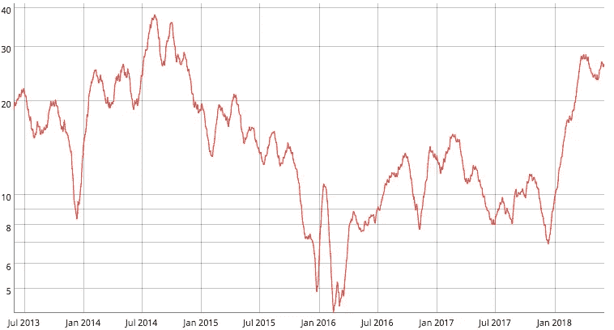
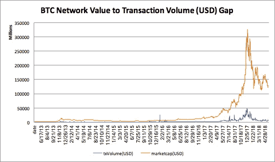
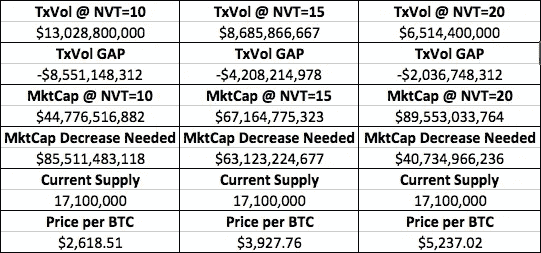

# 比特币抄底的数学

> 原文：<https://medium.com/hackernoon/mathematics-of-bitcoin-bottom-fishing-e3a615747dd5>

# 摆桌子

一周前，著名的加密货币分析师 Willy Woo 发表了一篇文章,称他预计比特币将从目前的水平下滑至 5500 美元至 5700 美元之间。提供的理由是 NVT 比率仍然过高，需要增加的*交易量*(以美元计)来证明当前价格的合理性，或者需要相应的市场价格*下降*来调节差额。

相反，几天后，Fundstrat 的董事总经理 Robert slu ymer[表示](https://www.newsbtc.com/2018/06/03/could-bitcoin-be-heading-upwards-fundstrats-sluymer-says-yes/)他对 BTC 恢复牛市趋势持乐观态度，因为 BTC 的强力支持[和在 7000 美元附近的超卖](https://www.investopedia.com/terms/s/support.asp) [RSI](https://www.investopedia.com/terms/r/rsi.asp) 水平。

# NVT 衡量估值还是速度？

在我们的帖子[测量令牌速度:NVT 比率](https://hackernoon.com/measuring-token-velocity-nvt-ratio-e3ce477612d7)中提到，我们断言，如果货币等式的数量理论足以对区块链网络估值，那么 *NVT 比率等于令牌速度**。此外，我们断言，当速度飙升(如 2018 年)时，它通常预示着熊市，这是清除上一轮牛市中的“非理性繁荣”所必需的。*

*假设历史标准成立，使用 30 天移动平均线，BTC NVT 比率(速度)的“正常”范围在 10 到 20 之间。任何高于 20 的都是泡沫，任何低于 10 的都接近被低估(*除非它来自繁荣的牛市)。*

**

**per coinmetrics.io*

*此外，使 NVT 比率(周转率)有用的是，它可以通过基本的算法分解，以测试每个变量的潜在价格范围-网络价值(市值)和区块链交易量区块链(美元)。*

# *解开 NVT 方程*

*使用 NVT 公式，我们进行了三种情景分析，以三角测量 BTC 的潜在价格范围，假设当前市值和区块链交易量之间的“差距”需要向历史“正常”范围靠拢。这种调整需要通过市值减少或区块链交易量增加来实现。*

**

**data from coinmetrics.io*

*我们的情景分析使用了 2018 年 6 月 3 日的区块链交易额和市值，分别为 44 亿美元和 1303 亿美元。使用的公式是:*

***NVT** =市值(MktCap) /交易量(TxVol)*

***TxVol @NVT 情景** =当前 MkCap / NVT 情景*

***TxVol Gap** =当前 TxVol — TxVol @NVT 场景*

***MkCap @NVT 情景** =当前 TxVol * NVT 情景*

***MktCap 减少** = MktCap @NVT 情景—当前市值*

***BTC 价格** = MktCap @NVT 情景/当前供应量*

**

**data from coinmetrics.io*

*使用以下 NVT 比率等于 10、15 和 20 的情景，我们看到交易量需要显著增加才能证明 BTC 目前的价格(分别为 85 亿美元、42 亿美元和 20 亿美元)是合理的。*

*或者，BTC 目前的市值必须大幅缩水，才能达到 10、15 和 20 的“正常”NVT 比率水平(分别为 855 亿美元、631 亿美元和 407 亿美元)。*

*   *最保守的 NVT 比率为 10，随后 BTC 最糟糕的价格是 2618.51 美元。*
*   *中等 NVT 比率为 15，BTC 第二糟糕的价格情景是*$ 3927.76。**
*   *最不保守的 NVT 比率 20 和 BTC 的最佳价格方案是 *$5，237.02。**

# *结论*

*这种分析有两个主要的注意事项:*

1.  *市值和区块链交易量是循环反馈回路，因此相互影响。因此，这个框架存在固有的缺陷，很难用高置信度进行量化。*
2.  *新 BTC 硬币每天都在发行，所以在我们的方案中，每 BTC 的假设价格将不断变化，这又一次限制了可量化的信心。*

*然而，使用可用的分析工具，我们同意两个市场评论员给出的每个观点似乎都通过 NVT 比率(速度)数学和[价格图表](https://www.tradingview.com/chart/BTCUSD/2LXXKguU-Bitcoin-Price-Analysis-5-30-2018/)得到了验证。然而，考虑到基本面往往会在长期内胜出，价格必须尽快(而不是推迟)以显著的购买量稳步上升，以便积极影响区块链交易量的增长，足以弥合 NVT 比率差距，并在“正常”范围内降低 NVT 比率。*

**免责声明:本分析仅用于信息和教育目的。建议读者在做出购买决定之前，对个人资产进行独立研究。**