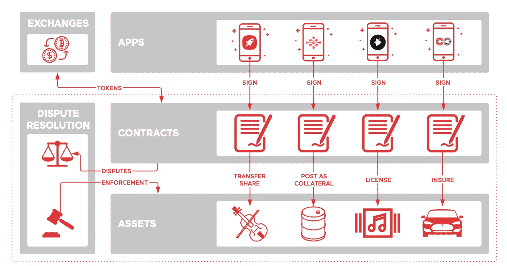
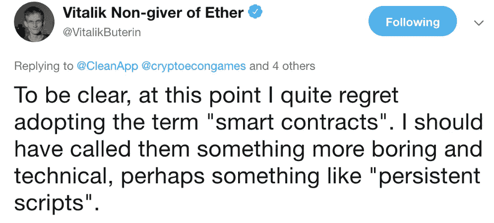
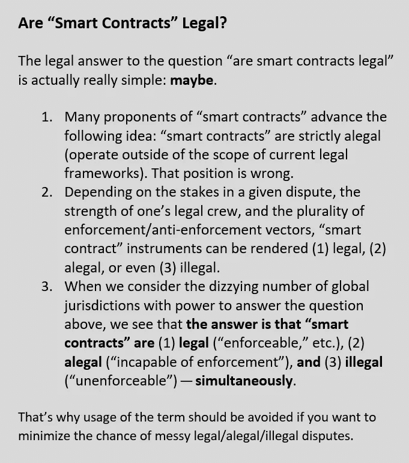

# Mattereum Litepaper {利弊}

> 原文：<https://medium.com/hackernoon/mattereum-litepaper-pros-cons-8fdf2a4b007e>

## 由于密码是从以太→等离子体→物质演变而来，所以物质转化必须是完美无瑕的。我们希望这篇评论能帮助我们达到目的。

在 [CleanApp Foundation](http://cleanapp.io) ，自从[自动保管人。](https://medium.com/u/43399d9c2888#2 的方法是通过引入一种新的法律形式:(3)一个<strong class=)

> [自动化托管人是智能合同的完美法律对手。](https://medium.com/u/43399d9c2888#2 的方法是通过引入一种新的法律形式:(3)一个<strong class=)
> 
> [自动托管人成为资产的合法所有人和登记人，维护资产权益的权威登记。](https://medium.com/u/43399d9c2888#2 的方法是通过引入一种新的法律形式:(3)一个<strong class=)

[不幸的是，这份文件并没有解释自动保管人——其工作是维护微型所有权登记的机器人——将如何实际执行。这又是一张报纸:](https://medium.com/u/43399d9c2888#2 的方法是通过引入一种新的法律形式:(3)一个<strong class=)

> [作为资产的合法所有人，注册官(bot)最有资格对资产执行这些宪法要求。](https://medium.com/u/43399d9c2888#2 的方法是通过引入一种新的法律形式:(3)一个<strong class=)

[但是，bot 能够强制执行任何法律要求(宪法、合同或财产)的唯一方式是 bot 在物理领域具有合法的执法权。这意味着机械警察。除了 RoboCop enforce，Mattereum 不能也不应该将其流程描述为物理领域的自动执行。](https://medium.com/u/43399d9c2888#2 的方法是通过引入一种新的法律形式:(3)一个<strong class=)

[如果 Mattereum 打算实现 Szabo 最初的“智能财产”计划，即自动收回汽车(# autorepoauto)和自锁公寓，那么它必须这样说，并将这些重要的治理和政策问题公开辩论。](https://medium.com/u/43399d9c2888#2 的方法是通过引入一种新的法律形式:(3)一个<strong class=)

[现在，报纸声称 Mattereum 协议将允许部署“一个简单的 API 来控制链外资产。”但正如它自己的图形所表明的那样，实际的控制机制不是物理控制，而实际上只是另一层合法权利——(1)转让权利；(二)附属权利；(3)知识产权许可权；(4)保险权利。](https://medium.com/u/43399d9c2888#2 的方法是通过引入一种新的法律形式:(3)一个<strong class=)

一个<strong class=)

[如果出现关于这些权利的争议，仲裁、裁决和执行将在链外完成。如果各方希望仲裁，那么 Mattereum 可能会与 OpenCourt 这样的仲裁提供商集成，提供更大的链上控制。但最终，实际的强制执行将在一个非实质性的强制执行论坛上进行。](https://medium.com/u/43399d9c2888#2 的方法是通过引入一种新的法律形式:(3)一个<strong class=)

# [聪明的斯特拉迪瓦里](https://medium.com/u/43399d9c2888#2 的方法是通过引入一种新的法律形式:(3)一个<strong class=)

[报纸以一把稀有的斯特拉迪瓦里小提琴(价值 900 万美元)为例。马特勒姆声称这把小提琴将是第一把它变成智能财产的小提琴。小提琴然后被用来说明马特勒姆协议的几个方面。](https://medium.com/u/43399d9c2888#2 的方法是通过引入一种新的法律形式:(3)一个<strong class=)

一个<strong class=)

[litepaper 给出了几个可以用小提琴做什么的例子，包括关于给定保管指令的自动化注册员监督。因此，如果资产所有者和合同方想要指定这把小提琴用于“一年内在 3 个国家的 6 场音乐会”，建议这把小提琴将用于“一年内在 3 个国家的 6 场音乐会”](https://medium.com/u/43399d9c2888#2 的方法是通过引入一种新的法律形式:(3)一个<strong class=)

[但关键问题是— *如何*？Mattereum 将如何执行这些财产+合同混合权利？同样，唯一可以想到的可以自动完成的方法是，如果自动保管员是一个机器人，他被编程为将小提琴送到 6 个音乐会场地中的每一个，然后将小提琴带回某个安全的保险库。但是，即使在这种情况下，如果第五场音乐会的小提琴手返回一个赝品，会发生什么呢？如果她拒绝把小提琴还给机器人会怎么样？](https://medium.com/u/43399d9c2888#2 的方法是通过引入一种新的法律形式:(3)一个<strong class=)

[关键是，“智能合约”自我执行是虚幻的。这是一种矛盾修饰法。Mattereum 通过两种方式避开了这个问题:(1)不使用自我执行术语(](https://medium.com/u/43399d9c2888#2 的方法是通过引入一种新的法律形式:(3)一个<strong class=)[谢天谢地](/cryptolawreview/whys-szabo-afraid-of-smart-contract-critiques-669ef9e63fc0)！);(2)通过发明一个第三方财产法机制——*自动保管人*——来执行。

但这只是把事情往后推。自动保管人不能执行。它不是一个执法机构。

# “智能合同”与“法律合同”

尽管我们很高兴看到一个主要的区块链项目有意识地远离“自我实施”术语，Mattereum 的法律架构仍然不发达。

最明显的例子是对“智能合同”术语的持续依赖，尽管有反对这种用法的原则性论证[和明显的对抗趋势。](/cryptolawreview/against-smart-contracts-4a1f43133215)

这些不是语义选择、美学考虑或“观点”在这种情况下，在明确的纠正信号之后继续误用法律术语只会导致一个结果:进一步的概念分裂和混乱。

当 Mattereum 写道其“基础设施(将)智能合同转变为可以在全世界有效执行的法律合同”时，Mattereum 的对比框架只会让事情变得更糟。

“智能合同”和“合法合同”在法律上没有概念上的区别，就像“合法合同”和“合同”没有概念上的区别一样。添加形容词“合法”是多余的。根据定义，合同是一种法律形式。术语“智能合同”或术语“法律合同”没有明确的行业惯例相反，在不同类型的“智能契约”和各种“自我执行”的法律契约之间，加密话语有太多不准确的等价性。

以下是“智能合同”如何转变为“合法合同”的实际答案

响亮的“也许”与马特勒姆契约“可以在全世界有效执行”的说法相去甚远。

远离高效执法，更接近也许的最好的思想练习是回到斯特拉迪瓦里，想象一个复杂的出处纠纷——或者——一个混合的合同+财产+侵权纠纷，起因于一个愤怒的暴力事件引起的小提琴损坏，抗议艺术的链化，或者其他什么。

头衔链现在看起来有多清晰并不重要；在一个大的利益纠纷中，不可能包含链上纠纷解决机制的各方——不管他们事先同意链上仲裁。

# 在马特勒姆的引擎盖下

下面是我们对马特勒姆的*自动化保管人*的实际内部运作的理论。

*   Mattereum 的自动保管人似乎是一种将财产法形式(如委托)转化为合同形式的秘密方式。
*   Mattereum 正在做这种法律炼金术，以便*国际化&协调财产法*(财产法是典型的地方性法律；合同法更加国际化，拥有执行仲裁裁决的强大国际法律机制。
*   将财产转让给集中或分散的登记员是试图将某一特定资产契约化(将其法律本质从财产形式改变为契约形式)。
*   尽管尽了最大的努力(在优秀律师的建议下)，但任何声称易于执行、易于实施和/或易于提高效率的说法都必须仔细审查。

# 后续步骤

我们以几个问题和澄清请求结束。

*   Mattereum 网站上写道:“如果合同双方同意以注册资产担保其债务，注册服务商将直接承认并执行针对该资产的仲裁裁决。”
*   **问:Mattereum 首选的仲裁机制是什么？**
*   在我们的理解中，决定将斯特拉迪瓦里作品连锁的动机是希望选择具有无可争议出处的高知名度资产。
*   **问:您是否愿意用其他资产类别构建 Mattereum 的原型，但其中** [**标题不清楚，并且出处可能有争议**](https://cleanapp.io/wp-content/uploads/CleanApp.pdf) **？**

感谢 Mattereum 团队为更广泛的全球区块链项目的发展开辟了一条新的道路。你们报纸关于将碳和污染数据市场化的创新建议是区块链历史上的一个重要里程碑。我们全心全意地为它鼓掌。

我们看到 Mattereum 作为类似但更广泛的实物资产类别的托管协议的全部潜力:开放 ar 云的区块链体现。我们很荣幸能分享我们的想法，将区块链流程与实物资产相结合，以打开全新的交易空间。