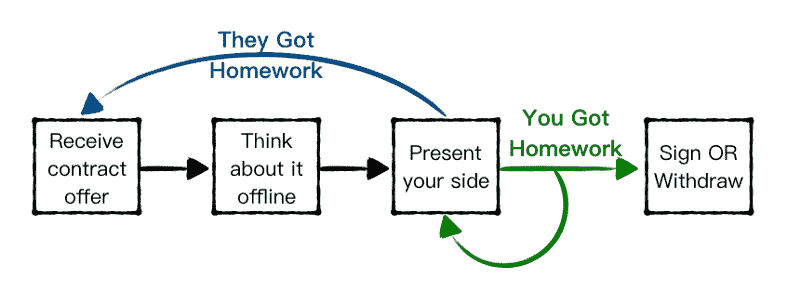

# 薪资谈判做得好

> 原文：<https://medium.com/hackernoon/maximizing-you-next-salary-4e3aa2af2f8e>

你通过了一家优秀公司的所有面试和测试——恭喜你！招聘人员刚刚打电话给你，说他们对你印象深刻，想给你一份合同，然后她会问你一个最大的问题——一个没有唯一正确答案的大问题——“你期望的薪水是多少？”。希望这个故事能帮助你以最好的方式回答这个问题，并在你签署的下一份合同中最大限度地提高工资。

重要免责声明:

1.  我的观点是有污点的，因为我来自一个快速增长的高科技市场，候选人在这个市场上占了上风。
2.  这篇文章的内容没有经过科学或经验证明。这是我作为招聘雇主、寻找下一个挑战的候选人以及作为博弈论的好奇粉丝所学到的工具和技巧的集合。
3.  在这篇文章中，我将只关注与新雇主的薪资谈判，而不是如何从现在的雇主那里获得加薪。
4.  显然，在选择你的下一个挑战时，工资是一个关键因素，但不是唯一的因素，我甚至要补充一点——不是最重要的因素。薪酬包可能包含多个因素(如奖金、股票期权、rsu)，从长远来看，这些因素可能会超过你的月薪。最重要的是——职位、公司和你的个人成长。

# 准备

在开始面试之前，你应该心中有一个数字，这样当被问到你期望的薪水时，你就有所准备了。这甚至可以在与公司代表的第一次电话交谈中提出。

## 了解你的价值

这里的关键是，你的价值是一个非常模糊的东西——所以你需要首先花时间来回答这个问题。

先说一个例子:James 是一名软件开发人员，SomeNiceCollege 毕业生，在 CoolSocialNetwork 公司有 1 年半的工程经验。詹姆斯目前年收入 5 万美元。

詹姆斯已经成功地通过了 ViralNewApp 公司的所有面试，当被问到时，他说他的期望工资是 8 万美元。

哇，詹姆斯，你确定吗？也许你要求的太多了？

但是等等，如果我告诉你詹姆斯目前挣 75000 美元，那么他的期望是合理的，对吗？

答案很简单——你目前挣多少钱，它不是这个等式中的一个变量！詹姆斯(和你)应该试着理解他的价值，而不是基于他的收入。如果你的收入低于你的市场价值，这并不意味着你应该妥协你的下一份薪水！

在网上搜索平均工资，问问你的朋友。问你信任的人会给你一个诚实的答案，而不是那些吹嘘他们在 TrendyPlace 公司得到的天文数字的人。找一个你愿意询问并且能够解释的数字——不要廉价出售自己，也不要夸大其词，吓跑公司。公司不会喜欢从一个远离标准或者他们认为过分夸张的候选人开始一个过程。

## 最小化误差幅度

你心目中的数字可能不是一成不变的，它可能是灵活的，但它不应该是一个范围。

假设詹姆斯告诉招聘人员，他的期望值是 7.5 万到 8.5 万美元——作为未来的雇主，你会怎么理解？我认为假设他会接受这个范围的下限是公平的，所以我们可以从 7 万美元和其他一些额外津贴和福利开始谈判——合理，对吗？事实上，詹姆斯觉得他应该得到大约 82000 美元，但他并不完全有信心说出来。

是的，我们都有一个范围和一些低端，如果职位很好，或者有其他好处，我们可能会满足于这个范围。但是当被问到的时候——给出一个你觉得合适的具体数字，并给自己留一个范围，就像打牌一样。

## 英特尔收藏

如今，你可以得到一个 X 公司付给你这种经验水平的人多少钱的大概数字——确保这个数字与你从上一节得到的数字大致一致。如果这个数字更高，您可以调整—但是如果它更低或者更低，这可能会有点问题。在这种情况下，我建议你仍然要求一个你认为你应得的数字，希望他们会尽最大努力达到这个数字，也许会使用薪酬包的其他组成部分。无论如何，这不是一个交易破坏者，你应该半信半疑，因为匿名在线人往往对真相有一定的灵活性。

到现在为止，你应该已经有了一个确切的数字——现在让我们来看看如何使用它。

# 游戏时间

## **了解设定**

回到你身边。如果一家公司决定给你一份合同，这意味着他们想要你。所有或大多数面试官都认为你足够优秀，可以加入他们的团队，希望与你合作，甚至认为你可以让他们成为更好的团队。

不要误解我的意思，这并不意味着你可以盲目地认为你占了上风，并要求荒谬的事情或给哪怕是最轻微的态度。

你拥有的是一手好牌，是时候优雅地尝试并最大化它了。通常情况下，会有一些空间可供玩耍。签订合同时获得一份让你感觉良好的薪酬包是非常重要的，因为它会一直伴随着你，直到你离开这家公司。

## 谈判技巧

这一节的全称是“你没有任何谈判技巧”，但是一旦你明白了这一点，你的谈判技巧就可以大大提高。

在某个时候，你得到了一份合同，通常，招聘人员会通过电话或亲自解释拟议的合同草案(是的，草案，这不是最终版本)的要点，尽管她会谈论一套不错的福利，但你听到的唯一一件事是底线:年薪。

***第一步* :** 现在你只需要做一件事——说“非常感谢，我很乐意详细地看一遍合同；我们明天再聊好吗？”

没有“当然！”也不是“该死的不！”—记住，你没有任何谈判技巧，你需要花点时间，看完它，想好你的下一步。

***第二步* :** 仔细检查合同。即使薪酬包看起来很棒，仔细检查所有细节，通常有一些值得讨论的地方。这一部分不能掉以轻心，但这是一个完全不同的话题，我们不打算在这个故事中深入探讨。

有时，即使考虑到其他福利，工资也会比你期望或认为你能得到的要低一些。回到你最初想的数字和你的范围——现在当你面前有完整的工作定义和薪酬包时，决定你应该谈判的薪水。此外，准备一份确凿的解释，说明为什么你应该得到更高的薪水。

***第三步* :** 现在，再次和招聘人员聊天，并且做了你的功课，你可以说他们的建议非常慷慨，但是……优雅地解释你想改变什么。

希望他们会说同样的话——“我会回复你的”。让乒乓球开始吧。

接下来——你可以继续打一两次乒乓球，保持谦逊，像肯德里克·拉马尔一样。但是记住，你需要努力关闭它，不要过度！！

这里的关键是，每次对话都可以以一个决定结束，或者以某个需要带着答案回来的人结束。因此，如果你不喜欢这个号码，你在接下来的对话中的目标是让对方说“我会检查一下，然后再打给你”(他们不会在通话中改变号码)——如果他们有作业，他们可能会改变——试着说服他们接受作业:)

如果你不能给他们布置作业——你有作业，因为他们的灵活性似乎已经达到了极限——你的作业是决定你是否会:同意，粗鲁地坚持，或者退出。

有一件事要记住——薪酬方案有很多因素，如果薪水已经用尽，其中一些因素是可以讨论的，即使是在密报的时候——你仍然可以谈论假期、期权、rsu、奖金或公司可能提供的其他福利

# **其他重要注意事项**

*   当被问及你期望的薪水时，你可能还会被问及你目前的收入是多少，这里的是一个很好的关于如何谈论这个问题的指南。
*   每家公司都有自己的调查，以及每个职位和经验级别的薪酬等级——他们会尽最大努力让你在他们给你分类的那个职位上开心——因为如果员工薪酬过低，很快就会需要大幅加薪，或者薪酬过高，会让其他人感到不安，这都是有问题的。

# 总结一下

准备步骤包括:

1.  理解你的价值并定义一个你可以证明的期望值
2.  考虑到报价的其他组成部分，确定一个你觉得合适的范围
3.  根据具体的公司定制你的最终要价

协商密钥:

1.  不要直接回答——谢谢他们，把它下线，思考一下，带着一个深思熟虑的答案回来
2.  没有作业——没有变化，试着和作业一起发
3.  不要做得太过，永远保持谦逊，当差距缩小时，表现出真诚的意愿和愿望去签字

# 结论

你收到了一份合同草案，这意味着这家公司认为你很好，他们想要你，并希望你加入。他们希望你会接受他们认为你能带来经验的工资范围内的薪水——不要害怕挑战，优雅地挑战，就像肯德里克·拉马尔说的那样:“坐下来，保持谦逊”。

别忘了，你所做的每一个决定都只是你职业生涯中的又一步——想想你的道路，着眼于更大的目标——这份工作会帮助你更接近它吗？如果是这样的话，金钱并不是等式中唯一的变量。