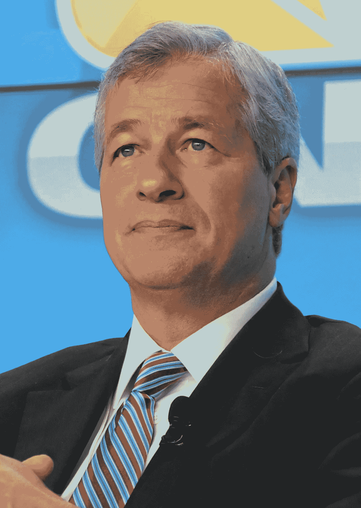

# 迈克菲——“你不用上吊！”加密货币投资者约翰·迈克菲对摩根大通首席执行官杰米·戴蒙大打出手

> 原文：<https://medium.com/hackernoon/mcafee-you-dont-have-to-hang-yourself-8b455343352f>

DAVOS/SWITZERLAND, 23JAN13 — James Dimon, Chairman and Chief Executive Officer, JPMorgan Chase & Co., USA is listens during the session ‘The Global Financial Context — Reinforcing Critical Systems’ at the Annual Meeting 2013 of the World Economic Forum in Davos, Switzerland, January 23, 2013 (Copyright by World Economic Forum. . swiss-image.ch/Photo Remy Steinegger)

在宣布他即将到来的主题演讲时，传奇计算机科学家、成功的区块链和加密货币投资者约翰·迈克菲嘲弄了摩根大通首席执行官杰米·戴蒙，并向他发出挑战，要求他在舞台上决斗，辩论区块链、以太坊、加密货币和 Replay Token([http://www.replaytoken.com](http://www.replaytoken.com))等新令牌。

# 看回放令牌(【http://www.replaytoken.com】T2

在一个以 20 世纪 80 年代和 90 年代拳击手相互殴打而闻名的城市，McAfee 在*区块链世界大会*上提供了一场在 Harrah 的大西洋城舞台上举行的新战斗，他们承诺数千名热切的加密货币投资者将出席。

自从乔治·福尔曼、伊万德·霍利菲尔德、迈克·泰森、詹姆斯·“巴斯特”·道格拉斯、利昂·斯平克斯、阿图罗·加蒂等人在大西洋城的舞台上大放异彩以来，我们还没有见过像这次来自迈克菲的吹牛挑战。

[John McAfee](https://en.wikipedia.org/wiki/John_McAfee) speaking at Politicon in Pasadena, California. ( Photo: Gage Skidmore)

> 约翰·麦卡菲说:“你不用上吊！”

在区块链世界大会网站上发布的 YouTube 视频([https://youtu.be/VYY4G8bKPzs](https://youtu.be/VYY4G8bKPzs))中，迈克菲立即向那些他认为是对手的人发起攻击。他直接针对戴蒙提出了一个赤手空拳的亿万富翁争吵，同时直视镜头，告诉戴蒙，“你不必上吊！”

> 据《美国消费者新闻与商业频道》报道，杰米·戴蒙在国际金融协会的一次会议上回答主持人的提问时说，“如果你蠢到去买它，总有一天你会为此付出代价。”。

当戴蒙声明他认为比特币是一种欺诈时，加密货币社区的许多人都很愤怒。

美国消费者新闻与商业频道告诉戴蒙，他后来收回了那句话，戴蒙在福克斯商业频道上表示，“我很后悔做出了那个评论。”区块链是真实的，”戴蒙在采访中补充道。他进一步表示，您已经单独查看了每个 ICO。

# 看重放令牌([http://www.replaytoken.com](http://www.replaytoken.com))

很容易理解他为什么放弃。Investopedia 援引普华永道咨询公司(PwC consulting company)和瑞士加密谷协会(Crypto Valley Association)发布的一份报告称，由于对首次发行硬币的强烈需求，2018 年上半年数字货币销售额为 137 亿美元，是去年 ICO 销售额的两倍多。他可以看到墙上的字迹。

McAfee 被这个社区的一些人视为加密货币权利的勇敢战士，以对抗入侵的老年风袋银行家。

根据维基百科，McAfee 是第一家商业软件公司 McAfee and Associates 的创始人，此前他曾在 NASA、Univac、Xerox、Computer Sciences Corp 和 Lockheed 等知名公司工作过。

根据区块链世界大会(BWC)的 YouTube 页面，他们已经“邀请了迈克菲和戴蒙来 BWC”

> 戴蒙是否会回应迈克菲还有待观察。如果他带了，他应该带些手套和嗅盐。以防万一，你知道…

#区块链#加密货币#投资者#比特币#迈克菲#迪蒙#以太坊# ICO # replaytoken # crypto # BTC # market # eth # alt coin # business[hacker noon](https://medium.com/u/4a8a924edf41?source=post_page-----8b455343352f--------------------------------)