# 衡量开发人员的生产力

> 原文：<https://medium.com/hackernoon/measure-a-developers-impact-e2e18593ac79>

## 这篇文章讲述了如何以一种明智而精确的方式衡量一个程序员对一个组织的贡献。

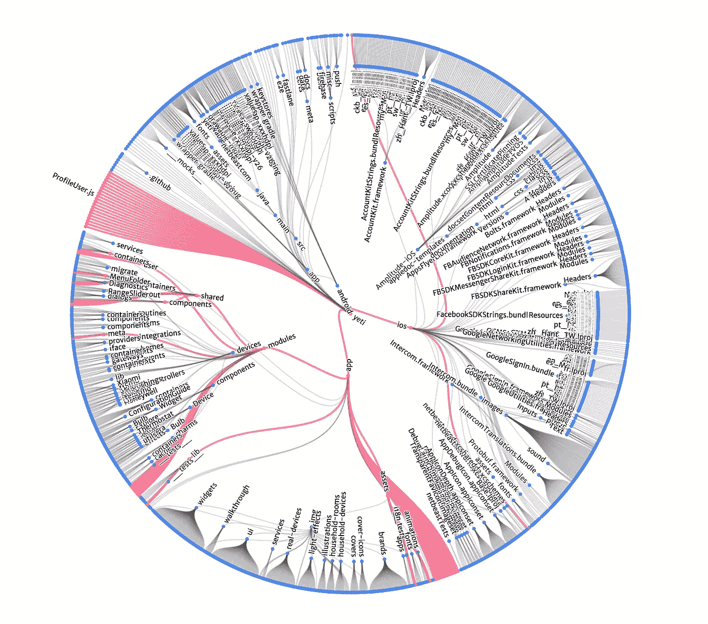

Visualization of a PR on Yeti Smart Home ([https://getyeti.co](https://getyeti.co)) codebase

与任何其他基于知识的工作一样，代码制作是艺术，而不是科学。决策非常重要，每个决策，不管是不是技术性的，都有很多副作用。所以你不能仅仅用数字的方式“衡量”一个开发者的产出，这是不公平的。

让我们开始假设你正在使用一个版本控制系统，比如 **git** 。最简单的方法是测量代码修改(行或文件添加、删除)和提交频率。许多读者都熟悉 **github** 的贡献活动图。

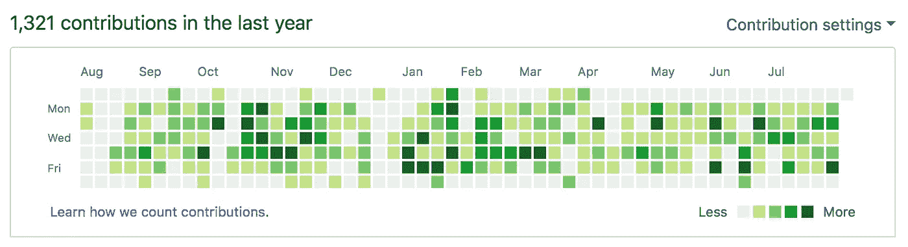

My contributions last year [[https://github.com/jsdario]](https://github.com/jsdario)

这是测量*活动*的一个很好的方法，为什么不呢，这是一个蛮数字输出。但是如果你想用这个来衡量一个组织内的“T6”生产力“T7”，那你就错了。事实上，只要你一尝试，你就会遇到以下问题:

*   在代码输出大于其质量保证能力的项目中，bug 会大量出现。还有…
*   […自动化测试本身并没有提高我们的代码质量](https://softwareengineering.stackexchange.com/questions/192/is-test-coverage-an-adequate-measure-of-code-quality)，但是确实需要代码输出
*   初级工程师的提交频率和行输出通常比高级工程师高，但相关性可能较小。如同…的情况
*   …选择短期解决方案，而不是更周到的界面来解决问题。这通常要求我们输出更多的绝对代码，但也增加了[技术债务](https://softwareengineering.stackexchange.com/questions/135993/how-can-i-quantify-the-amount-of-technical-debt-that-exists-in-a-project)。

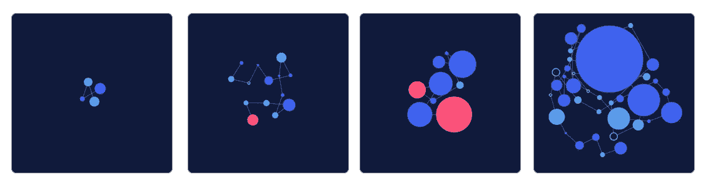

From junior to project lead, 4 developer contribution profiles in a 30 day row

大概还有更多我遗漏的点，这只是提几个。很多公司(和投资人)并不衡量“开发者生产力”。相反，它来源于产品指标。这种方法要好得多，因为**交付的速度和最终产品的质量**——就良好的客户评论或每周发布的数量而言—**只不过是团队表现的反映**。即使你会包括设计师👩‍🎨，支持💁‍♀️和其他团队成员认为，这种方法比野蛮输出更正确。

然而，我们不能改进我们不测量的东西。我们将会错过许多机会:

*   我们将无法跟踪新团队成员的发展。
*   我们将无法防止缺乏动力。
*   在没有测试到一个硬框架的情况下，我们不会准备去试验提高我们生产力的方法。

是的，我们总是可以使用定性方法。的确，它们比什么都没有好得多。然而，没有什么比得上硬数据。为了避免将人简化为数字，并保持定性分析的优势，衡量开发人员影响的更好方法不是梯子，而是数据可视化。由于每个团队和项目都是不同的，我们必须使用工具，这些工具允许我们以对组织有意义的方式感知开发人员的活动。

在过去的几个月里，我投入了一些——非常少的——空闲时间来创建一个最低限度的可行产品，为我们的团队服务。这个想法是**🔬范围**本文试图解释为什么它对我们有用。

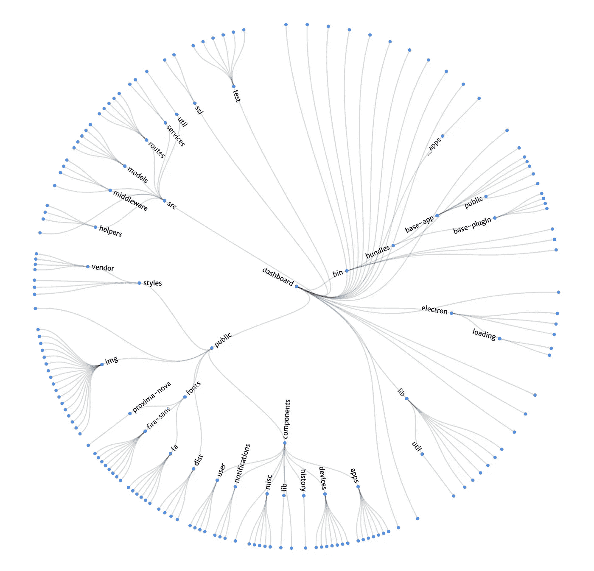

Anatomy of the Netbeast Dashboard (https://github.com/netbeast/dashboard)

# 工作流程

工程团队的大部分人都在 [Yeti 智能家居](https://getyeti.co)工作，这是一款 React 原生应用，可以在 iOS 和 Android 上运行，基于单一回购。此外，我们还有十几个 web APIs 形式的其他机器人和服务，每个都在一个单独的存储库中。因此，这篇文章不会关注运行在 [monorepos](https://developer.atlassian.com/blog/2015/10/monorepos-in-git/) 上的组织，但是可以很容易地进行改编。

## 规划

我们试图尽可能地应用精益[启动](https://hackernoon.com/tagged/startup)原则和敏捷开发方法，以我们不完美的方式，对待人类所有好的和坏的实践。实验、产品特性、增强功能和错误修复总是被分成一组**可交付的拉式请求** (PRs)。这个很关键，也是[连续投放](https://www.atlassian.com/continuous-delivery/ci-vs-ci-vs-cd)的一个原理。

PR 代表将当前产品转化为更好产品的附加值的最小单位，因此是有意义工作的最小单位。因此，这种代码库修改必须能够发布到商店/部署在服务器上。这鼓励他们尽可能做到最小，同时保持价值。在不同的冲刺阶段，一个特性可能(如果必要的话)被分割成几个版本。我们可以通过文件和修改来量化这里的工作量(现在是的)，因为这将代表输入、搜索和替换、运行 [codemods、](https://github.com/facebook/codemod)等的机械时间投资。

## 质量

每个 PR 在合并之前都必须经过审查和测试。自动和手动。自动测试可能会失败，但是如果审查者决定合并 PR，那么仍然可以合并 PR。因此，回顾是有意义工作的另一个最小单位，花费的时间对公司很重要。它们也是开发者之间最大的知识转移。在那里我们互相指出实现一个特性或使用语法的方法。这是另一种优雅的教与学的方式，不需要显式的结对编程。

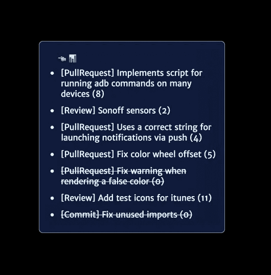

Example of scores of different work units

当错误发生时，我们只尝试编写回归测试，以防止它们再次发生，或者当集成测试可以覆盖软件用例的巨大表面时，我们才投资集成测试。这意味着我们主要为应用程序编写回归测试，为 web 服务器编写集成测试，这样我们可以轻松实现 100%的覆盖率。我们还有一个[诊断套件](https://github.com/netbeast/react-native-diagnose)，用于测试硬特性和生产环境中服务之间的交互。

有几个自动测试每个公关的机器人([商业模式测试](http://travis.com)、[应用构建测试](http://bitrise.io)和[良好实践检查](http://danger.systems/))。**这为 PRs 提供了其他维度，这些维度有助于以精确的方式度量**:(1)开发人员是否没有创建回归 bug，(2)覆盖率增加或减少，(3)需要对测试基础设施进行更改，因为测试失败了，但是——增加了技术债务——需要合并。

机器人和自动测试很重要，它们是一种被动的、隐含的、教授代码基础设施的方式。就像同行评议一样。

## 关于贡献和衡量的效率

拒绝公关的乒乓效应⏭致力于取悦评论者⏮光靠一个公关是没有成效的。很多时间会浪费在沟通上，尤其是当评审者很专注，可能会提交一个补丁来合并 PR 的时候。我们想要鼓励这种行为，所以会认为这些提交本身是有价值的，作为有意义工作的第三个单元。与推送到 master 的提交相反，这是我们想要阻止的，因为它们没有被审查(因此没有知识的转移),并且是回归的净贡献者。

Empty circles are hotfixes or commits on a PR created by another colleague

关于定量测量的另一个公平点是，无论我们使用什么算法来测量所有这些贡献(拉请求、审查、补丁和独立提交)，有一件事是肯定的:*我们会高估一些工作单元，而低估其他的*。这意味着:(1)不要相信天梯和纯数值分数，可视化是消化这类信息的方式。(2)从长期来看，该算法仍然有效，因为+/-偏移是一个零和游戏。每当我们面对任何分析系统，急于下结论时，这一点都非常重要。去吧。不是。拉什。

# 可视化算法

*截至 2018 年 9 月*

## 链接

目前，事情相当简单。您可以搜索您有推送权限的多个回购。同一回购的工作单元(拉，审查，修补程序)将出现链接。不同的链意味着不同的工作单元在项目中被执行:对组织来说更多的责任和影响。

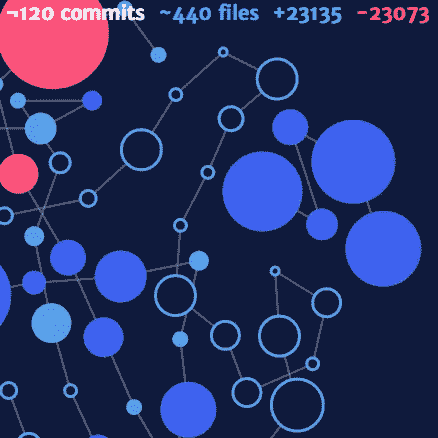

Different repos are not linked, thus are separate “islands”

链接会增加每个图表的整体得分或“力度”，最终会计算出来。

## 复习

审查规模很容易:它们应该占公关权重的 20%-40%，加上所有投入的评论(以激励知识和更正的分享)。我们也要劝阻“我看着不错👍“审查，所以强调工作流程在公司(通常)受到尊重是很重要的。PRs 在本地复制、人工测试、阅读和审查。因此，这确实意味着许多有价值的步骤。

## 拉取请求

拉取请求分数是 **mods** (添加+删除的行数) **absolute mods** (合并 PR 后不同行的数目，如果添加和删除的数目相同，可以为 0)和已更改文件的函数。最初的想法是也考虑 PR 的提交数量，但我仍在考虑如何改进这一点。这又是一个艺术多于科学的问题。

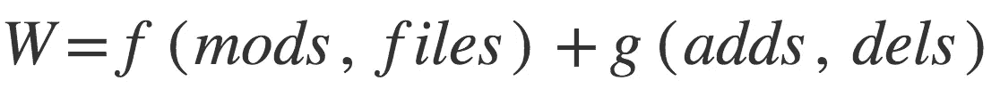

PR weight is a function of mods and files plus a function of absolute changes

> 我想进入如何建立上述功能的细节，但它们仍有待完善，是该项目的核心价值的一部分。我想创建一个关于如何将定性观察转化为定量值的帖子。

## 承诺

每个人都有不同的承诺。我试图教给我的导师们的是，采取这样的量子步骤，这样我就可以时间旅行到公关的不同阶段，这些阶段本身就有意义。非常类似于“合并的 PRs 必须总是可运输的”，但是以一种更柔和的方式。承诺更多的东西——也许——会为 PR 实现增加更多的定义，但我不认为这会影响它的规模或质量。有些日子你更累，要么发现承诺更多是有帮助的，要么制造疲劳。

我想反映提交对可视化的影响，所以我开始修补不透明度，或者投射不同的边界和阴影。现在，提交没有反映到**范围**中🔬图表。

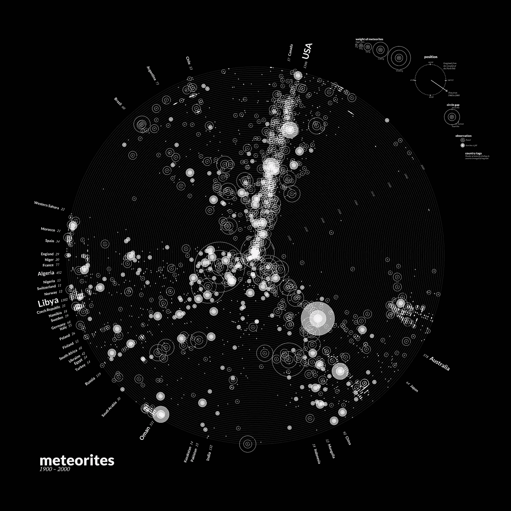

The future may be inspired in Kim Albrech’s work [http://meteorites.kimalbrecht.com/](http://meteorites.kimalbrecht.com/)

## 修补程序

相比之下，其他同事的 PRs 的单个提交(热修复)是相当大的，并且使用与 PRs 本身、mod、绝对 mod 和已更改文件相同的方法。

## 校正和实现更高的准确性

当文件或 mod 的数量很大时，算法选择对它们的标量值进行对数加权。这是有意义的:像搜索和替换或 codemod 这样的自动修改改变了很多行，但是它们本身并没有增加价值。它们通常是达到目的的手段。一个 1000 行 mod 的搜索和替换可能不会像 1000 行被手动修改*那样计算，但可能相当于修改 7 行[Math.log(1000) = 7]。*

*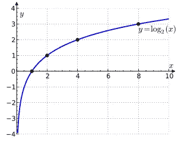*

*Abnormal number of lines modified automatically should not score as if manually*

*同时，PRs 中的 merge 提交会受到严厉的惩罚。我们试图鼓励**重定基础而不是合并**，因为它促进了一个对所有人都有益的工作流程。*

1.  *重定基数时，解决冲突是非常痛苦的。这鼓励更小的 PRs，并且不鼓励在相同的文件夹/文件上工作*
2.  *重置基础鼓励使用 master 的最后一个副本。延迟这样做将导致来自其他对等重构的冲突，这是您想要避免的(1)*
3.  *历史是容易阅读的*。这主要是一时兴起**
4.  *[重置基准并不是万能的](/@fredrikmorken/why-you-should-stop-using-git-rebase-5552bee4fed1)。如果你疯了，就合并吧*

## *提交作品的其他质量参数*

**可以用*来衡量的 PR 的其他维度已经提到过，但尚未在 [https://scope.ink](https://scope.ink) 上实现。它们是:通过的 CI 检查的数量(完全符合应该得到奖励，CI 失败应该得到惩罚)和测试覆盖的增加/减少。*

# *范围🔬作为一种产品*

*它的设计有很多限制:只有开发人员，只有 GitHub 的 API，需要特定的工作流才有意义…然而它可以提供对许多团队非常有价值的见解。节省潜在的数千工时，并对其他团队难以理解的过程给出即时反馈。*

*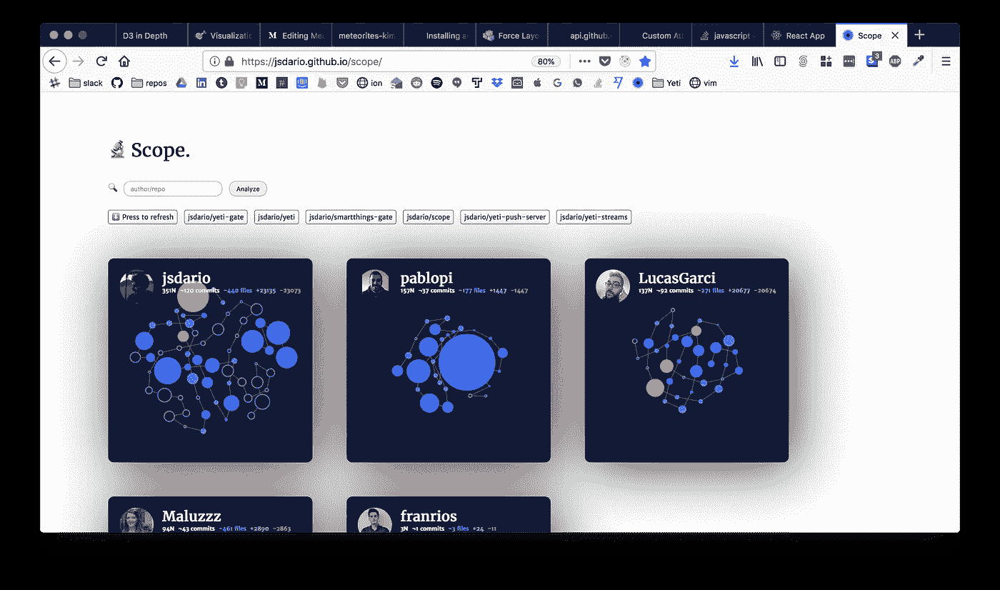*

*Scope 🔬 [prerelease](/jsdario.github.io/scope) preview*

*这种基于内容、内容质量、评审和规模的工作分析模型，可以导出到其他有 API 的领域。邮件/会议、trello / jira 项目。将不同的来源与参数混合起来，揭示来自不同团队(支持、设计、收入)的其他隐藏模式，会很有趣*

*我愿意进一步开发它，或者发布源代码，这取决于第一次发布后事情的发展。希望从团队那里得到一些有价值的反馈。*

## *请访问 [https://scope.ink](https://scope.ink) 并给予反馈*

*随着时间的推移，我认识到分享一个核心原则对于改善合作和促进创造性工作是多么重要。我在另一篇文章中写过:[软件设计原则](/@jsdario/software-design-principles-b2df3ee8d452)。我希望你会觉得有趣。*

*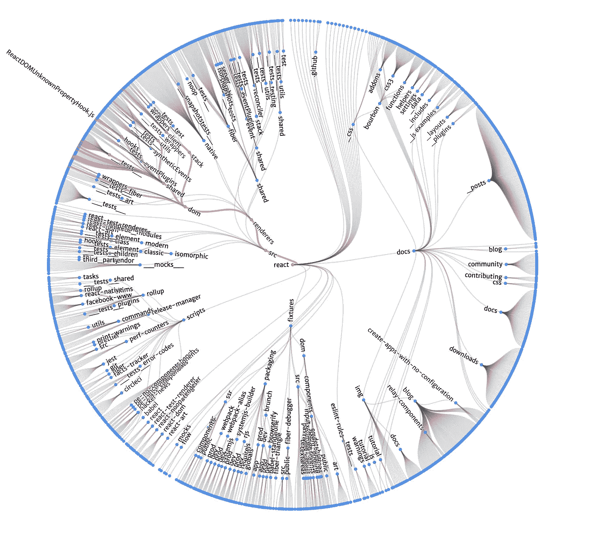*

*Anatomy of a PR on [Facebook React](https://github.com/facebook/react/pull/10385)*

*[赫苏斯·达里奥](https://medium.com/u/a8c939b0c7c9?source=post_page-----e2e18593ac79--------------------------------)🐦[推特](https://twitter.com/jsdariorivera)作者🔬[范围](https://jsdario.github.io/scope)🏡 [Yeti 智能家居](https://getyeti.co)*