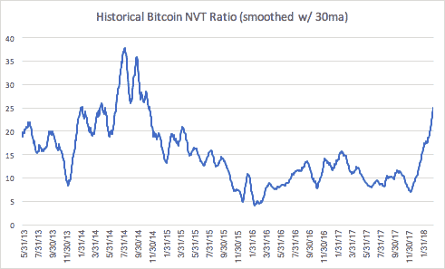
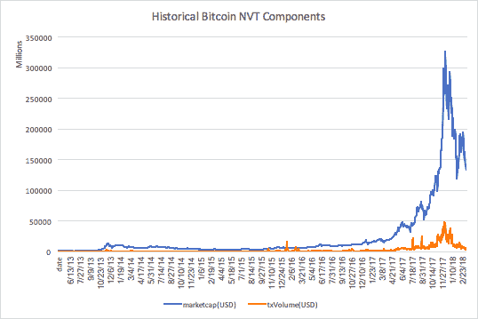

# 测量令牌速度:NVT 比率

> 原文：<https://medium.com/hackernoon/measuring-token-velocity-nvt-ratio-e3ce477612d7>

# **NVT 比率**

网络价值与交易(NVT)的比率被视为类似于股票市场的市盈率，可以用作衡量比特币等数字资产估值过高或过低的替代指标。NVT 的计算方法是市值(网络价值)除以网络上的美元交易量。

NVT 的传统“正常”范围在 20 到 100 之间。但是，使用经过 30 天移动平均线(MA)平滑的 NVT 比率，压缩了 10 到 30 之间的“正常”范围，即 10 以下被低估，30 以上被高估。例如，如果比特币的 NVT 大于 30，投资者可能会认为网络估值(市值)超过了其基础效用(在网络上交易的美元)；反之亦然。

# **新古典密码经济学**

数字资产估值的一个长期假设是，增加资产 [*速度*](https://app.mailtag.io/link-event-v2?mt__id=210397a4-2e19-11e8-b832-0674262b3940&mt__url=https%3A%2F%2Fen.wikipedia.org%2Fwiki%2FVelocity_of_money) 对网络价值有负面价格影响。这个概念是从新古典经济方程 [MV=PQ](https://app.mailtag.io/link-event-v2?mt__id=21039916-2e19-11e8-86db-0674262b3940&mt__url=https%3A%2F%2Fwww.thestreet.com%2Ftopic%2F46643%2Fmonetarism.html) 中借用的。这种动态是货币资产效用的结果，货币资产既是交换媒介，也是价值储存手段(速度较慢)。

举例来说，想象一下持有 100 美元一个月或 100 津巴布韦元的选择。一个月后，你的购买力仍然是 100 美元，你对哪一项更有信心？从理论上讲，人们希望摆脱价值货币或数字资产的不良存储，这增加了流通速度，并对其市值产生了负面影响。

# **NVT 比率=网络速度**

实际上，使用 MV=PQ 等式，NVT 比率在数学上等同于 ***网络速度*** 。下图说明了比特币的历史高估水平(高速度年)与熊市(2014 年至 2015 年)相吻合。类似地，比特币的牛市年份(2013 年、2016 年至 2017 年)显示，NVT 在低估至“正常”范围内振荡(低速年)。

此外，下图显示了 2018 年比特币的 NVT/速度峰值，这是有道理的，因为比特币今年(高速度年)已经损失了约 50%的价值。此外，NVT/速度与比特币市值之间的负相关关系在 2018 年和 2013 年以来的相关系数分别为-0.46 和-0.09。

*[coinmetrics.io](https://app.mailtag.io/link-event-v2?mt__id=c03bd270-3821-11e8-8f27-065c954bc2f4&mt__url=http%3A%2F%2Fcoinmetrics.io%2F)

# **似是而非的解释？**

一个可能的解释是，NVT 比率必须永远为过去牛市的罪恶买单，因为它们往往会偏向极度高估和过度繁荣。例如:

*   **首先:** BTC 开始下跌，NVT/周转率上升，不确定性增加，周转率再次上升，价格进一步下跌，直到市值和交易量(美元)之间的差异消失。

*[coinmetrics.io](https://app.mailtag.io/link-event-v2?mt__id=c03bd446-3821-11e8-8bb1-065c954bc2f4&mt__url=http%3A%2F%2Fcoinmetrics.io%2F)

*   **第二:**随着市值和网络交易之间的差距恢复到其长期均值，NVT/周转率开始下降。
*   **第三步:**第二步持续展开，直到找到底部，历史上低于 10，但更接近 5。
*   **第四:**一旦找到底部，下一轮牛市就开始了，NVT 在“正常”范围内震荡，直到估值变得“有泡沫”，过去的罪恶必须再一次被清洗。
*   **第五步:**步骤 1 重新开始，NVT/速度开始增加。
*   **第六:**冲洗，重复一个 la [反身](https://app.mailtag.io/link-event-v2?mt__id=21039a56-2e19-11e8-9ec2-0674262b3940&mt__url=https%3A%2F%2Fwww.coindesk.com%2Fxrp-dichotomy-ripple-price%2F)。

# **总结**

需要注意的是，2017 年底，比特币的 NVT 接近 5。事后看来，那只会是一个购买比特币的好时机，因为你在 2018 年 1 月的头几天卖掉了它，获得了快速而丰厚的利润。不幸的是，投资者心理并非如此，买入信号会让投资者损失惨重。

我们可以为[安全边际](https://app.mailtag.io/link-event-v2?mt__id=4378c1c6-38f3-11e8-969c-06d6244026ec&mt__url=https%3A%2F%2Fwww.investopedia.com%2Fterms%2Fm%2Fmarginofsafety.asp)插入的一个警告是，接近 5 的潜在买入信号应该来自熊市，而不是已经繁荣的牛市。

***免责声明*** *既非本文作者，也非风险投资家，不提供投资、金融或法律建议。这不能代替专业建议和独立的事实验证。本网站提供的内容仅供参考，不应被解释为任何投资机会的任何类型的投资邀约。*