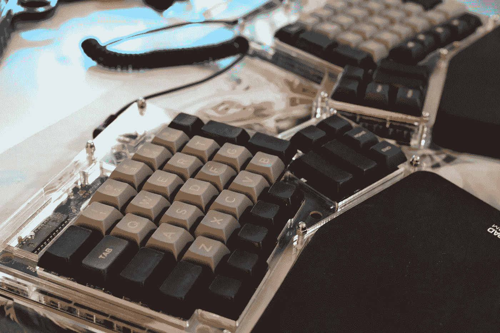
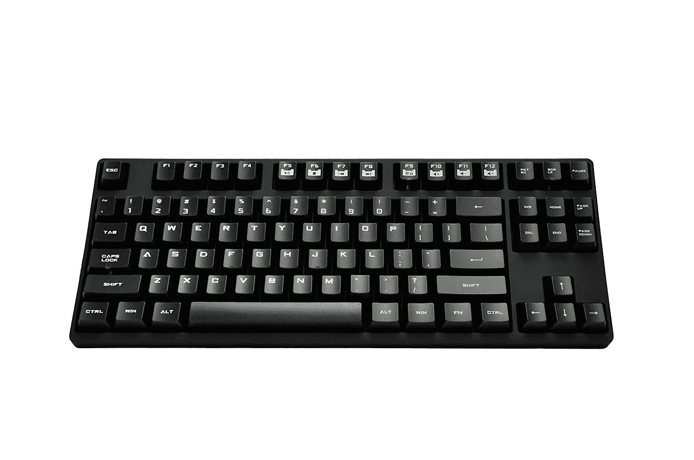
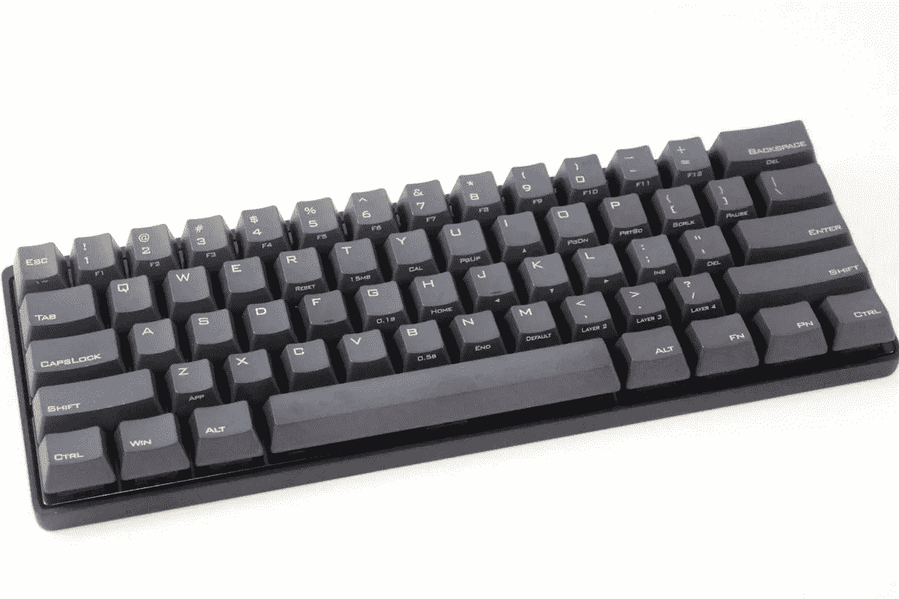
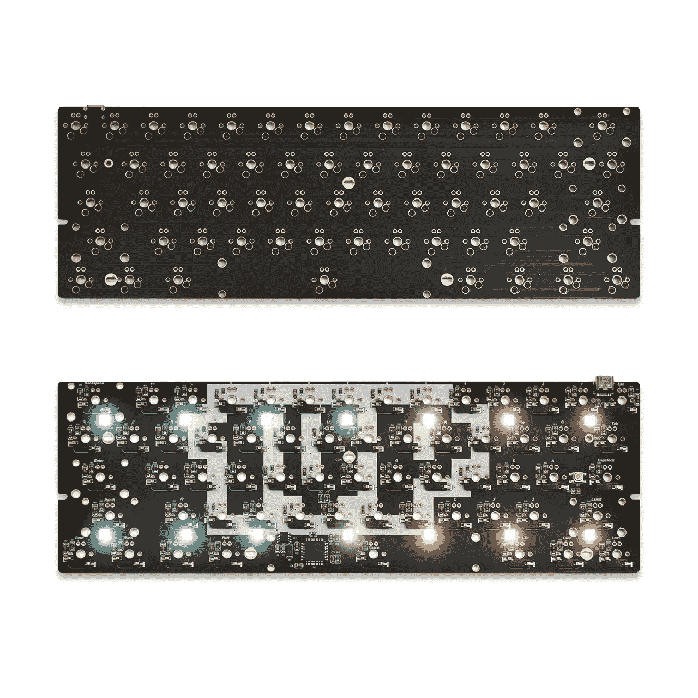

# 机械键盘和定制键盘

> 原文：<https://medium.com/hackernoon/mechanical-and-custom-built-keyboards-6343820da70d>

什么是“旧”又是新的，机械键盘！机械键盘是在每个键下都有一个分立的机械开关的键盘。有许多网站可以详细介绍这些功能的具体细节，以及交换机之间的所有差异。这篇文章并没有深入讨论交换机本身的细节，而是讨论了所有其他的东西。Lifehacker 几年前写了一篇关于交换机的内容丰富的文章。[https://life hacker . com/how-to-choose-the-best-mechanical-keyboard-and-why-you-511140347](https://lifehacker.com/how-to-choose-the-best-mechanical-keyboard-and-why-you-511140347)

为什么要用机械键盘呢？当一个人一周 5 天每天至少花 8 个小时使用键盘时，一个“感觉更好”的键盘可以极大地提高即使是平凡任务的乐趣。这是 IT 专业人员的世界，他们，一般来说，IT 专业人员，喜欢深入这个亚文化/利基的兔子洞。兔子洞的第一阶段是简单的机械键盘。这些都可以在亚马逊上找到，在网上随处可见。它们是基本的键盘，有时有 led 灯，大多数时候带有制造商的特定机械开关。键盘的第二层是开关被特别调用的地方。这是 gateron 或 cherrymx 开关，这些键盘可能看起来有点微妙，但它们通常是全尺寸键盘或十键布局。在这篇来自 massdrop 的文章中称为 tenkey (tk)或 tenkeyless(tkl)[https://www . mass drop . com/talk/947/keyboard-layouts-explained-in-detailed-many-pics](https://www.massdrop.com/talk/947/keyboard-layouts-explained-in-detail-many-pics)这种键盘也可以具有 60%的布局，即 ten keyless，但是减去了功能键、箭头键和 home/end/page up down 键。最后，第三层是完全定制的电路板。这些是 ergodox、ortholinear、40%和完全定制构建。这是一大堆要扔掉的信息，下面是更多的细节。

https://olkb.com/
麦角新碱[https://ergodox-ez.com/collections/frontpage](https://ergodox-ez.com/collections/frontpage)
百分之四十[https://thevankeyboards.com/products/backerselectkit](https://thevankeyboards.com/products/backerselectkit)

从 1 级开始；全尺寸和十个无键键盘。有入门级键盘。有时候，人们会从这里开始，在这里结束，甚至回去，因为这些都是很常见和舒适的。它们看起来就像其他键盘一样，根据选择的开关，它们可能不会有什么不同。人们不禁会问“这有什么大不了的？”这种键盘的一个完美的例子是 cmstorm 系列，它很容易从 amazon 获得。首先是 tenkeyless，然后是全尺寸[https://www . Amazon . com/Storm-quick fire-Rapid-ten keyless-Mechanical/DP/b 0068 insum](https://www.amazon.com/Storm-QuickFire-Rapid-Tenkeyless-Mechanical/dp/B0068INSUM)。[https://www . Amazon . com/Storm-quick fire-Rapid-ten keyless-Mechanical/DP/b 00 eqv 0 w 02？这些键盘价格从 40 美元到 80 美元不等，和大多数人见过的一样。它们会插上电源，做其他键盘会做的事情。(打哈欠)](https://www.amazon.com/Storm-QuickFire-Rapid-Tenkeyless-Mechanical/dp/B00EQV0W02?th=1)

更深入地钻研第二级；一些全尺寸和十键可能有提到的具体开关，如 cherrymx 或被称为 gateron 的克隆。但是第二层是更独特的键盘，比如 60%的布局。这就是键盘开始变得有趣的地方。经典的 60%被称为漩涡 pok3r。【https://mechanicalkeyboards.com/shop/index.php? l=product_detail & p=3633 。这些主板起价约为 120 美元。这种布局需要一点学习过程，因为没有箭头键。棋盘有一个默认的分层系统，允许选择层来将一个键转换成不同的键，因此箭头簇被移动到 IJKL。这种键盘的好处是它允许用户重新编程按键映射的位置。这是在键盘上完成的，通过一系列按键来转换模式，然后将一个键移动到不同的位置。虽然这是一个很好的功能，以正确的顺序和正确的时间击中所有正确的键，但这可能是一种痛苦。然而，在一天结束时，这些箭头可以很容易地重新映射为类似 VIM arrows HJKL 的东西。一旦这种定制被体验和玩弄，瘙痒开始变得更大，它是通向真正定制键盘的门户药物。

这里我们发现第三级；完全定制和定制的键盘。这些不是日常使用的键盘，它们被称为 ergo DOX $ 300[https://ergodox-ez.com/collections/frontpage](https://ergodox-ez.com/collections/frontpage)，Planck $ 150【https://olkb.com/】T2，minivan $ 200[https://thevankeyboards.com/products/backerselectkit](https://thevankeyboards.com/products/backerselectkit)，以及 1up 60 HSE $ 100–250([https://www . 1up keyboards . com/shop/controllers/1up-rg b-PCB-HSE/](https://www.1upkeyboards.com/shop/controllers/1up-rgb-pcb-hse/))之类的全定制键盘。

这些通常作为套件出售，然后使用各种开关类型、外壳材料和定制键帽进行焊接和组装。正是这些独立的部件开始让这些键盘变得独一无二。像铝、[https://www . 1 up keyboards . com/shop/bases-and-cases/al 60 case-champagne/](https://www.1upkeyboards.com/shop/bases-and-cases/al60case-champagne/)或紫心[这样的硬木。设计和布局也会引起同事的注意，并询问“搞什么鬼”,尤其是当一个人第一次遇到 ergodox 时。这种键盘，特别是具有完全分离布局和移位的正交布局的键盘，会导致一些人在第一次接触时不能使用这种键盘。这些键盘中的大部分需要花很多时间来组装，并且需要焊接技能。然而，1upkeyboards 60HSE(热插拔版)是定制键盘的新成员。这是新一代 PCB，允许使用各种 sip 插座交换开关。这允许开关被推入和拉出，而不需要焊接和脱焊每个开关。将它们焊接在一起的努力可能会令人望而生畏，并且经常会在电路板的某个地方出现小短路，这需要调试每个开关来找到缺陷。热插拔风格消除了这个问题，并大大降低了入门门槛。](https://thevankeyboards.com/collections/catalog/products/retro60-keyboard-case-purple-heart)

除了外表，引擎盖下才是这些键盘真正开始发光的地方。前面提到的所有键盘都能够运行名为 QMK[https://github.com/qmk/qmk_firmware](https://github.com/qmk/qmk_firmware)的定制固件，QMK 是一个开源项目，支持超过 120 种键盘。它是用 C 写的，可以从 docker 镜像编译而来。强烈建议使用 docker 映像，因为在使用 docker 构建时，有许多工具包和包的依赖关系可以立即得到解决。QMK 本身允许对键盘的每个方面进行完整的编程。德沃夏克布局？没问题。科尔马克？，不是问题。ergodox 甚至可以转换成速记布局。速记很容易就要 1000 多美元，所以 300 美元的价格标签很便宜。QMK 的杀手锏是它能够将各种宏编程到硬件本身中。其中，为了调出正确的层和键而进行的一系列击键可以触发用 C 编写的函数来启动，这将输出用户可以想象的任何内容。个人最喜欢的包括发送ಠ_ಠ` \_(ツ)_/ (╯ □ )╯ ︵ ┻━┻)的 unicode 符号，这些也可以用于为那些在开发人员的土地上重写相同的注释头或其他单调乏味的事情的人编写完整的代码块。实现定制编程也比遍历一系列按钮序列容易得多。该过程需要将固件编译成十六进制文件，然后按下键盘上的复位按钮，并将十六进制文件刷新到键盘。不要大惊小怪。可能性确实是无穷无尽的。

这是对机械键盘的小众世界的简单介绍。花大量时间在屏幕前和键盘上的人往往对他们的感觉和他们的设置有亲和力。当然，使用一个基本的键盘很容易，但当黑客的街头信誉可以通过屋顶时，当有人停在你的桌子旁边，根本不知道如何使用坐在他们面前的文本输入设备时，有什么乐趣呢？为了获得更多的信息，这些人会前往 https://www.reddit.com/r/mechanicalkeyboards 的 T2，花上几个小时浏览那里提供的一切。这是一个深不见底的兔子洞。祝你好运。