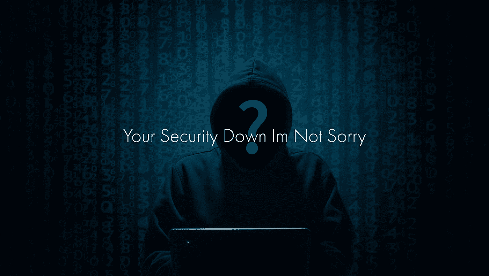

# 媒体和娱乐漏洞再次被利用

> 原文：<https://medium.com/hackernoon/media-entertainment-vulnerabilities-exploited-again-dce556996daa>

> “Ticketfly 网络攻击是后 GDPR 时代发生的首批重大安全事件之一。虽然该公司尚未证实客户数据遭到破坏，但从表面上看，黑客的说法——他/她通过未打补丁的漏洞或错误配置成功访问了他们的数据库——是完全有可能的。”—云应用分析和政策公司 Netskope 的创始人兼首席执行官 Sanjay Beri。

音乐会和体育赛事票务网站 Ticketfly 是最近一次网络攻击的受害者，我们现在知道该网站离线约一周，暴露了大约 2700 万个账户的数据。拥有 Ticketfly 的旧金山公司 Eventbrite 表示，与账户相关的姓名、电话号码、地址和电子邮件地址都在黑客攻击中被访问，而信用卡和借记卡号码等财务信息幸运地没有暴露。然而，这种大规模的安全利用是对媒体和娱乐(M&E)行业中存在的主要漏洞的严酷提醒。

# 媒体和娱乐公司在哪些方面最容易受到攻击？

正如我去年在[的一篇文章](https://blog.dataart.com/the-media-entertainment-industry-is-under-cyber-attack/?utm_source=linkedin&utm_medium=social&utm_content=hackernoon-post-link&utm_campaign=m-regular)中所讨论的，M & E 公司特别容易受到网络安全威胁，主要是因为大量的人参与内容、电影和视频制作。核心团队通常由过多的专家组成，从制作特效的专家到乐谱作者和许多其他人，这导致了黑客获取数据的一系列潜在安全漏洞。

随着该行业越来越依赖数字技术来提供产品，收集的大量数据对黑客来说是不可抗拒的，包括消费者信息、生产和后期制作数据以及公司与其创意开发人员和发行团队之间关系的细节。

此外，内容通常是 M&E 公司最有价值的资产，知识产权被盗会造成巨大损失。随着行业努力采用通过 IP 向消费者自有设备提供多服务和多协议的个性化内容，M&E 公司必须记住，尽管有针对性的数据驱动方法提供了极好的个性化产品和商业机会，但它也会成倍增加安全风险，除非采取适当的安全措施。

不幸的是，对媒体和娱乐行业的攻击持续上升，事件数量在过去几年翻了一番多。从 2014 年索尼影视娱乐公司(Sony Pictures Entertainment)遭受的臭名昭著的网络攻击，到最近的 Ticketfly 事件，以及这之间的许多其他事件，M&E 行业必须保持警惕，高度组织化地应对网络安全。

# 利用整体网络安全方法构建可靠的战略

虽然打击黑客极具挑战性，但雇佣专家来设计和维护所有系统是减少安全漏洞的一个极好的方法。M&E 公司只有采用整体方法并在组织内建立一致的网络安全战略，能够快速、全面地监控和缓解问题，才能在不断增长的网络威胁面前保持领先。

然而，AT & T 的最新[报告《注意差距:网络安全的巨大脱节](https://www.business.att.com/cybersecurity/archives/v6/)》表明，许多“*公司的网络安全战略可能会提高——而不是降低——网络风险*”。该报告确定了令人关切的主要领域，包括过度依赖保险而不是投资于预防、过度自信内部能力以及网络安全意识和培训方面的差距。

为了在不增加风险的情况下进行创新，M&E 公司应该尽职尽责，建立一个多层次的网络安全战略。

*   确保所有关键和敏感系统的定期安全评估和漏洞缓解，包括由第三方专家进行评估；
*   集成支持云的身份和访问管理，以保护网络和数据；
*   在整个开发生命周期中使用渗透测试；
*   对于移动解决方案，实现强大的服务器端身份验证组件、传输层加密和自动化会话管理；
*   利用先进的认证技术；
*   投资进行广泛的员工培训，以识别网络钓鱼电子邮件和其他恶意工具。

最后但同样重要的是，在您的组织内外进行协作。仅有技术是不够的，而且与流行观点相反，网络安全不仅仅是一个 IT 问题。所有 M&E 利益相关者、供应商和解决方案提供商都有责任抗击网络威胁，使其成为更大风险管理和数字战略的一个组成部分。

否则我们肯定会再次看到这条信息:

**你的安全下来了我不难过**

你对媒体和娱乐安全漏洞有什么担心？请在下面的评论中分享你的观点。

*由* [***谢尔盖·布多夫***](https://www.linkedin.com/in/sbludov/) *高级副总裁* [*媒体与娱乐实践处* ***数据艺术***](https://www.dataart.com/industry/media-and-entertainment?utm_source=medium.com&utm_medium=referral&utm_campaign=m-regular&utm_content=sbludov-hn-mediavuln)

*原载于*【Linkedin.com】**。**