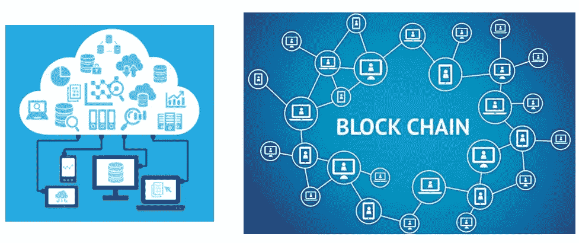

# MedicalChain:区块链健康记录是未来吗？*象征性投资者观点*

> 原文：<https://medium.com/hackernoon/medicalchain-is-blockchain-health-records-the-future-token-investor-point-of-view-82755fd7fd9f>

最近，美国医疗保健巨头梅奥诊所(Mayo Clinic)与一家名为 MedicalChain 的区块链公司合作，试点一系列不同的项目，从一个分散的安全患者数据库开始。

在区块链技术的早期阶段，任何具有真实用例并与大型企业合作的项目都绝对值得一试，当我查看 MedicalChain 项目时，我惊讶地发现它们的市值非常低，只有 1170 万美元，在 CMC 排名中排名第 388 位。

事实上，尽管不到一周前梅奥诊所合作的重大新闻，代币价格处于历史最低点，比历史最高点下降了 70%。负面价格行为当然是因为市场崩溃，它并不孤立于这个项目，但在 CMC 上排名 388，市值只有 11.77 美元。我认为这个项目被低估了，所以想深入了解一下。

根据约翰·霍普斯金大学的一项研究，仅次于心脏病和癌症的第三大死亡原因实际上是医疗失误！医疗错误，如开错药，比事故、中风、糖尿病、肺炎或自杀造成的死亡更多。

医疗差错如此普遍的原因不是因为医生的无能，而是因为医疗机构各自为政。一个病人的家庭医生可能知道他对某种药物过敏，但是如果这个病人被送进医院，医院的医生可能不知道这一点，并且开错了药。医疗实践并不共享他们的信息，因此零散的患者数据常常导致糟糕的医疗决策。

想象一下，如果医疗保健系统能够拥有一个通用且安全的数据库，那么参与患者护理的每一方，从当地医生到医院和药房，甚至保险公司和远程医疗咨询机构，都可以访问患者的健康档案。交流会变得多么容易。

此外，由于 MedicalChain 是基于区块链和去中心化的，数据将是安全的。

目前，医疗机构每年花费数千到数百万美元来确保患者信息的安全。任何个人的健康档案都是最隐私和最敏感的信息之一，在黑市上，患者的健康信息目前比他们的信用卡价值高 10 倍。

此外，它不仅仅是窃取信息，它还修改信息。据估计，保险欺诈每年造成的损失超过 400 亿美元。

目前最好的医疗数据存储服务是云服务器。云服务器将信息存储在云中，由中央服务器监控。然而，即使云存储也是集中式的，这意味着黑客可以从一个单独的黑客点访问大量的患者数据。这在历史上发生过几次。云服务器不断试图更新其安全功能，黑客不断试图提出新的和创造性的方法来入侵系统。这根本不是一个永久或安全的解决方案。

存储病人数据的最安全和最可靠的技术是通过区块链，在区块链中，信息是分散的，实际上无法被黑客攻击。它也不是单一来源的中心，这意味着数据不能被修改或丢失。此外，作为额外的安全和隐私层，Medicalchain 对所有信息进行加密，因此只有个人才能控制他们的数据。

如今，个人数据的所有权越来越受到关注。病人经常告诉医生一些他们甚至不会向配偶吐露的事情。但是你知道吗，当你去医院的时候，你的个人信息是属于医院的，而不是你的。你出院后，如果你回去要求阅读你的笔记，你将不得不经历一个漫长的申请信息自由和许可的过程，然后你的笔记才会被授予你。相反，一个医院的新实习生，可以在未经你允许的情况下 24/7 不受限制地接触到你的大部分个人信息。那是因为信息不属于你。

但有了 MedicalChain，你的个人信息完全属于你，专业人士只有在你允许的情况下才能访问。我认为这是应该的。

在实际的区块链结构方面，Medicalchain 将采用使用 Hyperledger 和以太坊的双区块链结构。

Hyperledger 作为一个网络是基于许可的，并且非常保密、灵活和可扩展。它非常适合医疗信息，因为它提供了敏感数据所需的隐私。拥有多层权限，这也意味着患者能够控制哪些医生可以访问他们的哪些数据。

以太坊将用于管理所有的账户和交易。它适合这项任务，因为它使用了智能合约，以及区块链的透明和安全特性。

这个看起来相当复杂的图表代表了加密技术。

对于那些更倾向于技术的人来说，您可以在白皮书中详细研究它，但一个简单的总结是，所有患者的数据都将存储在一个安全的数据存储中，并且该数据的散列存储在分类帐中。数据的解密只能通过病人的私钥来完成，所以即使是医护人员也不能看到这些信息。

在某些医疗条件下，患者可能无法给予许可。这可能涉及癫痫、心脏病或意外事故等情况。医疗链实际上已经开发了他们自己的硬件手镯，病人可以在紧急情况下佩戴，这样，在紧急情况下，急诊科的两名特别授权的医生可以同意访问数据。并且不是所有的数据都是可用的，只有紧急数据是可访问的。这种手镯的概念实际上已经成为患有严重疾病如癫痫的病人的常见做法，他们知道自己可能会癫痫发作等..然而，现在的护腕只是打印出他们的药物和过敏清单。所以这个手镯能提供更多信息。我唯一的负面评论是，它看起来不太吸引人，希望在未来的发展中，他们会发布一个更美观的配件。

运行该程序的软件将很容易在电脑和手机上安装和使用，正如你在前面的视频剪辑中看到的那样。只要有互联网接入，就可以使用该技术。如果服务使用 MedicalChain，将不再需要纸质文档。

除了提供医疗数据存储和安全性之外。MedicalChain 将是一个推出他们自己服务的平台，他们创建的第一个应用程序是一个名为 MyClinic 的远程医疗服务。在这个应用程序中，患者不需要离开他们的家去看医生，他们只需通过视频电话与医生进行电话会议和聊天，医生从区块链中获得他们的医疗数据，并可以相应地治疗他们。

显然，远程医疗不能用于所有情况，但它对随访预约和简单的复查非常有帮助。这将为卫生系统和病人节省大量的时间和金钱。

伦敦的格罗夫斯医疗集团将于 2018 年 7 月成为英国首家试点 MyChain 应用的医疗集团，他们也将接受加密货币作为支付方式。他们是一个拥有超过 30，000 名患者的大组织，并且他们在 NHS 系统之下。对于那些不熟悉这个术语的人来说，NHS 是英国的国家卫生基金系统，MedicalChain 是与这个系统兼容的。

最近，福布斯在一篇概述“30 多个区块链技术实践实例”的文章中，将 MedicalChain 列为其中一个实例。

因此，在与美国梅奥诊所、伦敦格罗夫斯医疗集团的合作以及现在福布斯的一篇有利文章之间，这个项目正在获得一些重要的用例和牵引力。

这是项目背后的团队。首席执行官实际上是一名在医疗领域工作的医生，知道当地面临的问题。团队的其他成员来自不同的背景，例如商业、法律、通信、网络安全，当然还有开发人员和工程师。这是一个很大的团队，角色很平衡，相当多的成员在各自的领域都有丰富的经验。

总的来说，他们看起来是一个可靠而聪明的团队。

这个由医生推动的整个项目的意义在于，它是临床引导的。如此多的区块链项目在技术上由开发人员领导，他们不知道商业或医疗或供应链企业真正需要什么，这真的是大规模采用区块链的最大障碍之一。所以这个项目是由一个医生开发的，他发现了这个领域的一个问题，并提出了一个解决方案。这就是为什么它在起作用，这就是为什么尽管它们是一个非常年轻的项目，还不到一年，像梅奥诊所和格罗夫斯医疗集团这样的大型卫生机构正在跳上船来。我认为这个项目的概念很有潜力。

这些是他们的顾问，包括顾问医师、区块链先驱和企业家、投资经理、医疗实践战略顾问和律师。

因此，这又是一个非常多样化和平衡的群体。

这是他们的路线图，需要注意的关键里程碑包括将于 2018 年 7 月(即下个月)引入试点的医疗紧急手环。第三季度的剩余时间将在中国、日本和韩国推出试点，并在美国和英国完成。只有在 2019 年 3 月，我们才能看到全功能医疗链平台的推出。

作为代币投资者要考虑的一件事是代币的使用。作为代币投资者，我们投资的是代币，而不是公司。因此，如果公司成功了，但没有使用代币，我们就不会得到好的回报。像任何货币一样，代币的价值是由需求决定的，用得越多，就越值钱。

在这里，我想向你解释 MedicalChain 的象征性用途，这不是一个坏的或好的，它只是不同的，如果你打算投资这个项目，你应该明白这一点。

我们已经审查了相当多的区块链 ID 为基础的项目，如本体，关键等..通过这些项目，每当企业(例如银行)想要使用个人数据时，他们都必须支付一些代币。因此，令牌的使用 100%依赖于技术。有了医疗链就不一样了。

如果我们考虑将使用 MedicalChain 技术的各方，例如医院、社区医生等..每当患者允许医生访问他们的信息时，区块链技术就被用来提取和解密数据。然而，即使使用了该技术，也不需要使用令牌。这个过程是免费的。换句话说，令牌的使用与技术的使用无关。

该项目的主要收入不是来自现有的医疗保健企业，而是来自他们自己的医疗保健项目，例如远程咨询服务。要使用远程会诊服务，病人当然要付费，而医疗代币是付费的一种形式。患者也可以选择用信用卡或贝宝支付。所以代币的使用对于医疗服务来说是可选的，而不是区块链技术。

现在 MedicalChain 的目标是引入更多令牌使用的举措，例如与研究或保险公司合作，这些公司将不得不为使用他们的数据向患者支付费用。患者当然可以完全控制他们的数据，并可以选择加入或退出这些项目。

该项目的长期目标是创造越来越多的医疗保健计划，并形成一个生态系统。

从技术上讲，生态系统的规模没有限制，他们可以有 10 个或 1000 个项目，这可能会导致令牌的潜在大型用例。然而，也可能发生相反的情况，因为像远程咨询这样的一些倡议将为患者提供用法定货币支付的选择。事实是，没人知道代币会如何使用。

希望使用该技术的现有医疗机构，例如诊所或医院，将不得不支付一定比例的费用。例如，如果一个全科医生每次咨询收费 50 美元，他们可能会收取 1 美元的费用，等等..费率尚未确定，也未确定该费用是以固定方式还是加密方式支付。因此，可能没有使用令牌。展望未来，我强烈建议象征性投资者关注这些消息。

最后，看看象征性的价格。令牌目前处于 0.06 美元的历史低点，比历史高点低了 70%以上，而且他们拥有真实的使用案例和大型企业合作伙伴关系，这使得它成为一个值得考虑的项目。

从代币投资者的角度来看，我希望看到更多代币的使用。代币有需求的潜力，特别是如果他们的生态系统起飞，但我觉得代币也有不被使用的潜力，这让我作为代币投资者感到紧张。但在如此低的市值下，这种硬币可能会长期增长。但是总的来说，伟大的项目，伟大的用例。这绝对是医疗保健行业急需的解决方案。如果这个项目来到我的领域，我肯定会考虑把它作为一个病人来使用。

请在下面的评论区让我们知道你对 MedicalChain 的看法，你认为这是一个好项目吗？你是否关心代币的使用？

一如既往，这些都不是专业建议，这只是我个人的看法和漫谈。一定要自己做研究，自己做决定。

这就是我的伙计们，有一个美好的一天，我会赶上你们的另一个检讨很快！