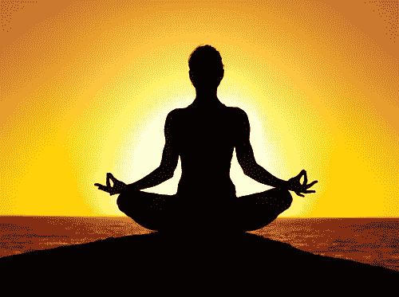
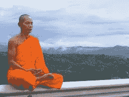
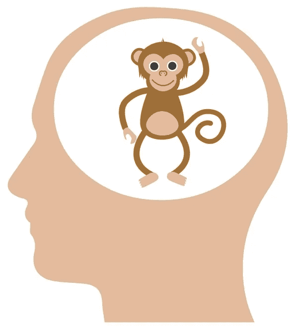
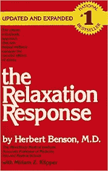
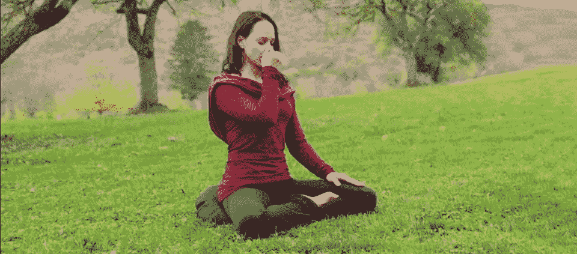

# 西方人的冥想技巧(东方人也一样！)

> 原文：<https://medium.com/hackernoon/meditation-hacks-for-westerners-and-easterners-too-6d3efcf1dfe3>

今天你在网上任何地方都不会听不到冥想的好处。

就像之前的瑜伽一样，冥想开始在西方成为主流。部分原因是许多好处现在已经在科学研究中得到验证，包括平静的感觉，降低血压，减轻压力(这在西方似乎比现在正在消失的传统东方更普遍)，处理焦虑，减少暴力倾向，等等。最近的一项研究甚至发现，冥想实际上可以增加大脑中的灰质！

Meditation Has All Kinds of Benefits — so how should I start??

## 那么我从哪里开始呢？

“太好了！”当我们谈论冥想时，人们总是对我说。对于那些不经常冥想的人来说，下一个问题是:“那么我该如何开始，我应该使用什么技巧？”

并不是没有任何关于如何冥想的信息——对西方人来说，更多的是 1)信息太多，2)西方人很快就厌倦了，许多人发现简单的呼吸冥想，最常见的冥想方法，不能足够长时间地保持他们的注意力。另一个抱怨是“什么都没发生”，或者“我分心了”，所以“我停止做了。”

对于西方人来说，瑜伽必须被剥离到它的“身体部分”(在瑜伽中，*体式*，或姿势，只是瑜伽的八个分支之一)，冥想需要被西方观众改编(已经被改编了)。

首先，冥想被剥夺了精神意义——例如，传统佛教中冥想的目的与其说是为了身体健康，不如说是为了学会认识“现实的真实本质”。另一方面，它通常被称为正念训练，这当然与坐下来冥想有关，但不是一回事。

今天有一些应用程序和技术可以帮助你冥想，但我想分享一些我多年来学到的技巧和技术，让你更容易冥想并坚持下去。

Most Meditation Teachers Say: My Way IS Best

## ***最冥想老师的主要问题***

另一件需要认识的事情是，对于中介来说，没有“一刀切”的方法——这就是为什么有这么多不同的技术。你可以在当地的瑜伽中心或精神书店找到冥想课(尽管这些地方一年比一年少)，成人教育中心甚至公司的人力资源部门现在都提供课程。

当然，这是学习冥想的最好方法:去一个有人可以向你展示他们技巧的班级。问题是，我去过的几乎每个冥想班都只教一种冥想技巧！每个传统都认为他们的技术是“万能的”。

我记得去过一个禅宗中心，让我们静坐 45 分钟。除了“注意呼吸”没有其他指示。这非常痛苦——当然，我没有成为那个传统的一部分，那个传统认为这是他们冥想的“简短版本”(他们经常有持续几天的静修，在冥想和行走之间交替几个小时)。我不是反对他们或他们的传统，但这对大多数西方人来说是行不通的，他们对自己的传统不是超级超级忠诚。

我发现尝试不同的技巧并不仅仅是一种技巧，而是很好的——也许尝试一种技巧一个星期，尝试另一种一个星期，然后交换。然后你会找到对你来说最容易跟上的那个。你也可能会觉得有趣，就像你可能会不时改变你的锻炼程序，在不同的技术之间切换。我发现，就像你可能想在同一次锻炼中锻炼出不同的肌肉一样，西方人的猴子思维可能会最好地结合一些我将在下面介绍的技巧。

当然，传统的老师会对我说的这些感到震惊。当被问及“最好的冥想方法是什么？”几乎每一个传统和冥想班都有相同的答案:我们的方法是最好的！你不能改变任何事情——你必须照我们说的做，坐着，一点也不改变！

## ***西方人与猴子的心灵***

众所周知，冥想时大脑会走神——任何试图静坐 3 分钟或试图让一个 5 岁的孩子静坐 1 分钟的人都可以告诉你这一点。这就是传统上所说的猴子思维。

思想走神是可以的。冥想的要点是承认游荡，并将思想带回到冥想的对象。在这样做的时候，你正在建立一个专注的精神肌肉，但是你必须小心，如果你做得“强有力”或者“过于集中”，那么你就没有达到“分离”或者“释放”。诀窍是观察心的徘徊，并轻轻地将心带回冥想焦点的呼吸。

The monkey mind is your primary obstacle to inner calm!

虽然东方人可能可以只是坐着看“猴子思维”，但对西方人来说，我发现最好给猴子思维一些事情做，最好有一些东西让思维回到不仅仅是呼吸的状态。也许我们的注意力持续时间更短，我们更容易分心。

## ***一些有助于猴子思维的冥想技巧***

这些年来，我从不同的老师和传统中学到了一些简单的技巧，可以帮助西方人应对猴子思维，让冥想练习变得更加容易。以下是一些最好的例子:

1.“哦，好”技巧

2.咒语(无声或大声)

3.冥想脉轮

4.用音乐冥想

5.热身

每一个都提供了不同的精神“工具”或“钩子”,你可以在猴子跳来跳去的时候帮助它。当你的思想走神时，你简单地承认注意力分散，并把它带回“钩子”上。

***“哦好吧”技巧和放松反应***

赫伯特·本森博士是第一批研究冥想益处的西方医生之一，他在 20 世纪 70 年代对 TM(超验冥想)实践者进行了研究。他是精神/身体医学的先驱，1975 年出版了《放松反应》,当时瑜伽只是“肚脐游客”做的事情，健康俱乐部还没有在美国兴起！

One of the first scholars in the west to demonstrate the benefits of meditation

他发现那些经常冥想的人血压较低，一整天都比较平静，而且这种练习可以在许多方面增强西方医学。他发现身体正在激活与压力相反的“放松反应”。压力会导致我们的血压上升，肌肉收紧和一系列的身体影响。放松反应表现出相反的效果——这是西方科学家首次证实这一点。

本森说你需要两样东西来激活“放松反应”:

1.找一个重复的短语。我们将在下一节讨论这一点。

2.采取一种消极的心态，当你走神的时候，简单地说“哦，好吧”,然后让思维回到重复的短语

他的研究表明，这两个因素都是必要的——第一个是猴子思维的“钩子”，第二个是必不可少的。如果你每次走神的时候都过于努力和紧张，那么你就不会激活你身体的放松反应。

“哦，好吧”，尤其是当它被本森平静的声音形象化时(你可以在这里看到他带你穿过它:<<youtube>>)，这是一个不“太害怕”的好方法，可以确保你的冥想实际上激活了放松反应。我发现“哦，好吧”的技巧比简单地注意到你的思想已经走神并把它带回来更容易做到——如果猴子的思想被分心的事物“抓住”,在心里说“哦，好吧”是一个很好的方法，可以让它从吸引猴子注意力的事物中“分离”,然后把它带回来。</youtube>

## ***口头禅:无声、大声等。***

这又把我们带回到“钩子”上。本森说任何短语都可以。它可以是可口可乐，或“绿树”，但一个具有某种精神意义的短语可以很好地发挥作用——只是为了强调不与任何精神传统挂钩，他鼓励基督徒使用基督教的短语，犹太人使用类似“shalom”的短语，穆斯林使用阿拉伯语短语，印度教徒或佛教徒使用类似“om”的短语，等等。

他的研究表明，短语是什么并不重要，但显然不应该是。一个与放松反应相反的短语——即制造压力。

本森说你应该在呼气时无声地重复这个短语。这似乎是最常见的有口头禅的方式。但是还有其他的。佛教僧侣一行禅师有一个技巧，他使用了一些平静的词语——一个在吸气时，一个在呼气时，这些词语也被认为可以引发放松反应。例如，列表以“进-出”开始，然后是“深-慢”，然后是“平静-释放”，等等。

咒文之所以有效，是因为它们给了你一些事情去做。许多传统主张大声说出咒语。那些看过关于蒂娜·特纳的电影的人，爱情和它有什么关系？由安吉拉·巴塞特主演，她将把这句咒语视为她离开虐待她的丈夫并有力量开始自己生活的关键力量。咒语是“ *Nam myohoo renge kyo* ”，她一遍又一遍地大声重复。这是一个被许多佛教派别反复念诵的短语，包括日莲派和天台宗，并且已经在西方的一些团体中流行起来。

这是献给莲花经的一句话，莲花经是佛陀的教导，在电影的开始，他们说:“莲花是在泥中生长得最好的一朵花。最好用佛教咒语 *Nam myoho renge kyo* 来表达。

咒语在印度教传统中也很强，任何见过哈瑞·奎师那的人都会认出他们对奎师那大声歌唱/吟唱。

我最近开始熟悉 Eckankar 的教义，它是由 Paul Twitchell 在西方创立的，现在在世界各地都有追随者。他们大声吟诵“胡”作为“上帝之声”，这很有催眠作用，能产生平静的效果。他们可以在每次呼气时默念它，或者在一群人中默念，以便它产生共鸣。关于这种声音，一个有趣的事情是，如果你在一个小组中吟唱，你不必全部同步，声音仍然会共振和混合，即使不同的人在不同的时间吟唱。

虽然我还没有看到任何关于大声念诵和在脑海中默念的具体研究，但毫无疑问，这是西方人能够理解并保持冥想的最佳技巧之一。“钩子”是一个短语，当你冥想的时候，猴子会有事情做。

## ***脉轮冥想***

我发现我可以定期遵循的第一个冥想技巧是我 20 多岁时的脉轮冥想。脉轮技巧很有趣，因为它让你专注于身体的某些部位，在古代瑜伽传统中，这些部位被认为是能量中心，或存在于精微身体中的“prana 漩涡”。

有七个脉轮，但当我学习这一技术时，我们专注于身体的三个中心，即*丹田*(严格来说它不是脉轮，但在中国、日本和可兰经武术传统中它是身体重量的中点，被称为*丹田*、*原*点或*堂·约翰*)，它位于肚脐下方一英寸左右。

我们关注的另外两个脉轮是心脏脉轮，大致位于胸部和第三只眼睛的中央，第三只眼睛位于前额。目的是让你的思想集中在脉轮上。

使用这项技术需要相信脉轮吗？我不确定我是否相信它们，但当我专注于不同的脉轮时，我开始注意到有趣的事情，这使我确信身体的这些点正在发生一些事情。我还注意到，虽然我已经知道第三个脉轮在肚脐下一英寸，但冥想这个点与心轮或第三只眼相比，感觉是非常不同的。因为这是在网络无处不在之前，我做了研究，那时我意识到在大多数传统中，这一点是不同的——它是丹田，而不被认为是脉轮。

许多传统，包括自我实现团契(由 Paramahansa Yogananda 创立的团体，著名的《一个瑜伽士的自传》的作者)和 Eckankar，都建议在冥想时专注于第三只眼睛。

我发现，作为一名计算机科学家，我花了太多时间在我的大脑上，最初专注于一些较低的脉轮比花所有时间在第三眼脉轮上是有益的。如果你专注于第三只眼睛，你无疑会开始看到幻觉和事物，所以你需要提醒自己将你的思想带回脉轮。

Chakras can be used as an energetic focal point

这个想法是把注意力集中在脉轮上，然后当思想游荡时，把它带回脉轮。你当然也可以注意到你的呼吸，以便从脉轮“休息一下”,你不想强迫聚焦，这会破坏冥想的目的。

通常那些使用脉轮技术的人关注身体前面的问题点，但从技术上来说，根据许多人说他们可以看到脉轮是旋转的漩涡，每个脉轮从身体的中心(在脊柱)开始，向前和向后延伸。后来，当我和芭芭拉·布伦南一起学习时，他是一名美国国家航空航天局的工程师，后来成为一名能量疗愈者和《光之手》的作者，我发现改变脉轮的前部或后部会产生有趣的效果！自己试试看！

## 音乐技巧

当我刚开始冥想时，我学到的另一个技巧是使用某种音乐来帮助专注于当下。

大多数冥想传统中使用呼吸的原因是它总是伴随着你！你总是在呼吸，所以不管你最后在想什么，你总是可以调整回你的呼吸。

音乐的想法是类似的，因为音乐是一个连续的东西，总是有一个音符在某一时刻被演奏(好吧，我不是音乐家，所以我不确定这在技术上是否正确，但你明白这一点)。因为总是有一个音符，所以对于人来说，特别是西方人兴奋的猴子思维，更容易把注意力集中到这个音符上。

你演奏的音乐，就像咒语一样，确实会有所不同。当我学习它时，橘子梦乐队和 Zazen 乐队的音乐特别有效，尤其是如果结合脉轮技巧的话。

## ***你也可以做组合***

随着你冥想的时间越来越长，你可能会发现自己对某个特定的技巧感到厌倦。就像 12 岁的约翰·康纳在《终结者 2》中告诉阿诺德·施瓦辛格的那样，“你也可以做组合！。

是的，让各地传统冥想老师感到恐怖的是，我会说尝试不同的技巧，甚至结合一些技巧也是可以的。例如，你可以专注于一个脉轮，然后当你的思想开小差时，把它带回到脉轮，或者开始一段无声的吟唱。当然，并不是所有的技巧都是兼容的——大声吟唱和音乐是不能很好配合的技巧。但是专注于当前的音符，然后专注于呼吸，然后是脉轮，让西方猴子的大脑有更多的事情要做！

作为另一个例子，当你专注于一个脉轮时，你可以听完整首歌，然后切换到下一个脉轮——这给你每个脉轮自动 5 分钟。

作为一个活跃的西方人，拥有大量的猴子思维能量，你会发现你更有能力保持冥想，并持续更长的时间。

## ***热身***

我发现的另一个有用的技巧是“热身”。通常，冥想老师会说坐下来开始冥想。

这意味着从“主动”的精神状态转变为“被动”的精神状态，这需要一段时间。就像我不会不热身就跳到篮球场上一样，有时候在你开始冥想之前“热身”是很有用的。

这给你的身心一些时间来调整。最好的热身是呼吸练习。瑜伽有一个完整的分支，调息法，致力于呼吸技巧。

Breathing techniques can be great warmups for your sitting meditation

我发现有两种基本的技巧既容易记忆又有效。如果你累了，我建议你选择第二条(因为第一条能让你入睡)。

*   ***不断呼吸。*** 吸气时数 1-4，憋气时数 1-4，呼气时数 1-4。随着时间的推移，逐渐从 4 增加到 8。许多传统鼓励这种变化。有些包括坚持一个给定的计数，但是随着计数变长，我发现在长时间呼气后吸气变得更容易。这种技巧能使身体平静，对精神也有镇静作用。
*   ***交替鼻孔呼吸。*** 这是一种通过一个鼻孔吸气(同时用拇指或食指盖住另一个鼻孔)，然后通过另一个鼻孔呼气(盖住刚刚吸气的那个鼻孔)的技术。然后你从刚才呼气的鼻孔再次吸气，然后交换拇指/食指，从另一个鼻孔呼气。然后重复。你可以在网上找到各种 youtube 视频和交替鼻孔呼吸的描述。这种技术通过平衡大脑的两侧，以及理论上我们“精力充沛的身体”中的 *prana* 两个通道来平静头脑。

再说一次，你不必相信 prana 或 chi 来尝试这些，几乎每个人都承认改变我们的呼吸对身体有影响，从降低血压到减轻压力等等。

我发现做 3-5 次呼吸的“热身”呼吸技术足以让我进入一种不同的心理-生理状态，这使得静坐冥想更容易(更少的猴子思维)。

## ***结论***

我的第一位冥想老师告诉我，几百年前冥想要容易得多，那时僧侣可以进入森林，地球上的人口也少得多。我发现西方的猴子思维比以往任何时候都更强，而且越来越多的是，即使你生活在东方，你的社会也变得如此西化，你还不如生活在西方。

这些是我在 20 多年探索不同冥想和精神传统中遇到的一些“技巧”或“技巧”。关键是，我不相信“一刀切”，如果你有兴趣获得传统静坐冥想的一些好处，这些“窍门”可以让你冥想更长时间，冥想后感觉更清新，并保持冥想练习更长时间。

佛陀告诉他的追随者不要相信他说的话，直到他们自己尝试过并证实了他的教导。这就是我要你对这些药物“黑客”做的事情。

好运和快乐的冥想！

*如果你喜欢你所读到的，请鼓掌 20x 并给我一个关注的媒体，或者在 www.zenentrepreneur.com*[*注册我的邮件列表*](http://www.zenentrepreneur.com)