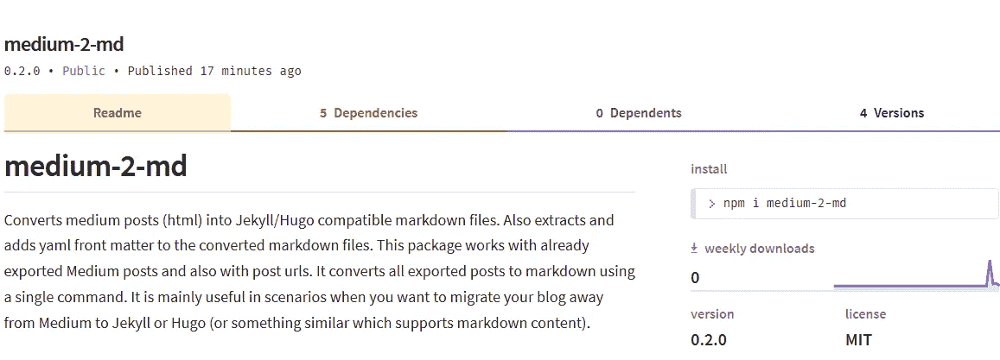

# 中型-2-md:将中型职位转换为带有前置内容的降价职位

> 原文：<https://medium.com/hackernoon/medium-2-md-convert-medium-posts-to-markdown-with-front-matter-c044e02c3cbb>

## 一个 CLI 工具，可将导出的中型文章(HTML)转换为 Jekyll/Hugo 兼容的 markdown with front matter

medium-2-md 是一个简单的 CLI 工具，它获取包含 Medium posts 的 HTML 文件的目录，并将其转换为 markdown。不仅如此，它还下载图像，并为这些转换后的 markdown 文件添加丰富的前置内容，以便它们可以直接用于 Jekyll 或 Hugo。



[https://www.npmjs.com/package/medium-2-md](https://www.npmjs.com/package/medium-2-md)

CLI 工具是用 node.js 编写的，它期望输入的 HTML 文件与上图所示的 posts 目录中包含的文件具有相同的标签和属性。这样，它就能够提取出前沿问题所需的所有信息。

注意:它没有经过通用 HTML 到 markdown 转换的测试；它只适用于从中型故事/帖子导出的 HTML 文件。

## 使用

medium-2-md 以一个 [npm 包](https://www.npmjs.com/package/medium-2-md)的形式提供，这样就可以很容易地下载和使用它，而不需要浏览代码。你需要做的就是下载并安装它(全局)，然后直接从命令行使用它。按照下列步骤使用 medium-2-md。

**第一步:从你的媒体账户中导出并提取你的媒体文章。**

*   转到[https://medium.com/me/settings](/me/settings)并滚动到`Download your information`。单击下载按钮。这将给你一个包含所有媒体内容的`medium-export.zip`档案。
*   提取。上一步下载的 zip 存档。它将有一个名为`posts`的子目录。
*   复制这个`posts`目录的路径。

**第二步:在系统上安装 node.js 和 medium-2-md。**

*   下载安装 node.js — `[https://nodejs.org/en/download/](https://nodejs.org/en/download/.)` [。](https://nodejs.org/en/download/.)
*   安装 medium-2d 包— `npm i -g medium-2-md`。

注意:`-g`标志意味着你正在全局安装这个包。为了直接从命令提示符/终端使用软件包，这是必不可少的。

**第三步:运行以下命令，将你所有的中型文章(HTML)转换成 markdown 文件。**

```
medium-2-md convertLocal '<path of the posts directory>' -dfi
```

就是这样。输出的 markdown 文件将被存储在 posts 目录下一个名为`md_<a big number>`的子目录中。

转换后的降价文件还将包含标题、描述、发布日期和原始媒体文章/故事的规范 URL。图像将被下载到输出目录的子目录中。

关于这个包的更多细节可以在 [medium-2-md GitHub 库](https://github.com/gautamdhameja/medium-2-md)的 readme 文件中找到。

当我把我所有的故事/帖子转换成 markdown 时，这个工具帮助我节省了很多时间。我在 Hugo 的一个测试网站上测试了转换后的 markdown，它的效果非常好。

我们需要手动处理的几件事情是代码栏和标签。导出的媒体文件中没有标签相关信息。代码栏也被导出为纯文本，降价转换也会忽略它们。

试一试，并随时使用 GitHub 资源库上的问题跟踪器提供您的反馈——https://github.com/gautamdhameja/medium-2-md。

*原载于 2018 年 12 月 30 日*[*www.gautamdhameja.com*](https://www.gautamdhameja.com/medium-to-markdown-converter/)*。*