# 营销媒介:如何每月获得 19，083 次主题浏览量和 1000 次网站访问量

> 原文：<https://medium.com/hackernoon/medium-for-marketing-how-to-get-19-083-views-on-your-topics-per-month-and-receive-1000x-visitors-51f44fc29681>

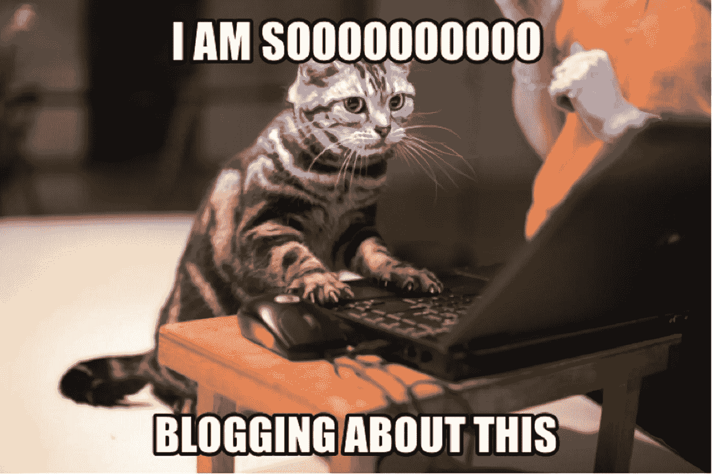

你花了多少时间尝试发展你的博客或 SAAS 营销策略？互联网上有数百万的帖子向你展示如何写 2000+字的帖子，让它变得 SEO 友好，并开始接待访客。但现实是，SEO 每年都变得越来越难，你需要在博客优化上投入更多来获得流量。

对于一家需要将所有资源集中在产品增长上的年轻公司来说，你没有时间自学 SEO 或者投资给经验丰富的 SEO 专家——你的预算是有限的。应该有另一种策略——而且确实存在。在这篇文章中，我将展示 Medium 如何帮助我们获得比我们自己的博客更多的流量。

在 2018 年期间，我和我的团队为我们自己的博客(始于 2017 年)和媒体创建并发布了 300 多个主题。比例是我们博客上的 190+话题和媒体上的 120+话题。在分析增长后，我们意识到 2019 年的战略将是完全专注于媒体。

这是在媒体和我们的 wordpress 博客:howtotoken.com 发布一年后的统计数据

媒体上 120 多个帖子的统计数据:

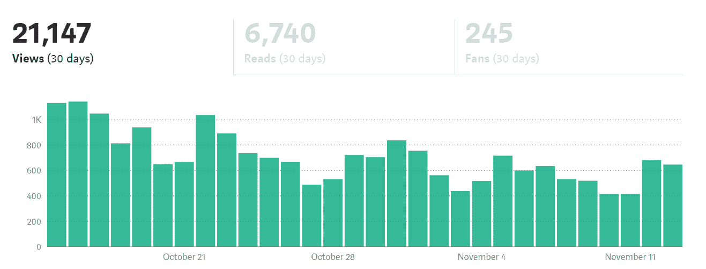

相比之下，我们自己的博客上有 190 多篇帖子:

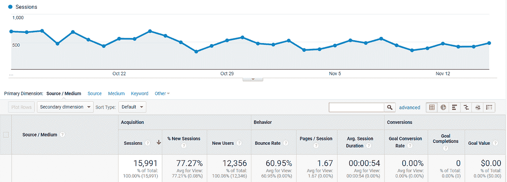

在这里，我们比较了谷歌分析会话的中等视图，根据下面的描述，这是最接近的指标。

[中等浏览量](https://help.medium.com/hc/en-us/articles/215108608-Your-stats)——点击一个故事页面的访问者数量。while Reads 告诉你有多少观众阅读了整个故事(估计)。

[GA sessions](https://support.google.com/analytics/answer/2731565?hl=en) —会话是在给定的时间框架内发生的一组用户与网站的交互。例如，一个会话可以包含多个页面视图、事件、社交互动和电子商务交易。

因此，Medium 上 120+帖子的浏览量为 21，147 次，而我们博客上 190+帖子的浏览量为 15，991 次。

考虑到我们需要少创建 1.6 倍的内容才能达到这个结果，Medium 是 1.3 倍。与 wordpress blog 相比，我们不需要支付托管和系统管理费用来支持中型博客。

如果你的内容营销策略中还没有媒介，那么现在是开始考虑的好时机。

# 媒介是如何工作的？

Medium 由 Twitter 联合创始人、前首席执行官伊万·威廉姆斯于 2012 年推出。它是世界上发展最快的博客平台之一，每月有超过 1 . 97 亿的访问者(根据 Similarweb)。

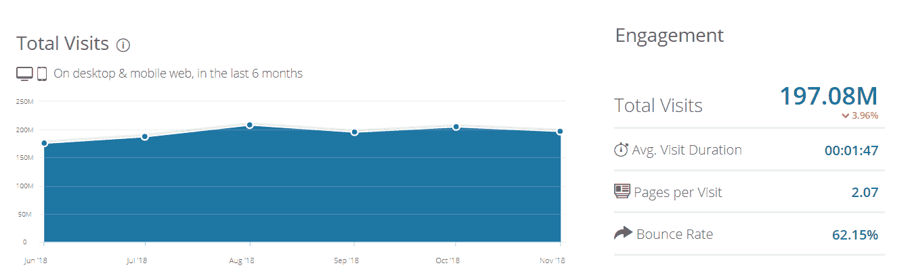

这个想法很简单——让用户无论在哪个平台上都可以方便地阅读内容。介质上没有边栏或弹出窗口，所以即使你在手机或平板电脑上阅读内容也非常棒。

对出版商来说，这确实让他们能够专注于发行和吸引最佳作家，而不是解决技术问题。出版商可以附上自己的域名，并确保流量属于他们。

正如你已经知道的，你只需要在 Medium 上注册，然后开始发布你的内容来接收关注者(就像你在脸书或 Twitter 上做的一样)。

如果你擅长发行，那么你可以创建自己的出版物(类似于脸书上的群组或页面)，附上自己的域名，并开始吸引最好的作家投稿。

这里是对中等术语的简单描述(这里是完整的[词汇表](https://help.medium.com/hc/en-us/articles/360006341833)):

*   所见即所得编辑器——发布内容的便捷方式。你可以从第一天开始写，不用担心风格。
*   出版物-您可以创建一个出版物，其他作者可以使用 Medium 的内容管理系统投稿。
*   Feed——Medium 有文章的 feed(像所有其他社交网络一样),所以你只需在手机上安装一个应用程序，就可以阅读新的故事。
*   关注者——如果你对任何作者(媒体用户)或出版物感兴趣，你只需关注它，并开始在你的 feed 中接收他们的内容。如果你拥有一份出版物，那么你可以向你的出版物的所有追随者发送一封电子邮件(在下面的发行部分有更多关于它的信息)。
*   鼓掌——类似于 Twitter 上的“赞”,这是对最好的内容表达敬意的好方法。
*   会员资格——每月支付 5 美元，你就可以获得独家策划的内容。如果你是一个作家，那么你可以靠它赚钱。
*   注释——你以私人方式评论 Medium 上的大多数故事。当你留言时，故事的作者会收到一封电子邮件(这是联系你感兴趣的合作伙伴的好方法)。
*   系列——类似于“Instagram stories”的东西。

因此，你可以成为一名作者，将你的故事发布到你的订阅源或其他出版物上。或者你可以创建自己的出版物，专注于为其他作者编辑和发行。Medium 有自己的内部发布平台，因此如果您在出版物上获得“作者”身份，那么您可以通过单击将您的内容提交到该出版物，在该出版物的编辑审阅并发布它之后，该出版物的所有关注者都将看到您的故事。以下是提交到 hackernoon.com 时的情况:

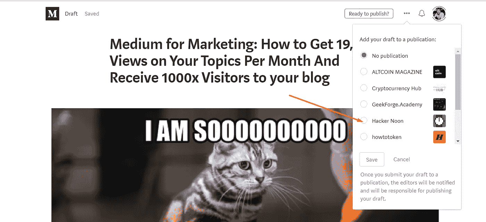

如果你刚刚开始使用 Medium，我建议你找一份与[相关的出版物](http://amipublications.com)，开始在那里投稿，这是你的故事获得流量的最快方式。

# 如何为你的故事选择出版物？

Medium 的伟大之处在于，它允许您将权利分配给出版商(出版物的所有者)和作者。根据你的技能:写作或发行，你可以选择你想参与哪一方。它允许你一次专注于一个主要活动，并从你的内容营销努力中获得最高的投资回报率。

如果你是一个年轻的初创企业或小企业主，那么你只需要找到合适的出版物(基于你需要的读者)并提交你的故事。但是如何选择合适的出版物呢？有一个特殊的服务可以显示按关注者数量排列的出版物:[顶级出版物](https://toppub.xyz/)，现在他们的数据库中有 2957 种出版物:

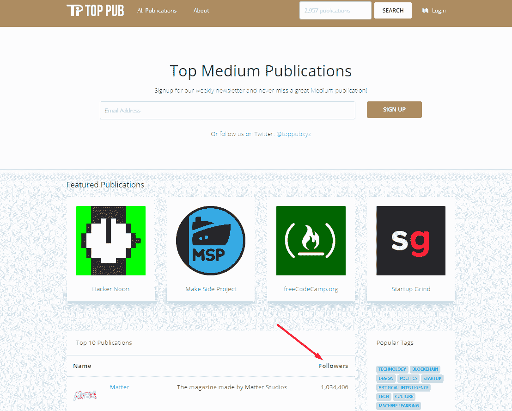

这里还有一个简单的技巧，你可以用它来找到一个出版物的追随者数量(只有当这个出版物有自己的域名时才有效)。上面的 [toppub.xyz](http://toppub.xyz) 似乎使用了这种方法(因为现在列表中没有域名的出版物也有了追随者)。

首先，你需要找到出版物中的任何一个故事，然后滚动到有标签部分的结尾，就像这样:[https://hackernoon . com/step-by-step-step-guide-on-making-Davids-job-obsolete-c2e 9784465 ed](https://hackernoon.com/step-by-step-guide-on-making-davids-job-obsolete-c2e9784465ed)

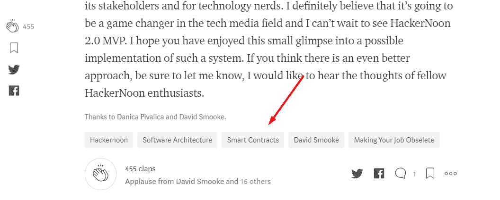

然后点击任何标签，您将看到该出版物在简短评论下的关注人数:

[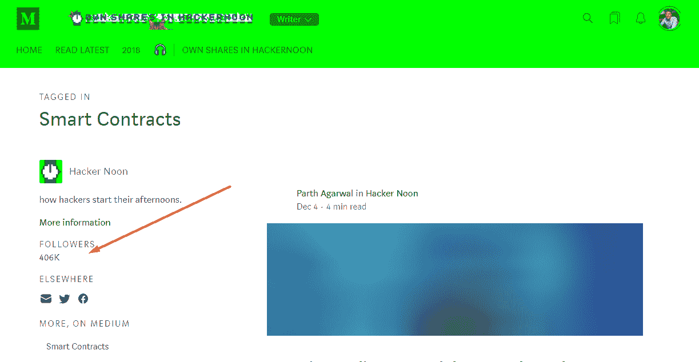](http://hackernoon.com/tagged/smart-contracts)

此外，你会找到联系方式(大多数情况下是电子邮件),你可以写信询问成为该出版物的作者——这将允许你提交故事。

## 媒体出版物的关注者数量真的很重要吗？

我们希望我们的故事有尽可能多的读者，对吗？出版物是这里的关键点，通过向正确的出版物提交故事，你可以获得大量的阅读，而不是为你的故事选择错误的(和不相关的)出版物，或者只是在你没有很多追随者的早期阶段发布到你自己的订阅源。

*相关主题提交给拥有 40 万关注者的正确出版物，结果有 47，000 次浏览:*

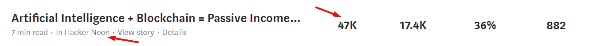

*不相关主题提交到出版物，有 39.8 万关注者，结果 109 次浏览:*

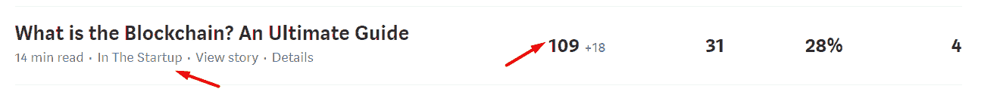

*故事在前期发布到我自己的 feed(当时我还没有 1.5K 粉丝)，结果 42 次浏览:*

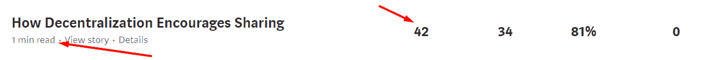

因此，正如你所看到的，相关性很重要，但更重要的是了解出版物所有者如何管理其发行。他们是否使用时事通讯和外部资源来发布其内容？

[*这里是*](https://softwareengineeringdaily.com/2017/12/19/hacker-noon-with-david-smooke/) *黑客正午创始人访谈*[geek forge 公式](https://medium.com/u/7f91547ce9c9# 10k QA challenge:</strong></a><a class=)。