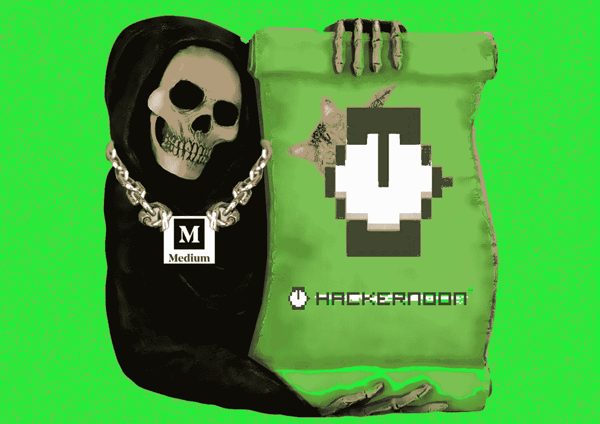
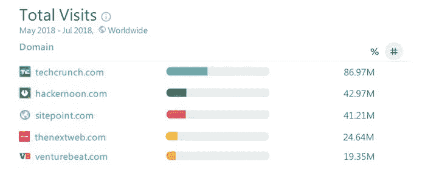
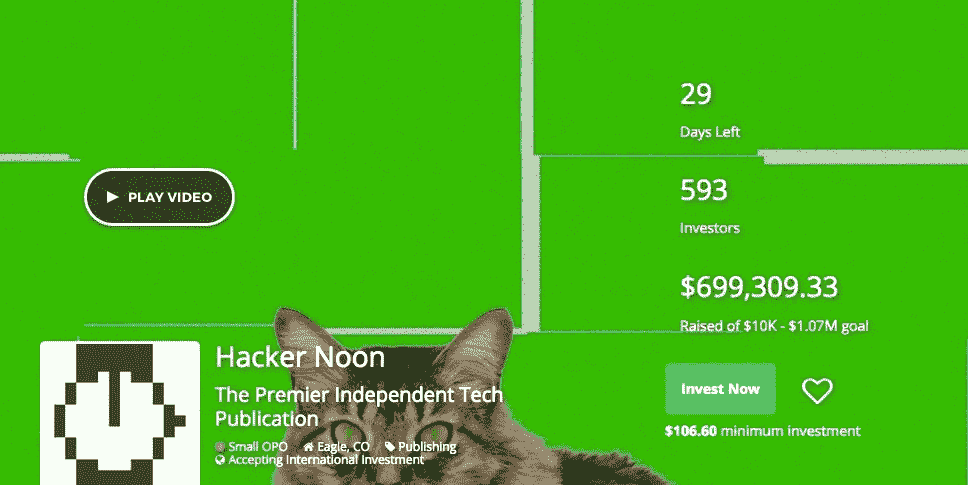

# 中杀黑客 Noon 的收益:WTF？

> 原文：<https://medium.com/hackernoon/medium-killed-hacker-noons-funding-wtf-157a2f86d9d4>

# 大约在 2015 年，我开始在 Medium 上写作，当时我自助出版了我的第一本书 [Un-Crap Your Life](https://www.amazon.com/Crap-Your-Life-Navigating-Situations-ebook/dp/B017PBLZPA) 。

不久之后，我开始向媒体刊物《黑客正午》提交我的一些技术文章。早在 2016 年，Hacker Noon 上的读者不到 5 万，尽管它没有获得巨大的流量，但当我的文章被接受并发表在 Hacker Noon 出版物上时，我总是感到非常满意。我最受欢迎的黑客正午故事记录了区块链幻想家[丹·拉里默](https://hackernoon.com/dan-larimer-visionary-programmer-of-bitshares-steem-and-eos-7e6d94b241d7)的历史，最近一次点击量超过了 5 万次。

## 我刚刚得知，Medium 在 9 月份切断了 Hacker Noon 的赞助，这实际上扼杀了 Hacker Noon 的收入流。

Hacker Noon 已经盈利了一段时间，与少数科技公司建立了合作关系，然后在他们的网站顶部放置广告。我从来没有注意到这些广告太多，因为他们中的大多数似乎与许多技术话题有关。《黑客正午》上的广告似乎从来没有打扰过。事实上，他们的广告模式似乎很有道理，因为他们从来没有跟踪他们的访问者的意图。

## 嗯，灵媒一点也不喜欢。

Medium 已经移除了 Hacker Noon 协商的这些赞助，据报道，Medium 已经在它们的位置上放置了自己的广告。对我来说，这似乎有点荒谬。黑客 Noon 最近已经成为一个重要的科技新闻竞争者，媒体应该接受它，而不是扼杀它。Hacker Noon 现在的网络流量比 Venture Beat 还多。TechCrunch 仍然领先，但 Hacker Noon 就像它的分散版本，所以我猜测它将继续增长。

from Hacker Noon crowdfunding site

我猜发布平台的日子不好过，尤其是那些没有将经济令牌化的平台。….不知道到目前为止这种媒体订阅模式的效果如何……

中杀黑客 Noon 的收入流似乎相当短视，彻头彻尾的丑陋。但好消息是，Hacker Noon 现在决定进一步发展。他们将创建自己的独立网站。Hacker Noon 由一对夫妻团队运营，完美地展示了精益运营是如何可行且有利可图的。

## Hacker Noon 现在正在接受投资，已经在一轮众筹中筹集了超过 69.9 万美元。

你可以投资的最小金额是 106 美元，这意味着黑客正午对普通人开放，而不仅仅是精英投资者。可以在这里投资黑客正午:【https://www.startengine.com/hackernoon 

他们正在建立自己的网络基础设施、团队、商业模式和社区。从许多方面来看，听起来他们真的打算扩张并尝试新的收入模式，甚至包括可能的令牌化策略。

## 《黑客正午》非常受区块链和密码社区的欢迎，而当时主流媒体并不欢迎它。我相信这一事实导致了它在过去一年的大规模增长。

# 黑客正午故事简介

> “黑客正午 2016 年 1 月开始在 Medium 上做黑客日报，2016 年 4 月成为黑客正午。这个网站由 David 和 Linh Dao Smooke 的夫妻团队运营，于 2016 年 10 月开始获得动力，故事包括 2016 年学习 Javascript 的感觉，以太坊-区块链的大小已经超过 1TB，是的，这是一个问题，我正在从你的网站上收集信用卡号码和密码。以下是方法。，以及为什么每个人都错过了加密货币最令人兴奋的功能。”——[https://www.startengine.com/hackernoon](https://www.startengine.com/hackernoon)

## 黑客 Noon 所说的媒体扼杀了他们的收入

我是从他们的众筹投资网站上了解到中杀黑客 Noon 的资金的。以下是他们对此的看法:

> “Medium 的最新支点敲响了警钟。我们过度依赖第三方，我们需要改进。他们的广告仍然留在我们的网站上…暂时。自从他们在 9 月初禁止我们的赞助套餐以来，我们已经:收购了 Crypto Disrupted 播客&推出了 Hacker Noon 播客，创建了 Hacker Noon 工作板，预售了 2019 年的赞助库存，并聘请了一位令人敬畏的临时 CTO。”——【https://www.startengine.com/hackernoon 

## 黑客 Noon 对社区的看法:

> “我们非常关心我们的贡献者。真正让 Hacker Noon 脱颖而出的是我们是独立拥有和社区驱动的。我们的社区驱动着我们的社论，而不仅仅是我们的流量。通过坚持我们的精神(发布社区想要的)，我们自然成为区块链最受信任的博客之一&加密货币。展望未来，我们将通过授权主题专家成为经验证的作者和社区编辑，更好地利用我们社区的力量。……”【https://www.startengine.com/hackernoon 的 

很多公司声称“关心社区”,但让我们面对现实吧，大多数公司并不这样做。很多在线网站，一旦他们变大了，他们就毁了所有帮助他们成长的小人物。作为一名在 Hacker Noon 最早期就开始为其写作的独立作家，我不得不说，他们仍然像我刚开始投稿时一样对待我。

我和大卫·斯穆克谈过几次，他是一名真正的职业球员。我很期待《黑客正午》的未来，我也会在游戏中加入更多的皮肤，因为大卫和林已经建立了一种我欣赏的令人惊叹的文化。我目前还没有投资《黑客正午》,但我可能会，而且肯定会继续为它写作，因为我现在比以往任何时候都更有动力。

Medium 的这一最新举动让我更加喜欢 Hacker Noon，而 Medium，嗯，*却不那么喜欢了。*

## 关于作者:

Stellabelle 是一名艺术家和作家，目前正在为许多区块链项目工作。