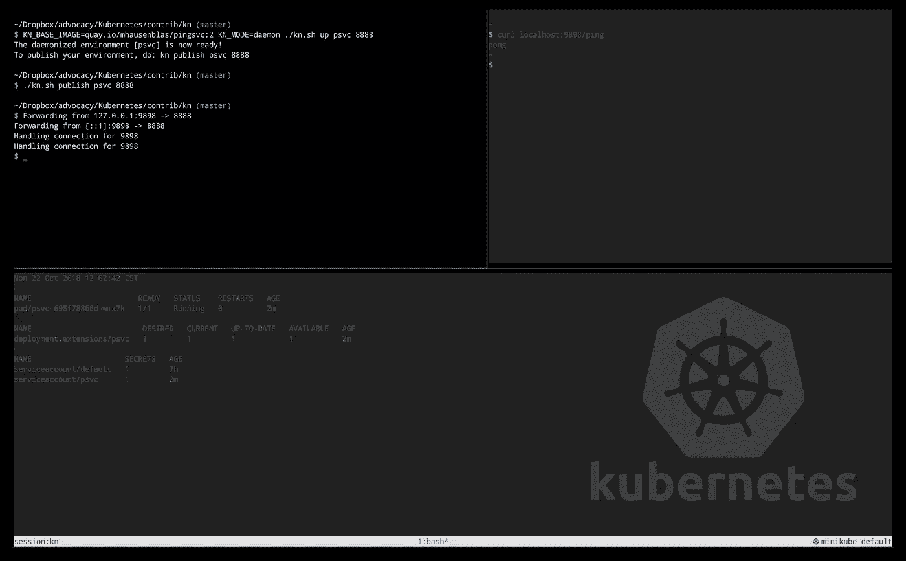

# 认识 kn——Kubernetes 的本土体验

> 原文：<https://medium.com/hackernoon/meet-kn-a-kubernetes-native-experience-bd87239a11ff>



kn in action

最近，我在我的电脑上看了一堆 shell 脚本，我用它们来快速增加调试 pod 或在 [Kubernetes](https://hackernoon.com/tagged/kubernetes) 集群中发布服务。我对自己说:为什么不把它们包装好并分享，这样其他人也能从中受益呢？

认识一下 [kn](https://github.com/mhausenblas/kn) ，这是**K**ubernetes**n**native 的缩写，你可能会发现快速进入 Kubernetes 集群是很有用的，这样你就可以四处逛逛，甚至试驾一个联网的应用，在公共网络上分享它。听起来很有趣？让我们跳进深水区！

与`kn`的典型调试会话可能是这样的:

```
$ kn up myenv$ kn connect myenv<< do your stuff here >>$ kn down myenv
```

现在，让我们换个角度，假设您有一个服务，比如一个应用服务器，它正在公开一个 HTTP API，并且您想要测试它和/或与您的同事共享它:

```
$ KN_BASE_IMAGE=quay.io/mhausenblas/pingsvc:2 KN_MODE=daemon \
  kn up psvc 8888The daemonized environment [psvc] is now ready!
To publish your environment, do: kn publish psvc 8888$ kn publish psvc 8888$ curl localhost:9898/ping
pong
```

如果你想看`kn`的[实践演练](https://hackernoon.com/tagged/walkthrough)，请看下面的视频或查看文档中的[示例](https://github.com/mhausenblas/kn#examples):

谢谢你的时间，也许你想试一试，让我知道你的想法？