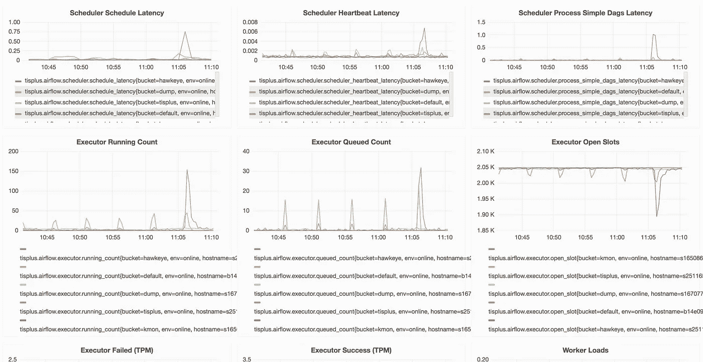

# 认识 MaaT:阿里巴巴基于 DAG 的分布式任务调度器

> 原文：<https://medium.com/hackernoon/meet-maat-alibabas-dag-based-distributed-task-scheduler-7c9cf0c83438>

*了解阿里巴巴如何通过一种新的支持平台确保跨平台效率*

*本文是* [***搜索 AIOps***](/@alitech_2017/aiops-for-alibaba-search-operations-765854c60752) *迷你系列的一部分。*

作为一个服务和平台的复杂生态系统，阿里巴巴集团的网络架构提出了独特的运营挑战。在这样的环境中，异步地执行特定的功能并与指定的过程保持一致需要部署能够在非常深的网络结构中操作的多个协作子系统。例如，应用程序的上线过程需要连续调用配置同步模块、监视器模块、资源更新模块、smoke 模块和引擎创建模块，这又需要在整个过程中进行分支判断、上下文转移和失败重试。

为了满足这些需求，阿里巴巴集团最近投资开发了使能平台，旨在支持单一系统无法满足需求的复杂服务。具体来说，阿里巴巴已经将自己的 MaaT 作为一种工具，用于集中管理大量面向过程的任务，同时在自己的容器中维护每个任务节点。这使得任务能够以分布式方式运行，确保过程以稳定的效率运行。

今天，我们更仔细地观察 MaaT 的架构及其核心相关组件，以提供对其原理和机制的一般介绍。

# 什么是 MaaT？

MaaT 是一个基于开源项目 Airflow 的流程调度系统，允许用户自定义流程节点。有了它，程序可以设置为在用户指定的时间启动(支持 crontab 格式)或由用户手动触发。

在 MaaT 中，所有节点以分布式方式在 Hippo 上运行，由 Drogo 调度。MaaT 允许用户创建自己的调度节点和执行节点，以实现资源隔离，并配置操作环境或自己的执行节点的副本数量。

下图显示了单个任务的调度过程示例:

# 为什么要部署 MaaT？

项目开发通常需要面向过程的定时派遣，例如上线过程或任务的定时分析。然而，试图开发一个程序调度系统和访问该集团的工作流程不可避免地提出了一些问题。

首先，服务代码和调度代码是高度耦合的。修改过程需要侵入代码层，其中服务代码的发布会影响调度。第二，如果没有统一的管理系统，很难管理和跟踪这些调度任务。最后，具有多个分支和上下文转移场景的复杂过程没有得到很好的支持，并且缺少可视 UI 使得它对用户不友好。

# 技术型号选择

## D2

定时任务和流程任务的调度是 D2 和 workflow 等阿里集团内部产品以及 Airflow 和 Quartz 等开源产品的常见需求。

D2 是一套基于 ODPS 的过程调度系统，承载集团基于 ODPS 数据输出产生的调度任务。允许用户自定义脚本、定时任务触发、手动触发(补充操作的方式)，适用于基于数据状态的任务过程调度(比如基于数据输出执行任务过程)。它由阿里巴巴的 D2 团队特别维护，拥有精心设计的用户界面。

然而，D2 有许多缺点。DAG(有向无环图)调度发生在大范围内，并且每天需要运行的每个节点和拓扑关系是基于前一天的全局拓扑关系来计算的。因此，理论上，新创建和修改的任务只能在第二天生效，并且需要以补偿操作的方式来完成，以便立即生效。服务中的任务(如任务配置或调度时间)经常会发生变化，或者涉及手动触发调度的场景(如随时可能发生的发布过程或完整备份过程)。使用 D2 使服务变得不灵活，并且在这种情况下超出了适用于 D2 的场景范围。此外，D2 不支持过程上下文的转移，而上下文转移在相关服务中是相对健壮的。往往上一个节点输出某个值，下一个节点需要使用。

最后，D2 缺乏对搜索生态系统的支持。搜索技术部的整个底层架构都有自己的一套生态系统，比如 dispatch(由 Hippo 和 Drago 组成)和 alarm(由 Kmon 组成)。使用 D2，用户无法充分享受搜索技术生态系统的好处，同时也给后续的统一部署带来了问题。

## 工作流程

组工作流是用于组审批过程的常规调度引擎。许多产品的审批过程都是基于组工作流的，它也可以用作简单的任务分派过程。在部署 MaaT 之前，阿里巴巴还使用小组工作流作为程序任务的调度引擎。它允许手动触发，支持以 HSF 模式调用外部系统，并支持上下文转移。但是，它涉及复杂的配置，并且对调用外部系统的支持有限。

## 石英

Quartz 是一个基于 Java 的开源调度框架。它支持分布式调度、任务持久性和定时任务，但不支持过程调度。此外，任务配置需要耦合到调度系统中，而任务的热加载需要修改。

## 气流

Airflow 是一个开源项目，是一个分布式过程调度系统，具有许多优点。有了它，服务代码与调度系统解耦，每个服务的过程代码由单独的 Python 脚本描述，脚本定义了面向过程的节点来执行服务逻辑和支持任务的热加载。这样，crontab 定时任务格式就完全受支持，可以用来指定任务完成的时间。它支持复杂的分支条件，并为每个节点设置一个触发时间，比如当父节点都成功时执行，或者当任何父节点成功时执行。它还提供了一个完整的 UI，可以可视化所有任务的状态和历史，并且只依赖于 DB 和 rabbitmq，外部依赖性更少，更容易构建。

有人对 Luigi 和 Airflow 的比较提出了一些问题。两者都基于功能相似的 pipline 任务调度系统。作为后来者，气流超越了早期的起步者和竞争者。

以下是同类产品对比:

*Here Y represents support and N represents non-support*

经过一段时间的研究，阿里巴巴选择了 Airflow 作为原型，从它开始开发分布式任务调度系统。功能全面，满足基本服务需求，可以比较轻松地扩展功能。气流较少依赖外部，更容易与搜索生态系统连接。

## 自然气流的问题

气流可以解决过程调度中存在的许多问题，但是直接实现用于生产的本地气流仍然存在许多问题。

Native Airflow 支持分布式调度，但由于依赖于本地状态，它不能直接部署在 Drogo 上。由于缺乏适当的监控手段，因此需要将其与 Kmon 相结合，以改善监控和警报设施，并且没有用户友好的编辑方法，因此用户需要了解更多有关气流的原理和细节，才能成功操作它。当大量任务正在运行时，调度的性能会急剧下降。最后，本地气流在分布式模式下存在一些缺陷。

# 马特的建筑

## 概观

下图提供了 MaaT 架构的高级视图:

## 服务层

可以根据任何程序调度或定时触发要求，使用 MaaT 创建应用程序。MaaT 提供可视化编辑页面和丰富的 API。用户可以方便地创建编辑过程模板，设置复杂的分支逻辑，而 MaaT 会根据调度时运行时的状态来确定过程的流程路径。

目前接入 MaaT 的应用场景有 Tisplus、鹰眼、Kmon、产能平台、离线组件平台、Opensearch 等。

## 管理层

native Airflow 中的管理相对简单，因为它基于描述任务过程 DAG 的 Python 脚本调度。因此，用户需要学习气流原理来创建、更新和执行任务。只能基于档案进行维护，相当不方便。因此，MaaT 在其外层(MaaT 控制台)中加入了一个管理系统层，以降低运营、维护和用户学习的成本。

下图是玛特管理系统的操作界面流程图:

## 模板管理

在任务过程分派场景中，通常用于执行不同任务的过程或多或少是相同的，只有个别参数不同。因此，MaaT 引入了基于模板管理的任务流程。用户在模板管理层为该过程定义一个运行模板，并使用变量来表示未确定的部分。当生成一个特定的任务时，它由特定的变量和模板来呈现。修改模板后，可以对依赖于它的所有任务进行验证。

模板管理预置了多个任务节点，用户可以自由选择不同的任务节点来组装模板流程。

## 应用管理

应用管理用于管理所有具体的过程调度任务，包括任务使用的模板、变量的值、告警信息以及任务触发的 crontab。通过模板创建应用程序后，用户可以通过应用程序管理继续维护任务的运行。

## 队列管理

在 MaaT 上运行的任务属于不同的应用程序，并且不同应用程序的操作环境差异很大。此外，不同的应用程序将理想地实现集群隔离。为此，MaaT 提供了队列管理。结果，指定队列的任务节点被分派到相应队列的机器，这些机器将只运行指定队列的任务节点。

此外，队列还可以指定并发性，指示当前队列上有多少任务同时运行，以确保在机器上同时运行的任务不会导致过度负载，并且超出并发性的任务将被挂起，直到资源被释放。

## 核心模块

MaaT 核心模块完成任务调度的整个过程。核心模块的各个节点在机器上独立运行，启动时互不依赖。数据状态通过 DB 保存，消息通过 MQ 或 FaaS 分发。

## Web API 服务

Web API 服务提供了丰富的与外部交互的 API，包括任务添加、删除和修改、历史任务状态、任务状态修改、任务触发和任务重试。

此外，它还完成了原生气流提供的网页显示功能。

## 调度程序

调度器在 MaaT 中起着关键作用，它决定任务何时被调度运行，以及在运行任务时哪些节点可以被执行。调度程序通过 MQ 或 FaaS 将确定要执行的节点发送给工作节点。

随着任务数量的增加，单个调度程序的负载逐渐变得过高，导致调度周期延长。为了减轻调度器的压力，MaaT 根据服务来划分调度器。不同服务的任务由一个独立的调度程序分派，并发送给指定的工作人员。

## 调度程序增强

本机气流的调度逻辑吞吐量较低。当任务数增加时，调度周期会变得相当长，面临高任务数的调度器会延迟一分钟左右。参考最新实现，我们优化了原生调度逻辑，将之前阻塞的调度方法拆分成多个进程池，异步完成可执行任务的生产>提交>轮询操作。压力测试后，原来 30 至 40 秒的调度时间减少到大约 5 秒。

## 工人

工作者是执行任务的角色。它接受调度程序发出的任务，并在 worker 上执行节点中描述的特定任务。worker 通常部署有副本，任务在任何等价的 worker 机器上。当工人资源不足时，任务可以动态扩展。

不同的队列任务需要不同的基本环境，比如 Python、Java、Hadoop 和 zk，并且不同队列中的 worker 角色的启动参数配置也有所不同。因此，当不同队列的工作人员启动时，他们将根据配置中描述的资源进行部署和安装。

在 worker 上完成任务后，DB 将被写回。调度程序将在检测到当前任务状态的变化后继续分派任务。

## 分销商

任务调度层将调度程序必须调度的任务发送给指定的工作人员。MaaT 使用本地芹菜+Rabbitmq 和基于搜索生态的 FaaS 来分派任务。

## 芹菜+兔肉

Native Airflow 使用 Celery + RabbitMQ 将消息从调度程序发送到工作程序。

Scheduler 向 MQ 发送将要运行的任务，其中包括任务的相应队列信息。当 worker 从 MQ 获取信息时，只获取相应的队列任务，并拉至相应的 worker 执行。MQ 是在 MaaT 中使用 RabbitMQ 实现的。与其他角色类似，MQ 也是独立部署的。

Celery + Rabbitmq 模型继续 mq 中的任务和任务状态。内存队列的性能可以满足大多数情况下的需求。但是，MaaT 部署基于两层调度程序 Drogo，并且要求所有部署节点都是无状态的。MQ 不满足这一要求，因为它存储消息状态。这就是为什么我们选择了基于搜索生态的 FaaS 框架来代替芹菜+ RabbitMQ。

## 法斯

FaaS (Function as a Service)是一个基于搜索生态实现的无服务器框架，其执行者是 MaaT。

所有的 MaaT 任务都被抽象成函数。当一个任务被执行时，MaaT 调用相应的函数；任务完成后，MaaT 返回到任务状态，此时 MaaT 和 FaaS 之间的初始链接完成。未来有望在 FaaS 的基础上进一步优化。例如，执行任务的多样化方式可以将轻量级任务转换为功能，将关键任务转换为服务；任务资源的动态调整甚至允许将资源分配给当前正在执行的任务，并在执行完成后立即释放这些资源。

对于 MaaT，FaaS 支持从生产者到消费者的任务分配，在 MQ 中构建消息，并提供任务状态接口。此外，FaaS 本身确保消息不会丢失，并且能够根据用户负载自动扩展和收缩。

## 基本组件

DB，使用 group IDB，负责 MaaT 信息的长寿，包括任务信息、任务运行记录、任务运行状态、节点运行记录、节点运行状态等等。

OSS 是一个管理 Drogo 启动时机器迁移风险的组件，因为没有日志可以存储在本地。所有节点的运行日志都存储在 OSS 上，查看日志需要访问 OSS。

Kmon 负责监控集群的运行状态，并在任务失败时发出警报。

最后，Drogo 完成所有 MaaT 节点的码头化部署。

# MaaT 平台的优势

## 可视化编辑和通用节点类型

MaaT 提供了一个管理平台 Aflow，使用户能够方便地编辑流节点并管理所有模板和任务，如本文前面的管理层部分所述。

此外，MaaT 还提供多样化类型的通用节点。Native Airflow 支持各种可以执行不同类型任务的节点。在与用户的交互中，MaaT 可以根据用户的习惯和需求来密封节点，也可以开发新的节点类型来满足大多数用户的需求，如下所示。

Bash 节点是直接在 workers 上执行基本 bash 操作的节点。Bash 节点通常依赖于其他资源，因此很少使用。

Http 节点支持 http 调用。在调度中，发送 http 请求来触发其他系统。这些节点还提供轮询 http 接口。当被触发时，它们轮询其他系统是否已经成功运行，只有当它们成功运行时才继续运行。

带资源的 Bash 节点，不同于普通的 bash 节点，自带一些资源(比如 jar 包、bash 脚本、Python 脚本)。运行这些节点首先在本地下载资源，然后执行 bash 脚本。

分支节点根据之前的节点运行结果或最初传递的参数来决定分支的被分割节点经过哪些分支。

## 基于 Drogo 的部署

MaaT 服务提供多种角色，都要求不同的运行环境。维护这些环境可能成为操作人员的噩梦，在这种情况下，启动 Hippo 成为 MaaT 操作的最佳选择。作为一个基于两层调度服务的管理平台，Drogo 使得所有 MaaT 节点部署到 Hippo 成为可能。

具体来说，基于 Drogo 的部署具有以下优势。

Drogo 支持低成本添加新节点。在 Drogo 之前，每次需要新节点时，都需要为运行准备资源，还需要编写部署脚本。此外，操作团队本身必须维护每个节点的脚本。发射 Drogo 后，所有此类部署信息都可以存储在 Drogo 上。随着新节点的出现，从以前的部署中复制和调整类似的信息就足以完成工作。

Drogo 易于扩展。在卓戈之前，高级任务的扩展需要准备机器、设置环境和调试运行参数，总共需要半天到一整天的时间。Drogo 上线后，调整副本数量就足以自动扩展那些任务。

Drogo 还能有效防止机器迁移造成的服务干扰。在推出 Drogo 之前，一旦原始机器出现故障，就必须依赖另一台机器进行扩展。对于一些只运行一台机器的节点，操作员只能祈祷他们的机器能坚持下去。相比之下，Drogo 会在机器迁移时自动指派一台新机器接管服务。对于可能被干扰的服务，即使在单节点部署场景中，也不必担心在机器出现故障后服务可能变得不可用。

下图显示了目前部署在 Drogo 上的 MaaT 角色:

由于 native Airflow 中的一些节点是有状态的，并且依赖于本地文件的一部分，所以机器迁移会使这些节点成为无状态的。因此，对 MaaT 进行了调整，以确保机器迁移不会导致如下结果。

以前的计划依赖于本地 Python DAG 文件，这些文件会因机器迁移而丢失，而现在的更改是将所有 DAG 文件与保存的计划信息一起存储在数据库中，以确保 DAG 信息在机器迁移后不会丢失。

由于对本地文件的依赖，web 服务和调度程序读取和写入相同的 DAG 文件。因此，native Airflow 的角色调度程序和 web 服务必须绑定在一起才能运行。相反，使用 DB 信息进行调度允许分别部署 web 服务和调度程序。

最后，由于原始日志文件存储在本地，机器迁移会导致它们丢失。重建后，日志文件存储在 OSS 的远端，每次都将在那里被读取。

## 按集群管理

为了隔离不同的任务，MaaT 扩展了针对各种任务的 Airflow 本地队列管理的集群管理功能。某些类型的任务可以创建自己的调度器和工作器，在创建应用程序时，可以使用指定的调度器来调度或运行指定的工作器。(如果没有指定，默认的调度程序和工作线程将负责调度。)

集群配置参数包括工作人员部署配置、工作人员数量、集群并发性和调度程序。

工作者部署配置与该工作者所依赖的资源有关。当 Drogo 启动时，任务运行时所需的资源将被部署到工作机。当机器迁移时，此部署配置将用于重新分配资源。

工作者数量参数简单地控制工作者角色的数量。

集群并发控制集群中运行的并发数量，以防止下游系统由于运行太多任务而负担过重。

目前，每个集群只有一个调度程序，尽管后续重建将支持多个调度程序节点。

# 监视器和警报

## 平台监控和报警

为了收集平台如何运行的感觉，MaaT 在每个节点的每个关键步骤向 Kmon 报告指标。开发人员会及时得到关于异常指标的警报。此类指标还可用于判断当前集群上的负载，并优化高负载的节点。

## 任务警报

对于特定的任务，MaaT 支持对任务节点的任何异常运行进行报警，例如异常节点运行、未能按时运行任务、任务超时等。用户可以在管理平台上设置报警条件和报警接收人。

# 平台的当前状态

MaaT 是一个基于 DAG 的任务调度系统，服务于阿里巴巴集团内部服务，以及众多云应用场景。

对于支持搜索的平台 Tisplus，它为 Tisplus 和其他需要定时触发的任务安排在线程序。

对于 Hawkeye 来说，它是基于时间安排分析任务的。

对于搜索监控平台 Kmon，MaaT 支持监控和托管服务以及警报处理程序。

Torch 是一个搜索容量估计平台，它依靠 MaaT 来管理容量估计过程。

在离线搜索平台巴哈姆特，MaaT 支持离线组件平台的发布程序和完整备份程序。

在 Opensearch 中，它支持许多算法场景的离线任务，在 Tpp 中，它为推荐的场景推荐过程调度任务。

## MaaT 在线集群任务执行

截至 2018 年 8 月 13 日，MaaT 平均每天调度超过 3000 个任务，平均每天运行超过 24000 个任务。

随着更多的应用场景切换到 MaaT，将在更严格的测试条件下进一步评估平台容量。

# 展望未来

随着更多业务和数据的出现，MaaT 还需要进一步增强其用户体验和可靠性。这应包括进一步与 Aflow 结合，以便在管理平台上一站式创建、配置和部署集群。它还需要提供更多的报警选项，作为更强大的错误报告机制的一部分。此外，随着任务的增加，一些调度缺陷将会出现，需要进一步优化，以及与 FaaS 的深入合作，为各种任务创建单独的服务，并减少资源消耗。

# 阿里巴巴科技

关于阿里巴巴最新技术的第一手深度资料→脸书: [**“阿里巴巴科技”**](http://www.facebook.com/AlibabaTechnology) 。推特: [**【阿里巴巴技术】**](https://twitter.com/AliTech2017) 。