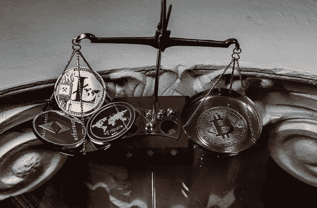
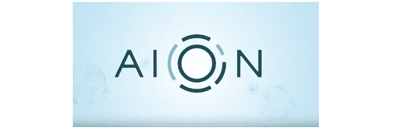
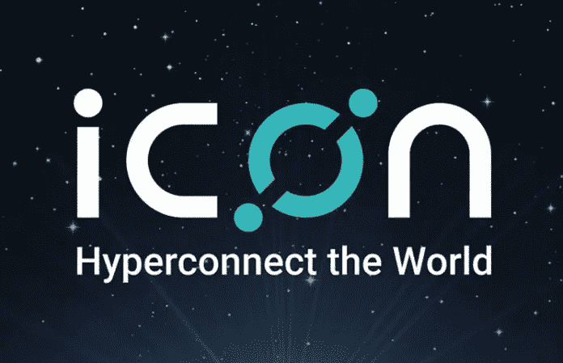
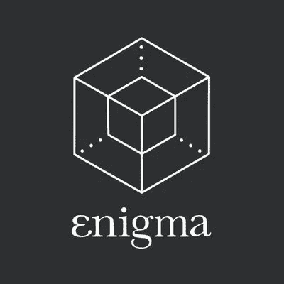
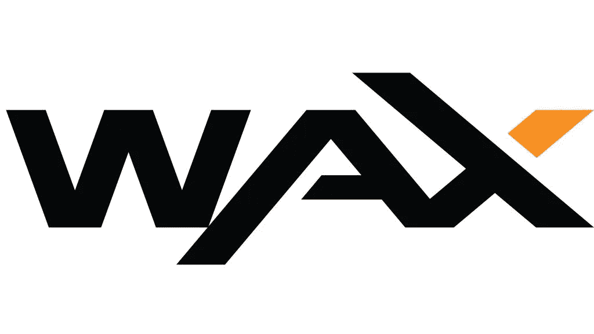

# 在八月，认识你需要关注的 4 种替代硬币

> 原文：<https://medium.com/hackernoon/meet-the-4-altcoins-you-need-to-watch-for-in-august-e3951556c842>

加密货币提示和技巧

随着熊市继续站稳脚跟，许多投资者想知道他们的下一步应该是什么；你是应该持有你的投资，关注下一轮牛市，还是应该减少损失，或许在其他地方寻找更好的运气。很明显，我们似乎正处于一个盘整期，过去一个月 BTC 价格在 5800 美元到 6800 美元之间徘徊。由于没有足够大的公告引发上涨趋势，市场可能会继续参与乐观主义者和卖空者之间的激烈拉锯战。
与此同时，这是一个投资少量硬币的好机会，这些硬币不仅被低估，而且显示出巨大的发展进步，比 12 月/1 月的历史高点便宜几倍。

***免责声明:以上为作者观点，不应视为投资建议。读者应该自己做研究。***

**AION**

***现价:$ 0.89(2018 年 7 月 26 日)，历史最高价:$ 11.10 2018 年 1 月 9 日***

AION 是一个多层区块链系统，旨在解决隐私、可伸缩性和互操作性问题。

**近期发展:**今年，AION 成功推出了他们的 mainnet“乞力马扎罗山”，这是他们在 2018 年路线图上设定的一个里程碑。他们还实现了一些较小的里程碑，这些里程碑是 Mainnet 发布的一部分，包括开发他们的虚拟机、Aion 内链、他们的工作算法证明、Aion 核心和 Aion API。

Aion 也是企业以太坊联盟的一部分，该联盟最近与易贝和富士康合作。永恒之塔计划扩展到韩国，日本和中国。

**图标(ICX)**

***现价:$1.32，历史最高价:$ 12.11 2018 年 1 月 9 日***

ICON 正在建立一个分散的网络，允许不同政府的独立区块链在没有中介的情况下进行交易。

**最近的发展:**尽管公司已经错过了很多路线图的最后期限，但仍有强有力的证据表明发展和业务正在取得进展。区块链已经在他们的 Mainnet 生态系统中推出了超过 12 个 Dapps。ICON 也是目前业内合作最多的区块链之一。ICON 合作的一些行业包括:游戏、生物识别、教育保健、保险和银行。

ICON 特别合作的一家公司是 Line，这是一个巨大的信息应用程序，希望在下个月推出一个加密交换。

**谜(英)**

***现价:$1.62，历史最高价:$ 8.06 2018 年 1 月 10 日***

[Enigma](https://cryptopotato.com/enigma-catalyst-project-ico-evaluation/?fb_comment_id=1248329658610247_1254236254686254) 是一个离链网络，通过提供数据存储和计算的辅助层来补充区块链网络。

**近况:**

区块链在 6 月推出了他们的测试网，并宣布了未来 5 年的路线图。他们还刚刚宣布了与英特尔的大规模合作伙伴关系，并聘请了许多新的开发人员，还建立了一个新的开发人员论坛。

最后，Enigma 刚刚开始向韩国市场扩张。

**蜡**

***现价:0.14 美元，历史最高价:2018 年 1 月 10 日 2.73 美元***

[WAX](https://cryptopotato.com/ico/wax/) 是一个去中心化的平台，让任何人都可以在安全、基础设施或支付处理方面零投资地运营一个全功能的虚拟市场。他们正在扰乱游戏产业(尤其是游戏皮肤交易；即交易套装、武器、健康包和视频游戏角色使用的其他物品的能力。仅这个市场就是一个 500 亿美元的产业)。

**近期发展:**该平台在过去几个月里发布了几项新公告，并承诺在下一轮牛市中实现所有硬币中最大的一次回归。4 月，WAX 选择 EOS 作为他们的区块链，以建立他们的分散市场。他们还与几家主要的区块链公司合作，如 Jaxx、Kyber Network、Nexo 和 Bancor。

最近，WAX 开始与 CryptoSpaceX 和 Crypto Wars 等游戏合作。

总体而言，一旦市场开始变得更加乐观，许多被低估的公司可能会重新获得巨大的动力。

然而，我认为这四个项目尤其值得进一步研究，因为它们展示了即使在价格大幅下跌的情况下也能坚持下去并取得进展的能力。如果在加密市场最糟糕的时候，高价值的合作伙伴关系和主网发布是他们的产品，那么我迫不及待地想看看一旦这个行业处于最佳状态，这些公司会给这个行业带来什么。

*原载于 2018 年 7 月 26 日 cryptopotato.com**的* [*。*](https://cryptopotato.com/meet-the-4-coins-you-need-to-watch-for-in-august/)